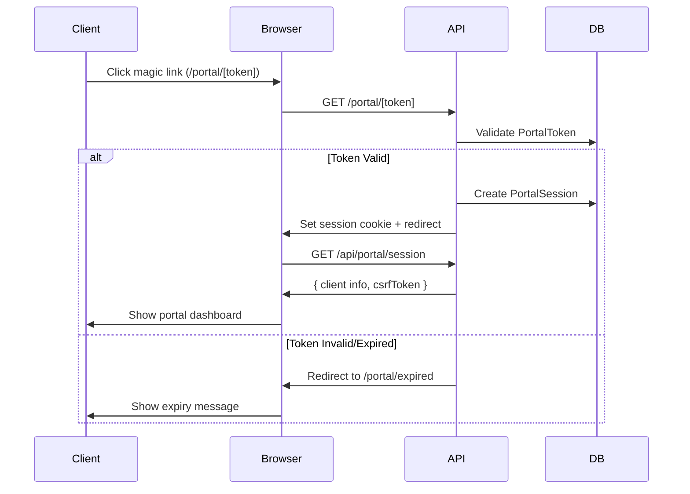
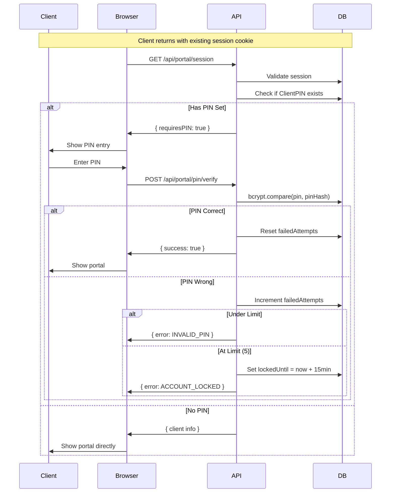
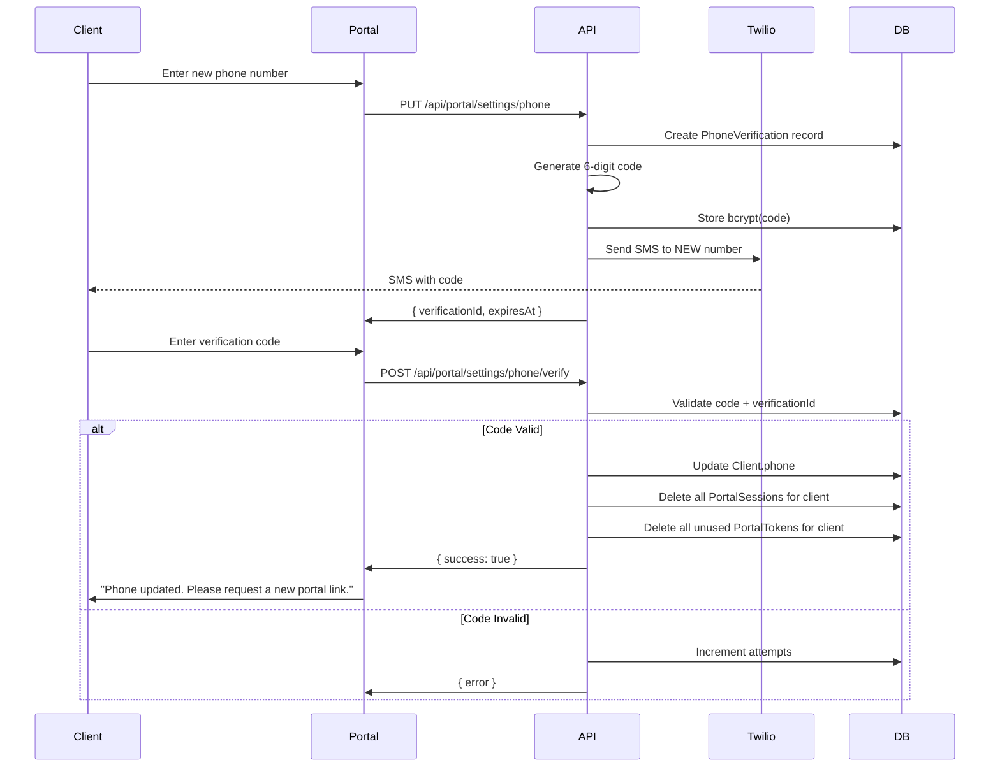

# Client Portal - Technical Specification

**Version:** 1.0
**Date:** January 2026
**Status:** Ready for Implementation

---

## 1. Executive Summary

The Client Portal provides a secure, mobile-friendly interface for clients to access messages from their case managers, view program progress, and manage contact preferences. This spec builds upon the existing messaging infrastructure (magic links, SMS notifications, message threading) while adding stateful sessions, PIN authentication, and program progress views.

### Key Decisions Made During Discovery

| Decision | Choice | Rationale |
|----------|--------|-----------|
| Session model | Stateful (PostgreSQL) | Enables PIN, preferences persistence, session management features |
| Session store | PostgreSQL only | No Redis needed - simpler ops, adequate for portal traffic |
| Phone verification | Trust magic link | SMS delivery IS verification; additional code is redundant |
| Session duration | Fixed 24hr, no extension | Simple, predictable; encourages fresh magic links |
| PIN bypass | Magic link bypasses PIN | Fresh magic link = full access; PIN only for returning to existing session |
| PIN lockout | 5 attempts, 15 min lock | Balances security with client-friendliness |
| PIN format | 4-digit numeric | Easy to remember, fast mobile entry, adequate with lockout |
| PIN hashing | bcrypt | Industry standard, built-in salting, brute-force resistant |
| Progress view | Basic (existing data) | Hours + progress bar; no session scheduling |
| Enrollment display | Active + completed | Historical reference, proof of participation |
| Settings scope | Phone + SMS prefs only | Minimal risk; other changes via case manager |
| Phone change impact | Invalidate all sessions | Security event requires re-auth |
| Phone update | SMS verification required | Proves ownership of new number |
| PWA | Basic manifest only | Add-to-homescreen; no offline support |
| Message filtering | None (chronological) | Simple newest-first list with pagination |
| Reply char limit | 2000 characters | Concise but adequate for detailed responses |
| Case manager notify | Email (no content) | Security-first; must log in to read |
| URL structure | /portal/[token]/* | Token in path, sub-routes for sections |
| Navigation | Bottom tab bar | Mobile-first, thumb-friendly |
| Default landing | Messages | Most relevant content first |
| Client status | No access restriction | Portal access independent of case status |
| Attachments | Signed S3 URLs | Time-limited, secure, no permanent public URLs |
| Link renewal | Contact case manager | No self-service; case manager controls access |
| Session cookies | HTTP-only secure | XSS protection, server-managed |
| Session metadata | IP + User Agent | Security audit capability |
| CSRF protection | Yes, token-based | Required with cookie-based sessions |
| Error messages | User-friendly, minimal | Generic messages; details server-side only |
| Analytics | Fathom | Privacy-focused, GDPR compliant |
| Accessibility | WCAG 2.1 AA | Core fundamentals; semantic HTML, contrast, keyboard, screen readers |
| Help content | Simple FAQ | Static page with common questions |
| Demo mode | Dev/staging only | Test tokens only in non-production |
| Rate limiting | Integrate with separate work | Will use app-wide rate limiting approach |

---

## 2. Scope

### 2.1 In Scope (MVP)

**P0 - Must Have:**
- Magic link entry with session creation
- Stateful session management (24hr fixed)
- Message inbox with newest-first ordering
- Message detail view with attachments
- Reply composer with 2000 character limit
- Attachment downloads (signed S3 URLs)

**P1 - Should Have:**
- Program progress view (hours completed/required, progress bar)
- Sessions attended count

**P2 - Nice to Have:**
- Optional PIN for returning users
- Phone number update with SMS verification
- SMS notification preference management
- Help/FAQ page

### 2.2 Out of Scope (Future Phases)

- Message search
- Date filtering
- Full PWA with offline support
- Upcoming session dates/calendar
- Document uploads from client
- Appointment scheduling
- Native mobile apps
- Self-service magic link renewal
- Advanced keyboard shortcuts

### 2.3 Deferred Decisions

- **Rate limiting:** Integrating with app-wide rate limiting work being done separately
- **Advanced analytics:** Start with Fathom basics, expand based on learnings

---

## 3. Technical Architecture

### 3.1 Database Schema

```prisma
// Add to prisma/schema.prisma

model PortalSession {
  id            String    @id @default(uuid())
  clientId      String
  sessionToken  String    @unique  // 64-char hex, crypto.randomBytes(32)
  createdAt     DateTime  @default(now())
  expiresAt     DateTime  // createdAt + 24 hours
  ipAddress     String?   // Client IP at session creation
  userAgent     String?   // User agent at session creation
  csrfToken     String    // 32-char hex for CSRF protection

  client        Client    @relation(fields: [clientId], references: [id], onDelete: Cascade)

  @@index([sessionToken])
  @@index([clientId])
  @@index([expiresAt])  // For cleanup queries
}

model ClientPIN {
  id             String    @id @default(uuid())
  clientId       String    @unique
  pinHash        String    // bcrypt hash of 4-digit PIN
  failedAttempts Int       @default(0)
  lockedUntil    DateTime?
  createdAt      DateTime  @default(now())
  updatedAt      DateTime  @updatedAt

  client         Client    @relation(fields: [clientId], references: [id], onDelete: Cascade)
}

model PhoneVerification {
  id          String    @id @default(uuid())
  clientId    String
  phoneNumber String    // E.164 format
  codeHash    String    // bcrypt hash of 6-digit code
  sentAt      DateTime  @default(now())
  expiresAt   DateTime  // sentAt + 10 minutes
  verifiedAt  DateTime?
  attempts    Int       @default(0)

  client      Client    @relation(fields: [clientId], references: [id], onDelete: Cascade)

  @@index([clientId])
  @@index([expiresAt])
}

// Update Client model to add relations
model Client {
  // ... existing fields ...

  portalSessions      PortalSession[]
  clientPIN           ClientPIN?
  phoneVerifications  PhoneVerification[]
}
```

### 3.2 Route Structure

```
src/app/(portal)/
├── [token]/
│   ├── layout.tsx          # Portal layout with bottom nav, session provider
│   ├── page.tsx            # Redirects to /[token]/messages
│   ├── messages/
│   │   └── page.tsx        # Message inbox
│   ├── programs/
│   │   └── page.tsx        # Program progress
│   ├── settings/
│   │   └── page.tsx        # Phone, SMS prefs, PIN
│   └── help/
│       └── page.tsx        # FAQ page
├── expired/
│   └── page.tsx            # Expired link message
└── layout.tsx              # Minimal portal-wide layout (no nav)
```

### 3.3 API Endpoints

#### Session Management

```typescript
// POST /api/portal/session
// Creates session from magic link token
// Input: { token: string }
// Output: { sessionId, csrfToken } + sets HTTP-only session cookie
// Errors: INVALID_TOKEN, EXPIRED_TOKEN, CLIENT_NOT_FOUND

// GET /api/portal/session
// Validates session cookie, returns client info
// Output: { client: { id, firstName, lastName, orgId }, expiresAt }
// Errors: NO_SESSION, EXPIRED_SESSION

// DELETE /api/portal/session
// Logs out (deletes session)
// Output: { success: true }
```

#### PIN Management

```typescript
// POST /api/portal/pin
// Creates or updates PIN
// Input: { pin: string } // 4 digits
// Output: { success: true }
// Errors: INVALID_PIN_FORMAT, SESSION_REQUIRED

// POST /api/portal/pin/verify
// Verifies PIN for returning session
// Input: { pin: string }
// Output: { success: true }
// Errors: INVALID_PIN, ACCOUNT_LOCKED, PIN_NOT_SET

// DELETE /api/portal/pin
// Removes PIN
// Output: { success: true }
```

#### Messages (Update Existing)

```typescript
// GET /api/portal/messages
// Now uses session cookie instead of Bearer token
// Output: { messages: Message[], pagination }

// POST /api/portal/messages
// Send reply (uses session)
// Input: { content: string } // max 2000 chars
// Output: { message: Message }

// POST /api/portal/messages/[messageId]/read
// Mark as read
// Output: { success: true }

// GET /api/portal/messages/[messageId]/attachments/[attachmentId]
// Get signed download URL
// Output: { url: string, expiresIn: number }
```

#### Programs

```typescript
// GET /api/portal/programs
// Get client's program enrollments
// Output: { enrollments: ClientEnrollmentSummary[] }
```

#### Settings

```typescript
// GET /api/portal/settings
// Get client's contact info and preferences
// Output: { phone, smsOptedIn, hasPIN }

// PUT /api/portal/settings/phone
// Request phone number change
// Input: { phone: string } // E.164 format
// Output: { verificationId, expiresAt }
// Triggers SMS verification code

// POST /api/portal/settings/phone/verify
// Complete phone change
// Input: { verificationId, code: string }
// Output: { success: true }
// Errors: INVALID_CODE, EXPIRED, MAX_ATTEMPTS

// PUT /api/portal/settings/sms
// Update SMS preferences
// Input: { optedIn: boolean }
// Output: { success: true }
```

### 3.4 Session Flow



### 3.5 PIN Authentication Flow



### 3.6 Phone Change Flow



---

## 4. UI/UX Specification

### 4.1 Layout Structure

```
┌─────────────────────────────────────┐
│  [Org Logo]     Secure Portal    ⓘ │  ← Header (fixed)
├─────────────────────────────────────┤
│                                     │
│                                     │
│         Main Content Area           │  ← Scrollable
│                                     │
│                                     │
├─────────────────────────────────────┤
│  [📬]      [📊]      [⚙️]          │  ← Bottom nav (fixed)
│ Messages  Programs  Settings        │
└─────────────────────────────────────┘
```

### 4.2 Messages Page

**Inbox View:**
- Newest messages first
- Each message shows: sender name, preview (50 chars), relative timestamp
- Case manager messages: left-aligned, primary background
- Client messages: right-aligned, secondary background
- Unread indicator (dot) for case manager messages
- Load more button for pagination (20 per page)

**Reply Section:**
- Textarea with placeholder "Type your message..."
- Character counter showing "X / 2000"
- Send button (disabled when empty or over limit)
- "Sending..." state with spinner

### 4.3 Programs Page

**Enrollment Card:**
```
┌─────────────────────────────────────┐
│ Program Name                        │
│ Status: In Progress                 │
│                                     │
│ ████████████░░░░░░░░  65%          │  ← Progress bar
│                                     │
│ 32.5 / 50 hours completed           │
│ 8 of 12 sessions attended           │
└─────────────────────────────────────┘
```

**Completed Enrollments:**
- Show with checkmark badge
- Progress bar at 100%
- Completion date displayed

### 4.4 Settings Page

**Sections:**
1. **Contact Information**
   - Phone number (with "Change" button)
   - Phone change triggers verification flow modal

2. **Notifications**
   - SMS notifications toggle
   - Description of what notifications include

3. **Security**
   - PIN status (Set/Not set)
   - "Set PIN" or "Change PIN" button
   - "Remove PIN" option if set

4. **Account**
   - Session expires: "in X hours"
   - "Log out" button

### 4.5 Help/FAQ Page

Static content covering:
- What is this portal?
- How do I save this link?
- What if my link expires?
- How do I contact my case manager?
- Is my information secure?
- How do I opt out of text notifications?

### 4.6 Error States

**Expired Link Page:**
```
┌─────────────────────────────────────┐
│           ⚠️ Link Expired           │
│                                     │
│  This link is no longer valid.      │
│                                     │
│  Please contact your case manager   │
│  to receive a new portal link.      │
│                                     │
│  [Case Manager Name]                │
│  [Organization Name]                │
└─────────────────────────────────────┘
```

**Generic Error:**
```
┌─────────────────────────────────────┐
│         Something went wrong        │
│                                     │
│  We couldn't load your information. │
│  Please try refreshing the page.    │
│                                     │
│        [Refresh Page]               │
└─────────────────────────────────────┘
```

---

## 5. Security Implementation

### 5.1 Session Cookie Configuration

```typescript
// Cookie settings
const SESSION_COOKIE = {
  name: 'portal_session',
  options: {
    httpOnly: true,
    secure: process.env.NODE_ENV === 'production',
    sameSite: 'strict' as const,
    path: '/portal',
    maxAge: 24 * 60 * 60, // 24 hours in seconds
  }
};
```

### 5.2 CSRF Protection

```typescript
// Include CSRF token in session response
// Validate on all state-changing requests

// Client includes in header:
headers: {
  'X-CSRF-Token': csrfToken
}

// Server validates:
const csrfFromHeader = request.headers.get('X-CSRF-Token');
const csrfFromSession = session.csrfToken;
if (csrfFromHeader !== csrfFromSession) {
  return { error: 'CSRF_MISMATCH' };
}
```

### 5.3 PIN Security

```typescript
import bcrypt from 'bcrypt';

const SALT_ROUNDS = 10;
const MAX_ATTEMPTS = 5;
const LOCKOUT_MINUTES = 15;

// Create PIN
const pinHash = await bcrypt.hash(pin, SALT_ROUNDS);

// Verify PIN
const isValid = await bcrypt.compare(pin, storedPinHash);

// Check lockout
if (clientPIN.lockedUntil && clientPIN.lockedUntil > new Date()) {
  return { error: 'ACCOUNT_LOCKED', lockedUntil: clientPIN.lockedUntil };
}
```

### 5.4 Phone Verification Security

```typescript
// 6-digit code, 10-minute expiry, max 3 attempts
const VERIFICATION_CODE_LENGTH = 6;
const VERIFICATION_EXPIRY_MINUTES = 10;
const MAX_VERIFICATION_ATTEMPTS = 3;

// Generate code
const code = crypto.randomInt(100000, 999999).toString();
const codeHash = await bcrypt.hash(code, SALT_ROUNDS);
```

### 5.5 Session Invalidation on Phone Change

```typescript
async function updateClientPhone(clientId: string, newPhone: string) {
  await prisma.$transaction([
    // Update phone
    prisma.client.update({
      where: { id: clientId },
      data: { phone: newPhone }
    }),
    // Invalidate all sessions
    prisma.portalSession.deleteMany({
      where: { clientId }
    }),
    // Invalidate unused magic links
    prisma.portalToken.deleteMany({
      where: {
        clientId,
        usedAt: null
      }
    })
  ]);
}
```

---

## 6. Services Layer

### 6.1 Portal Session Service

```typescript
// src/lib/services/portal-sessions.ts

export interface CreateSessionInput {
  clientId: string;
  ipAddress?: string;
  userAgent?: string;
}

export interface SessionWithClient {
  id: string;
  clientId: string;
  expiresAt: Date;
  csrfToken: string;
  client: {
    id: string;
    firstName: string;
    lastName: string;
    orgId: string;
    phone: string;
  };
}

export async function createPortalSession(input: CreateSessionInput): Promise<SessionWithClient>;
export async function validateSession(sessionToken: string): Promise<SessionWithClient | null>;
export async function deleteSession(sessionToken: string): Promise<void>;
export async function deleteClientSessions(clientId: string): Promise<number>;
export async function cleanupExpiredSessions(): Promise<number>;
```

### 6.2 Client PIN Service

```typescript
// src/lib/services/client-pin.ts

export async function setPIN(clientId: string, pin: string): Promise<void>;
export async function verifyPIN(clientId: string, pin: string): Promise<{
  success: boolean;
  error?: 'INVALID_PIN' | 'ACCOUNT_LOCKED';
  lockedUntil?: Date;
  remainingAttempts?: number;
}>;
export async function removePIN(clientId: string): Promise<void>;
export async function hasPIN(clientId: string): Promise<boolean>;
export async function resetLockout(clientId: string): Promise<void>;
```

### 6.3 Phone Verification Service

```typescript
// src/lib/services/phone-verification.ts

export async function initiatePhoneChange(
  clientId: string,
  newPhone: string
): Promise<{ verificationId: string; expiresAt: Date }>;

export async function verifyPhoneChange(
  clientId: string,
  verificationId: string,
  code: string
): Promise<{ success: boolean; error?: string }>;

export async function cleanupExpiredVerifications(): Promise<number>;
```

---

## 7. Email Notifications

### 7.1 Client Reply Notification

When a client sends a reply, email the assigned case manager:

**Subject:** New message from [Client Name]

**Body:**
```
Hi [Case Manager Name],

[Client First Name] [Client Last Name] has sent you a new message through the portal.

Log in to view and respond:
[Dashboard Link]

---
This is an automated notification from Scrybe.
```

**Implementation:**
- Use existing email service (if available) or add SendGrid/Postmark integration
- Send asynchronously (don't block reply submission)
- Include unsubscribe option per user preference (future enhancement)

---

## 8. PWA Configuration

### 8.1 Web App Manifest

```json
// public/portal-manifest.json
{
  "name": "Scrybe Client Portal",
  "short_name": "Portal",
  "description": "Secure messaging with your case manager",
  "start_url": "/portal",
  "display": "standalone",
  "background_color": "#ffffff",
  "theme_color": "#0ea5e9",
  "icons": [
    {
      "src": "/icons/portal-192.png",
      "sizes": "192x192",
      "type": "image/png"
    },
    {
      "src": "/icons/portal-512.png",
      "sizes": "512x512",
      "type": "image/png"
    }
  ]
}
```

### 8.2 Meta Tags

```html
<!-- In portal layout -->
<link rel="manifest" href="/portal-manifest.json" />
<meta name="theme-color" content="#0ea5e9" />
<meta name="apple-mobile-web-app-capable" content="yes" />
<meta name="apple-mobile-web-app-status-bar-style" content="default" />
<meta name="apple-mobile-web-app-title" content="Portal" />
<link rel="apple-touch-icon" href="/icons/portal-192.png" />
```

---

## 9. Analytics (Fathom)

### 9.1 Setup

```typescript
// src/lib/fathom.ts
export const FATHOM_SITE_ID = process.env.NEXT_PUBLIC_FATHOM_SITE_ID;

// In portal layout
import { load, trackPageview } from 'fathom-client';

useEffect(() => {
  load(FATHOM_SITE_ID, {
    includedDomains: ['app.scrybe.io'], // production domain
  });
  trackPageview();
}, []);
```

### 9.2 Custom Events

Track these events for product insights:
- `portal_session_created` - New session from magic link
- `portal_message_sent` - Client sent a reply
- `portal_pin_set` - Client configured PIN
- `portal_phone_changed` - Client updated phone
- `portal_sms_optout` - Client opted out of SMS

---

## 10. Accessibility Checklist

### 10.1 WCAG 2.1 AA Requirements

- [ ] **Semantic HTML:** Use proper heading hierarchy (h1 > h2 > h3)
- [ ] **Landmarks:** header, main, nav, footer ARIA roles
- [ ] **Form labels:** All inputs have associated labels
- [ ] **Focus indicators:** Visible focus rings on all interactive elements
- [ ] **Keyboard navigation:** All functions accessible without mouse
- [ ] **Color contrast:** 4.5:1 minimum for text, 3:1 for large text
- [ ] **Touch targets:** Minimum 44x44px on mobile
- [ ] **Error identification:** Form errors clearly described
- [ ] **Screen reader testing:** VoiceOver (Mac/iOS), NVDA (Windows)
- [ ] **Alt text:** All images have descriptive alt attributes
- [ ] **Reduced motion:** Respect prefers-reduced-motion

### 10.2 Implementation Notes

```typescript
// Example accessible button
<button
  type="submit"
  disabled={isLoading}
  aria-busy={isLoading}
  aria-label="Send message"
  className="focus:ring-2 focus:ring-offset-2 focus:ring-primary"
>
  {isLoading ? 'Sending...' : 'Send'}
</button>

// Example form field
<div>
  <label htmlFor="reply-input" className="sr-only">
    Your reply
  </label>
  <textarea
    id="reply-input"
    aria-describedby="char-count"
    maxLength={2000}
  />
  <span id="char-count" aria-live="polite">
    {charCount} / 2000 characters
  </span>
</div>
```

---

## 11. Testing Plan

### 11.1 Unit Tests

| Test ID | Description | Expected Result |
|---------|-------------|-----------------|
| UT-PS-001 | Create portal session with valid token | Session created, cookie set |
| UT-PS-002 | Validate expired session | Returns null |
| UT-PS-003 | Session cleanup removes expired | Only expired sessions deleted |
| UT-PIN-001 | Set 4-digit PIN | PIN hash stored |
| UT-PIN-002 | Verify correct PIN | Returns success |
| UT-PIN-003 | Verify wrong PIN 5 times | Account locked 15 min |
| UT-PIN-004 | Verify after lockout expires | Allowed to try again |
| UT-PV-001 | Initiate phone verification | Code sent, record created |
| UT-PV-002 | Verify correct code | Phone updated, sessions cleared |
| UT-PV-003 | Verify wrong code 3 times | Verification invalidated |

### 11.2 Integration Tests

| Test ID | Description | Expected Result |
|---------|-------------|-----------------|
| IT-FLOW-001 | Full magic link → session → messages | Messages displayed |
| IT-FLOW-002 | Session expiry during use | Redirect to expired page |
| IT-FLOW-003 | PIN set → return → PIN required | PIN entry shown |
| IT-FLOW-004 | Phone change → verify → old sessions invalid | Must use new magic link |
| IT-FLOW-005 | Send reply → case manager notified | Email sent |

### 11.3 E2E Tests (Playwright)

| Test ID | Description |
|---------|-------------|
| E2E-001 | Magic link authentication flow |
| E2E-002 | View messages and send reply |
| E2E-003 | View program progress |
| E2E-004 | Set and verify PIN |
| E2E-005 | Change phone number with verification |
| E2E-006 | Update SMS preferences |
| E2E-007 | Expired link handling |
| E2E-008 | Mobile viewport navigation |

### 11.4 Accessibility Tests

| Test ID | Description | Tool |
|---------|-------------|------|
| A11Y-001 | Keyboard navigation all pages | Manual |
| A11Y-002 | Screen reader navigation | VoiceOver |
| A11Y-003 | Color contrast | axe DevTools |
| A11Y-004 | Focus management | Manual |
| A11Y-005 | Touch target sizing | Manual (mobile) |

### 11.5 Performance Targets

| Metric | Target | Measurement |
|--------|--------|-------------|
| Initial page load (3G) | < 3 seconds | Lighthouse |
| Time to interactive | < 4 seconds | Lighthouse |
| Message list load (50) | < 1 second | API timing |
| Reply submission | < 500ms | API timing |
| Lighthouse performance | > 90 | Lighthouse |

---

## 12. Migration Plan

### 12.1 Database Migration

Single migration file for all portal tables:

```bash
npx prisma migrate dev --name add_portal_session_tables
```

### 12.2 Deployment Steps

1. **Pre-deployment:**
   - Run database migration
   - Deploy Fathom script (can be done via env var)

2. **Feature deployment:**
   - Deploy new portal routes
   - Existing `/portal/m/[token]` continues to work during transition

3. **Post-deployment:**
   - Set up session cleanup cron job
   - Monitor for errors

### 12.3 Rollback Plan

- Feature flag not needed (new routes don't affect existing functionality)
- If issues: revert deployment, migration is additive (no data loss)
- Old magic link flow remains functional throughout

---

## 13. Cron Jobs

### 13.1 Session Cleanup

```typescript
// Run daily at 3 AM
// Deletes sessions expired more than 24 hours ago
// Retention: Keep for 24 hours past expiry for debugging

await prisma.portalSession.deleteMany({
  where: {
    expiresAt: {
      lt: new Date(Date.now() - 24 * 60 * 60 * 1000)
    }
  }
});
```

### 13.2 Verification Cleanup

```typescript
// Run hourly
// Deletes expired phone verifications

await prisma.phoneVerification.deleteMany({
  where: {
    expiresAt: {
      lt: new Date()
    },
    verifiedAt: null
  }
});
```

---

## 14. Monitoring & Alerts

### 14.1 Metrics to Track

- Session creation rate
- Session validation failures
- PIN lockouts per day
- Phone verification success rate
- Message reply rate
- Email notification delivery rate

### 14.2 Alerting

- High PIN lockout rate (possible attack)
- Email delivery failures
- Session creation spike (possible abuse)
- API error rate > 1%

---

## 15. Discoveries & Learnings

Through the discovery process, we learned:

1. **Magic link is sufficient verification:** Since the magic link is sent to the client's phone via SMS, clicking it already proves phone ownership. Additional SMS verification codes would be redundant friction.

2. **Stateful sessions enable features:** While the existing stateless token approach works, moving to stateful sessions enables PIN protection, preferences persistence, and better security auditing without significant complexity increase.

3. **Fixed session duration is simpler:** Rolling session expiry with activity refresh can lead to sessions lasting indefinitely. Fixed 24-hour sessions are predictable and encourage fresh magic links.

4. **Existing program data is sufficient:** The `getClientEnrollments` service already provides everything needed for the progress view. No new data fetching or calculations required.

5. **Client status shouldn't restrict portal:** Client status (ACTIVE, ON_HOLD, CLOSED) is for internal case management. If a client has a valid magic link, they should be able to use the portal regardless of status.

6. **Security-first email notifications:** Putting message content in email creates additional exposure. Notification-only emails require case managers to log in, maintaining the secure channel.

7. **Phone changes are security events:** When a client's phone number changes, all sessions and unused magic links should be invalidated to prevent unauthorized access.

---

## 16. Future Considerations

Features intentionally deferred that may be valuable later:

1. **Offline PWA support:** Would require service workers, cache strategies, and sync conflict resolution. Significant complexity for uncertain benefit.

2. **Message search:** Full-text search would require either database indexing (pg_trgm) or search service integration. Wait for user demand.

3. **Self-service link renewal:** Could add "request new link" feature with phone verification, but increases attack surface. Case manager control is more secure.

4. **Session extension on activity:** Could implement rolling expiry if users complain about fixed 24-hour sessions interrupting their use.

5. **In-app notifications for case managers:** Real-time notifications (WebSocket/SSE) when clients reply. Email works for MVP.

6. **Document section:** Allow clients to view important documents. Requires document management on case manager side first.

---

## Appendix A: Environment Variables

```env
# Fathom Analytics
NEXT_PUBLIC_FATHOM_SITE_ID=XXXXX

# Session Configuration (optional overrides)
PORTAL_SESSION_DURATION_HOURS=24
PORTAL_PIN_MAX_ATTEMPTS=5
PORTAL_PIN_LOCKOUT_MINUTES=15
PORTAL_VERIFICATION_EXPIRY_MINUTES=10
```

---

## Appendix B: API Error Codes

| Code | HTTP Status | Description |
|------|-------------|-------------|
| INVALID_TOKEN | 401 | Magic link token invalid or already used |
| EXPIRED_TOKEN | 401 | Magic link token has expired |
| NO_SESSION | 401 | Session cookie missing or invalid |
| EXPIRED_SESSION | 401 | Session has expired |
| CSRF_MISMATCH | 403 | CSRF token validation failed |
| INVALID_PIN | 401 | PIN incorrect |
| ACCOUNT_LOCKED | 423 | Too many failed PIN attempts |
| PIN_NOT_SET | 400 | Attempted PIN verify with no PIN set |
| INVALID_PIN_FORMAT | 400 | PIN must be 4 digits |
| INVALID_PHONE | 400 | Phone number format invalid |
| VERIFICATION_EXPIRED | 400 | Phone verification code expired |
| INVALID_VERIFICATION_CODE | 400 | Verification code incorrect |
| MAX_VERIFICATION_ATTEMPTS | 429 | Too many verification attempts |
| MESSAGE_TOO_LONG | 400 | Reply exceeds 2000 characters |
| CLIENT_NOT_FOUND | 404 | Client record not found |
| INTERNAL_ERROR | 500 | Server error (details logged) |
