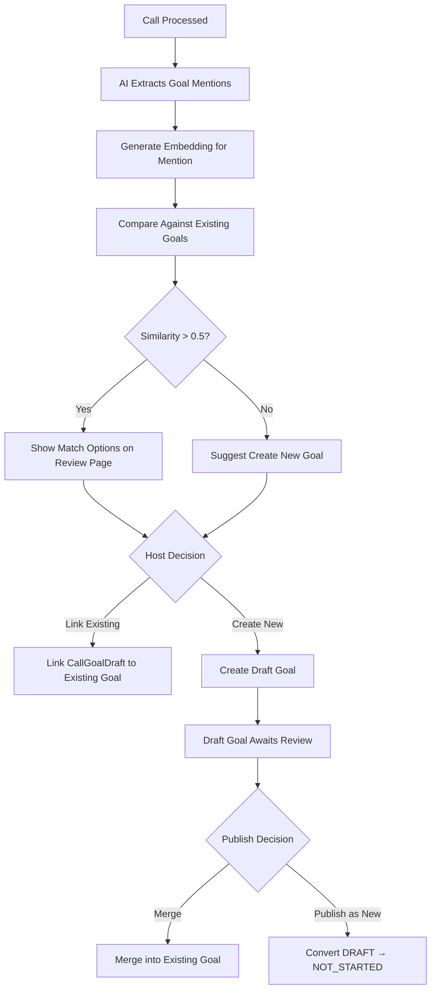
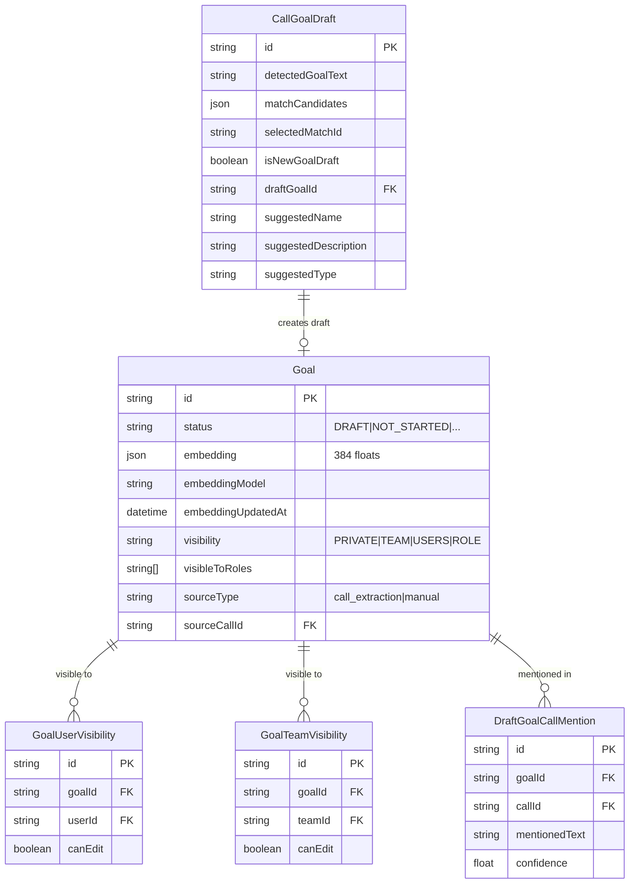

# Goal Deduplication & Draft Goal System

## Overview

When goals are mentioned in calls/conversations, the system now uses **semantic matching** to find existing goals instead of creating duplicates. If "Project Alpha" is mentioned in a call, the system matches it to an existing "Project Alpha" goal rather than creating a new one.

For genuinely new goals detected in calls, users can create **draft goals** with configurable visibility that go through a review/publish workflow.

## How It Works

### 1. Call Processing Flow



### 2. Semantic Matching

Instead of exact text matching, the system uses **sentence-transformers** (all-MiniLM-L6-v2) to generate 384-dimensional embeddings that capture semantic meaning:

- "Project Alpha kickoff" matches "Project Alpha" (0.87 similarity)
- "Housing assistance program" matches "Housing Support Initiative" (0.72 similarity)
- "Client intake process" does NOT match "Project Alpha" (0.21 similarity)

Matching is performed locally via the ML service—no external API calls required.

### 3. Review Page Experience

On the call review page, hosts see a **Goal Matches** section showing:

1. **Detected text** from the conversation
2. **Match candidates** with similarity percentages
3. **Options**: Link to existing goal OR create new draft

```
┌─────────────────────────────────────────────────────────┐
│ Goal Mentioned: "Project Alpha status update"          │
├─────────────────────────────────────────────────────────┤
│ ○ Link to: Project Alpha (87% match)                   │
│ ○ Link to: Alpha Initiative (72% match)                │
│ ○ Create new goal                                      │
│                                                         │
│ [Resolve]                                              │
└─────────────────────────────────────────────────────────┘
```

### 4. Draft Goal Visibility

When creating a new draft goal, users can configure who can see it before publishing:

| Visibility | Who Can See |
|------------|-------------|
| `PRIVATE` | Only the creator |
| `TEAM` | All members of selected team(s) |
| `USERS` | Specific users (picker) |
| `ROLE` | Users with specific roles (e.g., CASE_MANAGER) |

---

## Technical Architecture

### Database Schema



### Key Fields Added to `Goal`

| Field | Type | Purpose |
|-------|------|---------|
| `embedding` | `Json?` | 384-float array for semantic search |
| `embeddingModel` | `String?` | Model used (e.g., "all-MiniLM-L6-v2") |
| `embeddingUpdatedAt` | `DateTime?` | When embedding was last computed |
| `visibility` | `String?` | PRIVATE, TEAM, USERS, or ROLE |
| `visibleToRoles` | `String[]` | Roles that can view (if visibility=ROLE) |
| `sourceType` | `String?` | "call_extraction" or "manual" |
| `sourceCallId` | `String?` | Call that created this draft goal |

### New `GoalStatus` Value

```prisma
enum GoalStatus {
  DRAFT         // New: awaiting review/publish
  NOT_STARTED
  IN_PROGRESS
  ON_TRACK
  AT_RISK
  BEHIND
  COMPLETED
}
```

---

## API Endpoints

### Goal Matching

```
POST /api/goals/match
```

Find similar goals for a text query.

**Request:**
```json
{
  "queryText": "Project Alpha status",
  "excludeGoalIds": ["goal-123"],
  "threshold": 0.5,
  "topK": 5
}
```

**Response:**
```json
{
  "matches": [
    { "goalId": "goal-456", "goalName": "Project Alpha", "similarity": 0.87 },
    { "goalId": "goal-789", "goalName": "Alpha Initiative", "similarity": 0.72 }
  ]
}
```

### Draft Goals

```
GET /api/goals/drafts
```

List draft goals visible to current user.

```
POST /api/goals/drafts
```

Create a new draft goal.

**Request:**
```json
{
  "name": "New Housing Program",
  "description": "...",
  "type": "PROGRAM",
  "visibility": "TEAM",
  "visibleToTeams": ["team-123"],
  "sourceCallId": "call-456"
}
```

### Publish Draft

```
POST /api/goals/[goalId]/publish
```

Publish a draft goal (convert to active or merge with existing).

**Request:**
```json
{
  "action": "publish_new"
}
```

Or merge:
```json
{
  "action": "merge",
  "mergeIntoGoalId": "goal-existing-123"
}
```

### Visibility Management

```
GET /api/goals/[goalId]/visibility
PUT /api/goals/[goalId]/visibility
```

Get or update who can see a draft goal.

### Resolve Call Goal Draft

```
POST /api/calls/[callId]/goal-drafts/[draftId]/resolve
```

Resolve a goal mention from a call (link to existing or create new).

**Request (link existing):**
```json
{
  "action": "link_existing",
  "goalId": "goal-456"
}
```

**Request (create new):**
```json
{
  "action": "create_new",
  "goalData": {
    "name": "New Goal Name",
    "description": "...",
    "type": "CLIENT",
    "visibility": "PRIVATE"
  }
}
```

---

## ML Service Endpoints

The embedding service runs in `ml-services/` (Python/FastAPI).

### Generate Goal Embedding

```
POST /v1/matching/goals/embed
```

**Request:**
```json
{
  "name": "Project Alpha",
  "description": "Housing assistance program for families"
}
```

**Response:**
```json
{
  "embedding": [0.123, -0.456, ...],  // 384 floats
  "model_name": "all-MiniLM-L6-v2",
  "dimension": 384,
  "processing_time_ms": 12.5
}
```

### Find Similar Goals

```
POST /v1/matching/goals/similar
```

**Request:**
```json
{
  "query_text": "Project Alpha update",
  "candidates": [
    { "id": "goal-1", "name": "Project Alpha", "embedding": [...] },
    { "id": "goal-2", "name": "Beta Program", "embedding": [...] }
  ],
  "threshold": 0.5,
  "top_k": 5
}
```

**Response:**
```json
{
  "matches": [
    { "goal_id": "goal-1", "goal_name": "Project Alpha", "similarity": 0.87 }
  ],
  "query_embedding": [...],
  "processing_time_ms": 8.2
}
```

### Batch Embed Goals

```
POST /v1/matching/goals/embed-batch
```

For backfilling embeddings on existing goals.

**Request:**
```json
{
  "goals": [
    { "id": "goal-1", "name": "Project Alpha", "description": "..." },
    { "id": "goal-2", "name": "Beta Program", "description": "..." }
  ]
}
```

---

## TypeScript Service Functions

### `apps/web/src/lib/services/goals.ts`

```typescript
// Generate and store embedding when goal is created/updated
await updateGoalEmbedding(goalId);

// Find similar goals using embeddings
const matches = await findSimilarGoals(orgId, "Project Alpha", {
  threshold: 0.5,
  topK: 5,
  excludeGoalIds: ["goal-123"]
});

// Create a draft goal with visibility settings
const draft = await createDraftGoal({
  orgId,
  createdById: userId,
  name: "New Program",
  type: "PROGRAM",
  visibility: "TEAM",
  visibleToTeams: ["team-123"],
  sourceCallId: "call-456"
});

// Publish draft (convert or merge)
await publishDraftGoal(draftGoalId, {
  action: "publish_new",
  publishedById: userId
});

// Check if user can view a draft
const canView = await canViewDraftGoal(userId, goalId);
```

### `apps/web/src/lib/services/call-goal-drafts.ts`

```typescript
// Find goal matches using embeddings (replaces Claude-based matching)
const matches = await findGoalMatchesWithEmbeddings(
  ["Project Alpha", "housing support"],
  "Call summary text...",
  orgId,
  excludeGoalIds
);

// Create draft with match candidates for user resolution
const result = await createDraftWithMatchCandidates(
  callId,
  "Project Alpha mentioned",
  orgId,
  userId
);
// Returns: { draftId, matchCandidates, suggestedGoal }
```

---

## UI Components

### GoalMatchCard

`apps/web/src/components/goals/goal-match-card.tsx`

Shows a detected goal mention with match options:

```tsx
<GoalMatchCard
  draftId={draft.id}
  detectedText={draft.detectedGoalText}
  matchCandidates={draft.matchCandidates}
  suggestedGoal={draft.suggestedGoal}
  onResolve={handleResolve}
/>
```

### GoalMatchesSection

`apps/web/src/app/(dashboard)/calls/[callId]/review/components/GoalMatchesSection.tsx`

Section on review page showing all goal matches for a call.

### GoalStatusBadge

Updated to support `DRAFT` status with purple styling.

---

## Backfilling Existing Goals

To generate embeddings for existing goals that don't have them:

```typescript
// In a script or admin endpoint
import { prisma } from "@/lib/db";
import mlServices from "@/lib/ml-services/client";

const goalsWithoutEmbeddings = await prisma.goal.findMany({
  where: { embedding: null, archivedAt: null },
  select: { id: true, name: true, description: true }
});

const result = await mlServices.goalEmbeddings.batchGenerate(
  goalsWithoutEmbeddings.map(g => ({
    id: g.id,
    name: g.name,
    description: g.description || undefined
  }))
);

// Update goals with embeddings
for (const item of result.results) {
  if (item.success) {
    await prisma.goal.update({
      where: { id: item.id },
      data: {
        embedding: item.embedding,
        embeddingModel: "all-MiniLM-L6-v2",
        embeddingUpdatedAt: new Date()
      }
    });
  }
}
```

---

## Configuration

### Similarity Threshold

- **0.5**: Default threshold for showing matches
- **0.6+**: High confidence matches
- **0.4-0.5**: Lower confidence, show more candidates

### Embedding Model

Currently using `all-MiniLM-L6-v2`:
- 384 dimensions
- Fast inference (~10ms per embedding)
- Good for short text (goal names, descriptions)

To change the model, update `ml-services/src/matching/goal_embeddings.py`.

---

## Testing

### Manual Testing Flow

1. Create a goal "Project Alpha" in the dashboard
2. Record a call mentioning "Project Alpha status update"
3. Go to call review page
4. Verify "Project Alpha" appears as a match candidate
5. Select "Link to existing" and resolve
6. Verify goal progress is updated with call context

### Unit Tests

```bash
# Run goal service tests
npm test -- --grep "goal embedding"

# Run call-goal-drafts tests
npm test -- --grep "findGoalMatchesWithEmbeddings"
```

### E2E Tests

```bash
# Run Playwright tests for review page
npm run test:e2e -- review-page.spec.ts
```

---

## Troubleshooting

### Embeddings Not Generated

Check ML service is running:
```bash
curl http://localhost:8000/health
```

Check goal has embedding:
```sql
SELECT id, name, embedding IS NOT NULL as has_embedding
FROM "Goal"
WHERE "orgId" = 'your-org-id';
```

### No Matches Found

1. Verify goals have embeddings (run backfill if needed)
2. Lower the threshold to 0.4
3. Check ML service logs for errors

### Draft Goal Not Visible

Check visibility settings:
```sql
SELECT visibility, "visibleToRoles",
       (SELECT COUNT(*) FROM "GoalUserVisibility" WHERE "goalId" = g.id) as user_count,
       (SELECT COUNT(*) FROM "GoalTeamVisibility" WHERE "goalId" = g.id) as team_count
FROM "Goal" g
WHERE id = 'goal-id';
```

---

## Related Files

| File | Purpose |
|------|---------|
| `prisma/schema.prisma` | Database schema with new fields |
| `ml-services/src/matching/goal_embeddings.py` | Embedding service |
| `ml-services/src/matching/router.py` | ML API endpoints |
| `apps/web/src/lib/ml-services/client.ts` | TypeScript ML client |
| `apps/web/src/lib/services/goals.ts` | Goal service with embedding functions |
| `apps/web/src/lib/services/call-goal-drafts.ts` | Call goal draft processing |
| `apps/web/src/components/goals/goal-match-card.tsx` | Match UI component |
| `apps/web/src/components/goals/goal-status-badge.tsx` | Status badge (includes DRAFT) |
