# ML Services Foundation Specification

> **Status**: Draft
> **Author**: Claude + Valerie
> **Created**: 2026-03-02
> **Linear Tickets**: PX-889, PX-895, PX-896, PX-897, PX-898, PX-899, PX-900

## Overview

This specification defines the ML Services infrastructure for Inkra — a Python FastAPI service that provides model registry, training orchestration, audit routing, feedback collection, and differential privacy capabilities. This service operates alongside the existing Next.js application, communicating via REST APIs.

### Why This Matters

Inkra's extraction models need:
- **Versioned model management** with rollback capability
- **Compliance-aware audit routing** (HIPAA, SOC2, GDPR)
- **Privacy-preserving retraining** from user corrections
- **Strict tenant isolation** for the global model

Without this foundation, we can't ship production-grade ML features that meet compliance requirements.

---

## Build Order & Dependencies

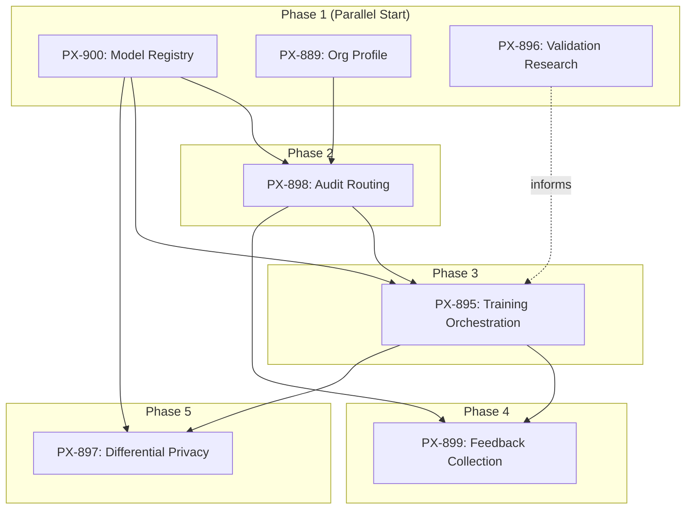

**This Quarter (Q1 2026)**: Phase 1 + Phase 2
**Next Quarter (Q2 2026)**: Phases 3-5

---

## Architecture

### High-Level System Architecture

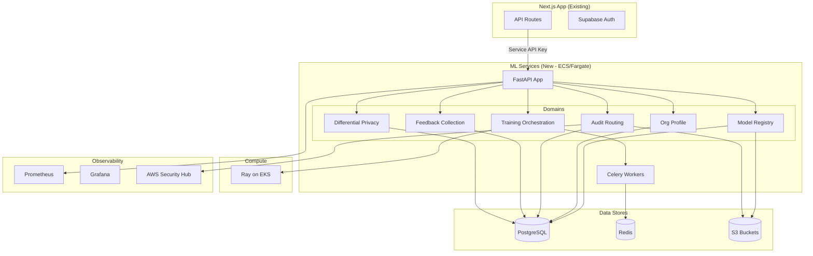

### Container Architecture

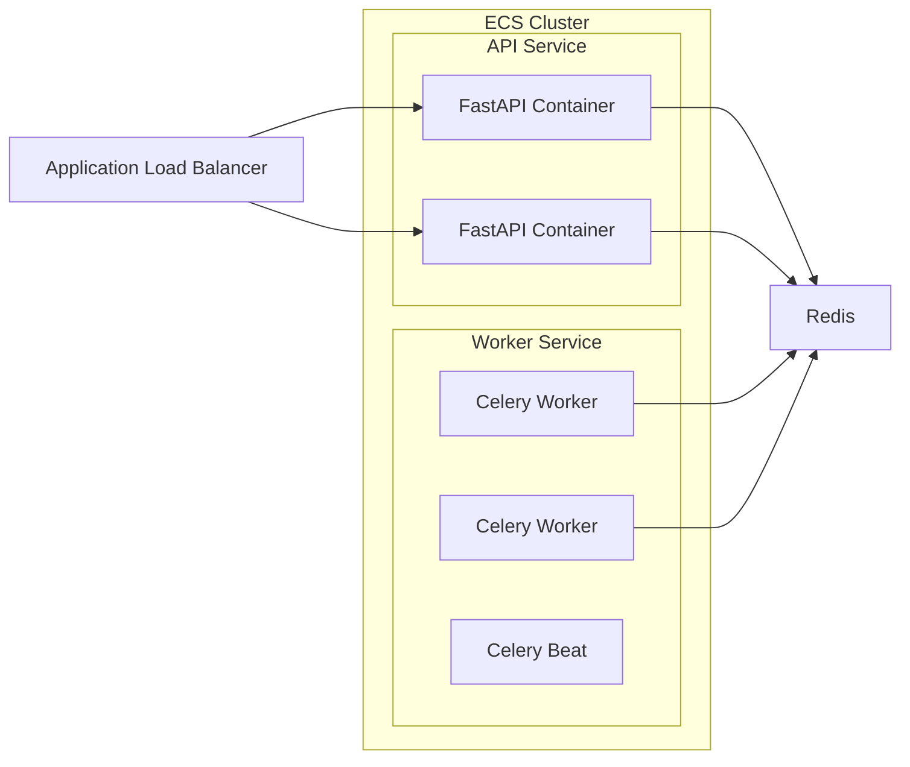

---

## Tech Stack

| Component | Technology | Rationale |
|-----------|------------|-----------|
| **Framework** | FastAPI | Async-native, Pydantic integration, OpenAPI docs |
| **Python** | 3.11 | Latest stable, good library support |
| **Validation** | Pydantic v2 | Performance, FastAPI native |
| **ORM** | SQLAlchemy 2.0 | Async support, mature ecosystem |
| **Migrations** | Alembic | SQLAlchemy native, rollback support |
| **Job Queue** | Celery + Redis | Battle-tested, complex workflows |
| **Training** | Ray on EKS | Distributed compute, ML-native |
| **Database** | PostgreSQL | Separate instance from Next.js app |
| **Cache/Queue** | Redis | Job broker, caching, rate limiting |
| **Storage** | S3 | Model artifacts, audit archives |
| **Observability** | Prometheus + Grafana | K8s-native, ML dashboards |
| **SIEM** | AWS Security Hub | Native AWS, compliance reporting |
| **Secrets** | AWS Secrets Manager | ECS integration, managed rotation |

---

## Domain Specifications

### PX-900: Model Registry Service

**Purpose**: Track model versions, metadata, and deployment state.

#### Data Model

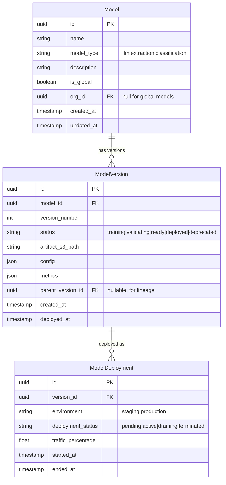

#### API Endpoints

| Endpoint | Method | Description | Latency SLA |
|----------|--------|-------------|-------------|
| `/v1/models` | GET | List models (filterable by type, org) | <50ms |
| `/v1/models` | POST | Register new model | <100ms |
| `/v1/models/{id}` | GET | Get model details | <50ms |
| `/v1/models/{id}/versions` | GET | List versions | <50ms |
| `/v1/models/{id}/versions` | POST | Create new version | <200ms |
| `/v1/models/{id}/versions/{v}` | GET | Get version details + metrics | <50ms |
| `/v1/models/{id}/versions/{v}/deploy` | POST | Trigger deployment | async |
| `/v1/models/{id}/versions/{v}/rollback` | POST | Rollback to version | async |

#### Versioning Strategy

- **Simple sequential**: v1, v2, v3...
- **Rollback**: Mark current as deprecated, promote previous
- **Canary**: Gradual traffic shift via `traffic_percentage`
- **Auto-rollback**: On metric degradation, revert automatically

---

### PX-889: Org Profile Schema & Admin Configuration

**Purpose**: Store compliance requirements and configuration per organization.

#### Data Model

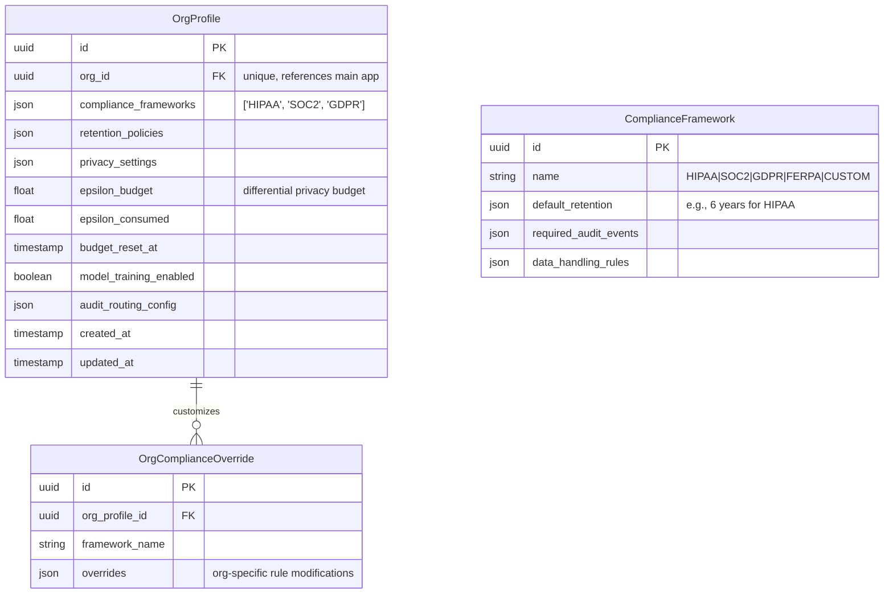

#### API Endpoints

| Endpoint | Method | Description | Latency SLA |
|----------|--------|-------------|-------------|
| `/v1/orgs/{org_id}/profile` | GET | Get org profile | <100ms |
| `/v1/orgs/{org_id}/profile` | PUT | Update org profile | <200ms |
| `/v1/orgs/{org_id}/compliance` | GET | Get compliance status | <100ms |
| `/v1/orgs/{org_id}/privacy/budget` | GET | Get ε budget status | <50ms |
| `/v1/frameworks` | GET | List available frameworks | <50ms |

#### Privacy Budget Enforcement

```python
# Hard block when budget exhausted
if org_profile.epsilon_consumed >= org_profile.epsilon_budget:
    raise PrivacyBudgetExhausted(
        org_id=org_id,
        consumed=org_profile.epsilon_consumed,
        budget=org_profile.epsilon_budget,
        resets_at=org_profile.budget_reset_at
    )
```

---

### PX-898: Audit Event Schema & Routing Layer

**Purpose**: Capture ML-related audit events and route to appropriate sinks based on org compliance requirements.

#### Data Model

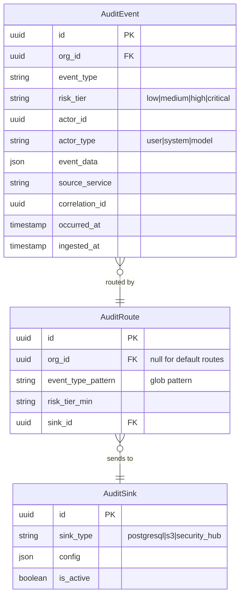

#### Event Types

| Event Type | Risk Tier | Description |
|------------|-----------|-------------|
| `model.version.created` | low | New model version registered |
| `model.deployed` | medium | Model promoted to production |
| `model.rollback` | high | Emergency rollback triggered |
| `training.started` | low | Training job initiated |
| `training.completed` | low | Training job finished |
| `training.failed` | medium | Training job failed |
| `feedback.submitted` | low | User correction submitted |
| `feedback.applied` | medium | Correction applied to training data |
| `privacy.budget.warning` | medium | ε budget at 80% |
| `privacy.budget.exhausted` | critical | ε budget depleted, training blocked |
| `inference.phi_accessed` | medium | Model accessed PHI data |

#### Routing Flow

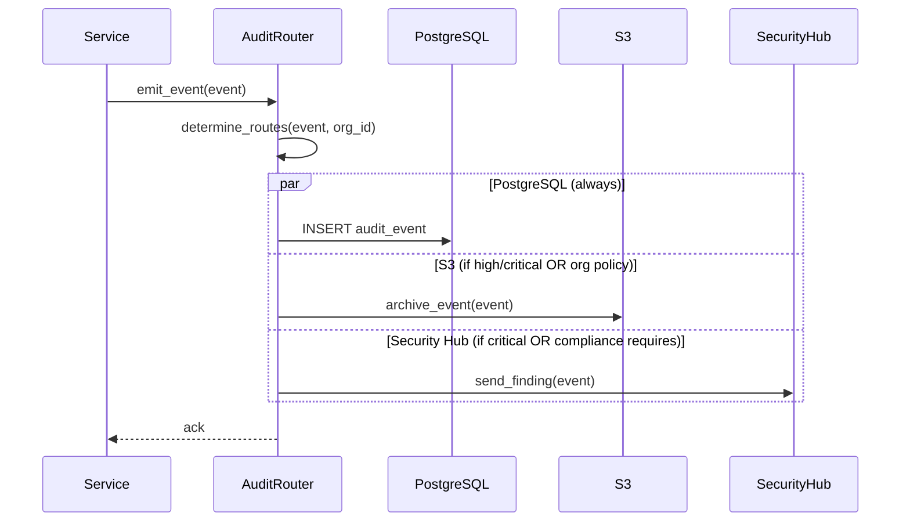

---

### PX-895: Model Training Orchestration Framework

**Purpose**: Manage training jobs, validation gates, and deployment pipelines.

> **Detailed spec in Linear**: PX-895
> **Depends on**: PX-900 (registry), PX-898 (audit)

#### High-Level Flow

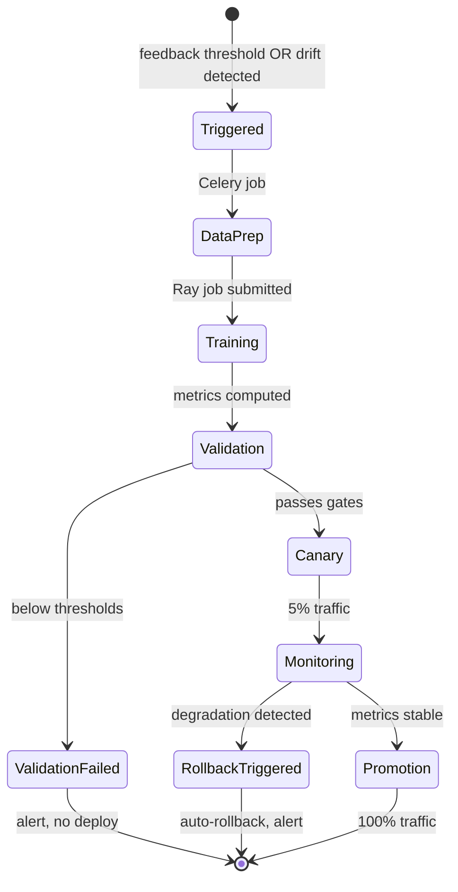

#### Validation Gates (from PX-896 Research)

Configured in `config/validation_dimensions.yaml`:

```yaml
validation_gates:
  accuracy:
    enabled: true
    metrics:
      - name: f1_score
        threshold: 0.85
        comparison: gte
      - name: precision
        threshold: 0.80
        comparison: gte

  calibration:
    enabled: true
    metrics:
      - name: expected_calibration_error
        threshold: 0.05
        comparison: lte

  drift:
    enabled: true
    metrics:
      - name: psi  # Population Stability Index
        threshold: 0.1
        comparison: lte
      - name: feature_drift_score
        threshold: 0.15
        comparison: lte

  fairness:  # For sensitivity classifier only
    enabled_for: ["sensitivity_classifier"]
    metrics:
      - name: demographic_parity_diff
        threshold: 0.1
        comparison: lte
```

---

### PX-899: Feedback Collection Infrastructure

**Purpose**: Collect user corrections, score quality, and feed into training pipeline.

> **Detailed spec in Linear**: PX-899
> **Depends on**: PX-895 (training), PX-898 (audit)

#### Feedback Types

| Type | Description | Example |
|------|-------------|---------|
| `field_correction` | User fixes extracted value | "Date of Birth" corrected from "1990" to "1990-05-15" |
| `classification_override` | User changes model label | Sensitivity changed from "low" to "high" |
| `quality_rating` | Thumbs up/down, 1-5 stars | User rates extraction as 4/5 |

#### Quality Scoring (Phased)

| Phase | Scoring Method |
|-------|----------------|
| MVP | Confidence-weighted corrections |
| Phase 3 | Cross-correction consensus detection |
| Phase 4 | Longitudinal user trust scoring |

---

### PX-897: Differential Privacy & Data Synthesis Layer

**Purpose**: Ensure global model training preserves privacy with strict ε-budgets.

> **Detailed spec in Linear**: PX-897
> **Depends on**: PX-895 (training), PX-900 (registry)

#### Privacy Flow

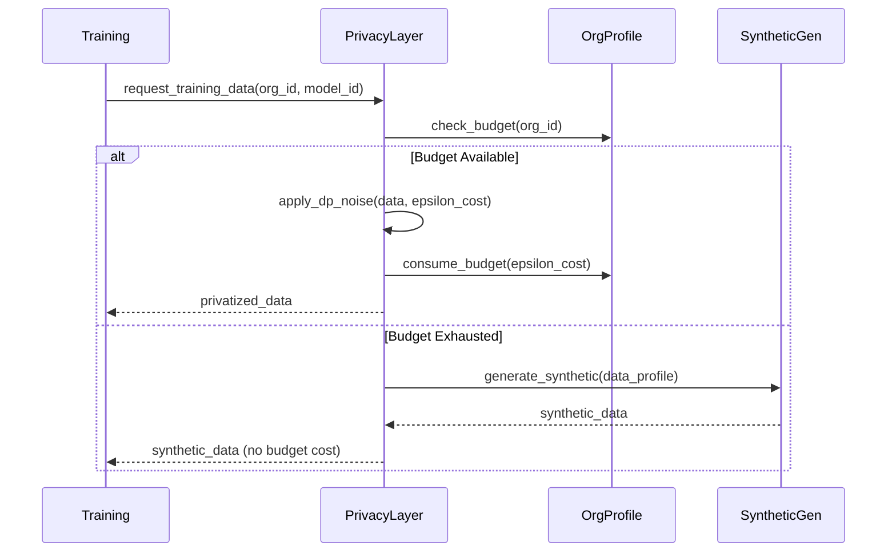

---

## Database Schema

### Full ERD

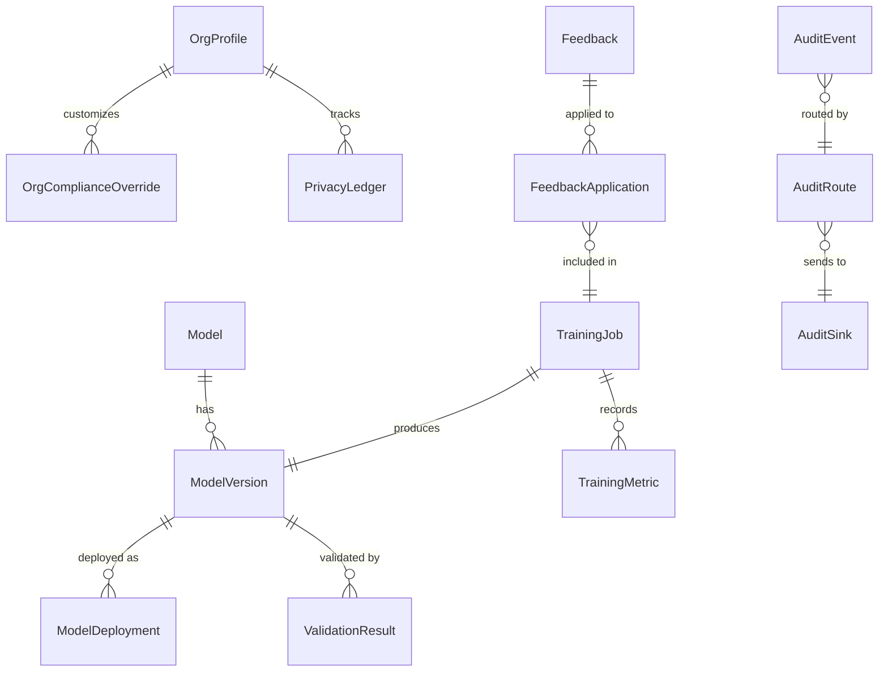

---

## API Authentication & Security

### Service-to-Service Auth

```python
# Next.js app includes header
headers = {
    "X-Service-API-Key": os.environ["ML_SERVICE_API_KEY"],
    "X-Request-ID": str(uuid4()),
    "X-Org-ID": org_id  # From authenticated user context
}
```

### Key Rotation

- Keys stored in AWS Secrets Manager
- Manual rotation (no auto-rotation initially)
- Rotation process:
  1. Generate new key in Secrets Manager
  2. Deploy ml-services with both keys valid
  3. Update Next.js app with new key
  4. Remove old key from ml-services

### Rate Limiting

Per-endpoint limits stored in Redis:

| Endpoint Category | Limit |
|-------------------|-------|
| Health checks | Unlimited |
| Registry reads | 1000/min per org |
| Registry writes | 100/min per org |
| Training triggers | 10/min per org |
| Audit writes | 10000/min per org |

---

## Observability

### Health Endpoints

| Endpoint | Purpose | Checks |
|----------|---------|--------|
| `/healthz` | Liveness | Process responding |
| `/readyz` | Readiness | DB connected, Redis connected |
| `/livez` | Detailed liveness | Component-level status |

### Metrics (Prometheus)

```python
# Key metrics to expose
ml_model_inference_duration_seconds = Histogram(...)
ml_training_job_duration_seconds = Histogram(...)
ml_feedback_submitted_total = Counter(...)
ml_privacy_budget_remaining = Gauge(...)
ml_audit_events_total = Counter(...)
```

### Dashboards (Grafana)

1. **Model Performance**: Inference latency, error rates, version traffic
2. **Training Pipeline**: Job status, duration, validation pass rates
3. **Privacy Budget**: Per-org consumption, projections
4. **Audit Volume**: Events by type, routing success rates

---

## Deployment

### ECS Task Definitions

**API Service**:
- CPU: 512
- Memory: 1024
- Desired count: 2
- Health check: `/healthz`
- ALB target group

**Worker Service**:
- CPU: 1024
- Memory: 2048
- Desired count: 2
- No health check (Celery manages)

### CI/CD Pipeline

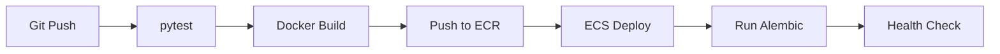

### Zero-Downtime Migrations

1. **Add column** (nullable or with default)
2. **Deploy new code** (handles both schemas)
3. **Backfill data** if needed
4. **Add constraints** (NOT NULL, etc.)
5. **Deploy cleanup code** (remove old handling)

---

## Error Handling

### Circuit Breaker Pattern

```python
from circuitbreaker import circuit

@circuit(failure_threshold=5, recovery_timeout=30)
async def call_next_app(endpoint: str, data: dict):
    async with httpx.AsyncClient() as client:
        response = await client.post(
            f"{NEXT_APP_URL}{endpoint}",
            json=data,
            timeout=5.0
        )
        response.raise_for_status()
        return response.json()
```

### Error Response Format

```json
{
  "error": {
    "code": "PRIVACY_BUDGET_EXHAUSTED",
    "message": "Organization privacy budget exhausted",
    "details": {
      "org_id": "uuid",
      "consumed": 5.0,
      "budget": 5.0,
      "resets_at": "2026-04-01T00:00:00Z"
    }
  },
  "request_id": "uuid"
}
```

---

## Testing Strategy

### Test Pyramid

| Level | Tool | What |
|-------|------|------|
| Unit | pytest + mocks | Business logic, utilities |
| Integration | pytest + testcontainers | DB operations, Redis, S3 |
| E2E | pytest + staging | Full API flows |

### Test Coverage Requirements

- Minimum 80% line coverage
- 100% coverage on privacy/audit code paths
- All API endpoints have integration tests

---

## Decisions Made

| Decision | Rationale | Alternatives Considered |
|----------|-----------|------------------------|
| Separate PostgreSQL | ML metadata shouldn't couple with app schema | Shared DB with schema prefix |
| Celery over ARQ | Complex workflows, mature ecosystem | ARQ simpler but less features |
| S3 versioning | Native, no extra tooling | DVC adds complexity |
| Hard block on ε exhaust | Privacy is non-negotiable | Grace period risks compliance |
| YAML configs | Version controlled, no UI needed | DB configs add complexity |
| Domain-driven structure | Clear boundaries, scalable | Layer-based harder to navigate |

---

## Deferred Items

| Item | Reason | When |
|------|--------|------|
| GraphQL API | REST sufficient for MVP | If query complexity grows |
| Auto key rotation | Manual is fine at low scale | When key count grows |
| Multi-region | Single region sufficient | Enterprise requirements |
| Custom compliance UI | YAML configs work | Customer demand |
| Model A/B testing UI | API-only for now | Product prioritizes |

---

## Open Questions

1. **Ray cluster sizing**: What's the expected training job concurrency?
2. **S3 bucket structure**: Single bucket with prefixes or multiple buckets?
3. **Synthetic data quality**: What validation ensures synthetic data is useful?

---

## Success Metrics

| Metric | Target | Measurement |
|--------|--------|-------------|
| Registry query latency | p99 < 50ms | Prometheus histogram |
| Training job success rate | > 95% | Celery task metrics |
| Audit event delivery | 100% (no loss) | Event count reconciliation |
| Privacy budget accuracy | ε tracking within 0.01 | Ledger audit |

---

## References

- **Linear Tickets**: PX-889, PX-895, PX-896, PX-897, PX-898, PX-899, PX-900
- **Existing Audit System**: `src/lib/audit/service.ts`
- **Prisma Schema**: `prisma/schema.prisma` (Organization model)
