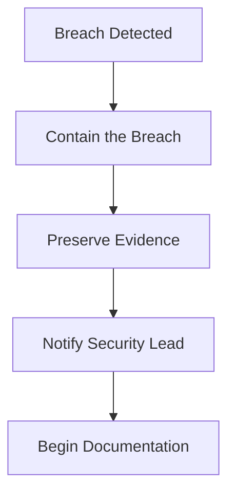

# Breach Notification Policy

**Document ID:** BREACH-POL-001
**Version:** 1.0
**Effective Date:** February 1, 2026
**Review Date:** February 1, 2027
**Owner:** Security Lead

---

## 1. Purpose

This policy establishes procedures for identifying, responding to, and reporting breaches of Protected Health Information (PHI) in compliance with the HIPAA Breach Notification Rule (45 CFR §§ 164.400-414).

## 2. Scope

This policy applies to:
- All actual or suspected breaches of unsecured PHI
- All workforce members who discover or suspect a breach
- All systems and processes that handle PHI

## 3. Definitions

| Term | Definition |
|------|------------|
| **Breach** | Unauthorized acquisition, access, use, or disclosure of PHI that compromises security or privacy |
| **Unsecured PHI** | PHI not rendered unusable through encryption or destruction |
| **Secured PHI** | PHI encrypted with NIST-approved algorithms (our PHI is secured via AES-256-GCM) |
| **Security Incident** | Attempted or successful unauthorized access, use, disclosure, modification, or destruction |

## 4. Breach Assessment

### 4.1 Initial Detection

Potential breach indicators:
- Unauthorized system access alerts
- Unusual data access patterns
- Lost or stolen devices
- Phishing attack success
- Insider threat reports
- Third-party notifications

### 4.2 Risk Assessment

For each potential breach, assess:

| Factor | Low Risk | Medium Risk | High Risk |
|--------|----------|-------------|-----------|
| **Nature of PHI** | Limited identifiers | Health + identifiers | SSN, financial + health |
| **Unauthorized Person** | Workforce member | Business associate | Unknown/malicious |
| **PHI Actually Acquired** | Unlikely | Possible | Confirmed |
| **Mitigation** | Immediate, effective | Partial | None possible |

### 4.3 Breach Determination

A breach is **presumed** unless:
1. PHI was properly encrypted (AES-256 with secure key management)
2. Low probability of compromise based on risk assessment
3. One of three exceptions applies:
   - Unintentional acquisition by workforce member acting in good faith
   - Inadvertent disclosure to authorized person within organization
   - Good faith belief that unauthorized recipient could not retain PHI

## 5. Response Procedures

### 5.1 Immediate Actions (Within 1 Hour)



1. **Contain**: Disable compromised accounts, isolate affected systems
2. **Preserve**: Do not delete logs or evidence
3. **Notify**: Alert Security Lead immediately
4. **Document**: Begin incident log

### 5.2 Investigation (Within 24 Hours)

1. Determine scope of breach
2. Identify all affected individuals
3. Assess what PHI was involved
4. Determine root cause
5. Document findings

### 5.3 Escalation Matrix

| Severity | Criteria | Response Team | Notification |
|----------|----------|---------------|--------------|
| **Critical** | >500 individuals, ongoing attack | Full incident team + Legal | CEO, Board, Covered Entities |
| **High** | 1-500 individuals, contained | Security + Privacy | CEO, affected Covered Entities |
| **Medium** | Potential breach, unconfirmed | Security Lead | Privacy Officer |
| **Low** | Security incident, no PHI | On-call engineer | Security Lead |

## 6. Notification Requirements

### 6.1 Covered Entity Notification

**Timeline:** Within 24 hours of breach confirmation

**Content:**
- Date of breach and discovery
- Description of incident
- Types of PHI involved
- Number of individuals affected
- Actions taken to mitigate
- Recommendations for affected individuals

### 6.2 HHS Notification (via Covered Entity)

| Breach Size | Timeline | Method |
|-------------|----------|--------|
| **< 500 individuals** | Within 60 days of calendar year end | HHS web portal |
| **≥ 500 individuals** | Within 60 days of discovery | HHS web portal + media |

### 6.3 Individual Notification (via Covered Entity)

**Timeline:** Within 60 days of discovery

**Required Content:**
- Brief description of what happened
- Types of PHI involved
- Steps individuals should take
- What we are doing to investigate and mitigate
- Contact information for questions

**Method:**
- First-class mail to last known address
- Email if individual has agreed to electronic notice
- Substitute notice if contact info insufficient

### 6.4 Media Notification (via Covered Entity)

Required when ≥ 500 individuals in a state are affected:
- Press release to prominent media outlets in state
- Within 60 days of discovery

## 7. Documentation Requirements

### 7.1 Incident Log

For every security incident:

```
Incident ID: INC-YYYY-XXXX
Date Discovered:
Date Reported:
Discovered By:
Initial Classification:
Description:
Systems Affected:
PHI Categories:
Individuals Affected:
Containment Actions:
Root Cause:
Breach Determination: [Yes/No/Pending]
Notification Status:
Remediation Actions:
Lessons Learned:
```

### 7.2 Retention

- Breach documentation: 6 years from date of creation or last effective date
- Investigation records: 6 years
- Notification records: 6 years

## 8. Post-Incident Activities

### 8.1 Remediation

- Implement technical fixes
- Update policies if needed
- Conduct additional training
- Update risk assessment

### 8.2 Post-Incident Review

Within 14 days of incident closure:
1. Review timeline and response effectiveness
2. Identify gaps in detection or response
3. Document lessons learned
4. Update incident response procedures

## 9. Breach Prevention

### 9.1 Technical Controls

| Control | Implementation |
|---------|----------------|
| Encryption | AES-256-GCM for PHI at rest |
| Access Control | MFA, role-based access, session timeout |
| Monitoring | Real-time alerts, audit logging |
| DLP | Data loss prevention rules (future) |

### 9.2 Administrative Controls

- Annual security training
- Background checks for workforce
- Vendor security assessments
- Regular access reviews

## 10. Contacts

| Role | Name | Phone | Email |
|------|------|-------|-------|
| Security Lead | _____________ | _____________ | _____________ |
| Privacy Officer | _____________ | _____________ | _____________ |
| Legal Counsel | _____________ | _____________ | _____________ |
| CEO | _____________ | _____________ | _____________ |

**24/7 Incident Hotline:** _____________

---

**Approval:**

| Name | Title | Signature | Date |
|------|-------|-----------|------|
| _________________ | Security Lead | _________________ | ________ |
| _________________ | Privacy Officer | _________________ | ________ |
| _________________ | CEO | _________________ | ________ |
