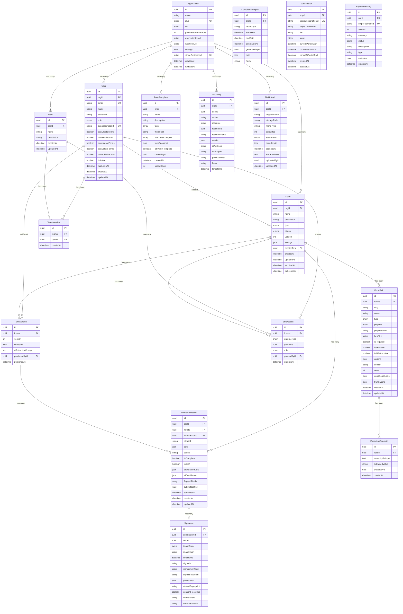
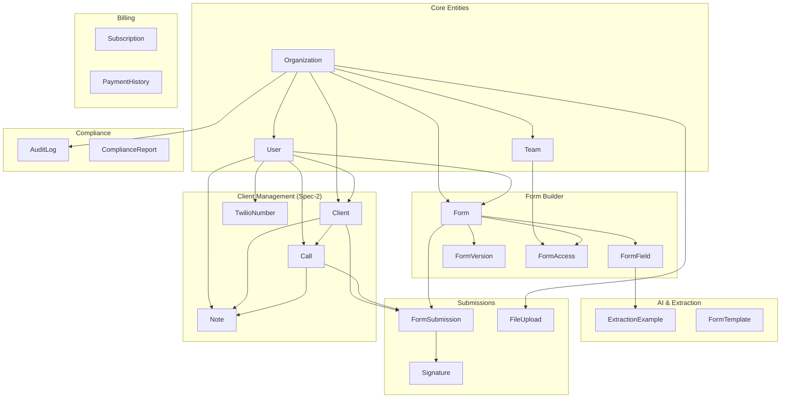

# Scrybe Solutions - Database Schema Documentation

## Entity Relationship Diagram



## Enums Reference

### Tier (Subscription Levels)
| Value | Description |
|-------|-------------|
| FREE | Free tier - 3 forms |
| STARTER | Starter tier - 10 forms |
| PROFESSIONAL | Professional tier - 50 forms |
| ENTERPRISE | Enterprise tier - Unlimited forms |

### FormType
| Value | Description |
|-------|-------------|
| INTAKE | Initial client enrollment |
| FOLLOWUP | Ongoing case documentation |
| REFERRAL | Partner agency referrals |
| ASSESSMENT | Evaluations (ACES, Cal-VIP, etc.) |
| CUSTOM | Organization-specific |

### FormStatus
| Value | Description |
|-------|-------------|
| DRAFT | Form is being built |
| PUBLISHED | Form is live and usable |
| ARCHIVED | Form is no longer active |

### FieldType
| Value | Description | AI Extractable |
|-------|-------------|----------------|
| TEXT_SHORT | Single line text | Yes (80%) |
| TEXT_LONG | Paragraph/multi-line | Yes (75%) |
| NUMBER | Numeric values | Yes (85%) |
| DATE | Date picker | Yes (90%) |
| PHONE | Phone number | Yes (85%) |
| EMAIL | Email address | Yes (85%) |
| ADDRESS | US address (Radar) | Yes (70%) |
| DROPDOWN | Single select | Yes (75%) |
| CHECKBOX | Multi-select | Yes (70%) |
| YES_NO | Boolean toggle | Yes (80%) |
| FILE | File upload | Limited (20%) |
| SIGNATURE | Digital signature | No (0%) |

### FieldPurpose
| Value | Description |
|-------|-------------|
| GRANT_REQUIREMENT | Required for funding compliance |
| INTERNAL_OPS | Day-to-day case management |
| COMPLIANCE | Required by law/regulation |
| OUTCOME_MEASUREMENT | Tracks program effectiveness |
| RISK_ASSESSMENT | Identifies client risk factors |
| OTHER | Custom reason |

### UserRole
| Value | Permissions |
|-------|-------------|
| SUPER_ADMIN | Full system access |
| ADMIN | Organization admin |
| PROGRAM_MANAGER | Manage programs/forms |
| CASE_MANAGER | Use forms, manage cases |
| VIEWER | Read-only access |

### ScanStatus (File Uploads)
| Value | Description |
|-------|-------------|
| PENDING | Awaiting scan |
| SCANNING | Currently scanning |
| CLEAN | No threats detected |
| INFECTED | Malware detected |
| ERROR | Scan failed |

## Table Relationships Summary



## Indexes

| Table | Index | Purpose |
|-------|-------|---------|
| Organization | slug | Quick lookup by slug |
| Organization | stripeCustomerId | Billing lookups |
| User | orgId | Filter users by org |
| User | email | Login/auth lookups |
| User | supabaseUserId | Auth integration |
| Form | orgId, status | Dashboard filtering |
| Form | createdById | User's forms |
| FormField | formId, order | Field ordering |
| FormSubmission | formId | Submission listing |
| FormSubmission | clientId | Client history |
| AuditLog | orgId, timestamp | Audit queries |
| AuditLog | resource, resourceId | Resource history |
| Client | orgId, status | Client listing |
| Client | orgId, phone | Duplicate detection |
| Client | assignedTo | Caseload queries |
| Call | clientId | Call history |
| Call | caseManagerId | Case manager calls |
| Call | status | Active calls |
| Call | aiProcessingStatus | Processing queue |
| Note | clientId | Client notes |
| Note | callId | Call notes |

---

## Spec-2: Client & Call Management ER Diagram

```mermaid
erDiagram
    Organization ||--o{ Client : "has many"
    User ||--o{ Client : "assigned"
    User ||--o{ Client : "created"
    User ||--o{ Call : "made"
    User ||--o{ Note : "authored"
    User ||--|| TwilioNumber : "has"

    Client ||--o{ Call : "has"
    Client ||--o{ Note : "has"
    Client ||--o{ FormSubmission : "has"

    Call ||--o{ Note : "has"
    Call ||--o{ FormSubmission : "produces"

    Client {
        uuid id PK
        uuid orgId FK
        string firstName
        string lastName
        string phone
        json additionalPhones
        string email
        json address
        string internalId
        enum status
        uuid assignedTo FK
        uuid createdBy FK
        datetime createdAt
        datetime updatedAt
        datetime deletedAt
    }

    Call {
        uuid id PK
        uuid clientId FK
        uuid caseManagerId FK
        array formIds
        enum status
        datetime startedAt
        datetime endedAt
        int durationSeconds
        string twilioCallSid UK
        string recordingUrl
        datetime recordingRetention
        text transcriptRaw
        json transcriptJson
        json aiSummary
        json extractedFields
        json confidenceScores
        json manualCorrections
        enum aiProcessingStatus
        string aiProcessingError
        int aiProcessingRetries
        datetime createdAt
        datetime updatedAt
    }

    Note {
        uuid id PK
        uuid clientId FK
        uuid callId FK
        uuid authorId FK
        enum type
        text content
        array tags
        boolean isDraft
        datetime createdAt
        datetime updatedAt
        datetime deletedAt
    }

    TwilioNumber {
        uuid id PK
        uuid userId FK UK
        string phoneNumber UK
        string twilioSid UK
        string areaCode
        datetime provisionedAt
    }

    ResourceLock {
        uuid id PK
        string resourceType
        uuid resourceId
        uuid lockedBy
        datetime lockedAt
        datetime expiresAt
    }

    FormEditLog {
        uuid id PK
        uuid submissionId FK
        uuid fieldId
        json previousValue
        json newValue
        uuid editedBy FK
        datetime editedAt
        string editReason
    }
```

## Spec-2: Enums Reference

### ClientStatus
| Value | Description |
|-------|-------------|
| ACTIVE | Currently active client |
| ON_HOLD | Temporarily paused |
| CLOSED | Case closed |
| PENDING | Awaiting activation |

### CallStatus
| Value | Description |
|-------|-------------|
| INITIATING | Call being set up |
| RINGING | Phone is ringing |
| IN_PROGRESS | Call is active |
| COMPLETED | Call ended normally |
| ABANDONED | Call was abandoned |
| ATTEMPTED | Attempted but not connected |
| FAILED | Technical failure |

### ProcessingStatus
| Value | Description |
|-------|-------------|
| PENDING | Awaiting processing |
| PROCESSING | Currently being processed |
| COMPLETED | Processing complete |
| FAILED | Processing failed |
| QUEUED_FOR_RETRY | Scheduled for retry |

### NoteType
| Value | Description |
|-------|-------------|
| INTERNAL | Internal notes only |
| SHAREABLE | Can be shared externally |

### ConsentMode
| Value | Description |
|-------|-------------|
| AUTO_RECORDING | Automatic consent recording |
| CASE_MANAGER_SCRIPT | Case manager reads consent |
| DISABLED | Consent handling disabled |
