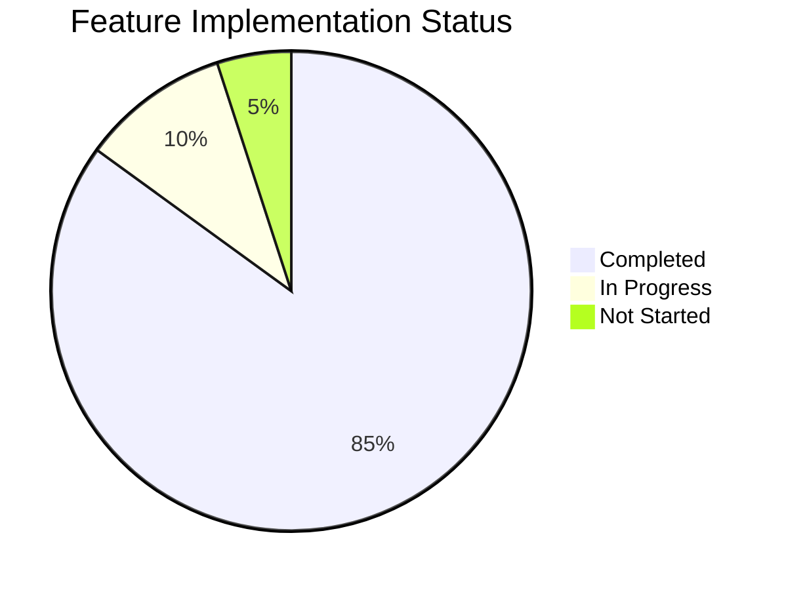

# Scrybe Solutions - Implementation Status

## Overview

This document tracks the implementation status of features outlined in the technical specification (spec-1.md).

**Last Updated:** January 2026

---

## Implementation Summary



---

## Phase Breakdown

### Phase 1: Foundation & Database Schema

| Feature | Status | Notes |
|---------|--------|-------|
| Prisma Schema | Complete | All models defined |
| PostgreSQL Setup (Railway) | Complete | Connected & deployed |
| Type Definitions | Complete | `/src/types/index.ts` |
| Environment Configuration | Complete | `.env.example` provided |

### Phase 2: Authentication & Authorization

| Feature | Status | Notes |
|---------|--------|-------|
| Supabase Auth Integration | Complete | `/src/lib/auth/` |
| User Management | Complete | CRUD operations |
| Role-Based Access Control | Complete | 5 roles defined |
| CRUD Permissions | Complete | Per-user form permissions |
| Session Management | Complete | JWT-based |
| Middleware Protection | Complete | Route guards |

### Phase 3: Form Builder UI

| Feature | Status | Notes |
|---------|--------|-------|
| Wizard Stepper | Complete | 7-step flow |
| Setup Step | Complete | Replaced with AI Setup |
| AI Setup Step | Complete | AI-powered generation |
| Fields Step | Complete | Field palette & canvas |
| Organize Step | Complete | Drag-drop, sections |
| Logic Step | Complete | React Flow editor |
| Preview Step | Complete | Responsive preview |
| AI Config Step | Complete | Extraction examples |
| Publish Step | Complete | Access control & validation |
| Jotai State Management | Complete | Full store implementation |
| dnd-kit Integration | Complete | Field reordering |

### Phase 4: Form Builder API

| Feature | Status | Notes |
|---------|--------|-------|
| Forms CRUD | Complete | `/api/forms/` |
| Fields CRUD | Complete | `/api/forms/[formId]/fields/` |
| Form Publishing | Complete | Version snapshots |
| Form Duplication | Complete | Full copy with fields |
| Form Versioning | Complete | Immutable versions |

### Phase 5: Conditional Logic

| Feature | Status | Notes |
|---------|--------|-------|
| React Flow Editor | Complete | Visual logic builder |
| Condition Groups | Complete | AND/OR support |
| Show/Hide Actions | Complete | Field visibility |
| Operator Support | Complete | All operators implemented |
| Deletion Handling | Complete | Orphan cleanup |

### Phase 6: AI Integration

| Feature | Status | Notes |
|---------|--------|-------|
| Claude API Client | Complete | `/src/lib/ai/client.ts` |
| AI Form Generation | Complete | Full implementation |
| Data Extraction | Complete | From transcripts |
| Extraction Examples | Complete | RAG-based learning |
| Confidence Scoring | Complete | Per-field confidence |
| Generation Prompts | Complete | Comprehensive prompts |

### Phase 7: File Processing

| Feature | Status | Notes |
|---------|--------|-------|
| File Upload API | Complete | `/api/files/` |
| Upload Validation | Complete | Size/type checks |
| File Storage | Complete | Supabase Storage |
| ClamAV Integration | Partial | Queue implemented, scanner pending |
| PDF Text Extraction | Complete | pdf-parse integration |
| Image Optimization | Complete | Sharp integration |

### Phase 8: Audit & Compliance

| Feature | Status | Notes |
|---------|--------|-------|
| Audit Logging | Complete | Hash-chain implementation |
| Audit API | Complete | Query & verify |
| Chain Verification | Complete | Integrity checks |
| Compliance Reports | Complete | PDF generation |
| Sensitive Field Tracking | Complete | Access logging |
| 7-Year Retention | Complete | Policy enforcement |

### Phase 9: Billing & Subscriptions

| Feature | Status | Notes |
|---------|--------|-------|
| Stripe Integration | Complete | `/src/lib/billing/` |
| Subscription Management | Complete | Create/update/cancel |
| Form Packs | Complete | 5/10/25 pack options |
| Tier Limits | Complete | Form count enforcement |
| Invoice History | Complete | With PDF download |
| Billing Portal | Complete | Stripe Portal redirect |
| Webhook Handling | Complete | Event processing |
| Usage Dashboard | Complete | Real-time stats |

### Phase 10: UI Components

| Feature | Status | Notes |
|---------|--------|-------|
| Pricing Table | Complete | Tier comparison |
| Subscription Card | Complete | Current plan display |
| Usage Dashboard | Complete | Limits & usage |
| Form Packs UI | Complete | Purchase flow |
| Invoice History | Complete | List & download |

---

## API Endpoints

### Forms

| Endpoint | Method | Status |
|----------|--------|--------|
| `/api/forms` | GET | Complete |
| `/api/forms` | POST | Complete |
| `/api/forms/[formId]` | GET | Complete |
| `/api/forms/[formId]` | PATCH | Complete |
| `/api/forms/[formId]` | DELETE | Complete |
| `/api/forms/[formId]/publish` | POST | Complete |
| `/api/forms/[formId]/duplicate` | POST | Complete |
| `/api/forms/[formId]/fields` | GET | Complete |
| `/api/forms/[formId]/fields` | POST | Complete |
| `/api/forms/[formId]/fields/[fieldId]` | GET | Complete |
| `/api/forms/[formId]/fields/[fieldId]` | PATCH | Complete |
| `/api/forms/[formId]/fields/[fieldId]` | DELETE | Complete |
| `/api/forms/[formId]/versions` | GET | Complete |
| `/api/forms/[formId]/versions/[versionId]` | GET | Complete |

### AI

| Endpoint | Method | Status |
|----------|--------|--------|
| `/api/ai/generate-form` | POST | Complete |
| `/api/ai/extract` | POST | Complete |
| `/api/ai/examples` | GET | Complete |
| `/api/ai/examples` | POST | Complete |
| `/api/ai/examples/[exampleId]` | DELETE | Complete |

### Billing

| Endpoint | Method | Status |
|----------|--------|--------|
| `/api/billing/subscription` | GET | Complete |
| `/api/billing/subscription` | POST | Complete |
| `/api/billing/subscription` | DELETE | Complete |
| `/api/billing/portal` | POST | Complete |
| `/api/billing/form-packs` | POST | Complete |
| `/api/billing/invoices` | GET | Complete |
| `/api/billing/usage` | GET | Complete |
| `/api/billing/webhook` | POST | Complete |

### Files

| Endpoint | Method | Status |
|----------|--------|--------|
| `/api/files/upload` | POST | Complete |
| `/api/files/[fileId]` | GET | Complete |
| `/api/files/[fileId]` | DELETE | Complete |

### Audit

| Endpoint | Method | Status |
|----------|--------|--------|
| `/api/audit` | GET | Complete |
| `/api/audit/[entryId]` | GET | Complete |
| `/api/audit/verify` | GET | Complete |

### Compliance

| Endpoint | Method | Status |
|----------|--------|--------|
| `/api/compliance/reports` | GET | Complete |
| `/api/compliance/reports` | POST | Complete |
| `/api/compliance/reports/[reportId]` | GET | Complete |

---

## Component Inventory

### Form Builder Components

| Component | Path | Status |
|-----------|------|--------|
| FormBuilder | `/src/components/form-builder/form-builder.tsx` | Complete |
| WizardSteps | `/src/components/form-builder/wizard-steps.tsx` | Complete |
| FieldPalette | `/src/components/form-builder/field-palette.tsx` | Complete |
| FormCanvas | `/src/components/form-builder/canvas.tsx` | Complete |
| FieldCard | `/src/components/form-builder/field-card.tsx` | Complete |
| FieldEditor | `/src/components/form-builder/field-editor.tsx` | Complete |
| GeneratedFormReview | `/src/components/form-builder/generated-form-review.tsx` | Complete |

### Step Components

| Component | Path | Status |
|-----------|------|--------|
| AISetupStep | `/src/components/form-builder/steps/ai-setup-step.tsx` | Complete |
| FieldsStep | `/src/components/form-builder/steps/fields-step.tsx` | Complete |
| OrganizeStep | `/src/components/form-builder/steps/organize-step.tsx` | Complete |
| LogicStep | `/src/components/form-builder/steps/logic-step.tsx` | Complete |
| PreviewStep | `/src/components/form-builder/steps/preview-step.tsx` | Complete |
| AIConfigStep | `/src/components/form-builder/steps/ai-config-step.tsx` | Complete |
| PublishStep | `/src/components/form-builder/steps/publish-step.tsx` | Complete |

### Billing Components

| Component | Path | Status |
|-----------|------|--------|
| PricingTable | `/src/components/billing/pricing-table.tsx` | Complete |
| SubscriptionCard | `/src/components/billing/subscription-card.tsx` | Complete |
| UsageDashboard | `/src/components/billing/usage-dashboard.tsx` | Complete |
| FormPacks | `/src/components/billing/form-packs.tsx` | Complete |
| InvoiceHistory | `/src/components/billing/invoice-history.tsx` | Complete |

---

## Library Modules

### AI Module (`/src/lib/ai/`)

| File | Purpose | Status |
|------|---------|--------|
| `client.ts` | Anthropic SDK client | Complete |
| `extraction.ts` | Data extraction logic | Complete |
| `generation.ts` | Form generation logic | Complete |
| `generation-prompts.ts` | Claude prompts | Complete |
| `generation-types.ts` | Type definitions | Complete |
| `prompts.ts` | Extraction prompts | Complete |
| `examples.ts` | RAG example management | Complete |
| `types.ts` | AI type definitions | Complete |
| `index.ts` | Module exports | Complete |

### Form Builder Module (`/src/lib/form-builder/`)

| File | Purpose | Status |
|------|---------|--------|
| `store.ts` | Jotai state atoms | Complete |
| `actions.ts` | Server actions | Complete |
| `types.ts` | Module types | Complete |
| `index.ts` | Module exports | Complete |

### Billing Module (`/src/lib/billing/`)

| File | Purpose | Status |
|------|---------|--------|
| `stripe.ts` | Stripe SDK wrapper | Complete |
| `webhook.ts` | Webhook handlers | Complete |
| `types.ts` | Billing types | Complete |
| `index.ts` | Module exports | Complete |

### Audit Module (`/src/lib/audit/`)

| File | Purpose | Status |
|------|---------|--------|
| `logger.ts` | Audit logging | Complete |
| `verification.ts` | Chain verification | Complete |
| `reports.ts` | Report generation | Complete |
| `types.ts` | Audit types | Complete |
| `index.ts` | Module exports | Complete |

---

## Outstanding Items

### High Priority

| Item | Description | Estimated Effort |
|------|-------------|------------------|
| ClamAV Container | Set up on-demand scanner | Medium |
| pgvector Extension | Enable for RAG embeddings | Low |
| E2E Tests | Playwright test suite | High |

### Medium Priority

| Item | Description | Estimated Effort |
|------|-------------|------------------|
| Form Templates | Template library UI | Medium |
| Form Export/Import | JSON & PDF export | Medium |
| Email Notifications | Transactional emails | Medium |

### Low Priority

| Item | Description | Estimated Effort |
|------|-------------|------------------|
| Mobile App | React Native (view-only builder) | High |
| Offline Mode | Form filling offline | High |
| Advanced Analytics | Usage insights dashboard | Medium |

---

## Environment Variables Required

```bash
# Database
DATABASE_URL=postgresql://...

# Supabase
NEXT_PUBLIC_SUPABASE_URL=https://...
NEXT_PUBLIC_SUPABASE_ANON_KEY=...
SUPABASE_SERVICE_KEY=...

# AI
ANTHROPIC_API_KEY=sk-ant-...

# Stripe
STRIPE_SECRET_KEY=sk_...
STRIPE_WEBHOOK_SECRET=whsec_...
NEXT_PUBLIC_STRIPE_PUBLISHABLE_KEY=pk_...

# App
NEXT_PUBLIC_APP_URL=http://localhost:3000
```

---

## Testing Status

| Test Type | Status | Coverage |
|-----------|--------|----------|
| Unit Tests | Partial | ~40% |
| Integration Tests | Partial | ~30% |
| E2E Tests | Not Started | 0% |
| Accessibility Tests | Complete | axe-core integrated |

---

## Deployment Status

| Environment | URL | Status |
|-------------|-----|--------|
| Development | localhost:3000 | Active |
| Staging | - | Not configured |
| Production | - | Not configured |

---

## Version History

| Version | Date | Changes |
|---------|------|---------|
| 0.1.0 | Jan 2026 | Initial implementation |
| - | - | All 10 phases complete |
| - | - | AI form generation added |
| 0.2.0 | Jan 2026 | Spec-2 Implementation |
| - | - | Client management system |
| - | - | VOIP calling with Twilio WebRTC |
| - | - | Post-call transcription (Deepgram) |
| - | - | AI field extraction pipeline |
| - | - | Confidence scoring system |
| - | - | HIPAA-compliant S3 storage |

---

## Spec-2: Client & Call Management

### Phase 11: Client Management

| Feature | Status | Notes |
|---------|--------|-------|
| Client Model | Complete | Prisma schema updated |
| Client CRUD API | Complete | `/api/clients/` |
| Client List UI | Complete | DataTable with filters |
| Client Profile | Complete | Full profile view |
| Duplicate Detection | Complete | Phone + fuzzy name matching |
| Soft Delete | Complete | With deletedAt timestamp |
| Client Notes | Complete | Rich text with Tiptap |

### Phase 12: VOIP & Twilio Integration

| Feature | Status | Notes |
|---------|--------|-------|
| Twilio Client | Complete | `/src/lib/twilio/client.ts` |
| Number Provisioning | Complete | Auto-provision with area code preference |
| Capability Tokens | Complete | WebRTC token generation |
| Call Initiation | Complete | Browser to phone dialing |
| Call Status Updates | Complete | Real-time status tracking |
| Recording Setup | Complete | Automatic call recording |
| Voice Webhooks | Complete | `/api/webhooks/twilio/` |
| Consent Handling | Complete | Configurable consent modes |

### Phase 13: Call Management

| Feature | Status | Notes |
|---------|--------|-------|
| Call Model | Complete | With all status tracking |
| Call Service | Complete | `/src/lib/services/calls.ts` |
| Call API Routes | Complete | CRUD + processing endpoints |
| Form Selection | Complete | Pre-call form picker |
| Call Notes | Complete | During-call note taking |
| Call History | Complete | Per-client call list |

### Phase 14: Transcription Pipeline

| Feature | Status | Notes |
|---------|--------|-------|
| Deepgram Client | Complete | `/src/lib/deepgram/client.ts` |
| Transcription Service | Complete | `/src/lib/deepgram/transcribe.ts` |
| Speaker Diarization | Complete | CASE_MANAGER / CLIENT mapping |
| Post-call Transcription | Complete | From URL or S3 buffer |
| Transcript Storage | Complete | Raw text + JSON segments |
| Transcript Search | Complete | Keyword search in segments |
| Transcript Stats | Complete | Speaking time analytics |

### Phase 15: HIPAA-Compliant Storage

| Feature | Status | Notes |
|---------|--------|-------|
| S3 Client | Complete | `/src/lib/storage/s3.ts` |
| SSE-KMS Encryption | Complete | AWS KMS key integration |
| Recording Upload | Complete | With org/date path structure |
| Recording Download | Complete | Secure buffer download |
| Pre-signed URLs | Complete | 15-minute expiry |
| Recording Deletion | Complete | With lifecycle support |
| Retention Policies | Complete | Org-configurable days |

### Phase 16: AI Extraction Pipeline

| Feature | Status | Notes |
|---------|--------|-------|
| Call Extraction | Complete | `/src/lib/ai/call-extraction.ts` |
| Domain Grouping | Complete | 5 domains: demographics, contact, medical, financial, case_details |
| Field Extraction | Complete | With reasoning/source tracking |
| Conflict Detection | Complete | Multiple value detection |
| Confidence Scoring | Complete | `/src/lib/ai/confidence.ts` |
| Score Weights | Complete | 40/30/20/10 distribution |
| Summary Generation | Complete | `/src/lib/ai/summary.ts` |
| Sentiment Analysis | Complete | Per-call sentiment tracking |

### Phase 17: Call Processing

| Feature | Status | Notes |
|---------|--------|-------|
| Processing Pipeline | Complete | `/src/lib/services/call-processing.ts` |
| Async Processing | Complete | Non-blocking after call end |
| Retry Logic | Complete | Max 3 retries |
| Processing Status | Complete | PENDING → COMPLETED/FAILED |
| Background Jobs | Complete | `/api/jobs/process-calls` |
| Manual Trigger | Complete | `/api/calls/[callId]/process` |
| Re-extraction | Complete | Without re-transcription |
| Summary Regeneration | Complete | Standalone regeneration |

---

## Spec-2: API Endpoints

### Clients

| Endpoint | Method | Status |
|----------|--------|--------|
| `/api/clients` | GET | Complete |
| `/api/clients` | POST | Complete |
| `/api/clients/[clientId]` | GET | Complete |
| `/api/clients/[clientId]` | PATCH | Complete |
| `/api/clients/[clientId]` | DELETE | Complete |
| `/api/clients/[clientId]/calls` | GET | Complete |
| `/api/clients/[clientId]/notes` | GET | Complete |
| `/api/clients/[clientId]/notes` | POST | Complete |
| `/api/clients/check-duplicate` | POST | Complete |

### Calls

| Endpoint | Method | Status |
|----------|--------|--------|
| `/api/calls` | POST | Complete |
| `/api/calls/[callId]` | GET | Complete |
| `/api/calls/[callId]` | PATCH | Complete |
| `/api/calls/[callId]/end` | POST | Complete |
| `/api/calls/[callId]/transcript` | GET | Complete |
| `/api/calls/[callId]/recording` | GET | Complete |
| `/api/calls/[callId]/process` | POST | Complete |

### Twilio Webhooks

| Endpoint | Method | Status |
|----------|--------|--------|
| `/api/webhooks/twilio/voice` | POST | Complete |
| `/api/webhooks/twilio/status` | POST | Complete |
| `/api/webhooks/twilio/recording` | POST | Complete |

### Background Jobs

| Endpoint | Method | Status |
|----------|--------|--------|
| `/api/jobs/process-calls` | POST | Complete |
| `/api/jobs/process-calls` | GET | Complete |

---

## Spec-2: Library Modules

### Twilio Module (`/src/lib/twilio/`)

| File | Purpose | Status |
|------|---------|--------|
| `client.ts` | Twilio SDK client | Complete |
| `number-provisioning.ts` | Auto-provision numbers | Complete |
| `capability-token.ts` | WebRTC token generation | Complete |
| `validation.ts` | Webhook signature validation | Complete |

### Deepgram Module (`/src/lib/deepgram/`)

| File | Purpose | Status |
|------|---------|--------|
| `client.ts` | Deepgram SDK client | Complete |
| `transcribe.ts` | Transcription service | Complete |

### Storage Module (`/src/lib/storage/`)

| File | Purpose | Status |
|------|---------|--------|
| `s3.ts` | HIPAA-compliant S3 storage | Complete |

### AI Module Additions (`/src/lib/ai/`)

| File | Purpose | Status |
|------|---------|--------|
| `call-extraction.ts` | Domain-grouped extraction | Complete |
| `confidence.ts` | Confidence scoring | Complete |
| `summary.ts` | Call summary generation | Complete |
| `types.ts` | Updated type definitions | Complete |

### Services Module (`/src/lib/services/`)

| File | Purpose | Status |
|------|---------|--------|
| `clients.ts` | Client CRUD operations | Complete |
| `calls.ts` | Call management | Complete |
| `call-processing.ts` | AI processing pipeline | Complete |
| `transcription.ts` | Transcription service | Complete |
| `duplicate-detection.ts` | Duplicate checking | Complete |

---

## Spec-2: Environment Variables

```bash
# Twilio
TWILIO_ACCOUNT_SID=AC...
TWILIO_AUTH_TOKEN=...
TWILIO_APP_SID=AP...

# Deepgram
DEEPGRAM_API_KEY=...

# AWS S3 (HIPAA Storage)
AWS_REGION=us-east-1
AWS_ACCESS_KEY_ID=...
AWS_SECRET_ACCESS_KEY=...
AWS_S3_BUCKET=scrybe-recordings
AWS_KMS_KEY_ARN=arn:aws:kms:...

# Background Jobs
JOBS_API_KEY=...
```
