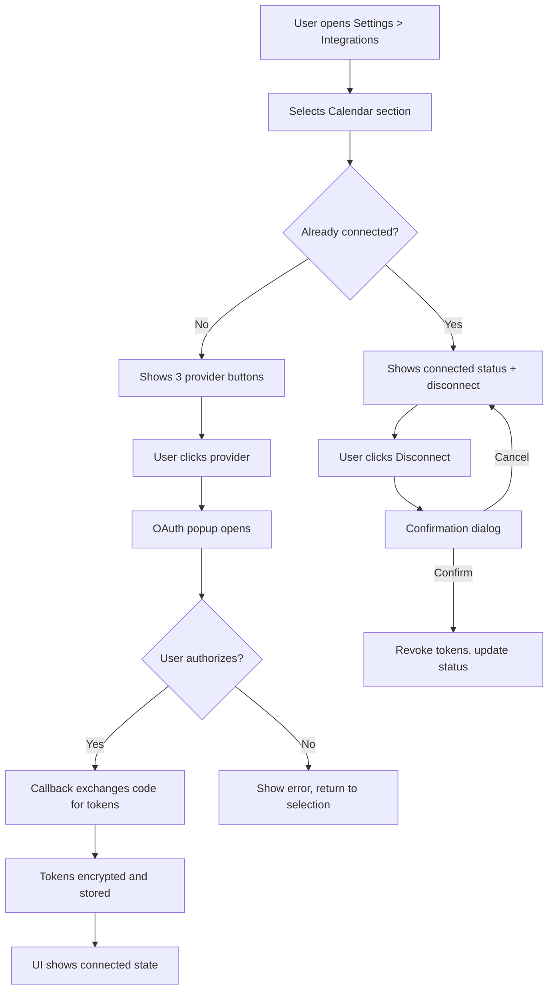
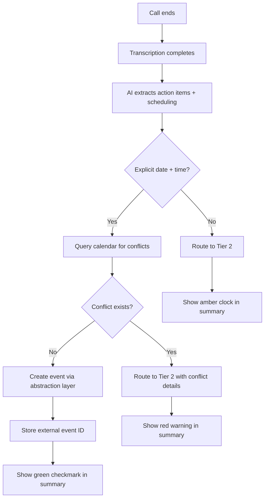
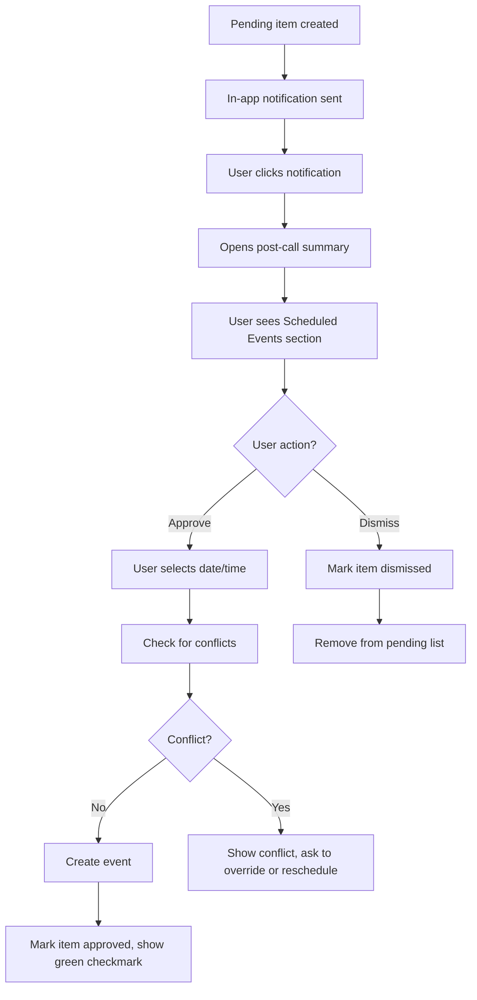
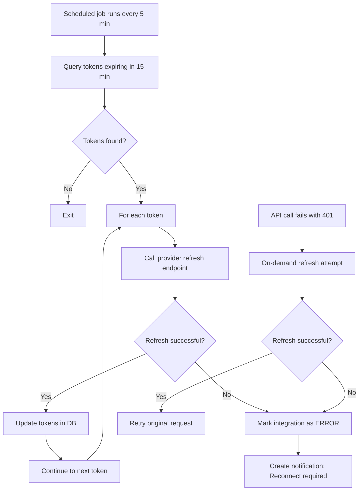
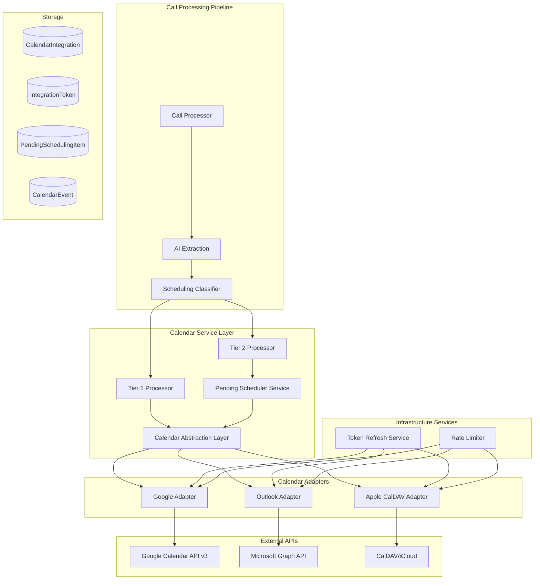
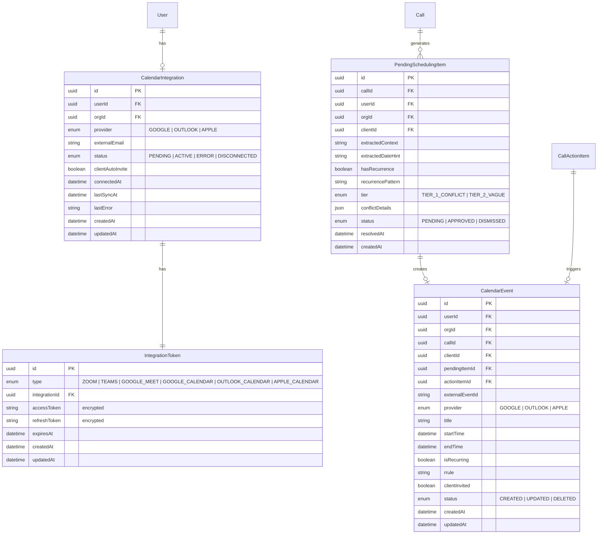

# Smart Calendar Integration - Technical Specification

**Status:** Ready for Implementation
**Linear Issues:** PX-822 through PX-830 + 2 new infrastructure issues
**Date:** February 26, 2026
**Author:** Claude Code (with Valerie Phoenix)

---

## 1. Overview

### 1.1 What We're Building

A Smart Calendar Integration that automatically converts time-sensitive action items from VoIP calls into calendar events. The system operates on a two-tier model:

- **Tier 1 (Auto-Schedule):** Explicit date + time detected → event auto-created with conflict check
- **Tier 2 (Review & Approve):** Vague scheduling intent → pending item for user approval

### 1.2 Why We're Building It

Case managers spend ~5 minutes post-call transferring discussed appointments to calendars. This feature eliminates that manual step, reducing post-call admin to zero for explicit dates and minimal effort for vague references.

### 1.3 Scope

| In Scope | Out of Scope (Future) |
|----------|----------------------|
| Google Calendar, Outlook, Apple Calendar | Two-way sync (external changes → Scrybe) |
| Tier 1 auto-scheduling with conflict detection | Availability-based smart suggestions |
| Tier 2 review & approve workflow | SMS/email reminders to clients |
| Recurring event creation | Multi-calendar per user |
| Client invite (email on file) | Org-wide calendar visibility |
| Unified token management service | Calendar event templates |
| Settings UI + Post-call UI | |

---

## 2. User Stories & Acceptance Criteria

### 2.1 Calendar Connection

**As any internal Scrybe user, I want to connect my calendar so Scrybe can auto-schedule events.**

**Acceptance Criteria:**
- [ ] User navigates to Settings > Integrations > Calendar
- [ ] User selects provider (Google, Outlook, Apple) with branded buttons
- [ ] OAuth flow opens in popup, user grants read/write permissions
- [ ] On success: connected account email displayed with green status
- [ ] User can disconnect with confirmation dialog
- [ ] Only one provider connected at a time
- [ ] Switching providers requires explicit disconnect confirmation

### 2.2 Tier 1: Auto-Schedule

**As a case manager, when I discuss a meeting with explicit date/time, I want Scrybe to auto-create the event.**

**Acceptance Criteria:**
- [ ] AI detects explicit date + time in call transcript
- [ ] System checks user's calendar for conflicts at that slot
- [ ] No conflict: event created automatically (30-min default)
- [ ] Conflict detected: routes to Tier 2 with conflict details
- [ ] Event title: "Scrybe: Follow-up with [Client First Name]"
- [ ] Event description: deep link to Scrybe interaction only
- [ ] Client auto-invited if email on file
- [ ] Post-call summary shows green checkmark confirmation
- [ ] External calendar event ID stored in Scrybe

### 2.3 Tier 2: Review & Approve

**As a case manager, when a call has vague scheduling references, I want to review and schedule them manually.**

**Acceptance Criteria:**
- [ ] AI detects scheduling intent without specific date/time
- [ ] Pending item created with extracted context
- [ ] Item appears in post-call summary with amber clock icon
- [ ] In-app notification generated (links to post-call summary)
- [ ] User can select date/time and approve → event created
- [ ] User can dismiss pending item
- [ ] Pending items persist until resolved

### 2.4 Recurring Events

**As a case manager, when I set up recurring check-ins, I want Scrybe to create the full series.**

**Acceptance Criteria:**
- [ ] AI detects recurrence patterns: daily, weekly, biweekly, monthly, custom
- [ ] Explicit recurrence + date/time → auto-create series (Tier 1)
- [ ] Vague recurrence → route to Tier 2 with recurrence flag
- [ ] RRULE formatting correct for all three providers

### 2.5 Disconnect & Reconnect

**As a user, I want clean disconnect behavior that preserves my existing events.**

**Acceptance Criteria:**
- [ ] On disconnect: existing events remain on calendar
- [ ] Scrybe stops creating new events
- [ ] Pending Tier 2 items preserved in-app
- [ ] User can reconnect and push pending items

---

## 3. User Flows

### 3.1 Calendar Connection Flow



### 3.2 Tier 1 Auto-Schedule Flow



### 3.3 Tier 2 Approval Flow



### 3.4 Token Refresh Flow



---

## 4. Technical Design

### 4.1 Architecture Overview



### 4.2 Database Schema



### 4.3 Prisma Schema Additions

```prisma
enum CalendarProvider {
  GOOGLE
  OUTLOOK
  APPLE
}

enum CalendarIntegrationStatus {
  PENDING
  ACTIVE
  ERROR
  DISCONNECTED
}

enum IntegrationTokenType {
  ZOOM
  TEAMS
  GOOGLE_MEET
  GOOGLE_CALENDAR
  OUTLOOK_CALENDAR
  APPLE_CALENDAR
}

enum PendingSchedulingTier {
  TIER_1_CONFLICT
  TIER_2_VAGUE
}

enum PendingSchedulingStatus {
  PENDING
  APPROVED
  DISMISSED
}

enum CalendarEventStatus {
  CREATED
  UPDATED
  DELETED
}

model CalendarIntegration {
  id               String                     @id @default(uuid())
  userId           String
  user             User                       @relation(fields: [userId], references: [id])
  orgId            String
  organization     Organization               @relation(fields: [orgId], references: [id])
  provider         CalendarProvider
  externalEmail    String?
  status           CalendarIntegrationStatus  @default(PENDING)
  clientAutoInvite Boolean                    @default(true)
  connectedAt      DateTime?
  lastSyncAt       DateTime?
  lastError        String?
  token            IntegrationToken?
  createdAt        DateTime                   @default(now())
  updatedAt        DateTime                   @updatedAt

  @@unique([userId])
  @@index([orgId])
}

model IntegrationToken {
  id                    String               @id @default(uuid())
  type                  IntegrationTokenType
  calendarIntegrationId String?              @unique
  calendarIntegration   CalendarIntegration? @relation(fields: [calendarIntegrationId], references: [id])
  meetingIntegrationId  String?              @unique
  meetingIntegration    MeetingIntegration?  @relation(fields: [meetingIntegrationId], references: [id])
  accessToken           String               // encrypted at rest
  refreshToken          String?              // encrypted at rest
  expiresAt             DateTime?
  createdAt             DateTime             @default(now())
  updatedAt             DateTime             @updatedAt

  @@index([expiresAt])
  @@index([type])
}

model PendingSchedulingItem {
  id                String                   @id @default(uuid())
  callId            String
  call              Call                     @relation(fields: [callId], references: [id])
  userId            String
  user              User                     @relation(fields: [userId], references: [id])
  orgId             String
  organization      Organization             @relation(fields: [orgId], references: [id])
  clientId          String?
  client            Client?                  @relation(fields: [clientId], references: [id])
  extractedContext  String
  extractedDateHint String?
  hasRecurrence     Boolean                  @default(false)
  recurrencePattern String?
  tier              PendingSchedulingTier
  conflictDetails   Json?
  status            PendingSchedulingStatus  @default(PENDING)
  resolvedAt        DateTime?
  calendarEvent     CalendarEvent?
  createdAt         DateTime                 @default(now())
  updatedAt         DateTime                 @updatedAt

  @@index([userId, status])
  @@index([callId])
}

model CalendarEvent {
  id              String              @id @default(uuid())
  userId          String
  user            User                @relation(fields: [userId], references: [id])
  orgId           String
  organization    Organization        @relation(fields: [orgId], references: [id])
  callId          String?
  call            Call?               @relation(fields: [callId], references: [id])
  clientId        String?
  client          Client?             @relation(fields: [clientId], references: [id])
  pendingItemId   String?             @unique
  pendingItem     PendingSchedulingItem? @relation(fields: [pendingItemId], references: [id])
  actionItemId    String?
  actionItem      CallActionItem?     @relation(fields: [actionItemId], references: [id])
  externalEventId String
  provider        CalendarProvider
  title           String
  startTime       DateTime
  endTime         DateTime
  isRecurring     Boolean             @default(false)
  rrule           String?
  clientInvited   Boolean             @default(false)
  status          CalendarEventStatus @default(CREATED)
  createdAt       DateTime            @default(now())
  updatedAt       DateTime            @updatedAt

  @@index([userId])
  @@index([externalEventId, provider])
}
```

### 4.4 API Contracts

#### OAuth Flow

```typescript
// GET /api/integrations/calendar/authorize
// Query params: provider=google|outlook|apple
// Response: { authorizationUrl: string }

// GET /api/integrations/calendar/callback/[provider]
// Query params: code, state
// Redirects to: /settings/integrations?calendar=connected|error

// DELETE /api/integrations/calendar
// Response: { success: true }
```

#### Calendar Integration Status

```typescript
// GET /api/integrations/calendar
// Response:
interface CalendarIntegrationResponse {
  connected: boolean;
  provider?: "google" | "outlook" | "apple";
  email?: string;
  status: "active" | "error" | "disconnected";
  clientAutoInvite: boolean;
  connectedAt?: string;
}

// PATCH /api/integrations/calendar
// Body: { clientAutoInvite: boolean }
// Response: { success: true }
```

#### Pending Scheduling Items

```typescript
// GET /api/scheduling/pending
// Query params: callId? (optional filter)
// Response:
interface PendingSchedulingItemsResponse {
  items: Array<{
    id: string;
    callId: string;
    clientName: string;
    extractedContext: string;
    extractedDateHint?: string;
    hasRecurrence: boolean;
    recurrencePattern?: string;
    tier: "TIER_1_CONFLICT" | "TIER_2_VAGUE";
    conflictDetails?: {
      conflictingEventTitle: string;
      conflictingEventTime: string;
    };
    createdAt: string;
  }>;
}

// POST /api/scheduling/approve
// Body:
interface ApproveSchedulingRequest {
  pendingItemId: string;
  startTime: string; // ISO datetime
  endTime?: string; // defaults to startTime + 30 min
  recurrence?: {
    frequency: "DAILY" | "WEEKLY" | "BIWEEKLY" | "MONTHLY";
    daysOfWeek?: number[]; // 0=Sun, 6=Sat
    until?: string; // ISO date
  };
}
// Response: { success: true, eventId: string }

// POST /api/scheduling/dismiss
// Body: { pendingItemId: string }
// Response: { success: true }
```

#### Calendar Events (Internal Use)

```typescript
// GET /api/calls/[callId]/calendar-events
// Response:
interface CallCalendarEventsResponse {
  events: Array<{
    id: string;
    externalEventId: string;
    provider: "google" | "outlook" | "apple";
    title: string;
    startTime: string;
    endTime: string;
    isRecurring: boolean;
    clientInvited: boolean;
    status: "CREATED" | "UPDATED" | "DELETED";
  }>;
  pendingItems: Array<PendingSchedulingItem>;
}
```

### 4.5 Calendar Abstraction Layer

```typescript
// src/lib/calendar/types.ts
export interface CalendarEvent {
  title: string;
  description?: string;
  startTime: Date;
  endTime: Date;
  attendees?: Array<{ email: string; name?: string }>;
  recurrence?: RecurrenceRule;
  location?: string;
}

export interface RecurrenceRule {
  frequency: "DAILY" | "WEEKLY" | "BIWEEKLY" | "MONTHLY";
  interval?: number;
  daysOfWeek?: number[];
  until?: Date;
  count?: number;
}

export interface CalendarConflict {
  eventId: string;
  title: string;
  startTime: Date;
  endTime: Date;
}

export interface CalendarAdapter {
  provider: CalendarProvider;

  // CRUD operations
  createEvent(event: CalendarEvent): Promise<{ eventId: string }>;
  updateEvent(eventId: string, event: Partial<CalendarEvent>): Promise<void>;
  deleteEvent(eventId: string): Promise<void>;

  // Availability
  checkConflicts(startTime: Date, endTime: Date): Promise<CalendarConflict[]>;

  // Recurring
  createRecurringEvent(event: CalendarEvent, rule: RecurrenceRule): Promise<{ eventId: string }>;
}

// src/lib/calendar/service.ts
export class CalendarService {
  private adapter: CalendarAdapter;

  constructor(integration: CalendarIntegration) {
    this.adapter = this.createAdapter(integration);
  }

  private createAdapter(integration: CalendarIntegration): CalendarAdapter {
    switch (integration.provider) {
      case "GOOGLE":
        return new GoogleCalendarAdapter(integration);
      case "OUTLOOK":
        return new OutlookCalendarAdapter(integration);
      case "APPLE":
        return new AppleCalendarAdapter(integration);
    }
  }

  async scheduleEvent(event: CalendarEvent): Promise<ScheduleResult> {
    // Check conflicts
    const conflicts = await this.adapter.checkConflicts(
      event.startTime,
      event.endTime
    );

    if (conflicts.length > 0) {
      return { success: false, conflict: conflicts[0] };
    }

    // Create event
    const { eventId } = event.recurrence
      ? await this.adapter.createRecurringEvent(event, event.recurrence)
      : await this.adapter.createEvent(event);

    return { success: true, eventId };
  }
}
```

### 4.6 AI Extraction Enhancement

Extend existing `src/lib/ai/call-action-items.ts` prompt to include scheduling classification:

```typescript
// Additional fields in extraction schema
interface SchedulingClassification {
  hasSchedulingIntent: boolean;
  tier: "TIER_1" | "TIER_2";
  explicitDateTime?: {
    date: string; // ISO date
    time: string; // HH:mm
    confidence: number; // 0-1
  };
  vagueReference?: string; // "next week", "soon", etc.
  recurrence?: {
    detected: boolean;
    pattern?: "DAILY" | "WEEKLY" | "BIWEEKLY" | "MONTHLY" | "CUSTOM";
    daysOfWeek?: string[]; // "Monday", "Wednesday"
    confidence: number;
  };
  participants?: string[]; // Names mentioned
}

// Extended action item
interface ExtractedActionItem {
  // ... existing fields ...
  scheduling?: SchedulingClassification;
}
```

**Prompt Addition:**

```
For each action item, also analyze if it involves scheduling a future event:

1. SCHEDULING INTENT: Does this action item involve scheduling a meeting, call, appointment, or follow-up?

2. TIER CLASSIFICATION:
   - TIER_1 (Auto-schedule): Explicit date AND time mentioned (e.g., "Thursday March 5th at 2pm", "tomorrow at 10am", "next Monday at 3")
   - TIER_2 (Review): Vague timing (e.g., "sometime next week", "soon", "in a few days", "let's reconnect")

3. DATE/TIME EXTRACTION: If explicit, extract the date and time. Resolve relative references using the call timestamp as anchor.

4. RECURRENCE: Does this mention recurring meetings? Look for: "every week", "weekly", "biweekly", "monthly", "every other [day]", "regularly"

5. PARTICIPANTS: Who is involved in this scheduled event based on conversation context?
```

### 4.7 Token Refresh Service

```typescript
// src/lib/services/token-refresh.ts
import { prisma } from "@/lib/db";
import { encrypt, decrypt } from "@/lib/encryption";

export interface TokenRefresher {
  type: IntegrationTokenType;
  refresh(refreshToken: string): Promise<{
    accessToken: string;
    refreshToken?: string;
    expiresAt: Date;
  }>;
}

const refreshers: Map<IntegrationTokenType, TokenRefresher> = new Map();

export function registerTokenRefresher(refresher: TokenRefresher) {
  refreshers.set(refresher.type, refresher);
}

export async function refreshExpiringTokens(): Promise<{
  refreshed: number;
  failed: number;
}> {
  const expiringThreshold = new Date(Date.now() + 15 * 60 * 1000); // 15 min

  const tokens = await prisma.integrationToken.findMany({
    where: {
      expiresAt: { lte: expiringThreshold },
      refreshToken: { not: null },
    },
    include: {
      calendarIntegration: true,
      meetingIntegration: true,
    },
  });

  let refreshed = 0;
  let failed = 0;

  for (const token of tokens) {
    const refresher = refreshers.get(token.type);
    if (!refresher) continue;

    try {
      const decryptedRefresh = decrypt(token.refreshToken!);
      const newTokens = await refresher.refresh(decryptedRefresh);

      await prisma.integrationToken.update({
        where: { id: token.id },
        data: {
          accessToken: encrypt(newTokens.accessToken),
          refreshToken: newTokens.refreshToken
            ? encrypt(newTokens.refreshToken)
            : undefined,
          expiresAt: newTokens.expiresAt,
        },
      });

      refreshed++;
    } catch (error) {
      failed++;

      // Mark integration as error
      if (token.calendarIntegration) {
        await prisma.calendarIntegration.update({
          where: { id: token.calendarIntegration.id },
          data: {
            status: "ERROR",
            lastError: "Token refresh failed. Please reconnect.",
          },
        });

        // Create notification
        await createNotification({
          userId: token.calendarIntegration.userId,
          orgId: token.calendarIntegration.orgId,
          type: "CALENDAR_DISCONNECTED",
          title: "Calendar Disconnected",
          body: "Your calendar connection expired. Please reconnect.",
          actionUrl: "/settings/integrations",
        });
      }
    }
  }

  return { refreshed, failed };
}
```

### 4.8 Rate Limit Extension

Add to existing `src/lib/rate-limit/config.ts`:

```typescript
export const RATE_LIMIT_CONFIGS = {
  // ... existing configs ...

  externalCalendar: {
    limit: 50,           // 50 requests
    windowMs: 60 * 1000, // per minute
    keyPrefix: "calendar",
    trackBy: ["userId"],
  },
};
```

---

## 5. Component Structure

### 5.1 Settings Page

```
src/app/(dashboard)/settings/integrations/
├── page.tsx                           # Main integrations page
└── components/
    ├── MeetingIntegrationsSection.tsx # Existing Zoom/Teams/Meet
    └── CalendarIntegrationSection.tsx # NEW
        ├── CalendarProviderButton.tsx
        ├── ConnectedCalendarCard.tsx
        └── CalendarSettingsForm.tsx
```

### 5.2 Post-Call Summary

```
src/app/(dashboard)/calls/[callId]/review/
├── page.tsx
└── components/
    ├── CallSummaryTabs.tsx
    ├── ActionItemsSection.tsx          # Existing
    ├── ScheduledEventsSection.tsx      # NEW
    │   ├── Tier1EventCard.tsx          # Green checkmark
    │   ├── Tier2PendingCard.tsx        # Amber clock + approve
    │   ├── ConflictCard.tsx            # Red warning
    │   └── DateTimePicker.tsx
    └── TranscriptSection.tsx
```

### 5.3 Service Layer

```
src/lib/calendar/
├── types.ts                    # Shared types
├── service.ts                  # CalendarService orchestrator
├── adapters/
│   ├── google.ts               # GoogleCalendarAdapter
│   ├── outlook.ts              # OutlookCalendarAdapter
│   └── apple.ts                # AppleCalendarAdapter (tsdav)
├── scheduling/
│   ├── classifier.ts           # AI scheduling classification
│   ├── tier1-processor.ts      # Auto-schedule logic
│   └── tier2-processor.ts      # Pending item creation
└── oauth/
    ├── google.ts               # Google OAuth flow
    ├── outlook.ts              # Microsoft OAuth flow
    └── apple.ts                # Apple OAuth flow

src/lib/services/
├── token-refresh.ts            # Unified token refresh service
└── pending-scheduler.ts        # Pending scheduling item CRUD
```

---

## 6. Security Considerations

### 6.1 HIPAA Compliance

| Data Element | Classification | Protection |
|-------------|----------------|------------|
| Calendar event title (client first name) | PII | Audit logged on creation |
| External calendar event ID | Non-PHI | Standard DB storage |
| OAuth tokens | Sensitive | AES-256-GCM encryption at rest |
| Scheduling context | May contain PHI | Audit logged when accessed |

**Audit Events:**
- `CALENDAR_EVENT_CREATED` - userId, clientId, eventId, callId
- `CALENDAR_EVENT_UPDATED` - userId, eventId, changes
- `CALENDAR_INTEGRATION_CONNECTED` - userId, provider
- `CALENDAR_INTEGRATION_DISCONNECTED` - userId, provider

### 6.2 OAuth Security

- State parameter with 10-minute expiry (existing pattern)
- PKCE for all OAuth flows
- Tokens encrypted with AES-256-GCM before storage
- Refresh tokens rotated on each use (where supported)
- Minimal scopes requested:
  - Google: `calendar.events`, `calendar.readonly`
  - Outlook: `Calendars.ReadWrite`
  - Apple: CalDAV read/write on default calendar

### 6.3 Rate Limiting

- 50 calendar API calls per user per minute
- Backoff on provider 429 responses
- Queue-based processing to prevent bursts

---

## 7. Success Metrics & Hypotheses

### 7.1 Hypotheses

| # | Hypothesis | Metric | Target |
|---|-----------|--------|--------|
| H1 | Calendar integration increases feature stickiness | DAU of users with calendar connected | 40% of active users |
| H2 | Auto-scheduling reduces post-call admin time | Avg post-call time (survey) | -3 min reduction |
| H3 | Tier 1 accuracy is high enough for trust | % of auto-created events edited/deleted within 24h | <15% |
| H4 | Tier 2 surfacing drives completion | % of Tier 2 items approved (not dismissed) | >60% |

### 7.2 Tracking Events

```typescript
// Analytics events to implement
track("calendar_connected", { provider, userId });
track("calendar_disconnected", { provider, userId, reason });
track("calendar_event_created", { tier: 1 | 2, provider, hasRecurrence, clientInvited });
track("tier2_item_approved", { pendingItemId, daysToResolve });
track("tier2_item_dismissed", { pendingItemId, daysToResolve });
track("calendar_conflict_detected", { callId });
track("calendar_event_edited_externally", { eventId, hoursAfterCreation });
```

---

## 8. Implementation Order

Based on infrastructure-first approach:

### Phase 1: Infrastructure (PX-NEW-1, PX-NEW-2, PX-822)
1. **PX-NEW-1:** Unified Token Refresh Service
   - Generic IntegrationToken table
   - Token refresh scheduler (cron)
   - On-demand refresh middleware
   - Migrate existing MeetingIntegration tokens

2. **PX-NEW-2:** Rate Limiter Extension
   - Add `externalCalendar` category to existing rate limiter
   - Queue wrapper for calendar API calls

3. **PX-822:** OAuth Infrastructure
   - CalendarIntegration table
   - Google/Outlook/Apple OAuth flows
   - Callback handlers
   - Token storage with encryption

### Phase 2: Abstraction Layer (PX-823)
4. **PX-823:** Calendar Abstraction Layer
   - CalendarAdapter interface
   - GoogleCalendarAdapter (Google Calendar API v3)
   - OutlookCalendarAdapter (Microsoft Graph)
   - AppleCalendarAdapter (tsdav for CalDAV)
   - RRULE generation for recurrence

### Phase 3: AI Pipeline (PX-824)
5. **PX-824:** AI Scheduling Extraction
   - Extend action item prompt with scheduling classification
   - Tier routing logic
   - Date/time parsing with call timestamp anchor
   - Recurrence detection

### Phase 4: Core Flows (PX-825, PX-826)
6. **PX-825:** Tier 1 Auto-Schedule
   - Conflict detection
   - Event creation flow
   - Client invite logic
   - External event ID storage

7. **PX-826:** Tier 2 Backend
   - PendingSchedulingItem model
   - API endpoints (list, approve, dismiss)
   - Notification creation

### Phase 5: UI (PX-827, PX-828, PX-829)
8. **PX-827:** Settings UI
   - Calendar section in integrations
   - Provider selection with branded buttons
   - Connected state display
   - Disconnect flow

9. **PX-828:** Post-Call Summary UI
   - Scheduled Events section
   - Tier 1/2/Conflict cards
   - Inline approval flow

10. **PX-829:** Notification System
    - Tier 2 pending notifications
    - Conflict alerts
    - Token expiry reconnect prompts

### Phase 6: Testing (PX-830)
11. **PX-830:** E2E Testing
    - Happy path tests per provider
    - Conflict scenarios
    - Edge cases (disconnect, reconnect, token expiry)
    - Recurring event tests

---

## 9. Decisions Made

| Decision | Choice | Rationale |
|----------|--------|-----------|
| Provider scope | All 3 at launch | Nonprofit diversity; spec requirement |
| Data model | Separate CalendarIntegration table | Clean separation from meetings; independent connection |
| Token storage | Generic IntegrationToken table | Reusable across all OAuth integrations |
| AI pipeline | Extend existing prompt | Single Claude call; cheaper and faster |
| CalDAV library | tsdav | TypeScript native, well-maintained, iCloud support |
| Event tracking | Store external IDs | Enables future two-way sync |
| Provider switch | Confirm disconnect first | Clear UX, user understands state change |
| Conflict check | Just event duration | Standard behavior, simple |
| Auth failure | In-app notification only | Persistent until resolved, actionable |
| Approval UX | Link to post-call summary | Single source of truth, simpler |
| Settings UI | Separate sections | Meetings vs Calendar clearly distinct |
| Summary placement | After Action Items | Natural flow |
| Build order | Infrastructure first | Solid foundation for all features |

---

## 10. Deferred Items

| Item | Reason | Future Issue |
|------|--------|--------------|
| Two-way sync (external → Scrybe) | Complexity; V1 is Scrybe → Calendar only | Post-launch |
| Availability suggestions | Nice-to-have; V1 user picks time | Post-launch |
| Multi-calendar per user | Complicates "which calendar" decision | Post-launch |
| SMS/email reminders to clients | Separate feature; scope creep | Separate epic |
| Calendar event templates | Nice-to-have; V1 uses defaults | Post-launch |
| Org-wide calendar visibility | Admin feature; not core flow | Post-launch |

---

## 11. Open Questions

None remaining - all questions resolved during interview.

---

## 12. Learnings

1. **Reusable infrastructure pays off:** Building the unified token refresh service now benefits existing Zoom/Teams/Meet integrations AND all future OAuth integrations.

2. **Existing patterns accelerate:** The codebase already has OAuth flows for meeting platforms, rate limiting, notifications, and action item extraction. Calendar integration follows these patterns closely.

3. **Two-tier model is well-suited:** The explicit/vague distinction maps cleanly to auto-schedule vs. human-in-the-loop, building trust through transparency.

4. **CalDAV is the complexity outlier:** Apple Calendar via CalDAV is more complex than Google/Outlook REST APIs. The tsdav library abstracts most of this, but edge cases in recurrence and invites may surface.

5. **Minimal event content is a feature:** HIPAA compliance drives the "title + link only" event design, which also provides a cleaner calendar UX.

---

## Appendix A: Linear Issues Summary

| Issue | Title | Priority | Dependencies |
|-------|-------|----------|--------------|
| PX-NEW-1 | Token Refresh Service | High | None |
| PX-NEW-2 | Rate Limiter Extension | High | None |
| PX-822 | OAuth Infrastructure | High | PX-NEW-1 |
| PX-823 | Calendar Abstraction Layer | High | PX-822, PX-NEW-2 |
| PX-824 | AI Scheduling Extraction | High | None |
| PX-825 | Tier 1 Auto-Schedule | High | PX-822, PX-823, PX-824 |
| PX-826 | Tier 2 Backend | High | PX-824 |
| PX-827 | Settings UI | High | PX-822 |
| PX-828 | Post-Call Summary UI | Medium | PX-825, PX-826 |
| PX-829 | Notification System | Medium | PX-826 |
| PX-830 | E2E Testing | Medium | All above |

---

## Appendix B: File Structure

```
src/
├── app/
│   ├── api/
│   │   ├── integrations/
│   │   │   └── calendar/
│   │   │       ├── route.ts              # GET, DELETE
│   │   │       ├── authorize/route.ts    # GET (start OAuth)
│   │   │       └── callback/[provider]/route.ts
│   │   ├── scheduling/
│   │   │   ├── pending/route.ts          # GET
│   │   │   ├── approve/route.ts          # POST
│   │   │   └── dismiss/route.ts          # POST
│   │   ├── calls/[callId]/
│   │   │   └── calendar-events/route.ts  # GET
│   │   └── cron/
│   │       └── refresh-tokens/route.ts   # Scheduled job
│   └── (dashboard)/
│       ├── settings/integrations/
│       │   └── components/
│       │       └── CalendarIntegrationSection.tsx
│       └── calls/[callId]/review/
│           └── components/
│               └── ScheduledEventsSection.tsx
├── lib/
│   ├── calendar/
│   │   ├── types.ts
│   │   ├── service.ts
│   │   ├── adapters/
│   │   │   ├── google.ts
│   │   │   ├── outlook.ts
│   │   │   └── apple.ts
│   │   ├── scheduling/
│   │   │   ├── classifier.ts
│   │   │   ├── tier1-processor.ts
│   │   │   └── tier2-processor.ts
│   │   └── oauth/
│   │       ├── google.ts
│   │       ├── outlook.ts
│   │       └── apple.ts
│   ├── services/
│   │   ├── token-refresh.ts
│   │   └── pending-scheduler.ts
│   └── rate-limit/
│       └── config.ts                     # Add externalCalendar
└── prisma/
    └── schema.prisma                     # Add new models
```
