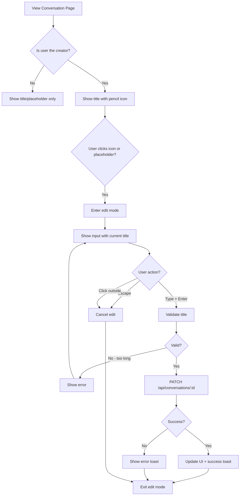
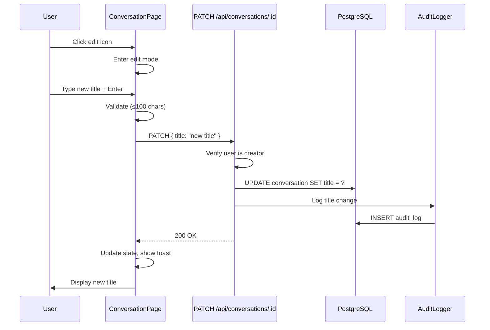

# Feature Spec: Conversation Title Editing

**Date:** 2026-03-13
**Status:** Ready for Implementation
**Author:** Claude (via spec interview)

## Overview

Enable users to edit conversation titles directly from the conversation view page. Currently, conversations display titles (or "Untitled Conversation" as fallback) but there's no UI to modify them after creation.

### Why This Matters
- Users need to rename sessions for better organization
- Default "Untitled Conversation" isn't meaningful for search/recall
- Existing API already supports title updates - just need UI

## User Stories

### US-1: Edit Conversation Title
**As a** conversation creator
**I want to** edit the title of my conversation
**So that** I can give it a meaningful name for future reference

**Acceptance Criteria:**
- [x] Pencil icon appears to the right of the title (only for creator)
- [x] Clicking icon enters edit mode with input field
- [x] Enter key saves, Escape key cancels
- [x] Title limited to 100 characters
- [x] Empty title reverts to "Untitled Conversation" display
- [x] Changes are audit logged
- [x] Success/error toast feedback

### US-2: Click Placeholder to Edit
**As a** conversation creator viewing an untitled conversation
**I want to** click on "Untitled Conversation" to edit it
**So that** I can quickly add a title without finding an edit button

**Acceptance Criteria:**
- [x] "Untitled Conversation" text is clickable when user is creator
- [x] Clicking enters edit mode
- [x] Same edit behavior as pencil icon

## User Flow



## Technical Design

### Architecture



### Component Structure

```
apps/web/src/app/(dashboard)/conversations/[id]/page.tsx
├── EditableTitle (new component)
│   ├── Display mode: title + pencil icon
│   ├── Edit mode: input + save/cancel
│   └── Handles keyboard events
```

### API Contract

**Endpoint:** `PATCH /api/conversations/:id`

**Request:**
```json
{
  "title": "string (max 100 chars, nullable)"
}
```

**Response (200):**
```json
{
  "id": "uuid",
  "title": "Updated Title",
  "updatedAt": "2026-03-13T..."
}
```

**Errors:**
- 401: Not authenticated
- 403: User is not the conversation creator
- 400: Title exceeds 100 characters
- 404: Conversation not found

### Database Changes

No schema changes required. The `Conversation` model already has:
```prisma
model Conversation {
  title String?  // Already nullable, already indexed
  // ...
}
```

### Audit Logging

New audit event type:
```typescript
await AuditLogger.conversationMetadataUpdated(
  orgId,
  userId,
  conversationId,
  { field: "title", oldValue, newValue }
);
```

## Security Considerations

| Concern | Mitigation |
|---------|------------|
| Authorization | Only creator can edit (check `createdById === userId`) |
| Input validation | Max 100 chars, sanitize for XSS (React handles this) |
| Audit trail | Log all title changes with old/new values |
| Rate limiting | Existing API rate limiting applies |

**Not PHI:** Conversation titles are metadata, not protected health information. However, we audit log changes since titles could contain client names.

## UI/UX Details

### Edit Icon
- Use `Pencil` icon from lucide-react (already in use elsewhere)
- Size: `h-4 w-4`
- Color: `text-muted-foreground hover:text-foreground`
- Cursor: `cursor-pointer`
- Position: Inline, immediately after title text with `ml-2` gap

### Edit Mode
- Input field replaces title text
- Auto-focus on entry
- Pre-filled with current title (or empty if "Untitled")
- Same font size/weight as display title for seamless transition
- Character count indicator when approaching limit

### States
- **Display:** Title text + edit icon (creator only)
- **Editing:** Input field with focus
- **Saving:** Input disabled, loading indicator
- **Error:** Red border, error message below

## Success Metrics

| Metric | Target |
|--------|--------|
| % conversations with custom titles | Increase from baseline |
| Edit success rate | >95% |
| Time to edit | <3 seconds from click to save |

## Decisions Made

| Decision | Rationale |
|----------|-----------|
| Creator-only editing | Prevents confusion about who can rename; matches ownership model |
| Pencil icon (not inline click) | More discoverable, consistent with other edit patterns |
| 100 char limit | Balances flexibility with UI display constraints |
| Audit log changes | Titles may contain client names; better to log for compliance |
| No auto-save on blur | Enter/Escape is more explicit; prevents accidental saves |

## Deferred Items

| Item | Reason |
|------|--------|
| Bulk title editing | Low priority; single edit covers 99% of use cases |
| AI title suggestions | Could be added later; not MVP |
| Title on Call model | Legacy model; focus on Conversation which is the future |
| Title editing on mobile | Mobile responsive already, but touch UX not explicitly designed |

## Implementation Checklist

- [ ] Add creator permission check to PATCH endpoint
- [ ] Add title length validation (100 chars) to API
- [ ] Create EditableTitle component
- [ ] Add audit logging for title changes
- [ ] Update conversation page to use EditableTitle
- [ ] Add toast notifications for save/error
- [ ] Test keyboard navigation (Enter/Escape)
- [ ] Test with "Untitled Conversation" placeholder
- [ ] Create Linear ticket and close with commit reference

## Learnings

1. **API already supported updates** - The PATCH endpoint for conversations already accepts title updates, reducing implementation scope.
2. **Existing patterns exist** - Call review page has inline editing for AI summary that we can follow.
3. **Asymmetry between models** - Conversations have titles; Calls don't. Future migration should consider unifying.
