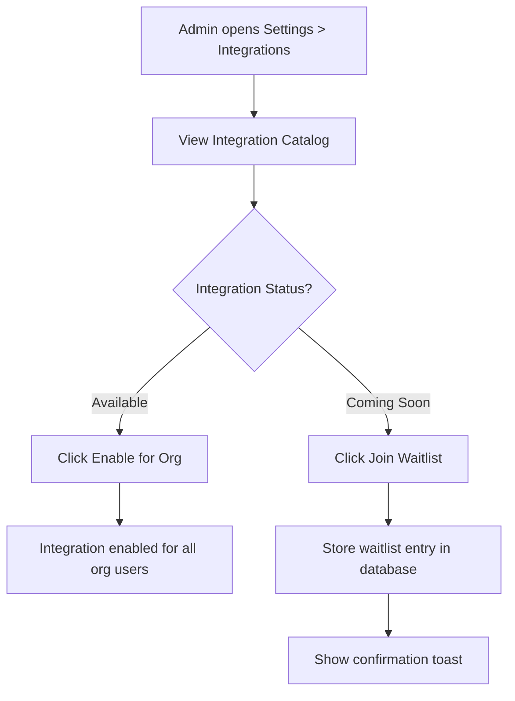
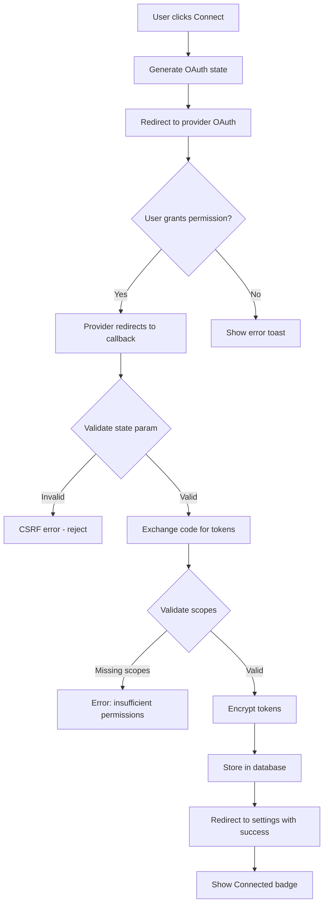
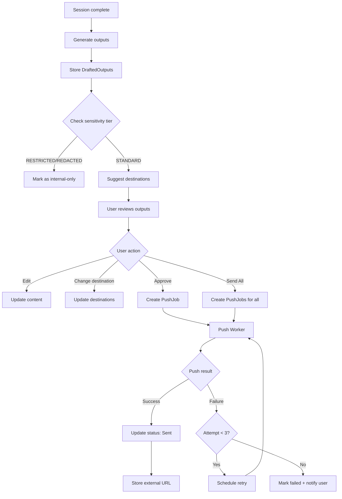
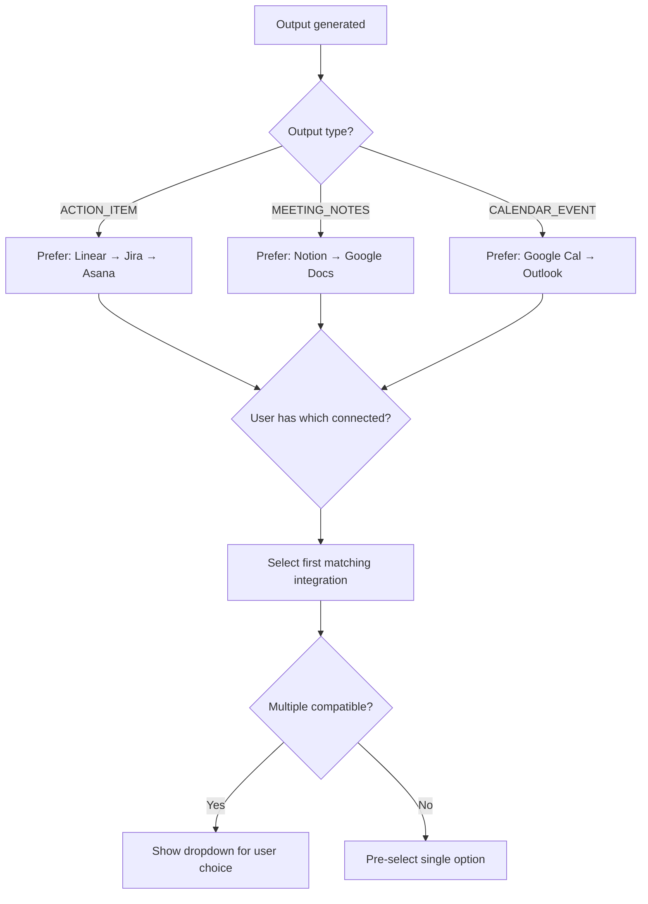
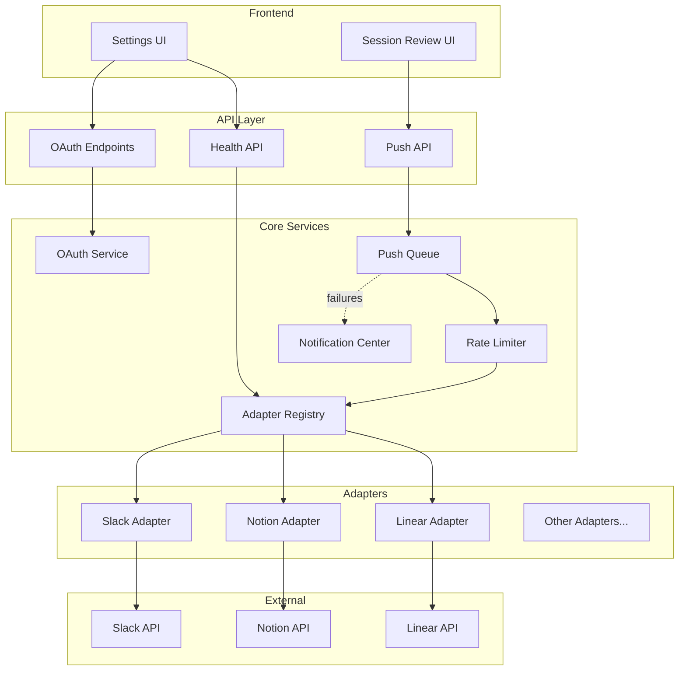
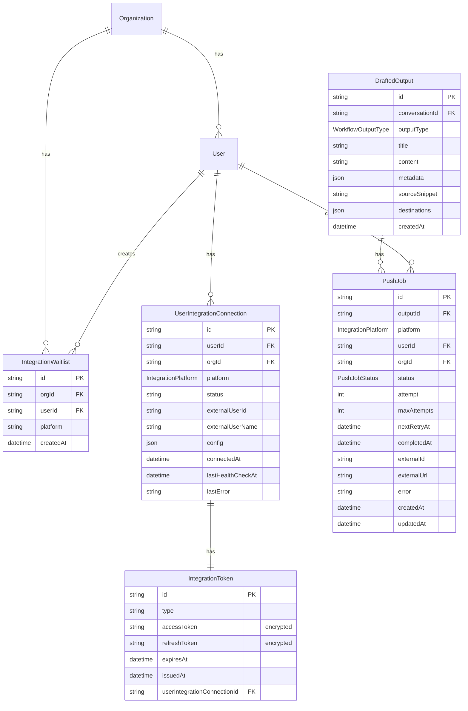

# Integration Hub - Technical Specification

**Status:** Ready for Implementation
**Linear Issues:** PX-1000 through PX-1011
**Date:** March 27, 2026
**Author:** Claude Code (with Valerie Phoenix)

---

## 1. Overview

### 1.1 What We're Building

An Integration Hub that enables Inkra to push conversation outputs (action items, meeting notes, calendar events) to third-party apps after call processing. The system follows a two-tier model:

- **Admin tier:** Org admins enable which integrations are available for their organization
- **User tier:** Individual users connect their own accounts to enabled integrations

### 1.2 Why We're Building It

Inkra's core value proposition is converting conversations into completed work. Currently, outputs live inside Inkra but don't flow to the external tools where work actually happens (Slack, Notion, Jira, etc.). Users must manually copy outputs, negating the automation benefit.

### 1.3 Scope

| In Scope (Wave 1) | Out of Scope (Future) |
|-------------------|----------------------|
| 11 Wave 1 integrations (see below) | Wave 2/3 integrations (CRM, HR, EHR, Nonprofit) |
| Per-user OAuth token management | Org-level shared tokens |
| Auto-suggest destinations by output type | Custom webhook / generic API |
| Multi-destination push (1 output → N integrations) | Bi-directional sync |
| Sensitivity gate (block RESTRICTED/REDACTED) | Mobile OAuth flows |
| Database-backed push queue with retry | Dedicated job queue (BullMQ) |

### 1.4 Wave 1 Integrations

| Category | Integrations |
|----------|-------------|
| Communication | Slack, Gmail, Outlook, Microsoft Teams |
| Documentation | Notion, Google Docs/Drive, Confluence |
| Project Management | Linear, Jira, Asana, Monday.com |

**Build priority:** Slack → Notion → Linear first (in parallel), then remaining 8.

---

## 2. User Stories & Acceptance Criteria

### 2.1 Admin: Enable Integrations

**As an org admin, I want to enable integrations for my organization so users can connect their accounts.**

**Acceptance Criteria:**
- [ ] Admin navigates to Settings > Integrations
- [ ] Catalog displays integrations grouped by category (Communication, Docs, PM)
- [ ] Each card shows: logo, name, description, status badge
- [ ] Admin sees which integrations are available vs "Coming Soon"
- [ ] "Coming Soon" cards have "Join Waitlist" button
- [ ] Waitlist signup stored in database with orgId, userId, platform

### 2.2 User: Connect Integration

**As a user, I want to connect my accounts to integrations my admin has enabled.**

**Acceptance Criteria:**
- [ ] User sees only integrations enabled by admin
- [ ] "Connect" button triggers OAuth flow (opens popup)
- [ ] OAuth callback validates state param (CSRF protection)
- [ ] Tokens encrypted with AES-256-GCM before storage
- [ ] Scope validation before storing tokens (PX-993 pattern)
- [ ] On success: green "Connected" badge, account email displayed
- [ ] On failure: error message, "Reconnect" button
- [ ] User can disconnect with confirmation dialog

### 2.3 User: View Integration Health

**As a user, I want to see the health status of my connected integrations.**

**Acceptance Criteria:**
- [ ] Connected integrations show health status badge:
  - Green: "Connected" - token valid
  - Yellow: "Expiring Soon" - token expires within 7 days
  - Red: "Error" - token invalid or revoked
- [ ] Background job checks token health periodically
- [ ] User receives notification when token needs refresh
- [ ] "Refresh" button available for expiring/errored connections

### 2.4 User: Review Outputs Before Push

**As a user, after a call is processed, I want to review and approve outputs before they're sent to integrations.**

**Acceptance Criteria:**
- [ ] Session review shows all extracted outputs (action items, notes, etc.)
- [ ] Each output shows suggested destination(s) based on type + connected integrations
- [ ] User can edit output content inline
- [ ] User can change destination (multi-select dropdown)
- [ ] User can select multiple destinations for one output
- [ ] "Approve" button queues push for that output
- [ ] "Send All" button queues all outputs at once
- [ ] Outputs from RESTRICTED/REDACTED content show "Cannot send externally" message

### 2.5 User: Track Push Status

**As a user, I want to see the status of my output pushes.**

**Acceptance Criteria:**
- [ ] Push status badge per output: Pending → Sending → Sent → Failed
- [ ] On success: external link to created item (e.g., Notion page URL)
- [ ] On failure: error message, "Retry" button
- [ ] Failed pushes appear in notification center
- [ ] After 3 failures over 1 hour: marked as permanently failed

### 2.6 Sensitivity Gate

**As the system, I must prevent sensitive content from being pushed to external integrations.**

**Acceptance Criteria:**
- [ ] Before allowing push, check output's source segments for sensitivity
- [ ] If any source segment is RESTRICTED or REDACTED tier → block push
- [ ] Show message: "This output contains sensitive content and cannot be sent to external integrations"
- [ ] Destination selector disabled for blocked outputs
- [ ] Only STANDARD tier outputs can be pushed externally

---

## 3. User Flows

### 3.1 Admin Enable Integration Flow



### 3.2 User Connect Integration Flow



### 3.3 Output Push Flow



### 3.4 Destination Suggestion Flow



---

## 4. Technical Design

### 4.1 Architecture Overview



### 4.2 Directory Structure

**Backend Services:**
```
apps/web/src/lib/integrations/
├── oauth/
│   ├── providers/
│   │   ├── slack.ts         # Slack OAuth config
│   │   ├── notion.ts        # Notion OAuth config
│   │   ├── linear.ts        # Linear OAuth config
│   │   ├── google.ts        # Shared: Gmail, Drive, Calendar
│   │   ├── microsoft.ts     # Shared: Outlook, Teams
│   │   └── atlassian.ts     # Shared: Jira, Confluence
│   ├── service.ts           # OAuth orchestration
│   └── types.ts             # OAuthProvider, OAuthConfig
├── base/
│   ├── adapter.ts           # IntegrationAdapter interface
│   ├── registry.ts          # Adapter registry
│   ├── rate-limiter.ts      # Reusable rate limiting
│   ├── push-queue.ts        # Async dispatch with retry
│   └── sensitivity-check.ts # Block RESTRICTED/REDACTED
└── adapters/
    ├── slack/
    │   ├── index.ts         # SlackAdapter implements IntegrationAdapter
    │   ├── oauth.ts         # Slack-specific OAuth
    │   ├── api.ts           # Slack Web API client
    │   ├── formatters.ts    # Format outputs for Slack
    │   └── types.ts
    ├── notion/
    ├── linear/
    └── ... (8 more adapters)
```

**UI Components (Extend Existing Page):**
```
apps/web/src/app/(dashboard)/settings/integrations/
├── page.tsx                              # EXISTING - add new sections here
├── integrations-content.tsx              # EXISTING - Meeting Platforms
├── components/
│   ├── CalendarIntegrationSection.tsx    # EXISTING - Calendar
│   ├── AdminWorkflowPlatformsSection.tsx # EXISTING - Linear/Notion/Jira
│   ├── CommunicationSection.tsx          # NEW - Slack, Gmail, Outlook, Teams Chat
│   ├── DocumentationSection.tsx          # NEW - Google Docs, Confluence
│   ├── ProjectManagementSection.tsx      # NEW - Asana, Monday.com
│   ├── ComingSoonSection.tsx             # NEW - Wave 2/3 waitlist
│   └── IntegrationCard.tsx               # NEW - Reusable card component
```

**Existing Page Structure (3 Sections - DO NOT REBUILD):**
```
Settings > Integrations
├── CalendarIntegrationSection        # Google, Outlook, Apple Calendar
├── IntegrationsContent               # Meeting Platforms (Teams, Zoom, Meet)
└── AdminWorkflowPlatformsSection     # Workflow (Linear, Notion, Jira)
```

**New Sections to Add (Below Existing):**
```
Settings > Integrations
├── [existing sections above]
├── CommunicationSection              # Slack, Gmail, Outlook Mail, Teams Chat
├── DocumentationSection              # Google Docs, Confluence
├── ProjectManagementSection          # Asana, Monday.com
└── ComingSoonSection                 # Wave 2/3 waitlist
```

### 4.3 IntegrationAdapter Interface

```typescript
// apps/web/src/lib/integrations/base/adapter.ts

export interface IntegrationAdapter {
  readonly platform: IntegrationPlatform;
  readonly displayName: string;
  readonly description: string;
  readonly logoUrl: string;
  readonly categories: IntegrationCategory[];
  readonly supportedOutputTypes: WorkflowOutputType[];

  // OAuth
  getAuthorizationUrl(userId: string, orgId: string): Promise<string>;
  handleCallback(code: string, state: OAuthState): Promise<ConnectionResult>;
  disconnect(userId: string, orgId: string): Promise<void>;
  refreshToken(userId: string, orgId: string): Promise<RefreshResult>;

  // Push
  push(output: DraftedOutput, config: PushConfig): Promise<PushResult>;

  // Health
  healthCheck(userId: string, orgId: string): Promise<HealthStatus>;

  // Configuration (post-OAuth)
  getConfigSchema(): ConfigSchema;
  discoverResources(userId: string, orgId: string): Promise<Resource[]>;
}

export type PushResult =
  | { success: true; externalId: string; externalUrl?: string }
  | { success: false; error: PushError; retryable: boolean; message: string };

export type HealthStatus =
  | { status: 'connected'; account: string; expiresAt?: Date }
  | { status: 'expiring_soon'; account: string; expiresAt: Date }
  | { status: 'disconnected' }
  | { status: 'error'; message: string };

export type PushError =
  | 'auth_error'      // Token invalid/revoked
  | 'rate_limit'      // Provider rate limit hit
  | 'not_found'       // Resource not found (channel, project, etc.)
  | 'permission'      // Insufficient permissions
  | 'network'         // Network error
  | 'unknown';        // Other errors
```

### 4.4 Rate Limiter Service

```typescript
// apps/web/src/lib/integrations/base/rate-limiter.ts

export interface RateLimiter {
  /**
   * Check if action is allowed under rate limit
   * @param key - Unique key (e.g., `push:${userId}`)
   * @param limit - Max actions allowed
   * @param windowMs - Time window in milliseconds
   */
  checkLimit(key: string, limit: number, windowMs: number): Promise<RateLimitResult>;

  /**
   * Increment usage counter
   */
  incrementUsage(key: string): Promise<void>;

  /**
   * Get remaining quota
   */
  getRemainingQuota(key: string, limit: number, windowMs: number): Promise<number>;
}

export type RateLimitResult =
  | { allowed: true; remaining: number }
  | { allowed: false; retryAfter: number }; // retryAfter in seconds

// Default limits
export const RATE_LIMITS = {
  PUSH_PER_USER_HOUR: 100,    // 100 pushes per user per hour
  PUSH_PER_ORG_HOUR: 1000,    // 1000 pushes per org per hour
  OAUTH_PER_USER_MINUTE: 5,   // 5 OAuth attempts per user per minute
};
```

### 4.5 Push Queue Service

```typescript
// apps/web/src/lib/integrations/base/push-queue.ts

export interface PushQueueService {
  /**
   * Enqueue a push job
   */
  enqueue(job: EnqueuePushJob): Promise<string>; // Returns job ID

  /**
   * Process pending jobs (called by worker)
   */
  processPendingJobs(): Promise<ProcessResult>;

  /**
   * Get job status
   */
  getJobStatus(jobId: string): Promise<PushJobStatus>;

  /**
   * Retry a failed job
   */
  retryJob(jobId: string): Promise<void>;

  /**
   * Cancel a pending job
   */
  cancelJob(jobId: string): Promise<void>;
}

export interface EnqueuePushJob {
  outputId: string;
  platform: IntegrationPlatform;
  userId: string;
  orgId: string;
  config?: PushConfig;
}

// Retry policy: 3 attempts over 1 hour
// Backoff: 1 min, 15 min, 44 min (total ~1 hour)
export const RETRY_DELAYS_MS = [
  60_000,       // 1 minute
  900_000,      // 15 minutes
  2_640_000,    // 44 minutes
];
```

---

## 5. Database Schema

### 5.1 Entity Relationship Diagram



### 5.2 Prisma Schema Additions

```prisma
// Add to prisma/schema.prisma

model IntegrationWaitlist {
  id        String   @id @default(uuid())
  orgId     String
  userId    String
  platform  String   // e.g., "SALESFORCE", "EPIC", "HUBSPOT"
  createdAt DateTime @default(now())

  org  Organization @relation(fields: [orgId], references: [id], onDelete: Cascade)
  user User         @relation(fields: [userId], references: [id], onDelete: Cascade)

  @@unique([orgId, userId, platform])
  @@index([platform])
}

model PushJob {
  id          String          @id @default(uuid())
  outputId    String
  platform    IntegrationPlatform
  userId      String
  orgId       String
  status      PushJobStatus   @default(PENDING)
  attempt     Int             @default(1)
  maxAttempts Int             @default(3)
  nextRetryAt DateTime?
  completedAt DateTime?
  externalId  String?
  externalUrl String?
  error       String?
  createdAt   DateTime        @default(now())
  updatedAt   DateTime        @updatedAt

  output DraftedOutput @relation(fields: [outputId], references: [id], onDelete: Cascade)
  user   User          @relation(fields: [userId], references: [id], onDelete: Cascade)
  org    Organization  @relation(fields: [orgId], references: [id], onDelete: Cascade)

  @@index([status, nextRetryAt])
  @@index([userId, createdAt])
  @@index([outputId])
}

enum PushJobStatus {
  PENDING
  PROCESSING
  COMPLETED
  FAILED
}

// Extend existing DraftedOutput model
model DraftedOutput {
  // ... existing fields ...

  // Add relation to push jobs
  pushJobs PushJob[]
}

// Add new platforms to existing enum
enum IntegrationPlatform {
  // Existing
  LINEAR
  JIRA
  NOTION
  GOOGLE_DOCS
  GOOGLE_CALENDAR
  OUTLOOK_CALENDAR

  // New for Wave 1
  SLACK
  GMAIL
  OUTLOOK_MAIL
  MICROSOFT_TEAMS
  CONFLUENCE
  ASANA
  MONDAY
}
```

---

## 6. API Contracts

### 6.1 Integration Connection APIs

```typescript
// GET /api/integrations/catalog
// Returns all available integrations with user's connection status
interface GetCatalogResponse {
  categories: {
    name: string;
    integrations: {
      platform: IntegrationPlatform;
      displayName: string;
      description: string;
      logoUrl: string;
      status: 'available' | 'coming_soon';
      connection?: {
        status: 'connected' | 'error' | 'expiring_soon';
        account: string;
        connectedAt: string;
      };
    }[];
  }[];
}

// POST /api/integrations/:platform/authorize
// Initiates OAuth flow
interface AuthorizeRequest {
  redirectUrl?: string;  // Where to redirect after OAuth
}
interface AuthorizeResponse {
  authorizationUrl: string;
}

// GET /api/integrations/:platform/callback
// OAuth callback handler (query params from provider)

// DELETE /api/integrations/:platform
// Disconnect integration
interface DisconnectResponse {
  success: boolean;
}

// GET /api/integrations/:platform/health
// Check connection health
interface HealthResponse {
  status: 'connected' | 'expiring_soon' | 'error' | 'disconnected';
  account?: string;
  expiresAt?: string;
  message?: string;
}

// POST /api/integrations/waitlist
// Join waitlist for coming-soon integration
interface WaitlistRequest {
  platform: string;
}
interface WaitlistResponse {
  success: boolean;
  alreadyJoined: boolean;
}
```

### 6.2 Push APIs

```typescript
// POST /api/outputs/:outputId/push
// Queue output for push to integration(s)
interface PushRequest {
  destinations: {
    platform: IntegrationPlatform;
    config?: Record<string, unknown>;  // Platform-specific config
  }[];
}
interface PushResponse {
  jobs: {
    id: string;
    platform: IntegrationPlatform;
    status: 'pending';
  }[];
}

// POST /api/outputs/push-all
// Queue multiple outputs for push
interface PushAllRequest {
  outputs: {
    outputId: string;
    destinations: {
      platform: IntegrationPlatform;
      config?: Record<string, unknown>;
    }[];
  }[];
}

// GET /api/push-jobs/:jobId
// Get push job status
interface PushJobResponse {
  id: string;
  status: 'pending' | 'processing' | 'completed' | 'failed';
  platform: IntegrationPlatform;
  attempt: number;
  externalId?: string;
  externalUrl?: string;
  error?: string;
  createdAt: string;
  completedAt?: string;
}

// POST /api/push-jobs/:jobId/retry
// Retry a failed push job
interface RetryResponse {
  success: boolean;
  jobId: string;
}
```

---

## 7. Security Considerations

### 7.1 Sensitive Data Protection

```typescript
// apps/web/src/lib/integrations/base/sensitivity-check.ts

export async function canPushExternally(outputId: string): Promise<SensitivityCheckResult> {
  const output = await prisma.draftedOutput.findUnique({
    where: { id: outputId },
    include: {
      conversation: {
        include: {
          flaggedSegments: {
            where: { status: { not: 'DISMISSED' } }
          }
        }
      }
    }
  });

  if (!output) {
    return { allowed: false, reason: 'output_not_found' };
  }

  // Check if any source segments are RESTRICTED or REDACTED
  const sensitiveSegments = output.conversation.flaggedSegments.filter(
    seg => seg.finalTier === 'RESTRICTED' || seg.finalTier === 'REDACTED'
  );

  if (sensitiveSegments.length > 0) {
    return {
      allowed: false,
      reason: 'contains_sensitive_content',
      message: 'This output contains sensitive content and cannot be sent to external integrations.'
    };
  }

  return { allowed: true };
}
```

### 7.2 Security Checklist

| Requirement | Implementation |
|-------------|----------------|
| Token encryption | AES-256-GCM via `encryptForOrg()` |
| Scope validation | Validate before storing tokens (PX-993) |
| CSRF protection | OAuth state param with 10-min expiry |
| Rate limiting | Per-user (100/hour) via RateLimiter service |
| Audit logging | Log all push attempts |
| Sensitivity gate | Block RESTRICTED/REDACTED outputs |
| Org isolation | All queries filtered by orgId |

### 7.3 Audit Logging

```typescript
// Log push attempts
await AuditLogger.integrationPushAttempted(
  orgId,
  userId,
  platform,
  outputId,
  { success: true, externalId: result.externalId }
);

// Log connection changes
await AuditLogger.integrationConnected(orgId, userId, platform);
await AuditLogger.integrationDisconnected(orgId, userId, platform);
```

---

## 8. Success Metrics

### 8.1 Hypotheses

| Hypothesis | Metric | Target |
|------------|--------|--------|
| Users want automated output delivery | % of orgs with 1+ integration connected | >50% within 30 days |
| Multi-destination is valuable | Avg destinations per output | >1.2 |
| Push reliability matters | Push success rate | >98% |
| Users trust auto-suggestions | % of pushes using suggested destination | >70% |

### 8.2 KPIs to Track

- **Connection rate:** % of active users with at least 1 integration connected
- **Push volume:** Total pushes per day/week
- **Success rate:** % of pushes that succeed (first attempt + retries)
- **Retry rate:** % of pushes requiring retry
- **Time to first push:** Days from org creation to first successful push
- **Integration distribution:** Which integrations are most connected/used
- **Waitlist signups:** Demand signal for Wave 2/3 integrations

---

## 9. Decisions Made

| Decision | Choice | Rationale |
|----------|--------|-----------|
| UI approach | Extend existing Settings > Integrations page | Page already has Calendar, Meeting, Workflow sections - add new sections below |
| Token ownership | Per-user | Matches calendar pattern, better attribution |
| Admin role | Enable/disable only | Keep simple, users own connections |
| Routing | Auto-suggest, user confirms | System is smart, user has control |
| Multi-destination | Supported | Single output often relevant to multiple tools |
| Sensitive data | Block externally | Security boundary, HIPAA compliance |
| Rate limiting | Per-user (100/hour) | Prevent abuse, stay within provider quotas |
| Job queue | Database-backed | Use existing patterns, research BullMQ for Phase 2 |
| Retry policy | 3 attempts / 1 hour | Quick feedback, don't spam providers |
| Health checks | Proactive + on-demand | Warn before failures |
| Notifications | Existing notification center | Don't build new system |

---

## 10. Deferred Items

| Item | Reason |
|------|--------|
| Wave 2/3 integrations | After Wave 1 validated with pilot |
| Custom webhook / generic API | Future "Integration Builder" feature |
| Bi-directional sync | Phase 2 after push is stable |
| Mobile OAuth flows | Web-only sufficient for launch |
| Dedicated job queue (BullMQ/Redis) | Current approach sufficient for scale |
| Per-user routing preferences | Start with system defaults |
| Org-level shared tokens | Per-user model works for now |

---

## 10.5 Existing Code Patterns to Follow

### UI Patterns (from existing integrations page)

**File Locations:**
- `apps/web/src/app/(dashboard)/settings/integrations/page.tsx` - Main page
- `apps/web/src/app/(dashboard)/settings/integrations/components/` - All components

**Section Layout Pattern:**
```tsx
// From AdminWorkflowPlatformsSection.tsx
<div className="space-y-4">
  <div>
    <h3 className="text-lg font-medium">Section Title</h3>
    <p className="text-sm text-muted-foreground">Description</p>
  </div>
  <div className="grid gap-4 md:grid-cols-3">
    {/* Integration cards */}
  </div>
</div>
```

**Integration Card Pattern:**
```tsx
// From integrations-content.tsx
<Card>
  <CardHeader className="flex flex-row items-center gap-4">
    <div className="h-10 w-10 rounded-lg bg-[#brandColor] flex items-center justify-center">
      <Icon className="h-5 w-5 text-white" />
    </div>
    <div className="flex-1">
      <CardTitle className="text-base">{name}</CardTitle>
      <CardDescription>{description}</CardDescription>
    </div>
    <Badge variant={statusVariant}>{statusLabel}</Badge>
  </CardHeader>
  <CardContent>
    {/* Settings or connect button */}
  </CardContent>
</Card>
```

**Status Badge Mapping:**
```tsx
const statusConfig = {
  ACTIVE: { variant: "default", label: "Connected" },
  PENDING: { variant: "secondary", label: "Pending" },
  EXPIRED: { variant: "destructive", label: "Expired" },
  ERROR: { variant: "destructive", label: "Error" },
  DISCONNECTED: { variant: "outline", label: "Disconnected" },
};
```

**OAuth Flow Pattern:**
```tsx
// Initiate OAuth
const response = await fetch(`/api/integrations/${platform}/authorize`);
const { authorizationUrl } = await response.json();
window.location.href = authorizationUrl;

// Handle callback (via URL params)
const searchParams = useSearchParams();
const success = searchParams.get("success");
const error = searchParams.get("error");
const platform = searchParams.get("platform");

useEffect(() => {
  if (success && platform) {
    toast({ title: "Connected", description: `${platform} connected` });
    router.replace("/settings/integrations"); // Clear params
    refetch();
  }
}, [success, platform]);
```

**Disconnect Confirmation Pattern:**
```tsx
<AlertDialog>
  <AlertDialogTrigger asChild>
    <Button variant="outline">Disconnect</Button>
  </AlertDialogTrigger>
  <AlertDialogContent>
    <AlertDialogHeader>
      <AlertDialogTitle>Disconnect {platform}?</AlertDialogTitle>
      <AlertDialogDescription>
        This will remove the connection. You can reconnect anytime.
      </AlertDialogDescription>
    </AlertDialogHeader>
    <AlertDialogFooter>
      <AlertDialogCancel>Cancel</AlertDialogCancel>
      <AlertDialogAction onClick={handleDisconnect}>
        Disconnect
      </AlertDialogAction>
    </AlertDialogFooter>
  </AlertDialogContent>
</AlertDialog>
```

**Suspense Loading Pattern:**
```tsx
// In page.tsx
<Suspense fallback={<IntegrationsSkeleton />}>
  <CommunicationSection />
</Suspense>
```

### API Patterns (from existing endpoints)

**Existing Endpoints to Reference:**
- `GET /api/integrations/calendar` - Connection status
- `POST /api/integrations/{platform}/authorize` - Start OAuth
- `DELETE /api/integrations/{platform}` - Disconnect
- `PATCH /api/integrations/{platform}` - Update settings
- `GET /api/admin/workflow-platforms` - Admin platform list

---

## 11. Implementation Phases

### Phase 1: Foundation (Est. ~1 week)
- [ ] IntegrationAdapter interface
- [ ] Adapter registry
- [ ] Rate limiter service (reusable)
- [ ] Push queue service (database-backed)
- [ ] Sensitivity check gate
- [ ] Database migrations (PushJob, IntegrationWaitlist)

### Phase 2: Extend Admin UI (Est. ~3 days)

**Note:** The Settings > Integrations page already exists with 3 sections (Calendar, Meeting Platforms, Workflow Platforms). We are EXTENDING this page, not rebuilding it.

**Existing Components to Reference (Patterns):**
- `AdminWorkflowPlatformsSection.tsx` - Section layout, 3-col grid, admin toggles
- `CalendarIntegrationSection.tsx` - OAuth flow, connection cards
- `integrations-content.tsx` - Platform grid, status badges

**New Components to Create:**
- [ ] `CommunicationSection.tsx` - Slack, Gmail, Outlook Mail, Teams Chat
- [ ] `DocumentationSection.tsx` - Google Docs, Confluence
- [ ] `ProjectManagementSection.tsx` - Asana, Monday.com
- [ ] `ComingSoonSection.tsx` - Wave 2/3 waitlist cards
- [ ] `IntegrationCard.tsx` - Reusable card for new integrations

**Update Existing Files:**
- [ ] `page.tsx` - Add new section components with Suspense wrappers
- [ ] `index.ts` - Export new components

### Phase 3: Session Review UI (Est. ~3 days)
- [ ] Destination selector component
- [ ] Multi-select dropdown
- [ ] Push status badges
- [ ] Bulk approve button
- [ ] Retry button
- [ ] Sensitivity blocking UI

### Phase 4: Wave 1 Adapters (Est. ~2 weeks, parallel)
- [ ] Slack adapter
- [ ] Notion adapter
- [ ] Linear adapter
- [ ] Gmail adapter
- [ ] Google Docs/Drive adapter
- [ ] Microsoft Teams adapter
- [ ] Outlook adapter
- [ ] Jira adapter
- [ ] Confluence adapter
- [ ] Asana adapter
- [ ] Monday.com adapter

### Phase 5: Testing & Polish (Est. ~1 week)
- [ ] Unit tests for all adapters
- [ ] Integration tests (mock providers)
- [ ] E2E tests (Playwright)
- [ ] Manual testing with real integrations
- [ ] Error handling polish
- [ ] Documentation

---

## 12. Verification Plan

### Unit Tests
- Adapter interface compliance
- Rate limiter behavior (allow/deny, quota tracking)
- Push queue retry logic (backoff timing)
- Sensitivity check (block RESTRICTED/REDACTED)
- Destination suggestion logic

### Integration Tests
- OAuth flow with mocked provider
- Push dispatch → adapter → API call (mocked)
- Multi-destination push
- Failed push → retry queue

### E2E Tests (Playwright)
- Settings > Integrations renders catalog
- Connect flow (mocked OAuth)
- Session review → destination selection
- Push status updates
- Failed push → notification

### Manual Testing Checklist
1. Connect Slack with test workspace
2. Process a call with action items
3. Review outputs, select Slack + Notion
4. Verify message in Slack channel
5. Verify page in Notion
6. Disconnect, verify tokens removed
7. Test with RESTRICTED content (should block)

---

## 13. Appendix: Adapter Specifications

### A.1 Slack Adapter

**OAuth:**
- Scopes: `chat:write`, `channels:read`, `groups:read`, `users:read`
- OAuth 2.0 with workspace-level install

**Configuration:**
- `defaultChannel`: Channel ID for posts (selected post-OAuth)

**Output Mapping:**
| Output Type | Slack Action |
|-------------|-------------|
| ACTION_ITEM | Post to channel with checklist Block Kit |
| MEETING_NOTES | Post to channel with sections |

### A.2 Notion Adapter

**OAuth:**
- Scopes: `read_content`, `update_content`, `insert_content`
- Must validate scopes before storage (PX-993)

**Configuration:**
- `databaseId`: Target database for new pages

**Output Mapping:**
| Output Type | Notion Action |
|-------------|--------------|
| ACTION_ITEM | Create task in database |
| MEETING_NOTES | Create page with content blocks |
| DOCUMENT | Create page |

### A.3 Linear Adapter

**OAuth:**
- Scopes: `issues:create`, `teams:read`

**Configuration:**
- `teamId`: Target team
- `projectId`: Optional default project

**Output Mapping:**
| Output Type | Linear Action |
|-------------|--------------|
| ACTION_ITEM | Create issue |
| GOAL_UPDATE | Create issue with "Update" label |
