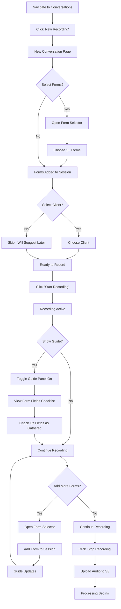
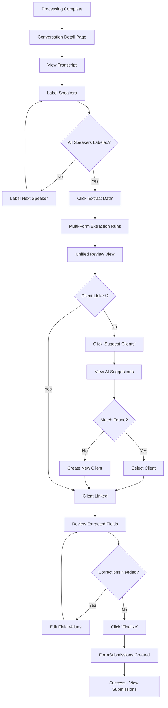
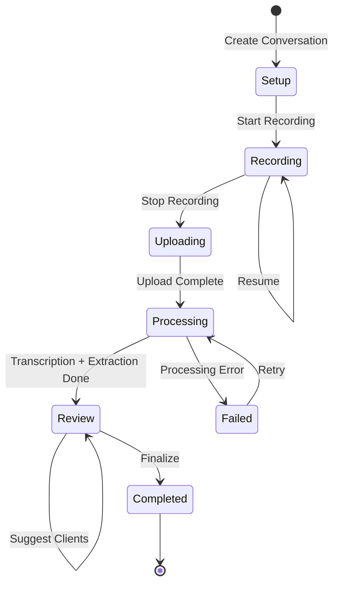

# Feature Specification: Smart Forms for In-Person Recording Sessions

**Date:** 2026-03-15
**Status:** Implemented
**Author:** Claude (Opus 4.5)
**Implemented:** 2026-03-17

---

## 1. Overview

### What We're Building
Connect smart forms to in-person recording sessions, enabling users to:
1. Pre-select forms before recording AND add forms on-the-fly during a session
2. Optionally view form fields as a conversation guide during recording
3. Start sessions without a client, with AI suggesting client matches from transcript
4. Review all extracted data in a unified view before splitting into FormSubmissions
5. Label speakers from diarized audio (staff vs client)

### Why We're Building It
Case managers conducting in-person meetings (home visits, office intakes, assessments) need the same form-filling automation that phone calls have. Currently, in-person recordings can only link to a single form upfront. This feature enables:
- Dynamic form addition as conversation topics emerge
- Reduced manual data entry through multi-form AI extraction
- Faster client linking through AI-suggested matches
- Better transcript context through speaker labeling

### Business Impact
- Reduces form completion time by ~60% for in-person sessions
- Enables capturing more structured data from field work
- Improves data accuracy through AI extraction with human review
- Increases platform stickiness for social services organizations

---

## 2. User Stories

### US-1: Form Selection Before Recording
**As a** case manager
**I want to** select forms before starting an in-person recording
**So that** I know what information to gather during the conversation

**Acceptance Criteria:**
- [ ] Multi-select dropdown shows published forms on new conversation page
- [ ] Selected forms are stored in `Conversation.formIds`
- [ ] Can proceed without selecting any forms
- [ ] Form count badge shows number of selected forms

### US-2: Add Forms During Recording
**As a** case manager
**I want to** add additional forms while recording continues
**So that** I can capture relevant data when topics emerge naturally

**Acceptance Criteria:**
- [ ] Form selector accessible during active recording (not blocking recording UI)
- [ ] Adding form doesn't interrupt or pause recording
- [ ] Newly added forms appear in conversation guide immediately
- [ ] Can remove forms before recording ends (but not after)

### US-3: Optional Form Field Guide
**As a** case manager
**I want to** toggle a checklist of form fields during recording
**So that** I can track what information I've gathered

**Acceptance Criteria:**
- [ ] Toggle button to show/hide guide panel
- [ ] Guide shows fields grouped by form with collapsible sections
- [ ] Can check off fields as information is gathered
- [ ] Progress indicator shows completed/total fields per form
- [ ] State persists during pause/resume

### US-4: Client Suggestion from Transcript
**As a** case manager
**I want the** system to suggest matching clients based on the conversation
**So that** I can link submissions without manual search

**Acceptance Criteria:**
- [ ] After transcription, AI extracts PII (name, DOB, phone, email)
- [ ] System searches existing clients with configurable confidence threshold (default 70%)
- [ ] Shows matched identifiers and confidence score for each suggestion
- [ ] Can select suggested client or create new
- [ ] PHI access is audit logged

### US-5: Unified Extraction Review
**As a** case manager
**I want to** review all extracted data across forms in one view
**So that** I can efficiently correct and approve before finalizing

**Acceptance Criteria:**
- [ ] Single review screen shows data grouped by form
- [ ] Each field shows: extracted value, confidence score, source snippet
- [ ] Fields below confidence threshold are highlighted for review
- [ ] Inline editing for corrections
- [ ] "Finalize" creates separate FormSubmissions per form
- [ ] Can assign different clients to different forms if needed

### US-6: Speaker Labeling
**As a** case manager
**I want to** label who each speaker is in the transcript
**So that** extraction focuses on client statements

**Acceptance Criteria:**
- [ ] Deepgram diarization identifies speaker numbers in transcript
- [ ] UI to label each detected speaker (staff/client/other)
- [ ] Can optionally link speaker to existing client record
- [ ] Labels stored and displayed in transcript viewer
- [ ] Extraction prioritizes client-labeled speakers

---

## 3. User Flows

### Primary Flow: In-Person Session with Forms



### Post-Recording Flow: Review and Finalize



### State Machine: Conversation Lifecycle



---

## 4. Technical Design

### 4.1 Architecture Overview

```mermaid
flowchart TB
    subgraph "Frontend (Next.js)"
        A[NewConversationPage] --> B[InPersonSessionView]
        B --> C[InPersonRecorder]
        B --> D[ConversationGuide]
        B --> E[FormSelector]

        F[ConversationDetailPage] --> G[TranscriptViewer]
        F --> H[SpeakerLabeler]
        F --> I[UnifiedReviewView]
        I --> J[ClientSuggestionPanel]
    end

    subgraph "API Layer"
        K[/conversations/in-person]
        L[/conversations/:id/forms]
        M[/conversations/:id/guide]
        N[/conversations/:id/speakers]
        O[/conversations/:id/extract]
        P[/conversations/:id/suggest-clients]
        Q[/conversations/:id/finalize]
    end

    subgraph "Services"
        R[ConversationProcessing]
        S[MultiFormExtraction]
        T[ClientMatching]
        U[SpeakerLabeling]
    end

    subgraph "External"
        V[Deepgram API]
        W[Claude API]
        X[AWS S3]
    end

    B --> K
    B --> L
    B --> M
    F --> N
    F --> O
    F --> P
    F --> Q

    R --> V
    R --> X
    S --> W
    T --> W
```

### 4.2 Database Schema Changes

**Add `conversationId` to FormSubmission:**

```prisma
model FormSubmission {
  id               String   @id @default(uuid())
  formId           String
  formVersionId    String
  clientId         String?
  callId           String?
  conversationId   String?  // NEW: Link to Conversation

  // ... existing fields ...

  // Relations
  form         Form          @relation(fields: [formId], references: [id])
  formVersion  FormVersion   @relation(fields: [formVersionId], references: [id])
  client       Client?       @relation(fields: [clientId], references: [id])
  call         Call?         @relation(fields: [callId], references: [id])
  conversation Conversation? @relation(fields: [conversationId], references: [id])  // NEW

  @@index([conversationId])  // NEW
}

model Conversation {
  // ... existing fields ...

  formSubmissions FormSubmission[]  // NEW
}
```

**Speaker Labels Storage** (in existing JSON field):

```typescript
// InPersonDetails.participants structure
{
  "speakerLabels": {
    "0": { "type": "staff", "name": "Case Manager Jane" },
    "1": { "type": "client", "clientId": "uuid-here" },
    "2": { "type": "other", "name": "Family Member" }
  },
  "participants": [
    { "name": "Jane Smith" },
    { "name": "John Client" }
  ]
}
```

### 4.3 API Specifications

#### PATCH `/api/conversations/[id]/forms`

Add or remove forms from a conversation.

**Request:**
```typescript
{
  action: "add" | "remove",
  formIds: string[]
}
```

**Response:**
```typescript
{
  success: true,
  formIds: string[],  // Updated list
  forms: Array<{
    id: string,
    name: string,
    fieldCount: number
  }>
}
```

**Authorization:** User must own conversation or have org admin role.

---

#### GET `/api/conversations/[id]/guide`

Fetch form fields formatted for conversation guide.

**Response:**
```typescript
{
  success: true,
  sections: Array<{
    formId: string,
    formName: string,
    fields: Array<{
      id: string,
      slug: string,
      label: string,
      type: FieldType,
      required: boolean,
      description: string | null
    }>
  }>
}
```

---

#### PATCH `/api/conversations/[id]/speakers`

Save speaker identity labels.

**Request:**
```typescript
{
  speakerLabels: Record<number, {
    type: "staff" | "client" | "other",
    name?: string,
    clientId?: string
  }>
}
```

**Response:**
```typescript
{
  success: true,
  speakerLabels: Record<number, SpeakerLabel>
}
```

---

#### POST `/api/conversations/[id]/extract`

Trigger multi-form extraction from transcript.

**Request:**
```typescript
{
  speakerFilter?: "client" | "all"  // Default: "client"
}
```

**Response:**
```typescript
{
  success: true,
  results: Array<{
    formId: string,
    formName: string,
    fields: Array<{
      fieldId: string,
      slug: string,
      label: string,
      value: unknown,
      confidence: number,
      sourceSnippet: string,
      needsReview: boolean
    }>
  }>,
  tokensUsed: {
    input: number,
    output: number
  }
}
```

---

#### POST `/api/conversations/[id]/suggest-clients`

Suggest matching clients from transcript PII.

**Request:**
```typescript
{
  minConfidence?: number  // Default: 0.70
}
```

**Response:**
```typescript
{
  success: true,
  extractedPII: {
    name?: string,
    phone?: string,
    email?: string,
    dob?: string,
    address?: string
  },
  suggestions: Array<{
    clientId: string,
    firstName: string,
    lastName: string,
    overallConfidence: number,
    matchedIdentifiers: Array<{
      type: "name" | "phone" | "email" | "dob" | "address",
      extractedValue: string,
      matchedValue: string,
      similarity: number
    }>
  }>
}
```

---

#### POST `/api/conversations/[id]/finalize`

Create FormSubmissions from reviewed extraction data.

**Request:**
```typescript
{
  submissions: Array<{
    formId: string,
    clientId?: string,
    data: Record<string, unknown>,
    status: "DRAFT" | "SUBMITTED"
  }>
}
```

**Response:**
```typescript
{
  success: true,
  created: Array<{
    submissionId: string,
    formId: string,
    formName: string,
    clientId: string | null
  }>
}
```

---

### 4.4 Component Specifications

#### `InPersonSessionView`

**Location:** `apps/web/src/components/recording/in-person-session-view.tsx`

**Props:**
```typescript
interface InPersonSessionViewProps {
  conversationId: string;
  uploadUrl: string;
  maxDurationMinutes: number;
  initialForms: Array<{
    id: string;
    name: string;
    fields: FormField[];
  }>;
  onComplete: (conversationId: string) => void;
}
```

**State:**
- `showGuide: boolean` - Toggle guide visibility
- `forms: Form[]` - Currently linked forms
- `completedFields: Set<string>` - Checked field IDs
- `isRecording: boolean` - Recording state

**Layout:**
```
┌─────────────────────────────────────────────────┐
│ Header: Title | Status | Timer                  │
├─────────────────────────────┬───────────────────┤
│                             │                   │
│   InPersonRecorder          │  ConversationGuide│
│   (main content)            │  (collapsible)    │
│                             │                   │
│   [Pause] [Stop]            │  [Add Form ▼]     │
│                             │                   │
└─────────────────────────────┴───────────────────┘
```

---

#### `FormSelector`

**Location:** `apps/web/src/components/recording/form-selector.tsx`

**Props:**
```typescript
interface FormSelectorProps {
  selectedFormIds: string[];
  onFormsChange: (formIds: string[]) => void;
  disabled?: boolean;
}
```

**Features:**
- Fetches published forms from `/api/forms?status=PUBLISHED`
- Searchable dropdown with multi-select
- Shows form name and field count
- Badges for already-selected forms

---

#### `SpeakerLabeler`

**Location:** `apps/web/src/components/conversation/speaker-labeler.tsx`

**Props:**
```typescript
interface SpeakerLabelerProps {
  conversationId: string;
  speakers: number[];  // Detected speaker numbers from transcript
  initialLabels?: Record<number, SpeakerLabel>;
  clients: Array<{ id: string; firstName: string; lastName: string }>;
  onLabelsChange: (labels: Record<number, SpeakerLabel>) => void;
}
```

**Layout:**
```
┌────────────────────────────────────────┐
│ Speaker Identification                 │
├────────────────────────────────────────┤
│ Speaker 1: [Staff ▼]    Name: [____]  │
│ Speaker 2: [Client ▼]   Link: [____▼] │
│ Speaker 3: [Other ▼]    Name: [____]  │
│                                        │
│                        [Save Labels]   │
└────────────────────────────────────────┘
```

---

#### `UnifiedReviewView`

**Location:** `apps/web/src/components/conversation/unified-review-view.tsx`

**Props:**
```typescript
interface UnifiedReviewViewProps {
  conversationId: string;
  extractionResults: FormExtractionResult[];
  suggestedClients?: ClientSuggestion[];
  onFinalize: (submissions: SubmissionData[]) => void;
}
```

**Layout:**
```
┌──────────────────────────────────────────────────────────┐
│ Review Extracted Data                    [Suggest Client]│
├──────────────────────────────────────────────────────────┤
│ Client: [Select or search...▼]    or [Create New]        │
├──────────────────────────────────────────────────────────┤
│ ▼ Intake Form (8/10 fields)                              │
│   ┌────────────────────────────────────────────────────┐ │
│   │ First Name: John          [92%] "My name is John" │ │
│   │ Last Name:  [Smith_____]  [45%] "unclear..."      │ │
│   │ DOB:        1985-03-15    [88%] "born in March"   │ │
│   └────────────────────────────────────────────────────┘ │
│                                                          │
│ ▼ Assessment Form (5/7 fields)                           │
│   ┌────────────────────────────────────────────────────┐ │
│   │ Risk Level: Medium        [75%] "some concerns"   │ │
│   │ ...                                                │ │
│   └────────────────────────────────────────────────────┘ │
│                                                          │
│                              [Save as Draft] [Finalize]  │
└──────────────────────────────────────────────────────────┘
```

---

#### `ClientSuggestionPanel`

**Location:** `apps/web/src/components/conversation/client-suggestion-panel.tsx`

**Props:**
```typescript
interface ClientSuggestionPanelProps {
  suggestions: ClientSuggestion[];
  onSelect: (clientId: string) => void;
  onCreateNew: () => void;
}
```

**Layout:**
```
┌────────────────────────────────────────┐
│ Suggested Client Matches               │
├────────────────────────────────────────┤
│ ┌────────────────────────────────────┐ │
│ │ John Smith           [85%]        │ │
│ │ Name: ✓ Phone: ✓ DOB: ✗          │ │
│ │                        [Select]   │ │
│ └────────────────────────────────────┘ │
│ ┌────────────────────────────────────┐ │
│ │ John Smithson        [72%]        │ │
│ │ Name: ~ Phone: ✗ Email: ✓        │ │
│ │                        [Select]   │ │
│ └────────────────────────────────────┘ │
│                                        │
│ No match? [Create New Client]          │
└────────────────────────────────────────┘
```

---

### 4.5 Service Layer

#### MultiFormExtractionService

**Location:** `apps/web/src/lib/services/multi-form-extraction.ts`

```typescript
interface ExtractableForm {
  id: string;
  name: string;
  fields: Array<{
    id: string;
    slug: string;
    name: string;
    type: FieldType;
    options?: string[];
    isRequired: boolean;
  }>;
}

interface ExtractionResult {
  formId: string;
  fields: Array<{
    fieldId: string;
    slug: string;
    value: unknown;
    confidence: number;
    sourceSnippet: string;
    needsReview: boolean;
  }>;
}

export async function extractMultipleForms(
  transcript: string,
  forms: ExtractableForm[],
  speakerLabels?: Record<number, SpeakerLabel>
): Promise<{
  results: ExtractionResult[];
  tokensUsed: { input: number; output: number };
}>;
```

**Implementation Strategy:**
1. Combine all form fields into single prompt
2. Include form context for disambiguation (e.g., "For Intake Form, extract...")
3. Filter transcript to client-labeled speakers if available
4. Use existing extraction patterns from `call-extraction.ts`
5. Post-process to group by form and validate field types

---

#### ClientMatchingService

**Location:** `apps/web/src/lib/services/client-matching.ts`

```typescript
interface ExtractedPII {
  name?: string;
  phone?: string;
  email?: string;
  dob?: string;
  address?: string;
}

interface ClientMatch {
  clientId: string;
  client: Client;
  overallConfidence: number;
  matchedFields: Array<{
    field: keyof ExtractedPII;
    extracted: string;
    matched: string;
    similarity: number;
  }>;
}

export async function extractPIIFromTranscript(
  transcript: string
): Promise<ExtractedPII>;

export async function findMatchingClients(
  orgId: string,
  pii: ExtractedPII,
  minConfidence?: number  // Default 0.70
): Promise<ClientMatch[]>;
```

**Matching Algorithm:**
1. **Name Matching (weight: 0.40)**
   - Levenshtein distance for fuzzy match
   - Handle first/last name order variations
   - Normalize case and whitespace

2. **Phone Matching (weight: 0.30)**
   - Normalize to digits only
   - Exact match required

3. **Email Matching (weight: 0.20)**
   - Case-insensitive exact match

4. **DOB Matching (weight: 0.10)**
   - Parse various date formats
   - Exact date match

**Confidence Calculation:**
```
overallConfidence = Σ(matchedField.similarity × fieldWeight)
```

---

## 5. Security Considerations

### PHI Access & Audit Logging

Client matching involves searching by PII extracted from transcripts. Required logging:

```typescript
await AuditLogger.log({
  orgId,
  userId,
  action: "SEARCH",
  resource: "CLIENT",
  resourceId: null,
  details: {
    searchType: "pii_matching",
    fieldsSearched: ["name", "phone", "email"],
    resultsCount: matches.length,
    conversationId
  }
});
```

### Authorization Checks

All endpoints must verify:
1. User is authenticated
2. Conversation belongs to user's organization
3. User has appropriate permissions (case manager or higher)
4. Forms being linked are published and accessible to user

### Data Validation

- Validate `formIds` exist and are published before linking
- Sanitize speaker labels to prevent XSS
- Validate client IDs before linking
- Enforce org isolation on all queries

---

## 6. Success Metrics & Hypotheses

### Hypothesis 1: Increased Form Completion
**If** we allow adding forms during recording,
**Then** users will complete 30% more forms per session,
**Because** they can capture information as topics naturally arise.

**Metrics:**
- Forms per conversation (before vs after)
- Form completion rate per conversation

### Hypothesis 2: Faster Client Linking
**If** we suggest clients from transcript PII,
**Then** client linking will be 50% faster,
**Because** users don't need to manually search.

**Metrics:**
- Time from recording end to client link
- Client suggestion acceptance rate

### Hypothesis 3: Improved Extraction Accuracy
**If** users label speakers before extraction,
**Then** extraction accuracy will improve by 15%,
**Because** AI can focus on client statements.

**Metrics:**
- Field correction rate (edits in review)
- Confidence scores with vs without speaker labels

---

## 7. Decisions Made

| Decision | Rationale | Alternatives Considered |
|----------|-----------|------------------------|
| Reuse `ConversationGuide` component | Existing component has all needed functionality | Build new component |
| Store speaker labels in `InPersonDetails.participants` JSON | Avoids schema migration, flexible structure | New `SpeakerLabel` table |
| Unified review before split | User feedback prefers seeing all data together | Per-form review flow |
| 70% confidence threshold for client suggestions | Balances recall vs precision; adjustable | Fixed 80% or 60% |
| Post-session transcription only | Simpler, more reliable than real-time | Real-time streaming |
| Full transcript extraction | AI determines relevant sections | User-marked segments |

---

## 8. Deferred Items

| Item | Reason for Deferring |
|------|---------------------|
| Real-time transcription during recording | Complexity; post-session works for V1 |
| ML-based automatic form suggestion | Already exists for calls; can extend later |
| Offline recording with later sync | Schema supports it; not core use case |
| Video meeting form attachment | Focus on in-person first |
| Bulk form selection presets | Nice-to-have; manual selection sufficient |

---

## 9. Implementation Phases

### Phase 1: Form Selection & Guide (2-3 days)
- Add form selector to new conversation page
- Create `InPersonSessionView` wrapper
- Implement mid-session form addition
- Integrate existing `ConversationGuide`

### Phase 2: Speaker Diarization & Labeling (1-2 days)
- Create speaker labeling UI
- Store labels in InPersonDetails
- Display in transcript viewer

### Phase 3: Multi-Form Extraction (2-3 days)
- Create extraction service for multiple forms
- Batch fields into single Claude request
- Store results with form grouping

### Phase 4: Client Matching (2 days)
- Implement PII extraction from transcript
- Create fuzzy client search
- Build suggestion UI
- Add PHI audit logging

### Phase 5: Unified Review & Finalization (2-3 days)
- Create unified review component
- Implement inline editing
- Create finalize endpoint
- Add schema migration for FormSubmission.conversationId

---

## 10. Learnings

1. **Existing infrastructure is substantial** - The conversation capture system (PX-865) already has most building blocks. This feature is primarily orchestration and UI.

2. **Form system complexity** - Forms have versions, conditional logic, and encryption. Extraction must respect these constraints.

3. **Speaker diarization is already enabled** - Deepgram config has `diarize: true`. We just need UI to label the detected speakers.

4. **Client matching is sensitive** - Searching by PII requires careful audit logging for HIPAA compliance.

5. **Unified review simplifies UX** - Rather than N review flows for N forms, one unified view reduces cognitive load.
