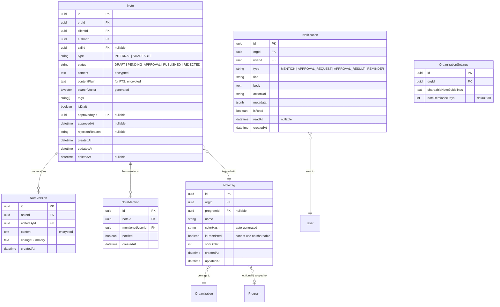

# Client Notes Feature Specification

> **Status:** Draft
> **Created:** 2026-02-09
> **Author:** Engineering Team
> **Feature Owner:** TBD
> **Target Release:** TBD

---

## Table of Contents

1. [Executive Summary](#executive-summary)
2. [Business Context](#business-context)
3. [User Stories](#user-stories)
4. [Feature Requirements](#feature-requirements)
5. [User Flows](#user-flows)
6. [Technical Architecture](#technical-architecture)
7. [Database Schema](#database-schema)
8. [API Specifications](#api-specifications)
9. [UI/UX Design](#uiux-design)
10. [Security & Compliance](#security--compliance)
11. [Metrics & Analytics](#metrics--analytics)
12. [Deferred Features](#deferred-features)
13. [Tradeoffs & Decisions](#tradeoffs--decisions)
14. [Learnings & Risks](#learnings--risks)

---

## Executive Summary

This specification defines a comprehensive notes feature for client profiles in Scrybe. The feature enables case managers and staff to document client interactions, collaborate via @mentions, and share appropriate notes externally through a supervised approval workflow.

### Key Capabilities

- **Create/Edit Notes**: Rich text editor with auto-save drafts
- **Note Types**: Internal (staff-only) and Shareable (client-visible after approval)
- **Tagging System**: Hierarchical predefined tags (org-wide + program-specific)
- **@Mentions**: Tag colleagues with in-app notifications
- **Full-Text Search**: PostgreSQL FTS with access control filtering
- **Approval Workflow**: Shareable notes require supervisor approval
- **Notification Center**: Bell icon with badge, dedicated /notifications page
- **Version History**: HIPAA-compliant edit tracking (audit only, no UI)

---

## Business Context

### Problem Statement

Case managers need to document client interactions beyond structured form submissions and call transcripts. Current workarounds include external tools, emails, or memory, leading to:

- Incomplete client records
- Poor handoff when cases transfer
- Compliance gaps during audits
- Lack of visibility for supervisors

### Business Hypotheses

| Hypothesis | Validation Metric | Target |
|------------|-------------------|--------|
| Structured notes improve service continuity | Notes per client (avg) | > 3 per active client |
| Timely documentation improves outcomes | Time to first note after client creation | < 7 days |
| @Mentions enable collaboration | Mention response rate (viewed within 24h) | > 80% |
| Auto-save reduces friction | Draft abandonment rate | < 15% |

### Success Metrics to Track

1. **Notes per client** (average, median)
2. **Time to first note** after client creation
3. **@Mention response rate** (within 24/48 hours)
4. **Draft abandonment rate** (started but never published)
5. **Shareable note approval rate** (approved vs. rejected)
6. **Search usage frequency**
7. **Tag adoption rate** (% notes with tags)

---

## User Stories

### Case Manager Stories

| ID | Story | Acceptance Criteria |
|----|-------|---------------------|
| CM-1 | As a case manager, I want to add notes to my clients so I can document interactions | Can open drawer, enter content, save note |
| CM-2 | As a case manager, I want my notes to auto-save so I don't lose work | Drafts persist across sessions, "Saving..." indicator visible |
| CM-3 | As a case manager, I want to edit my notes so I can correct mistakes | Can edit own notes, version history stored |
| CM-4 | As a case manager, I want to @mention colleagues so they're notified | Mention autocomplete works, notification created |
| CM-5 | As a case manager, I want to search notes so I can find past documentation | Full-text search returns relevant results |
| CM-6 | As a case manager, I want to tag notes so I can categorize them | Can select predefined tags, filter by tag |
| CM-7 | As a case manager, I want to create shareable notes so clients can see them | Can mark as shareable, goes to approval queue |

### Supervisor Stories

| ID | Story | Acceptance Criteria |
|----|-------|---------------------|
| SUP-1 | As a supervisor, I want to review shareable notes so I can ensure appropriateness | See approval queue, approve/reject with feedback |
| SUP-2 | As a supervisor, I want to see staff documentation activity so I can identify training needs | Basic reminder system for inactive clients |

### Admin Stories

| ID | Story | Acceptance Criteria |
|----|-------|---------------------|
| ADM-1 | As an admin, I want to manage predefined tags so I can standardize documentation | CRUD interface for org-wide and program tags |
| ADM-2 | As an admin, I want to configure shareable note guidelines so staff know expectations | Editable guidelines text in settings |
| ADM-3 | As an admin, I want to set reminder thresholds so staff are prompted to document | Configurable days threshold (default 30) |

---

## Feature Requirements

### Core Note Functionality

| Requirement | Priority | Notes |
|-------------|----------|-------|
| Create note via side drawer | P0 | Sheet component, form + recent notes context |
| Rich text editing (TipTap) | P0 | Bold, italic, underline, lists, links |
| Auto-save drafts (debounced 2s) | P0 | Visual indicator, persist to database |
| Edit existing notes (author only) | P0 | Version history stored for HIPAA |
| View notes in client profile | P0 | Notes tab with list view |
| Delete notes | P1 | NOT SUPPORTED - immutable record |
| Mobile full-screen modal | P1 | Responsive design |

### Note Types & Visibility

| Requirement | Priority | Notes |
|-------------|----------|-------|
| Internal notes (default) | P0 | Visible to org staff only |
| Shareable notes | P0 | Requires approval before client-visible |
| Approval workflow | P0 | Queue in admin panel |
| Rejection with feedback | P0 | Predefined reasons + custom input |
| Block edits during review | P1 | Pending notes locked |
| Content guidelines (configurable) | P1 | Admin can set org-specific text |
| Restricted tags for shareable | P1 | Certain tags block shareable marking |

### Tagging System

| Requirement | Priority | Notes |
|-------------|----------|-------|
| Predefined tags only | P0 | No freeform tags |
| Org-wide tags | P0 | Available to all programs |
| Program-specific tags | P0 | Scoped to program |
| Auto-generated tag colors | P0 | Hash-based consistent colors |
| Tag admin interface | P0 | /settings/note-tags page |
| Default starter tags | P1 | Created on org setup |

### @Mentions & Notifications

| Requirement | Priority | Notes |
|-------------|----------|-------|
| @Mention in editor | P0 | Autocomplete popup in TipTap |
| All org members mentionable | P0 | Including Viewers |
| Notification on mention | P0 | In-app notification created |
| Bell icon with badge | P0 | Header, shows unread count |
| /notifications page | P0 | Dedicated page for all notifications |
| Auto-read on click | P0 | Clicking marks as read |
| Deep link to specific note | P1 | Notification links to note |

### Search & Filtering

| Requirement | Priority | Notes |
|-------------|----------|-------|
| Filter by tags | P0 | Multi-select tag filter |
| Filter by date range | P0 | Date picker |
| Full-text search | P0 | PostgreSQL FTS on content |
| Scoped to current client | P0 | No global search in v1 |
| Access control filtering | P0 | Only show notes user can access |

### Reminders & Automation

| Requirement | Priority | Notes |
|-------------|----------|-------|
| No-notes reminder | P1 | Notify if client has no notes in X days |
| Configurable threshold | P1 | Default 30 days, org can change |

---

## User Flows

### Flow 1: Add Note to Client


### Flow 2: Shareable Note Approval


### Flow 3: @Mention Notification


### Flow 4: Edit Existing Note


---

## Technical Architecture

### System Context


### Component Architecture

```mermaid
flowchart TB
    subgraph Frontend
        A[ClientProfile Page]
        B[NotesTab Component]
        C[NoteDrawer Component]
        D[TipTapEditor Component]
        E[MentionAutocomplete Extension]
        F[NotificationBell Component]
        G[NotificationsPage]
        H[TagAdminPage]
        I[NoteApprovalsTab Component]
    end

    subgraph API Layer
        J[/api/clients/:id/notes]
        K[/api/notes/:id]
        L[/api/notes/:id/versions]
        M[/api/notifications]
        N[/api/admin/note-tags]
        O[/api/admin/note-approvals]
        P[/api/users/mentionable]
    end

    subgraph Services
        Q[NoteService]
        R[NotificationService]
        S[TagService]
        T[ApprovalService]
        U[VersionService]
        V[SearchService]
    end

    subgraph Database
        W[(Notes Table)]
        X[(NoteVersions Table)]
        Y[(Notifications Table)]
        Z[(NoteTags Table)]
    end

    A --> B
    B --> C
    C --> D
    D --> E
    A --> F
    F --> G

    C --> J
    C --> K
    G --> M
    H --> N
    I --> O
    E --> P

    J --> Q
    K --> Q
    K --> U
    L --> U
    M --> R
    N --> S
    O --> T

    Q --> W
    U --> X
    R --> Y
    S --> Z
```

### Reusable TipTap Editor

The TipTap editor will be built as a reusable component for use across the application:

```
src/components/editor/
├── tiptap-editor.tsx       # Main editor component
├── extensions/
│   ├── mention.ts          # @mention extension
│   └── index.ts            # Extension exports
├── toolbar.tsx             # Formatting toolbar
├── mention-list.tsx        # Autocomplete dropdown
└── index.ts                # Public exports
```

**Props Interface:**
```typescript
interface TipTapEditorProps {
  content: string;
  onChange: (html: string) => void;
  onMention?: (userId: string) => void;
  placeholder?: string;
  editable?: boolean;
  autoFocus?: boolean;
  mentionableUsers?: User[];
  className?: string;
}
```

---

## Database Schema

### New Tables



### Prisma Schema Changes

```prisma
// Add to existing Note model
model Note {
  id        String   @id @default(uuid())
  orgId     String
  clientId  String
  authorId  String
  callId    String?
  sessionId String?

  type      NoteType    @default(INTERNAL)
  status    NoteStatus  @default(DRAFT)
  content   String      @db.Text
  tags      String[]

  isDraft   Boolean     @default(true)
  isMassNote Boolean    @default(false)

  // Approval workflow
  approvedById    String?
  approvedAt      DateTime?
  rejectionReason String?

  // Timestamps
  createdAt DateTime  @default(now())
  updatedAt DateTime  @updatedAt
  deletedAt DateTime?

  // Relations
  client     Client   @relation(fields: [clientId], references: [id])
  author     User     @relation("NoteAuthor", fields: [authorId], references: [id])
  approvedBy User?    @relation("NoteApprover", fields: [approvedById], references: [id])
  call       Call?    @relation(fields: [callId], references: [id])
  session    ProgramSession? @relation(fields: [sessionId], references: [id])
  organization Organization @relation(fields: [orgId], references: [id])

  versions  NoteVersion[]
  mentions  NoteMention[]

  @@index([clientId])
  @@index([authorId])
  @@index([orgId, status])
  @@index([orgId, createdAt])
}

enum NoteStatus {
  DRAFT
  PENDING_APPROVAL
  PUBLISHED
  REJECTED
}

model NoteVersion {
  id          String   @id @default(uuid())
  noteId      String
  editedById  String
  content     String   @db.Text
  createdAt   DateTime @default(now())

  note     Note @relation(fields: [noteId], references: [id])
  editedBy User @relation(fields: [editedById], references: [id])

  @@index([noteId])
}

model NoteMention {
  id              String   @id @default(uuid())
  noteId          String
  mentionedUserId String
  notified        Boolean  @default(false)
  createdAt       DateTime @default(now())

  note          Note @relation(fields: [noteId], references: [id])
  mentionedUser User @relation(fields: [mentionedUserId], references: [id])

  @@unique([noteId, mentionedUserId])
  @@index([mentionedUserId])
}

model NoteTag {
  id           String   @id @default(uuid())
  orgId        String
  programId    String?
  name         String
  colorHash    String   // Auto-generated from name
  isRestricted Boolean  @default(false)
  sortOrder    Int      @default(0)
  createdAt    DateTime @default(now())
  updatedAt    DateTime @updatedAt

  organization Organization @relation(fields: [orgId], references: [id])
  program      Program?     @relation(fields: [programId], references: [id])

  @@unique([orgId, programId, name])
  @@index([orgId])
  @@index([programId])
}

model Notification {
  id        String   @id @default(uuid())
  orgId     String
  userId    String
  type      NotificationType
  title     String
  body      String?  @db.Text
  actionUrl String?
  metadata  Json?
  isRead    Boolean  @default(false)
  readAt    DateTime?
  createdAt DateTime @default(now())

  organization Organization @relation(fields: [orgId], references: [id])
  user         User         @relation(fields: [userId], references: [id])

  @@index([userId, isRead])
  @@index([orgId, createdAt])
}

enum NotificationType {
  MENTION
  APPROVAL_REQUEST
  APPROVAL_RESULT
  REMINDER
  SYSTEM
}
```

### PostgreSQL Full-Text Search

```sql
-- Add search vector column
ALTER TABLE "Note" ADD COLUMN search_vector tsvector;

-- Create GIN index for fast search
CREATE INDEX note_search_idx ON "Note" USING GIN(search_vector);

-- Create trigger to update search vector
CREATE OR REPLACE FUNCTION note_search_update() RETURNS trigger AS $$
BEGIN
  NEW.search_vector :=
    setweight(to_tsvector('english', coalesce(NEW.content_plain, '')), 'A');
  RETURN NEW;
END
$$ LANGUAGE plpgsql;

CREATE TRIGGER note_search_trigger
  BEFORE INSERT OR UPDATE ON "Note"
  FOR EACH ROW EXECUTE FUNCTION note_search_update();
```

---

## API Specifications

### Notes Endpoints

#### GET /api/clients/:clientId/notes

Get notes for a client with optional filtering.

**Query Parameters:**
| Param | Type | Description |
|-------|------|-------------|
| tags | string[] | Filter by tag names |
| startDate | ISO date | Filter by created after |
| endDate | ISO date | Filter by created before |
| search | string | Full-text search query |
| status | string | Filter by status (DRAFT, PUBLISHED) |
| limit | number | Max results (default 50) |
| cursor | string | Pagination cursor |

**Response:**
```json
{
  "success": true,
  "data": {
    "notes": [
      {
        "id": "uuid",
        "content": "<p>Note content...</p>",
        "type": "INTERNAL",
        "status": "PUBLISHED",
        "tags": ["Follow-up", "Housing"],
        "author": { "id": "uuid", "name": "Jane Doe" },
        "createdAt": "2026-02-09T10:00:00Z",
        "updatedAt": "2026-02-09T10:00:00Z",
        "editedAt": null,
        "editedBy": null
      }
    ],
    "cursor": "next-page-cursor",
    "hasMore": true
  }
}
```

#### POST /api/clients/:clientId/notes

Create a new note.

**Request Body:**
```json
{
  "content": "<p>Note HTML content</p>",
  "type": "INTERNAL",
  "tags": ["Follow-up"],
  "isDraft": false,
  "mentions": ["user-uuid-1", "user-uuid-2"]
}
```

#### PATCH /api/notes/:noteId

Update an existing note.

**Request Body:**
```json
{
  "content": "<p>Updated content</p>",
  "tags": ["Updated-tag"],
  "type": "SHAREABLE"
}
```

#### POST /api/notes/:noteId/publish

Publish a draft note.

**Request Body:**
```json
{
  "type": "INTERNAL"
}
```

### Notifications Endpoints

#### GET /api/notifications

Get notifications for current user.

**Query Parameters:**
| Param | Type | Description |
|-------|------|-------------|
| unreadOnly | boolean | Filter to unread only |
| limit | number | Max results (default 50) |
| cursor | string | Pagination cursor |

#### PATCH /api/notifications/:id/read

Mark notification as read.

#### GET /api/notifications/unread-count

Get unread notification count for badge.

### Approval Endpoints

#### GET /api/admin/note-approvals

Get pending shareable notes for approval.

#### POST /api/admin/note-approvals/:noteId/approve

Approve a shareable note.

#### POST /api/admin/note-approvals/:noteId/reject

Reject a shareable note.

**Request Body:**
```json
{
  "reason": "INAPPROPRIATE_CONTENT",
  "customFeedback": "Please remove internal jargon"
}
```

### Tag Management Endpoints

#### GET /api/admin/note-tags

Get all tags (org + program).

#### POST /api/admin/note-tags

Create a new tag.

#### PATCH /api/admin/note-tags/:id

Update a tag.

#### DELETE /api/admin/note-tags/:id

Delete a tag (soft delete if in use).

---

## UI/UX Design

### Side Drawer Layout

```
+------------------------------------------+
|  Add Note                           [X]  |
+------------------------------------------+
|                                          |
|  +------------------------------------+  |
|  | Note Type:  [Internal v]           |  |
|  +------------------------------------+  |
|                                          |
|  +------------------------------------+  |
|  | Tags:  [Select tags...]            |  |
|  +------------------------------------+  |
|                                          |
|  +------------------------------------+  |
|  | [B] [I] [U] | [=] [1.] | [Link]   |  |
|  +------------------------------------+  |
|  |                                    |  |
|  |  Start typing your note...         |  |
|  |                                    |  |
|  |                                    |  |
|  |                                    |  |
|  +------------------------------------+  |
|                                          |
|  Status: Saved                           |
|                                          |
|  +------------------------------------+  |
|  | Recent Notes (3)              [^]  |  |
|  +------------------------------------+  |
|  | Jane D. - Feb 8, 2026              |  |
|  | Client reported progress on...     |  |
|  +------------------------------------+  |
|  | John S. - Feb 5, 2026              |  |
|  | Follow-up scheduled for...         |  |
|  +------------------------------------+  |
|                                          |
|  [Cancel]              [Save as Draft]   |
|                              [Publish]   |
+------------------------------------------+
```

### Notes Tab Layout

```
+--------------------------------------------------+
|  Notes                              [+ Add Note]  |
+--------------------------------------------------+
|  Filters: [Tags v] [Date Range v] [Search...]    |
+--------------------------------------------------+
|                                                   |
|  +---------------------------------------------+ |
|  | Jane Doe                      Feb 9, 2026   | |
|  | [Follow-up] [Housing]                       | |
|  | Client reported significant progress on...  | |
|  | Mentioned: @John Smith                      | |
|  +---------------------------------------------+ |
|                                                   |
|  +---------------------------------------------+ |
|  | John Smith                    Feb 5, 2026   | |
|  | [Benefits]                    (Edited)      | |
|  | Assisted client with SNAP application...    | |
|  +---------------------------------------------+ |
|                                                   |
+--------------------------------------------------+
```

### Notification Bell & Page

```
Header:
+------------------------------------------+
| [Logo]  Dashboard  Clients  ...  [Bell(3)] [User] |
+------------------------------------------+

/notifications page:
+------------------------------------------+
|  Notifications                            |
+------------------------------------------+
|  +--------------------------------------+ |
|  | [Unread]                             | |
|  | @Jane Doe mentioned you in a note    | |
|  | Client: John Smith                    | |
|  | "...please review the housing app..." | |
|  | 2 hours ago                           | |
|  +--------------------------------------+ |
|  |                                       | |
|  | Shareable note approved              | |
|  | Your note for Client Maria G. was... | |
|  | Yesterday                             | |
|  +--------------------------------------+ |
+------------------------------------------+
```

### Mobile (Full-Screen Modal)

On screens < 768px, the drawer becomes a full-screen modal:

```
+-------------------------+
| [<] Add Note            |
+-------------------------+
| Type: [Internal v]      |
+-------------------------+
| Tags: [...]             |
+-------------------------+
| [B][I][U] [=][1.][Link] |
+-------------------------+
|                         |
| Note content here...    |
|                         |
|                         |
|                         |
+-------------------------+
| Recent Notes (3)    [^] |
| ...                     |
+-------------------------+
| [Cancel]    [Publish]   |
+-------------------------+
```

---

## Security & Compliance

### HIPAA Requirements

| Requirement | Implementation |
|-------------|----------------|
| Access Control | Role-based: Case managers see assigned clients only |
| Audit Trail | All note access/edits logged via AuditLogger |
| Amendment Tracking | Full version history stored for all edits |
| Encryption at Rest | Note content encrypted with AES-256-GCM |
| Minimum Necessary | Search results filtered by access permissions |

### Audit Events

| Event | Trigger | Data Logged |
|-------|---------|-------------|
| NOTE_CREATED | Note published | noteId, clientId, authorId, type |
| NOTE_VIEWED | Note opened | noteId, clientId, viewerId |
| NOTE_EDITED | Note updated | noteId, previousVersionId, editorId |
| NOTE_APPROVED | Shareable approved | noteId, approverId |
| NOTE_REJECTED | Shareable rejected | noteId, approverId, reason |
| NOTES_SEARCHED | Search executed | userId, clientId, query (hashed) |

### Authorization Matrix

| Action | Viewer | Case Manager | Program Manager | Admin |
|--------|--------|--------------|-----------------|-------|
| View notes (assigned) | - | Yes | Yes | Yes |
| View notes (any) | - | - | Yes | Yes |
| Create notes | - | Yes | Yes | Yes |
| Edit own notes | - | Yes | Yes | Yes |
| Approve shareable | - | - | Yes | Yes |
| Manage tags | - | - | - | Yes |
| Configure settings | - | - | - | Yes |

### Data Encryption

- **Tier 1 (Automatic)**: Note content encrypted/decrypted transparently
- **Search Index**: Plaintext stored separately for FTS, also encrypted
- **Version History**: Each version encrypted independently

---

## Metrics & Analytics

### Dashboard Metrics


### Tracking Implementation

```typescript
// Analytics events to track
const ANALYTICS_EVENTS = {
  NOTE_CREATED: 'note.created',
  NOTE_EDITED: 'note.edited',
  NOTE_PUBLISHED: 'note.published',
  NOTE_DRAFT_SAVED: 'note.draft_saved',
  NOTE_DRAFT_ABANDONED: 'note.draft_abandoned',
  NOTE_SEARCH: 'note.search',
  NOTE_FILTER: 'note.filter',
  MENTION_ADDED: 'note.mention_added',
  MENTION_CLICKED: 'notification.mention_clicked',
  SHAREABLE_SUBMITTED: 'note.shareable_submitted',
  SHAREABLE_APPROVED: 'note.shareable_approved',
  SHAREABLE_REJECTED: 'note.shareable_rejected',
};
```

### Reminder Logic

```typescript
// Pseudo-code for reminder cron job
async function checkNoteReminders() {
  const threshold = org.settings.noteReminderDays || 30;
  const cutoff = subDays(new Date(), threshold);

  const clientsNeedingNotes = await db.client.findMany({
    where: {
      status: 'ACTIVE',
      assignedTo: { not: null },
      notes: {
        none: {
          createdAt: { gte: cutoff },
          status: 'PUBLISHED'
        }
      }
    }
  });

  for (const client of clientsNeedingNotes) {
    await notificationService.create({
      userId: client.assignedTo,
      type: 'REMINDER',
      title: `Documentation reminder: ${client.firstName} ${client.lastName}`,
      body: `No notes have been added in ${threshold} days.`,
      actionUrl: `/clients/${client.id}?tab=notes`
    });
  }
}
```

---

## Deferred Features

The following features were discussed but explicitly deferred to future iterations:

| Feature | Reason for Deferral | Future Ticket |
|---------|---------------------|---------------|
| File attachments | Adds S3 complexity, not MVP | SCRY-XXX |
| Global notes search | Current scope is per-client | SCRY-XXX |
| API for external systems | No current integration needs | SCRY-XXX |
| Export to PDF | Nice-to-have, not core flow | SCRY-XXX |
| Email notifications | In-app sufficient for v1 | SCRY-XXX |
| Slash commands in editor | Keyboard shortcuts sufficient | SCRY-XXX |
| User-facing version history | Audit-only meets HIPAA | SCRY-XXX |
| Supervisor dashboard | Basic reminders sufficient | SCRY-XXX |
| Call linking from notes | Call notes stay separate | SCRY-XXX |

---

## Tradeoffs & Decisions

### Decision Log

| Decision | Options Considered | Chosen | Rationale |
|----------|-------------------|--------|-----------|
| UI Pattern | Modal, Drawer, Inline | **Side Drawer** | Preserves client context, professional feel |
| Note Mutability | Full CRUD, Edit-only, Immutable | **Edit Only** | Balances usability with compliance (no delete) |
| Version History | Full UI, View-only, Audit-only | **Audit Only** | Meets HIPAA without UI complexity |
| Rich Text Editor | TipTap, Slate, Quill, Textarea | **TipTap** | Modern, extensible, great @mention support |
| Tag System | Freeform, Predefined, Hybrid | **Predefined (Hierarchical)** | Consistency with org+program flexibility |
| Draft Persistence | DB, LocalStorage, Session | **Database** | Cross-device, survives browser close |
| Search Backend | LIKE, PostgreSQL FTS, Algolia | **PostgreSQL FTS** | Native, performant, no external service |
| Notification UI | Dropdown, Panel, Page | **Dedicated Page + Bell Badge** | Clean header, full notification management |
| Mobile UX | Same drawer, Bottom sheet, Full-screen | **Full-Screen Modal** | Better editing experience on small screens |

### Key Tradeoffs Accepted

1. **No delete functionality**: Users cannot delete notes, only edit. This is a compliance decision - notes are part of the permanent record. Users who make mistakes must edit or add correction notes.

2. **Predefined tags only**: No freeform tags to ensure consistency. This may frustrate users who want custom categorization, but benefits organization-wide reporting and filtering.

3. **Author-only editing**: Supervisors cannot edit staff notes, only approve/reject shareable ones. This maintains clear accountability but may frustrate supervisors who want to correct errors.

4. **Shareable approval required**: All shareable notes must be approved, adding friction. This protects the organization from inappropriate client-facing content but slows the workflow.

5. **No global search in v1**: Search is scoped to current client only. Users wanting to find notes across clients must navigate to each client. This simplifies access control but limits discoverability.

---

## Learnings & Risks

### What We Learned During Design

1. **Existing infrastructure is solid**: The current Note model, audit logging, and encryption patterns provide a strong foundation. We're extending rather than rebuilding.

2. **Admin panel pattern is established**: The tabbed admin panel with badge counts (Phone Requests) gives us a clear pattern for the approval queue.

3. **HIPAA drives decisions**: Several UX preferences (like allowing delete) were overridden by compliance requirements. Version history, audit logging, and immutability are non-negotiable.

4. **Notification system is foundational**: Building the notification center now enables future features (task assignments, alerts, reminders) to leverage the same infrastructure.

5. **TipTap is the right choice**: No existing rich text editor in the codebase means we're starting fresh. TipTap's @mention extension aligns perfectly with requirements.

### Risks & Mitigations

| Risk | Likelihood | Impact | Mitigation |
|------|------------|--------|------------|
| TipTap bundle size impacts performance | Medium | Medium | Lazy load editor component, code split |
| Full-text search performance at scale | Low | High | Proper indexing, query optimization, pagination |
| Approval queue becomes bottleneck | Medium | Medium | Multiple approvers (PM + Admin), email escalation |
| Draft auto-save causes data loss perception | Low | Medium | Clear "Saved" indicator, localStorage backup |
| Tag proliferation (too many tags) | Medium | Low | Admin controls, archive unused tags |
| @Mention notification overload | Medium | Medium | Consider digest mode in future |

### Open Questions for Implementation

1. Should the TipTap editor be loaded on page load or lazily when drawer opens?
2. How should we handle @mention for users who leave the organization?
3. Should rejected notes show the rejection reason to other staff, or only the author?
4. What's the retention policy for notification records?
5. Should we implement rate limiting on note creation?

---

## Appendix: Default Starter Tags

When a new organization is created, the following tags will be pre-populated:

### Org-Wide Tags

| Tag Name | Color (Auto) | Restricted |
|----------|--------------|------------|
| Follow-up | Blue | No |
| Urgent | Red | No |
| Resolved | Green | No |
| Internal Review | Purple | **Yes** |
| Confidential | Orange | **Yes** |

### Suggested Program Tags (Template)

Organizations can add program-specific tags. Suggested defaults:

| Tag Name | Use Case |
|----------|----------|
| Housing | Housing assistance notes |
| Benefits | Benefits enrollment |
| Employment | Job search/placement |
| Healthcare | Medical coordination |
| Education | Training/education |
| Legal | Legal assistance |
| Crisis | Crisis intervention |
| Referral | External referrals |

---

## Appendix: Rejection Reasons

Predefined rejection reasons for shareable notes:

| Code | Display Text |
|------|--------------|
| INAPPROPRIATE_CONTENT | Content not appropriate for client viewing |
| INTERNAL_JARGON | Contains internal jargon or abbreviations |
| MISSING_CONTEXT | Lacks sufficient context for client |
| FACTUAL_ERROR | Contains factual errors that need correction |
| FORMATTING_ISSUES | Formatting or grammar needs improvement |
| WRONG_CLIENT | Note appears to be for wrong client |
| DUPLICATE | Duplicates existing information |
| OTHER | Other (requires custom feedback) |

---

*End of Specification*
