# Phase 2 Remaining Features - Technical Specification

**Version**: 1.0
**Date**: 2026-02-08
**Status**: Approved for Implementation
**Timeline**: 4-6 weeks (thorough approach with proper testing)
**Release Strategy**: Feature-by-feature as each is completed

---

## Executive Summary

This specification covers the remaining Phase 2 features for Scrybe:

| Feature | Ticket | Priority | Complexity | Status |
|---------|--------|----------|------------|--------|
| Automated Chatbot Intake | PX-702 | High | High | Approved |
| In-Person Recording | PX-703 | Medium | Medium | Approved |
| Staff Training & Quizzes | PX-704, PX-707 | Medium | Medium | Approved |
| Email Integration | PX-705 | High | Medium | Approved |
| Staff Performance Metrics | PX-708 | High | Medium | Approved |
| Industry Add-On (Workforce) | PX-711 | Medium | High | Approved |
| Insurance Eligibility | PX-712 | Medium | Medium | Approved (Scoped) |
| Real-Time Chat | PX-713 | High | High | Approved |

**Deferred to Phase 3**:
- PX-710: Native Mobile App (Very High complexity)
- PX-714: Screenshot-Based Data Capture (Niche use case)
- Full employer CRM for workforce (out of MVP scope)
- Response time tracking for performance metrics

---

## Table of Contents

1. [Automated Chatbot Intake (PX-702)](#1-automated-chatbot-intake-px-702)
2. [Email Integration (PX-705)](#2-email-integration-px-705)
3. [Real-Time Chat (PX-713)](#3-real-time-chat-px-713)
4. [Staff Performance Metrics (PX-708)](#4-staff-performance-metrics-px-708)
5. [Staff Training & Quizzes (PX-704, PX-707)](#5-staff-training--quizzes-px-704-px-707)
6. [In-Person Recording (PX-703)](#6-in-person-recording-px-703)
7. [Workforce Development Add-On (PX-711)](#7-workforce-development-add-on-px-711)
8. [Insurance Eligibility Verification (PX-712)](#8-insurance-eligibility-verification-px-712)
9. [Database Schema Changes](#9-database-schema-changes)
10. [Security & Compliance](#10-security--compliance)
11. [Metrics & Success Criteria](#11-metrics--success-criteria)
12. [Deferred Decisions](#12-deferred-decisions)
13. [Learnings & Recommendations](#13-learnings--recommendations)

---

## 1. Automated Chatbot Intake (PX-702)

### Overview

AI-powered conversational intake that guides potential clients through the intake form process using natural language, with the ability to escalate to human case managers.

### User Stories

| As a... | I want to... | So that... |
|---------|--------------|------------|
| Potential client | Complete intake conversationally | I don't feel like I'm filling out a form |
| Case manager | See pending chatbot intakes | I can review and approve new clients |
| Org admin | Embed chatbot on our website | Clients can self-serve intake anytime |
| Case manager | Take over a chatbot session | I can help when someone requests a human |

### Technical Decisions

| Decision | Choice | Rationale |
|----------|--------|-----------|
| Entry points | Embedded widget + dedicated URL | Covers partner sites and direct access |
| AI approach | Form-driven with AI polish | Ensures all required fields collected while feeling natural |
| Crisis handling | Immediate escalation + resources | Safety-first approach for vulnerable populations |
| Widget auth | Org-configurable | Some orgs want spam protection, others want easy access |
| Session recovery | Cookie + SMS resume | Maximizes completion rate for abandoned sessions |
| Live takeover | On client request only | "Talk to a person" button triggers CM notification |
| Widget embed | Script tag only | Works on any site, simplest for partners |
| AI provider | Claude API (same as forms) | Consistency, single vendor, proven quality |
| Conversation storage | Full history retained | Audit trail, training data, debugging |
| Session memory | No memory - always fresh | Privacy-focused, no fingerprinting |
| Styling | Colors + logo only | Simple branding, standard templates |
| Volume architecture | Simple (< 100/day) | Direct processing, no complex queuing |

### Architecture

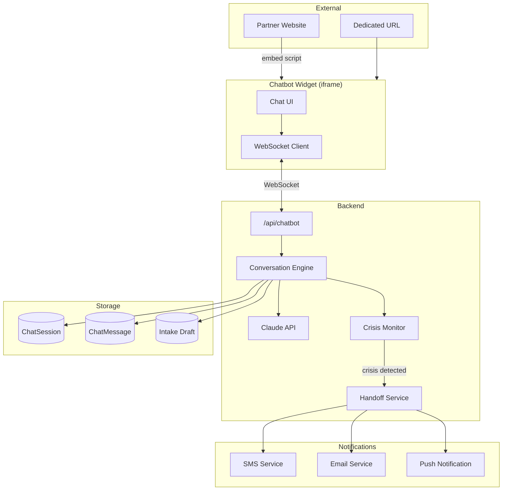
```mermaid
flowchart TD
    subgraph External
        WS[Partner Website]
        DU[Dedicated URL]
    end

    subgraph Widget["Chatbot Widget (iframe)"]
        UI[Chat UI]
        WC[WebSocket Client]
    end

    subgraph Backend
        API["/api/chatbot"]
        CE[Conversation Engine]
        AI[Claude API]
        CM[Crisis Monitor]
        HS[Handoff Service]
    end

    subgraph Storage
        CS[(ChatSession)]
        MSG[(ChatMessage)]
        INT[(Intake Draft)]
    end

    subgraph Notifications
        SMS[SMS Service]
        EMAIL[Email Service]
        PUSH[Push Notification]
    end

    WS --> |embed script| Widget
    DU --> Widget
    UI --> WC
    WC <--> |WebSocket| API
    API --> CE
    CE --> AI
    CE --> CM
    CM --> |crisis detected| HS
    HS --> SMS
    HS --> EMAIL
    HS --> PUSH
    CE --> CS
    CE --> MSG
    CE --> INT
```

### User Flow: Client Completing Intake

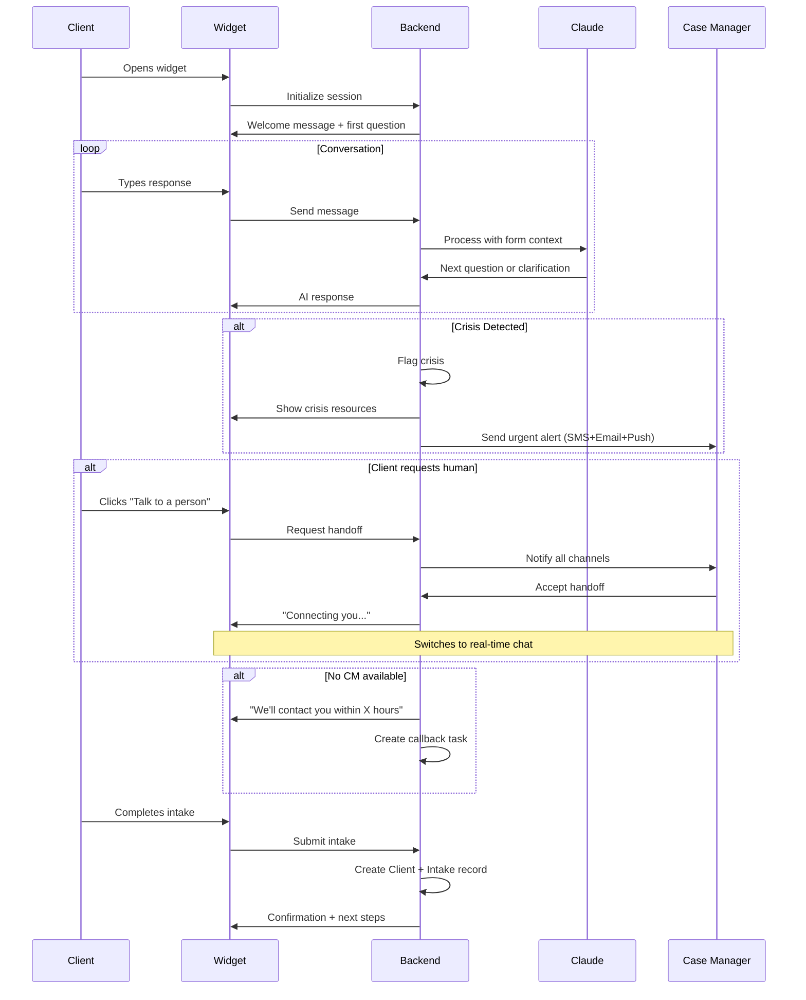
```mermaid
sequenceDiagram
    participant C as Client
    participant W as Widget
    participant API as Backend
    participant AI as Claude
    participant CM as Case Manager

    C->>W: Opens widget
    W->>API: Initialize session
    API->>W: Welcome message + first question

    loop Conversation
        C->>W: Types response
        W->>API: Send message
        API->>AI: Process with form context
        AI->>API: Next question or clarification
        API->>W: AI response
    end

    alt Crisis Detected
        API->>API: Flag crisis
        API->>W: Show crisis resources
        API->>CM: Send urgent alert (SMS+Email+Push)
    end

    alt Client requests human
        C->>W: Clicks "Talk to a person"
        W->>API: Request handoff
        API->>CM: Notify all channels
        CM->>API: Accept handoff
        API->>W: "Connecting you..."
        Note over CM,W: Switches to real-time chat
    end

    alt No CM available
        API->>W: "We'll contact you within X hours"
        API->>API: Create callback task
    end

    C->>W: Completes intake
    W->>API: Submit intake
    API->>API: Create Client + Intake record
    API->>W: Confirmation + next steps
```

### API Endpoints

| Method | Endpoint | Description |
|--------|----------|-------------|
| POST | `/api/chatbot/sessions` | Initialize new session |
| POST | `/api/chatbot/sessions/:id/messages` | Send message |
| POST | `/api/chatbot/sessions/:id/handoff` | Request human takeover |
| GET | `/api/chatbot/sessions/:id` | Get session state |
| POST | `/api/chatbot/sessions/:id/complete` | Submit completed intake |
| GET | `/api/chatbot/widget-config/:orgSlug` | Get widget configuration |

### Widget Embed Code

```html
<!-- Scrybe Chatbot Widget -->
<script
  src="https://app.scrybe.com/widget/chatbot.js"
  data-org="org-slug"
  data-form="intake-form-id"
  data-primary-color="#4F46E5"
  data-position="bottom-right"
></script>
```

### Crisis Detection

The existing `content-moderation.ts` service will be enhanced to detect:
- Self-harm indicators (suicide, self-harm mentions)
- Abuse/violence mentions
- Immediate danger keywords
- Crisis indicators (emergency, unsafe)

**Escalation Flow**:
1. Stop intake immediately
2. Display crisis resources (988 Suicide Prevention, local crisis line)
3. Alert org-configured crisis contact via SMS + Email + Push
4. Log incident for audit

### Analytics Tracked

| Metric | Description | Purpose |
|--------|-------------|---------|
| Completion rate | % of started intakes completed | Measure effectiveness |
| Drop-off points | Which questions cause abandonment | UX optimization |
| Time to complete | Average intake duration | Efficiency measurement |
| Handoff rate | % requesting human takeover | Bot quality indicator |
| Conversion rate | % of intakes becoming enrolled clients | Business impact |
| Satisfaction score | Post-completion rating | Quality measurement |

---

## 2. Email Integration (PX-705)

### Overview

Production-ready email sending via AWS SES with inbound reply parsing, enabling case managers to communicate with clients via email with all messages logged to the case.

### User Stories

| As a... | I want to... | So that... |
|---------|--------------|------------|
| Case manager | Send emails to clients | I can communicate without phone calls |
| Client | Reply to emails | My response goes to my case file |
| Org admin | See email delivery status | I know if clients received messages |
| Compliance officer | See all email communications | Audit trail is complete |

### Technical Decisions

| Decision | Choice | Rationale |
|----------|--------|-----------|
| Email provider | AWS SES | Already using AWS for S3, HIPAA BAA available |
| Tracking | Delivery status only | Most HIPAA-safe, no open/click tracking |
| Inbound | Reply parsing with threading | Replies add to existing conversation |
| Templates | Standard + org logo | Simple customization, consistent look |
| Inbound domain | reply.scrybe.app subdomain | Simplest DNS, custom domains later |
| Bounce handling | Retry 3x, then mark invalid + alert CM | Comprehensive handling |

### Architecture

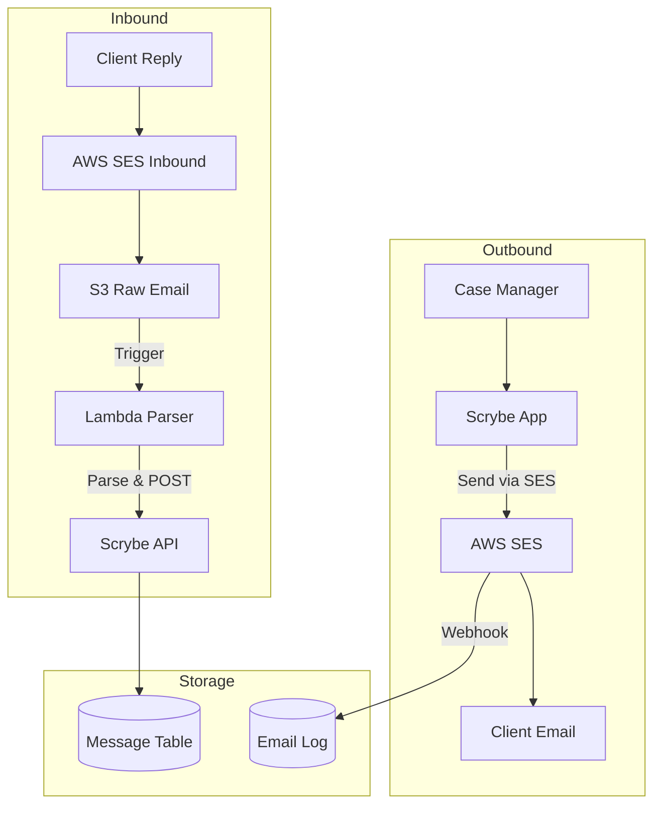
```mermaid
flowchart TD
    subgraph Outbound
        CM[Case Manager]
        APP[Scrybe App]
        SES_OUT[AWS SES]
        CLIENT_IN[Client Email]
    end

    subgraph Inbound
        CLIENT_OUT[Client Reply]
        SES_IN[AWS SES Inbound]
        S3[S3 Raw Email]
        LAMBDA[Lambda Parser]
        API[Scrybe API]
    end

    subgraph Storage
        MSG[(Message Table)]
        EMAIL_LOG[(Email Log)]
    end

    CM --> APP
    APP --> |Send via SES| SES_OUT
    SES_OUT --> CLIENT_IN
    SES_OUT --> |Webhook| EMAIL_LOG

    CLIENT_OUT --> SES_IN
    SES_IN --> S3
    S3 --> |Trigger| LAMBDA
    LAMBDA --> |Parse & POST| API
    API --> MSG
```

### Inbound Email Flow

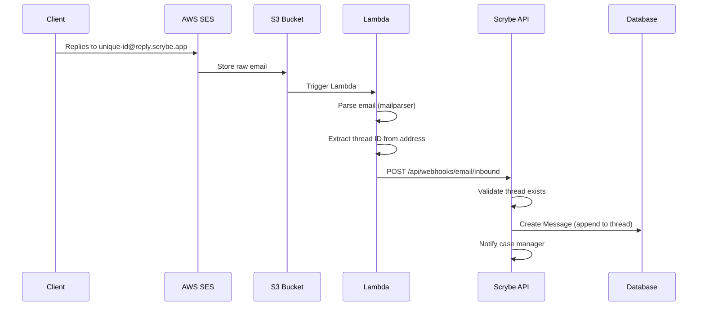
```mermaid
sequenceDiagram
    participant C as Client
    participant SES as AWS SES
    participant S3 as S3 Bucket
    participant L as Lambda
    participant API as Scrybe API
    participant DB as Database

    C->>SES: Replies to unique-id@reply.scrybe.app
    SES->>S3: Store raw email
    S3->>L: Trigger Lambda
    L->>L: Parse email (mailparser)
    L->>L: Extract thread ID from address
    L->>API: POST /api/webhooks/email/inbound
    API->>API: Validate thread exists
    API->>DB: Create Message (append to thread)
    API->>API: Notify case manager
```

### Reply-To Address Format

```
{threadId}-{hash}@reply.scrybe.app

Example: msg_abc123-x7k2@reply.scrybe.app
```

The hash prevents guessing thread IDs.

### Email Templates

Standard templates (orgs customize subject/body text + logo):

| Template | Use Case |
|----------|----------|
| `client_message` | Case manager sending message to client |
| `appointment_reminder` | Upcoming appointment notification |
| `document_request` | Request for client to upload document |
| `intake_confirmation` | Confirmation after intake completion |
| `portal_notification` | Notification of portal activity |

### Bounce Handling

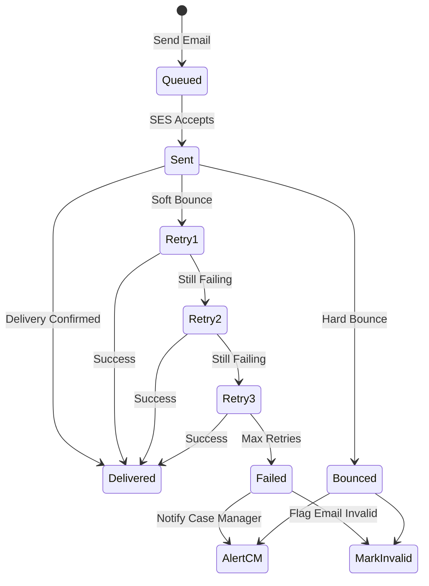
```mermaid
stateDiagram-v2
    [*] --> Queued: Send Email
    Queued --> Sent: SES Accepts
    Sent --> Delivered: Delivery Confirmed
    Sent --> Bounced: Hard Bounce
    Sent --> Retry1: Soft Bounce
    Retry1 --> Delivered: Success
    Retry1 --> Retry2: Still Failing
    Retry2 --> Delivered: Success
    Retry2 --> Retry3: Still Failing
    Retry3 --> Delivered: Success
    Retry3 --> Failed: Max Retries
    Failed --> AlertCM: Notify Case Manager
    Failed --> MarkInvalid: Flag Email Invalid
    Bounced --> AlertCM
    Bounced --> MarkInvalid
```

---

## 3. Real-Time Chat (PX-713)

### Overview

WebSocket-based real-time chat between case managers and clients, supporting crisis situations, chatbot handoffs, and quick questions that don't warrant a phone call.

### User Stories

| As a... | I want to... | So that... |
|---------|--------------|------------|
| Client | Chat in real-time with my case manager | I get immediate answers to urgent questions |
| Case manager | See typing indicators | I know when client is responding |
| Case manager | Set business hours | Clients know when to expect responses |
| Org admin | Moderate chat content | PHI and crisis indicators are flagged |

### Technical Decisions

| Decision | Choice | Rationale |
|----------|--------|-----------|
| WebSocket library | Socket.io self-hosted | Full control, proven reliability |
| Scaling | Redis adapter from start | Proper multi-server architecture |
| Indicators | Typing + read receipts (both ways) | Full transparency for both parties |
| Attachments | Text only for MVP | Reduce complexity, add later |
| Business hours | Configurable per org | Clients know when CMs are available |
| Moderation | Same pipeline as async | HIPAA compliance on all messages |

### Architecture

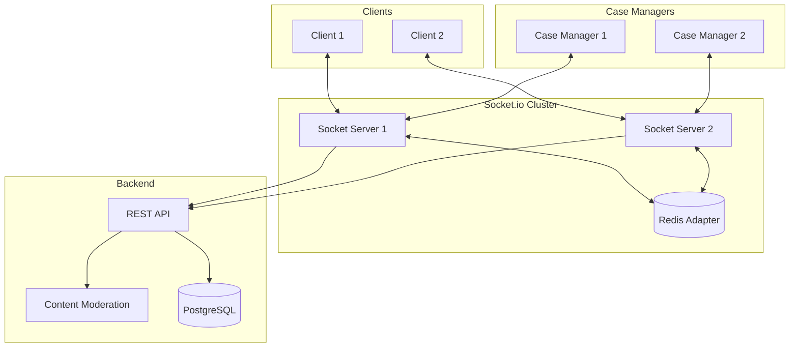
```mermaid
flowchart TD
    subgraph Clients
        C1[Client 1]
        C2[Client 2]
    end

    subgraph "Case Managers"
        CM1[Case Manager 1]
        CM2[Case Manager 2]
    end

    subgraph "Socket.io Cluster"
        S1[Socket Server 1]
        S2[Socket Server 2]
        REDIS[(Redis Adapter)]
    end

    subgraph Backend
        API[REST API]
        MOD[Content Moderation]
        DB[(PostgreSQL)]
    end

    C1 <--> S1
    C2 <--> S2
    CM1 <--> S1
    CM2 <--> S2
    S1 <--> REDIS
    S2 <--> REDIS
    S1 --> API
    S2 --> API
    API --> MOD
    API --> DB
```

### Socket Events

| Event | Direction | Payload | Description |
|-------|-----------|---------|-------------|
| `chat:message` | Client → Server | `{ roomId, content }` | Send message |
| `chat:message` | Server → Client | `{ id, senderId, content, timestamp }` | Receive message |
| `chat:typing` | Bidirectional | `{ roomId, isTyping }` | Typing indicator |
| `chat:read` | Client → Server | `{ messageId }` | Mark message read |
| `chat:read` | Server → Client | `{ messageId, readAt }` | Read receipt |
| `chat:join` | Client → Server | `{ roomId }` | Join chat room |
| `chat:leave` | Client → Server | `{ roomId }` | Leave chat room |
| `presence:online` | Server → Client | `{ userId, online }` | Online status |

### Business Hours

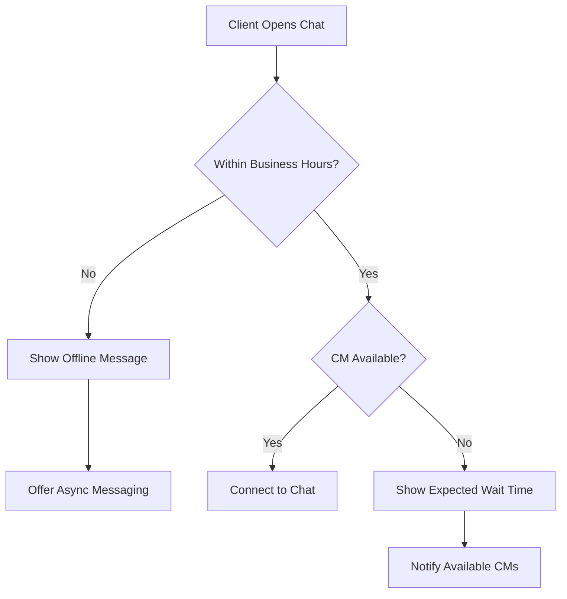
```mermaid
flowchart TD
    C[Client Opens Chat] --> BH{Within Business Hours?}
    BH --> |Yes| AVAIL{CM Available?}
    BH --> |No| OFFLINE[Show Offline Message]
    OFFLINE --> ASYNC[Offer Async Messaging]
    AVAIL --> |Yes| CONNECT[Connect to Chat]
    AVAIL --> |No| QUEUE[Show Expected Wait Time]
    QUEUE --> NOTIFY[Notify Available CMs]
```

### Content Moderation Flow

All real-time messages go through the same moderation pipeline as async messages:

1. Client sends message via WebSocket
2. Server runs through `moderateContent()` before delivery
3. If flagged (PHI, crisis), message is flagged but still delivered
4. Crisis indicators trigger immediate escalation
5. Flagged messages marked for supervisor review

---

## 4. Staff Performance Metrics (PX-708)

### Overview

Activity and outcome tracking for case managers, tied to program-level goals and grant deliverables, with custom KPI support via the OKR system.

### User Stories

| As a... | I want to... | So that... |
|---------|--------------|------------|
| Case manager | See my activity metrics | I can track my own performance |
| Supervisor | See my team's metrics | I can identify coaching opportunities |
| Org admin | Tie activities to grants | I can report on grant deliverables |
| Program manager | See program-level metrics | I can measure program effectiveness |

### Technical Decisions

| Decision | Choice | Rationale |
|----------|--------|-----------|
| Core KPIs | Activity + Outcomes + Custom | Comprehensive view of performance |
| Visibility | Private to individual + supervisor | Avoid toxic competition, support coaching |
| Goal system | Tie to OKRs and programs | Align individual work with org goals |
| Attribution | Program-level only | Auto-link to grant, no manual tagging needed |
| Response time | Deferred to Phase 3 | Focus on activity/outcome metrics first |
| Dashboards | Custom built-in (Recharts) | Full control, no external dependencies |

### Metrics Tracked

| Category | Metric | Calculation |
|----------|--------|-------------|
| **Activity** | Calls completed | Count of calls by user per period |
| | Messages sent | Count of messages by user per period |
| | Forms completed | Count of form submissions by user |
| | Sessions delivered | Count of sessions facilitated |
| | Clients contacted | Unique clients with any interaction |
| **Outcomes** | Case closure rate | Closed cases / Total cases |
| | Program completion rate | Clients completing / Clients enrolled |
| | Goal achievement | OKR/KR completion percentage |
| | Client satisfaction | Average satisfaction rating |

### Program-to-Grant Attribution

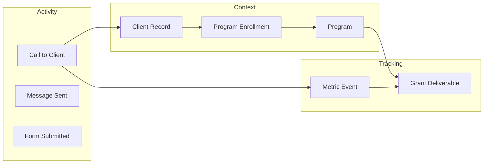
```mermaid
flowchart LR
    subgraph Activity
        CALL[Call to Client]
        MSG[Message Sent]
        FORM[Form Submitted]
    end

    subgraph Context
        CLIENT[Client Record]
        ENR[Program Enrollment]
        PROG[Program]
    end

    subgraph Tracking
        GRANT[Grant Deliverable]
        METRIC[Metric Event]
    end

    CALL --> CLIENT
    CLIENT --> ENR
    ENR --> PROG
    PROG --> GRANT
    CALL --> METRIC
    METRIC --> GRANT
```

### Dashboard Views

**Individual View** (case manager sees their own):
- Activity summary (calls, messages, forms this week/month)
- Trend chart (activity over time)
- Program contribution (which programs they worked on)
- Linked OKRs and progress

**Team View** (supervisor sees team):
- Aggregate team metrics
- Per-person activity (private, not competitive leaderboard)
- Workload distribution
- Coaching opportunities flagged

---

## 5. Staff Training & Quizzes (PX-704, PX-707)

### Overview

Lightweight quiz and assessment system for both staff training and client learning verification, attached to training materials and program sessions.

### User Stories

| As a... | I want to... | So that... |
|---------|--------------|------------|
| Org admin | Create training quizzes for staff | I can verify they understand procedures |
| Program manager | Create quizzes for clients | I can measure learning from sessions |
| Staff member | Take required training quizzes | I can demonstrate competency |
| Client | Take a quiz after a session | I can reinforce what I learned |

### Technical Decisions

| Decision | Choice | Rationale |
|----------|--------|-----------|
| Question types | Full toolkit | MC, multi-select, free text, scale, matching, ordering, file upload |
| Scoring | Per-quiz configurable | Different quizzes need different passing thresholds |
| Retakes | Configurable limit per quiz | Balance learning with assessment integrity |
| Question order | Fixed | Predictable experience, simpler implementation |
| File uploads | Images + documents (10MB) | Match existing attachment limits |
| Enforcement | Advisory only | Track completion, don't block features |
| Audience | Both staff and clients | Same engine, different content |

### Question Types

| Type | Description | Use Case |
|------|-------------|----------|
| `SINGLE_CHOICE` | Select one answer | Factual knowledge |
| `MULTIPLE_CHOICE` | Select all that apply | Identifying multiple correct items |
| `FREE_TEXT` | Open-ended response | Reflective questions |
| `SCALE` | 1-10 rating | Self-assessment |
| `MATCHING` | Match items to categories | Terminology pairing |
| `ORDERING` | Put items in sequence | Process steps |
| `FILE_UPLOAD` | Upload document/image | Practical demonstrations |

### Quiz Flow

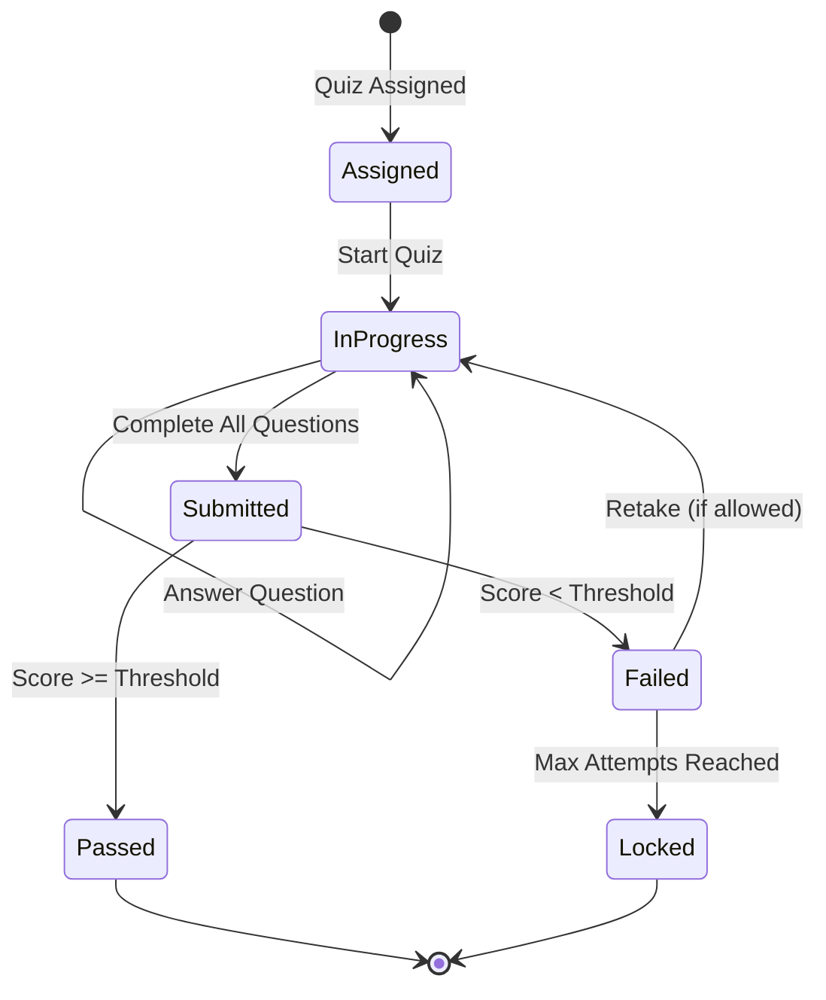
```mermaid
stateDiagram-v2
    [*] --> Assigned: Quiz Assigned
    Assigned --> InProgress: Start Quiz
    InProgress --> InProgress: Answer Question
    InProgress --> Submitted: Complete All Questions
    Submitted --> Passed: Score >= Threshold
    Submitted --> Failed: Score < Threshold
    Failed --> InProgress: Retake (if allowed)
    Failed --> Locked: Max Attempts Reached
    Passed --> [*]
    Locked --> [*]
```

### Quiz Result Storage

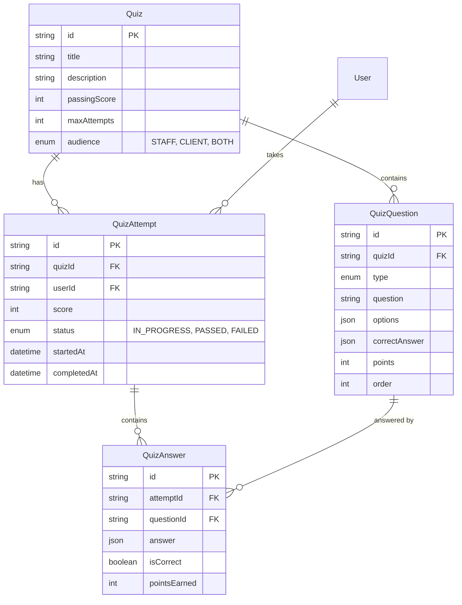
```mermaid
erDiagram
    Quiz ||--o{ QuizAttempt : "has"
    Quiz ||--o{ QuizQuestion : "contains"
    QuizAttempt ||--o{ QuizAnswer : "contains"
    QuizQuestion ||--o{ QuizAnswer : "answered by"
    User ||--o{ QuizAttempt : "takes"

    Quiz {
        string id PK
        string title
        string description
        int passingScore
        int maxAttempts
        enum audience "STAFF, CLIENT, BOTH"
    }

    QuizQuestion {
        string id PK
        string quizId FK
        enum type
        string question
        json options
        json correctAnswer
        int points
        int order
    }

    QuizAttempt {
        string id PK
        string quizId FK
        string userId FK
        int score
        enum status "IN_PROGRESS, PASSED, FAILED"
        datetime startedAt
        datetime completedAt
    }

    QuizAnswer {
        string id PK
        string attemptId FK
        string questionId FK
        json answer
        boolean isCorrect
        int pointsEarned
    }
```

---

## 6. In-Person Recording (PX-703)

### Overview

Browser-based audio recording for 1:1 client meetings, with the same transcription and extraction pipeline as phone calls.

### User Stories

| As a... | I want to... | So that... |
|---------|--------------|------------|
| Case manager | Record in-person meetings | I can focus on the client, not note-taking |
| Client | Give consent before recording | I know my rights are respected |
| Case manager | Get transcription after meeting | I have accurate notes |
| Compliance officer | See consent records | Audit trail is complete |

### Technical Decisions

| Decision | Choice | Rationale |
|----------|--------|-----------|
| Recording scenario | 1:1 client meetings | Primary use case, simpler than group |
| Consent methods | All available (digital, verbal, pre-signed) | Org chooses based on state laws |
| Storage | Same S3 bucket, different prefix | Shared infrastructure, easy management |
| Transcription | Post-recording processing | Cheaper, simpler, sufficient for use case |
| Consent storage | Same as call recordings | Consistency with existing pattern |

### Recording Flow

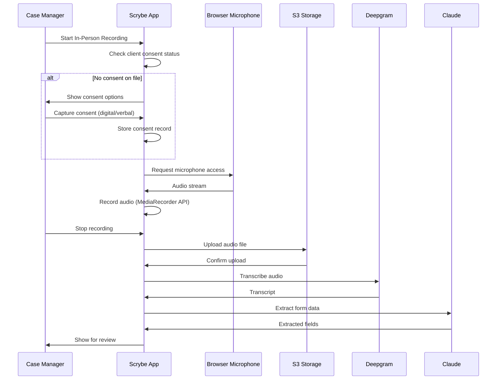
```mermaid
sequenceDiagram
    participant CM as Case Manager
    participant APP as Scrybe App
    participant MIC as Browser Microphone
    participant S3 as S3 Storage
    participant DG as Deepgram
    participant AI as Claude

    CM->>APP: Start In-Person Recording
    APP->>APP: Check client consent status

    alt No consent on file
        APP->>CM: Show consent options
        CM->>APP: Capture consent (digital/verbal)
        APP->>APP: Store consent record
    end

    APP->>MIC: Request microphone access
    MIC->>APP: Audio stream
    APP->>APP: Record audio (MediaRecorder API)

    CM->>APP: Stop recording
    APP->>S3: Upload audio file
    S3->>APP: Confirm upload

    APP->>DG: Transcribe audio
    DG->>APP: Transcript
    APP->>AI: Extract form data
    AI->>APP: Extracted fields
    APP->>CM: Show for review
```

### Consent Options

| Method | Flow | Storage |
|--------|------|---------|
| Digital consent | Client signs on CM's device | Signature image + timestamp |
| Verbal consent | First 10s of recording captures consent | Flagged in recording metadata |
| Pre-signed consent | Reference existing intake consent | Link to consent document |

### Browser API Usage

```javascript
// Request microphone access
const stream = await navigator.mediaDevices.getUserMedia({ audio: true });

// Create MediaRecorder
const recorder = new MediaRecorder(stream, {
  mimeType: 'audio/webm;codecs=opus'
});

// Record chunks
const chunks = [];
recorder.ondataavailable = (e) => chunks.push(e.data);

// On stop, create blob and upload
recorder.onstop = async () => {
  const blob = new Blob(chunks, { type: 'audio/webm' });
  await uploadToS3(blob);
};
```

---

## 7. Workforce Development Add-On (PX-711)

### Overview

Industry-specific features for workforce development organizations, including job placement tracking, credential management, and career pathway visualization.

### User Stories

| As a... | I want to... | So that... |
|---------|--------------|------------|
| Case manager | Track client's job placements | I can measure employment outcomes |
| Case manager | Track client's certifications | I know when renewals are needed |
| Client | See my career progress | I understand my pathway to goals |
| Org admin | Report on placement rates | I can demonstrate grant outcomes |

### Technical Decisions

| Decision | Choice | Rationale |
|----------|--------|-----------|
| Employer tracking | Placements only (MVP) | Full employer CRM deferred |
| Credential management | Included with auto-expiry | Core to workforce tracking |
| Career pathway | Simple checklist | Visualization deferred |
| Pricing model | Deferred | Build feature first, monetize later |
| Feature flag | Yes | Orgs opt-in to workforce features |

### Scope for MVP

**Included**:
- Job placement records (client, employer name, job title, start date, wage)
- Credential/certification tracking with expiry dates
- Expiry alerts (30 days, 7 days before)
- Simple skills/training list
- Placement outcome reports

**Deferred to Phase 3**:
- Full employer CRM with contacts
- Job posting management
- Career pathway flowchart visualization
- Skills gap analysis

### Credential Expiry Flow

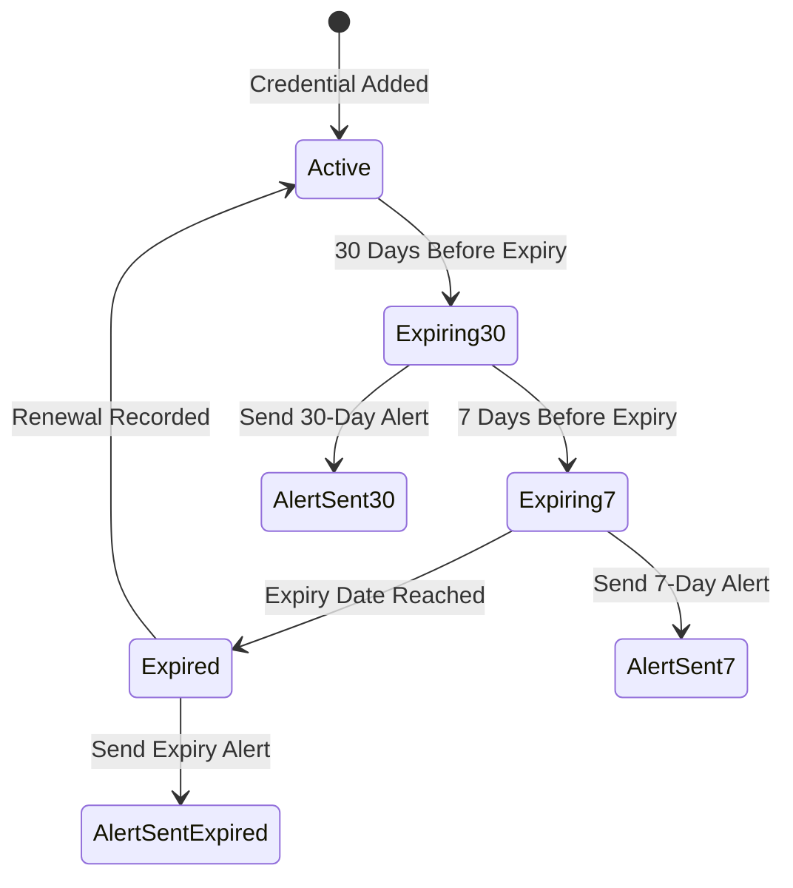
```mermaid
stateDiagram-v2
    [*] --> Active: Credential Added
    Active --> Expiring30: 30 Days Before Expiry
    Expiring30 --> Expiring7: 7 Days Before Expiry
    Expiring7 --> Expired: Expiry Date Reached
    Expired --> Active: Renewal Recorded

    Expiring30 --> AlertSent30: Send 30-Day Alert
    Expiring7 --> AlertSent7: Send 7-Day Alert
    Expired --> AlertSentExpired: Send Expiry Alert
```

### Data Model

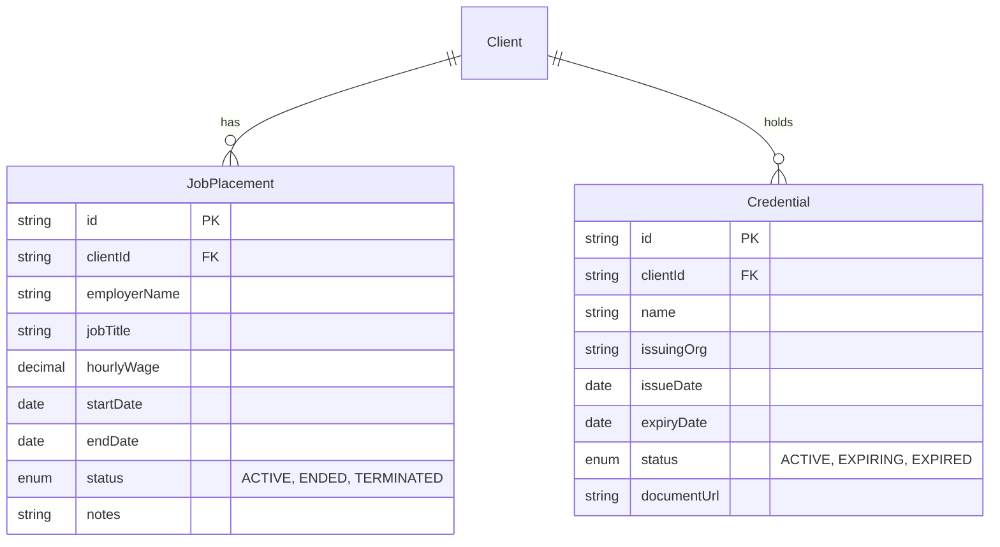
```mermaid
erDiagram
    Client ||--o{ JobPlacement : "has"
    Client ||--o{ Credential : "holds"

    JobPlacement {
        string id PK
        string clientId FK
        string employerName
        string jobTitle
        decimal hourlyWage
        date startDate
        date endDate
        enum status "ACTIVE, ENDED, TERMINATED"
        string notes
    }

    Credential {
        string id PK
        string clientId FK
        string name
        string issuingOrg
        date issueDate
        date expiryDate
        enum status "ACTIVE, EXPIRING, EXPIRED"
        string documentUrl
    }
```

---

## 8. Insurance Eligibility Verification (PX-712)

### Overview

Integration with Availity to verify client insurance eligibility for specific services, with documentation generation for manual billing.

### User Stories

| As a... | I want to... | So that... |
|---------|--------------|------------|
| Case manager | Check if client's insurance covers a service | I can advise the client accurately |
| Billing staff | Generate eligibility documentation | I can submit claims manually |
| Client | Know if my insurance covers services | I can plan my care |

### Technical Decisions

| Decision | Choice | Rationale |
|----------|--------|-----------|
| Scope | Eligibility + documentation (not claims) | Avoids claims processing complexity |
| Provider | Availity | Largest clearinghouse, best payer coverage |
| Caching | 7 days | Cost savings, eligibility rarely changes |
| Documents | Eligibility PDF + pre-filled CMS-1500 | Both for org flexibility |
| Payers | Medicaid + Private | Cover primary use cases |

### Eligibility Check Flow

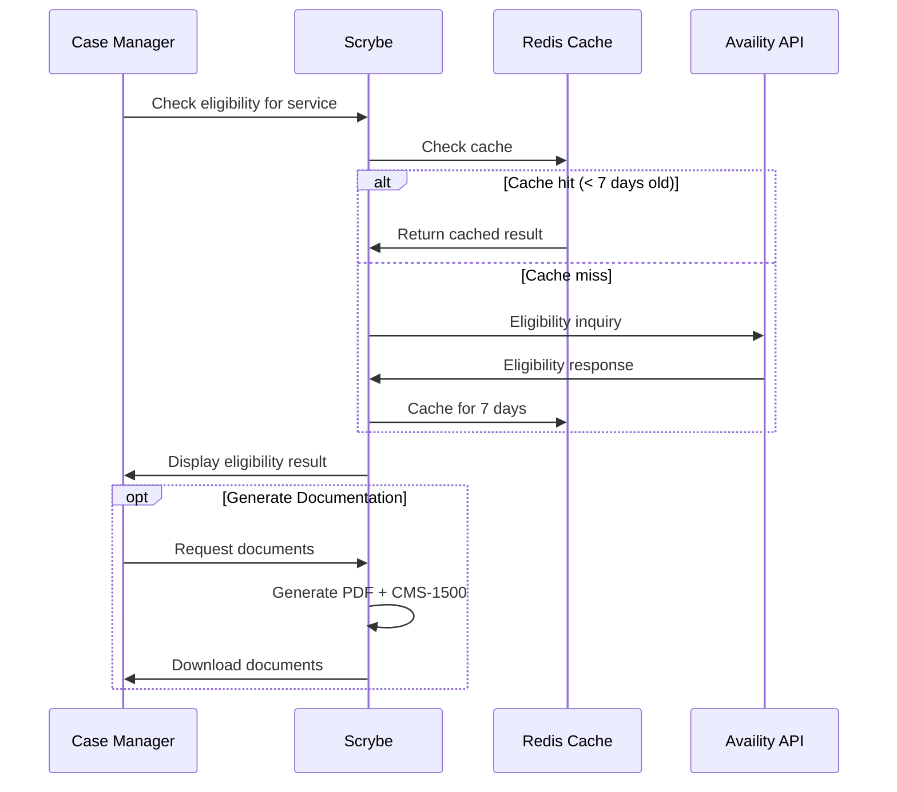
```mermaid
sequenceDiagram
    participant CM as Case Manager
    participant APP as Scrybe
    participant CACHE as Redis Cache
    participant AV as Availity API

    CM->>APP: Check eligibility for service
    APP->>CACHE: Check cache

    alt Cache hit (< 7 days old)
        CACHE->>APP: Return cached result
    else Cache miss
        APP->>AV: Eligibility inquiry
        AV->>APP: Eligibility response
        APP->>CACHE: Cache for 7 days
    end

    APP->>CM: Display eligibility result

    opt Generate Documentation
        CM->>APP: Request documents
        APP->>APP: Generate PDF + CMS-1500
        APP->>CM: Download documents
    end
```

### Eligibility Response Data

| Field | Description |
|-------|-------------|
| `isEligible` | Boolean - covered for service |
| `planName` | Insurance plan name |
| `memberId` | Client's member ID |
| `groupNumber` | Group number |
| `effectiveDate` | Coverage start date |
| `terminationDate` | Coverage end date (if known) |
| `copay` | Copay amount for service |
| `deductible` | Remaining deductible |
| `coinsurance` | Coinsurance percentage |
| `priorAuthRequired` | Whether prior auth needed |
| `limitations` | Any service limitations |

---

## 9. Database Schema Changes

### New Enums

```prisma
enum ChatSessionStatus {
  ACTIVE
  COMPLETED
  ABANDONED
  ESCALATED
}

enum QuizQuestionType {
  SINGLE_CHOICE
  MULTIPLE_CHOICE
  FREE_TEXT
  SCALE
  MATCHING
  ORDERING
  FILE_UPLOAD
}

enum QuizAttemptStatus {
  IN_PROGRESS
  PASSED
  FAILED
}

enum QuizAudience {
  STAFF
  CLIENT
  BOTH
}

enum CredentialStatus {
  ACTIVE
  EXPIRING
  EXPIRED
}

enum PlacementStatus {
  ACTIVE
  ENDED
  TERMINATED
}

enum EmailStatus {
  QUEUED
  SENT
  DELIVERED
  BOUNCED
  FAILED
}

enum ConsentMethod {
  DIGITAL
  VERBAL
  PRE_SIGNED
}
```

### New Models

```prisma
// Chatbot Intake
model ChatSession {
  id              String            @id @default(cuid())
  organizationId  String
  formId          String
  status          ChatSessionStatus @default(ACTIVE)
  clientPhone     String?
  clientEmail     String?
  extractedData   Json?
  handoffRequested Boolean          @default(false)
  handoffUserId   String?
  crisisDetected  Boolean           @default(false)
  completedAt     DateTime?
  createdAt       DateTime          @default(now())
  updatedAt       DateTime          @updatedAt

  organization    Organization      @relation(fields: [organizationId], references: [id])
  form            Form              @relation(fields: [formId], references: [id])
  handoffUser     User?             @relation(fields: [handoffUserId], references: [id])
  messages        ChatMessage[]

  @@index([organizationId, status])
}

model ChatMessage {
  id          String      @id @default(cuid())
  sessionId   String
  role        String      // "user" | "assistant" | "system"
  content     String
  metadata    Json?
  createdAt   DateTime    @default(now())

  session     ChatSession @relation(fields: [sessionId], references: [id])

  @@index([sessionId])
}

// Email
model EmailLog {
  id              String      @id @default(cuid())
  organizationId  String
  messageId       String?     // Link to Message if applicable
  recipientEmail  String
  subject         String
  status          EmailStatus @default(QUEUED)
  sesMessageId    String?
  sentAt          DateTime?
  deliveredAt     DateTime?
  bouncedAt       DateTime?
  bounceReason    String?
  retryCount      Int         @default(0)
  createdAt       DateTime    @default(now())
  updatedAt       DateTime    @updatedAt

  organization    Organization @relation(fields: [organizationId], references: [id])
  message         Message?     @relation(fields: [messageId], references: [id])

  @@index([organizationId, status])
  @@index([sesMessageId])
}

// Quizzes
model Quiz {
  id              String        @id @default(cuid())
  organizationId  String
  title           String
  description     String?
  audience        QuizAudience  @default(BOTH)
  passingScore    Int           @default(80)
  maxAttempts     Int?
  isActive        Boolean       @default(true)
  createdBy       String
  createdAt       DateTime      @default(now())
  updatedAt       DateTime      @updatedAt

  organization    Organization  @relation(fields: [organizationId], references: [id])
  creator         User          @relation(fields: [createdBy], references: [id])
  questions       QuizQuestion[]
  attempts        QuizAttempt[]

  @@index([organizationId, isActive])
}

model QuizQuestion {
  id            String           @id @default(cuid())
  quizId        String
  type          QuizQuestionType
  question      String
  options       Json?            // For choice questions
  correctAnswer Json             // Correct answer(s)
  points        Int              @default(1)
  order         Int

  quiz          Quiz             @relation(fields: [quizId], references: [id])
  answers       QuizAnswer[]

  @@index([quizId])
}

model QuizAttempt {
  id          String            @id @default(cuid())
  quizId      String
  userId      String
  score       Int?
  status      QuizAttemptStatus @default(IN_PROGRESS)
  startedAt   DateTime          @default(now())
  completedAt DateTime?

  quiz        Quiz              @relation(fields: [quizId], references: [id])
  user        User              @relation(fields: [userId], references: [id])
  answers     QuizAnswer[]

  @@index([quizId, userId])
}

model QuizAnswer {
  id           String       @id @default(cuid())
  attemptId    String
  questionId   String
  answer       Json
  isCorrect    Boolean?
  pointsEarned Int?

  attempt      QuizAttempt  @relation(fields: [attemptId], references: [id])
  question     QuizQuestion @relation(fields: [questionId], references: [id])

  @@index([attemptId])
}

// In-Person Recording
model InPersonRecording {
  id              String        @id @default(cuid())
  organizationId  String
  clientId        String
  userId          String
  recordingUrl    String
  duration        Int?          // seconds
  transcriptText  String?
  extractedData   Json?
  consentMethod   ConsentMethod
  consentRecordedAt DateTime
  processedAt     DateTime?
  createdAt       DateTime      @default(now())

  organization    Organization  @relation(fields: [organizationId], references: [id])
  client          Client        @relation(fields: [clientId], references: [id])
  user            User          @relation(fields: [userId], references: [id])

  @@index([organizationId])
  @@index([clientId])
}

// Workforce Development
model JobPlacement {
  id            String          @id @default(cuid())
  clientId      String
  employerName  String
  jobTitle      String
  hourlyWage    Decimal?
  startDate     DateTime
  endDate       DateTime?
  status        PlacementStatus @default(ACTIVE)
  notes         String?
  createdAt     DateTime        @default(now())
  updatedAt     DateTime        @updatedAt

  client        Client          @relation(fields: [clientId], references: [id])

  @@index([clientId])
}

model Credential {
  id            String           @id @default(cuid())
  clientId      String
  name          String
  issuingOrg    String?
  issueDate     DateTime?
  expiryDate    DateTime?
  status        CredentialStatus @default(ACTIVE)
  documentUrl   String?
  notes         String?
  createdAt     DateTime         @default(now())
  updatedAt     DateTime         @updatedAt

  client        Client           @relation(fields: [clientId], references: [id])

  @@index([clientId])
  @@index([expiryDate, status])
}

// Insurance Eligibility
model EligibilityCheck {
  id              String    @id @default(cuid())
  clientId        String
  insurancePlanId String?
  serviceCode     String
  isEligible      Boolean
  responseData    Json
  documentUrls    String[]
  checkedAt       DateTime  @default(now())
  expiresAt       DateTime

  client          Client    @relation(fields: [clientId], references: [id])

  @@index([clientId, serviceCode])
  @@index([expiresAt])
}

// Real-Time Chat (extends existing Message model)
model ChatRoom {
  id              String    @id @default(cuid())
  organizationId  String
  clientId        String
  isActive        Boolean   @default(true)
  lastActivityAt  DateTime  @default(now())
  createdAt       DateTime  @default(now())

  organization    Organization @relation(fields: [organizationId], references: [id])
  client          Client       @relation(fields: [clientId], references: [id])

  @@unique([organizationId, clientId])
  @@index([isActive, lastActivityAt])
}
```

### Model Updates

```prisma
// Add to Organization
model Organization {
  // ... existing fields

  // Feature flags
  chatbotEnabled       Boolean @default(false)
  realTimeChatEnabled  Boolean @default(false)
  workforceEnabled     Boolean @default(false)

  // Chatbot config
  chatbotFormId        String?
  chatbotCrisisContact String?
  chatbotAuthRequired  Boolean @default(false)

  // Business hours for real-time chat
  businessHoursStart   String? // "09:00"
  businessHoursEnd     String? // "17:00"
  businessHoursTimezone String? // "America/New_York"
  businessHoursDays    Int[]   // [1,2,3,4,5] for Mon-Fri

  // Relations
  chatSessions         ChatSession[]
  emailLogs            EmailLog[]
  quizzes              Quiz[]
  inPersonRecordings   InPersonRecording[]
  chatRooms            ChatRoom[]
}

// Add to Client
model Client {
  // ... existing fields

  emailBounced         Boolean @default(false)
  emailBouncedAt       DateTime?

  // Workforce
  jobPlacements        JobPlacement[]
  credentials          Credential[]
  eligibilityChecks    EligibilityCheck[]

  // Chat
  chatRoom             ChatRoom?
  inPersonRecordings   InPersonRecording[]
}

// Add to Message
model Message {
  // ... existing fields

  emailLogs            EmailLog[]
}
```

---

## 10. Security & Compliance

### HIPAA Requirements

| Feature | PHI Handling | Audit Logging | Encryption |
|---------|--------------|---------------|------------|
| Chatbot Intake | Collects PHI | All messages logged | TLS + at-rest |
| Email | Contains PHI | Send/receive logged | TLS + SES encryption |
| Real-Time Chat | Contains PHI | All messages logged | TLS + at-rest |
| In-Person Recording | Audio contains PHI | Recording access logged | S3 encryption |
| Eligibility Check | Insurance = PHI | All checks logged | TLS + at-rest |

### Content Moderation

All user-generated content (chatbot, email, chat) runs through the existing `moderateContent()` pipeline:

- PHI detection (SSN, MRN, DOB)
- Crisis indicators (self-harm, threats)
- Contact information flagging
- Profanity filtering

### Authentication & Authorization

| Feature | Auth Required | Permission Check |
|---------|---------------|------------------|
| Chatbot widget | Org-configurable | N/A (public-facing) |
| Email send | Yes | `canMessageClients` |
| Real-time chat | Yes (both sides) | Client token or user session |
| Quiz creation | Yes | `canManageTraining` |
| Eligibility check | Yes | `canViewClients` |

### Rate Limiting

| Endpoint | Limit | Window |
|----------|-------|--------|
| Chatbot messages | 60/min per session | 1 minute |
| Email send | 100/hour per org | 1 hour |
| Eligibility checks | 100/day per org | 24 hours |
| Quiz attempts | 10/hour per user | 1 hour |

---

## 11. Metrics & Success Criteria

### Hypotheses to Validate

| Hypothesis | Metric | Target | Measurement |
|------------|--------|--------|-------------|
| Chatbot reduces intake time | Avg time to complete | < 10 min | Compare to manual intake |
| Chatbot increases conversion | Intake → enrolled client | > 60% | Track funnel |
| Email reduces phone volume | Calls per client | -20% | Before/after comparison |
| Real-time chat improves satisfaction | Client satisfaction score | > 4.5/5 | Post-chat survey |
| Credential alerts prevent lapses | Credentials expired unexpectedly | < 5% | Track renewals |

### Key Performance Indicators

| Feature | KPI | Tracking Method |
|---------|-----|-----------------|
| Chatbot | Completion rate | `ChatSession.status = COMPLETED` |
| Chatbot | Crisis detection rate | `ChatSession.crisisDetected = true` |
| Email | Delivery rate | `EmailLog.status = DELIVERED` |
| Email | Bounce rate | `EmailLog.status = BOUNCED` |
| Real-time Chat | Response time | Time between messages |
| Quizzes | Pass rate | `QuizAttempt.status = PASSED` |
| Workforce | Placement rate | `JobPlacement` count per month |

### Analytics Dashboard Requirements

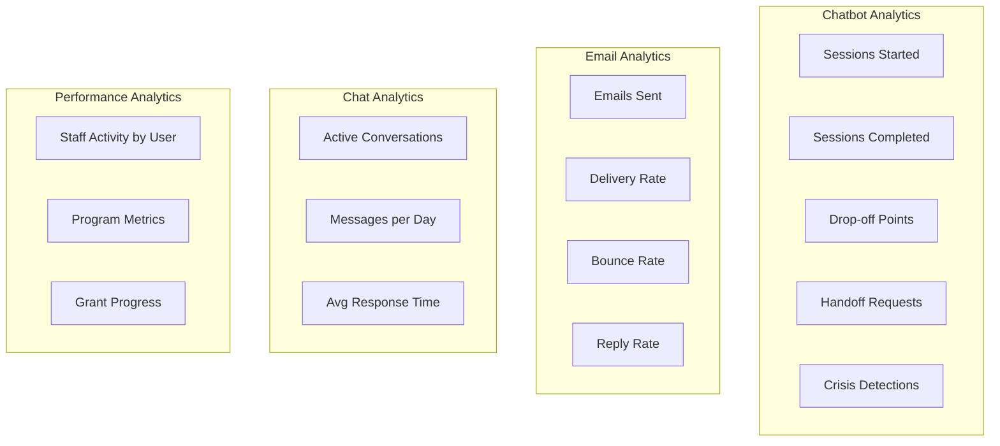
```mermaid
graph TD
    subgraph "Chatbot Analytics"
        CA1[Sessions Started]
        CA2[Sessions Completed]
        CA3[Drop-off Points]
        CA4[Handoff Requests]
        CA5[Crisis Detections]
    end

    subgraph "Email Analytics"
        EA1[Emails Sent]
        EA2[Delivery Rate]
        EA3[Bounce Rate]
        EA4[Reply Rate]
    end

    subgraph "Chat Analytics"
        CHA1[Active Conversations]
        CHA2[Messages per Day]
        CHA3[Avg Response Time]
    end

    subgraph "Performance Analytics"
        PA1[Staff Activity by User]
        PA2[Program Metrics]
        PA3[Grant Progress]
    end
```

---

## 12. Deferred Decisions

### Deferred to Phase 3

| Item | Reason | When to Revisit |
|------|--------|-----------------|
| Native mobile app (PX-710) | Very high complexity | After web features stable |
| Screenshot data capture (PX-714) | Niche use case | Based on customer requests |
| Response time metrics | Focus on activity/outcome first | After MVP metrics dashboard |
| Custom org email domains | Start with subdomain | When Enterprise customers request |
| Full employer CRM | Out of workforce MVP scope | Based on workforce adoption |
| Career pathway flowchart | Defer visualization | After checklist proven useful |
| SMS-initiated chatbot | Start with web widget | Based on widget adoption |
| WhatsApp integration | Single channel focus | Based on international demand |
| Full LMS with video hosting | Light assessment only | Based on training adoption |
| Leaderboards/peer visibility | Privacy-first approach | Based on org feedback |

### Open Questions for Future

1. **Chatbot multi-language**: Should chatbot support Spanish/other languages?
2. **Email marketing**: Should we ever support bulk marketing emails?
3. **Quiz proctoring**: For high-stakes assessments, do we need proctoring?
4. **Workforce job board**: Should we build internal job listings?
5. **Insurance claims**: Will orgs eventually want claim submission?

---

## 13. Learnings & Recommendations

### Key Insights from Interview

1. **Privacy-first approach**: User chose no session memory, private metrics visibility - indicates privacy is a core value for the platform.

2. **Grant-centric thinking**: Performance metrics should tie to grants/programs, not just individual productivity - this is unique to nonprofit/social services.

3. **Safety is paramount**: Immediate escalation for crisis, org-configured contacts - safety protocols are critical for this user base.

4. **Start simple, expand later**: Multiple features scoped to MVP with clear deferral - avoid over-engineering.

5. **Consistency matters**: Use same AI (Claude) for chatbot, same storage (S3) for recordings, same moderation for all content.

### Architecture Recommendations

1. **Unified real-time infrastructure**: Socket.io + Redis will serve both real-time chat and chatbot handoffs.

2. **Event-driven metrics**: Extend existing `grant-metrics.ts` pattern for performance tracking.

3. **Modular add-ons**: Workforce features behind feature flag - pattern for future industry add-ons.

4. **Shared services**: Email, SMS, and push notifications should share a unified notification service.

### Implementation Order Recommendation

Based on dependencies and value:

1. **Week 1-2**: Email Integration (foundational, enables other notifications)
2. **Week 2-3**: Real-Time Chat + Socket.io infrastructure (enables chatbot handoff)
3. **Week 3-4**: Chatbot Intake (depends on chat for handoffs)
4. **Week 4-5**: Staff Performance Metrics (extends existing grant metrics)
5. **Week 5-6**: Quizzes, In-Person Recording, Workforce, Eligibility (parallel)

---

## Appendix A: API Reference

### Chatbot Endpoints

```yaml
POST /api/chatbot/sessions:
  body:
    orgSlug: string
    formId: string
  response:
    sessionId: string
    welcomeMessage: string

POST /api/chatbot/sessions/{id}/messages:
  body:
    content: string
  response:
    message: ChatMessage
    nextQuestion: string?
    isComplete: boolean

POST /api/chatbot/sessions/{id}/handoff:
  response:
    queued: boolean
    estimatedWait: string?

GET /api/chatbot/widget-config/{orgSlug}:
  response:
    formId: string
    primaryColor: string
    logoUrl: string?
    authRequired: boolean
```

### Email Endpoints

```yaml
POST /api/email/send:
  body:
    clientId: string
    templateId: string
    subject: string
    body: string
  response:
    emailLogId: string
    status: EmailStatus

POST /api/webhooks/email/inbound:
  body:
    from: string
    to: string
    subject: string
    body: string
  response:
    success: boolean
    messageId: string?
```

### Quiz Endpoints

```yaml
POST /api/quizzes:
  body:
    title: string
    description: string?
    audience: QuizAudience
    passingScore: number
    maxAttempts: number?
    questions: QuizQuestion[]
  response:
    quiz: Quiz

POST /api/quizzes/{id}/attempts:
  response:
    attemptId: string
    questions: QuizQuestion[]

POST /api/quiz-attempts/{id}/answers:
  body:
    questionId: string
    answer: any
  response:
    isCorrect: boolean?
    pointsEarned: number?

POST /api/quiz-attempts/{id}/submit:
  response:
    score: number
    status: QuizAttemptStatus
    passed: boolean
```

---

## Appendix B: Socket.io Events

```typescript
// Server -> Client
interface ServerToClientEvents {
  'chat:message': (message: ChatMessageDTO) => void;
  'chat:typing': (data: { roomId: string; userId: string; isTyping: boolean }) => void;
  'chat:read': (data: { messageId: string; readAt: string }) => void;
  'presence:online': (data: { userId: string; online: boolean }) => void;
  'handoff:accepted': (data: { caseManagerId: string; name: string }) => void;
}

// Client -> Server
interface ClientToServerEvents {
  'chat:join': (roomId: string) => void;
  'chat:leave': (roomId: string) => void;
  'chat:message': (data: { roomId: string; content: string }) => void;
  'chat:typing': (data: { roomId: string; isTyping: boolean }) => void;
  'chat:read': (messageId: string) => void;
}
```

---

## Appendix C: Feature Flags

```typescript
interface OrganizationFeatureFlags {
  // Phase 2 features
  chatbotEnabled: boolean;
  realTimeChatEnabled: boolean;
  workforceEnabled: boolean;
  quizzesEnabled: boolean;
  inPersonRecordingEnabled: boolean;
  eligibilityCheckEnabled: boolean;

  // Chatbot configuration
  chatbotAuthRequired: boolean;

  // Performance metrics
  performanceMetricsEnabled: boolean;
}
```

---

*Document generated: 2026-02-08*
*Author: Claude Code with user interview input*
