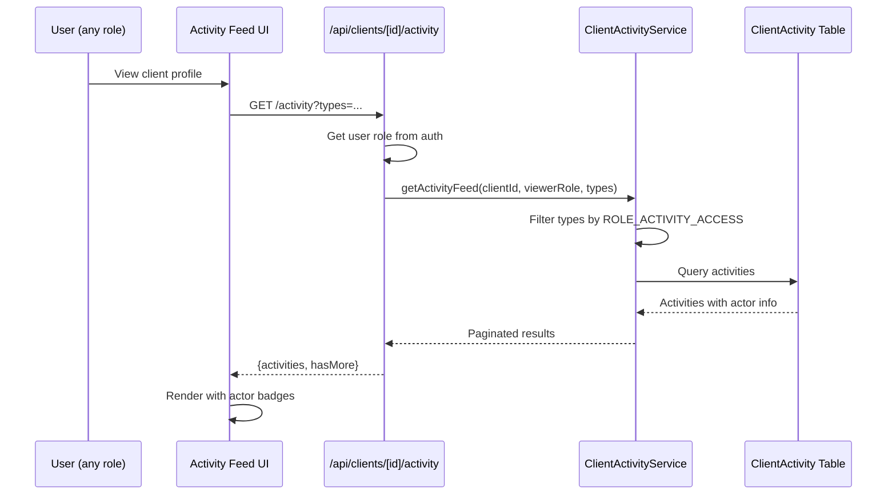
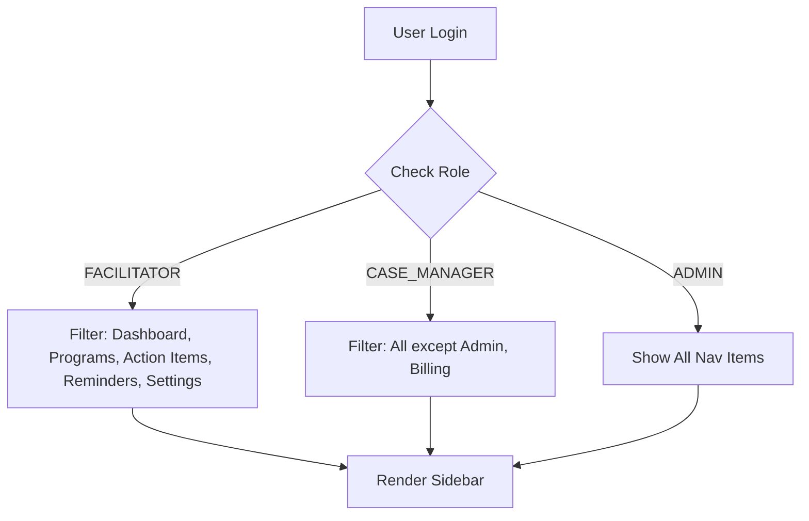

# Track C: Platform Features Specification

**Tickets**: PX-728, PX-729
**Status**: Complete
**Spec Date**: 2026-02-15

## Overview

Track C implements platform-wide features for role-based access and unified activity tracking. The Facilitator role enables users who run programs/classes without case management access, while the unified activity feed aggregates all client interactions across roles.

---

## PX-729: Facilitator Role & Class Management Workflow

### Implementation Summary

The FACILITATOR role provides scoped access for users who run programs and sessions without case management responsibilities.

### Role Definition

**Added to Prisma schema** (already existed):
```prisma
enum UserRole {
  SUPER_ADMIN
  ADMIN
  PROGRAM_MANAGER
  CASE_MANAGER
  FACILITATOR  // PX-729: Class/program facilitators
  VIEWER
}
```

**Added to frontend types** (`src/types/index.ts`):
```typescript
export enum UserRole {
  SUPER_ADMIN = "SUPER_ADMIN",
  ADMIN = "ADMIN",
  PROGRAM_MANAGER = "PROGRAM_MANAGER",
  CASE_MANAGER = "CASE_MANAGER",
  FACILITATOR = "FACILITATOR",
  VIEWER = "VIEWER",
}
```

### Permission Matrix

| Capability | FACILITATOR | Case Manager | Admin |
|------------|-------------|--------------|-------|
| Dashboard | ✅ | ✅ | ✅ |
| Programs | ✅ (assigned only) | ✅ | ✅ |
| Sessions | ✅ | ✅ | ✅ |
| Attendance | ✅ | ✅ | ✅ |
| Action Items | ✅ | ✅ | ✅ |
| Reminders | ✅ | ✅ | ✅ |
| Forms | ❌ | Read-only | Full |
| Clients (full list) | ❌ | ✅ | ✅ |
| VoIP Calls | ❌ | ✅ | ✅ |
| Goals | ❌ | ✅ | ✅ |
| Billing | ❌ | ❌ | ✅ |
| Admin Panel | ❌ | ❌ | ✅ |

### Navigation Filtering

**Location**: `src/components/layout/sidebar.tsx`

Navigation items now include `allowedRoles` and `excludedRoles` properties:

```typescript
interface NavItem {
  title: string;
  href: string;
  icon: React.ComponentType<{ className?: string }>;
  allowedRoles?: UserRole[];
  excludedRoles?: UserRole[];
}

function filterNavItems(items: NavItem[], userRole: UserRole): NavItem[]
```

**FACILITATOR Excluded From**:
- Forms (`/forms`)
- Clients (`/clients`)
- Calls (`/calls`)
- Goals (`/goals`)
- Billing (`/billing`)

### Response Filtering (PHI Protection)

**Location**: `src/lib/services/response-filter.ts`

FACILITATOR role has restricted client data access:

```typescript
[UserRole.FACILITATOR]: {
  canViewFullPhone: false,
  canViewFullEmail: false,
  canViewFullAddress: false,
  requiresAssignment: false, // Always restricted
}
```

---

## PX-728: Cross-Role Unified Activity Feed

### Implementation Summary

The activity feed aggregates all client interactions (calls, notes, forms, attendance, enrollments, action items, consent) into a single chronological view with role-based filtering.

### Data Model

**ClientActivity** (already existed in schema):
```prisma
model ClientActivity {
  id           String       @id @default(cuid())
  clientId     String
  actorId      String
  actorRole    UserRole     // Captured at activity time
  activityType ActivityType
  summary      String
  rawData      Json
  sourceType   String
  sourceId     String
  createdAt    DateTime     @default(now())
}
```

### Activity Types

```typescript
enum ActivityType {
  CALL_COMPLETED
  CALL_MISSED
  NOTE_ADDED
  FORM_SUBMITTED
  FORM_UPDATED
  ATTENDANCE_RECORDED
  ENROLLMENT_CREATED
  ENROLLMENT_UPDATED
  ACTION_ITEM_CREATED
  ACTION_ITEM_COMPLETED
  CONSENT_GRANTED
  CONSENT_REVOKED
}
```

### Role-Based Activity Visibility

**Location**: `src/lib/services/client-activity.ts`

```typescript
const ROLE_ACTIVITY_ACCESS: Record<UserRole, ActivityType[]> = {
  SUPER_ADMIN: Object.values(ActivityType),
  ADMIN: Object.values(ActivityType),
  PROGRAM_MANAGER: Object.values(ActivityType),
  CASE_MANAGER: Object.values(ActivityType),
  FACILITATOR: [
    ActivityType.ATTENDANCE_RECORDED,
    ActivityType.ENROLLMENT_CREATED,
    ActivityType.ENROLLMENT_UPDATED,
  ],
  VIEWER: [/* limited set */],
};
```

### Filter UI

**Location**: `src/components/clients/client-activity-feed.tsx`

Added filter controls with the following options:
- All Activities
- Calls
- Notes
- Forms
- Attendance
- Enrollments
- Action Items
- Consent

### Actor Attribution

Each activity item now displays:
- Actor name (or email prefix if no name)
- Actor role badge (e.g., "Facilitator", "Case Manager")
- Timestamp with relative time

```tsx
{activity.actor && (
  <span className="flex items-center gap-1">
    <UserCircle className="h-3 w-3" />
    {activity.actor.name || activity.actor.email.split("@")[0]}
    <Badge variant="outline" className="text-[9px]">
      {ROLE_LABELS[activity.actor.role]}
    </Badge>
  </span>
)}
```

---

## Files Modified

### New/Updated for PX-729 (Facilitator Role)
- `src/types/index.ts` - Added FACILITATOR to UserRole enum
- `src/lib/auth/index.ts` - Added FACILITATOR case to getDefaultPermissions()
- `src/components/layout/sidebar.tsx` - Added role-based navigation filtering
- `src/lib/services/response-filter.ts` - Added FACILITATOR PHI access config

### New/Updated for PX-728 (Activity Feed)
- `src/components/clients/client-activity-feed.tsx` - Added filter UI and actor attribution
- `src/lib/services/client-activity.ts` - Role-based activity visibility (already existed)
- `src/app/api/clients/[clientId]/activity/route.ts` - Filter param support (already existed)

---

## Architecture

### Activity Feed Flow



### Role-Based Navigation



---

## Testing Scenarios

### PX-729 Facilitator Role
1. Create a user with FACILITATOR role
2. Log in and verify sidebar shows only: Dashboard, Programs, Action Items, Reminders, Settings
3. Navigate directly to /clients → should redirect or show limited view
4. View a program → should see sessions for assigned programs only
5. Take attendance → should work
6. View client in activity feed → should only see attendance/enrollment activities

### PX-728 Activity Feed
1. Open a client with multiple activity types
2. Verify all activities display with actor name + role badge
3. Use filter dropdown to select "Calls" → only call activities shown
4. Click "Clear" → all activities shown again
5. Log in as FACILITATOR → activity feed shows only attendance/enrollment items

---

## Decisions Made

1. **FACILITATOR as full role, not permission set**: Simpler to manage and audit than permission flags
2. **PHI restriction for facilitators**: Cannot view client contact info to protect privacy
3. **Filter UI at component level**: Allows reuse in different contexts without API changes
4. **Actor role captured at activity time**: Preserves historical context even if user role changes later

---

## Deferred Items

- Facilitator dashboard with upcoming sessions widget
- Facilitator-specific client view (enrolled participants only)
- Activity feed date range filtering
- Activity export functionality
