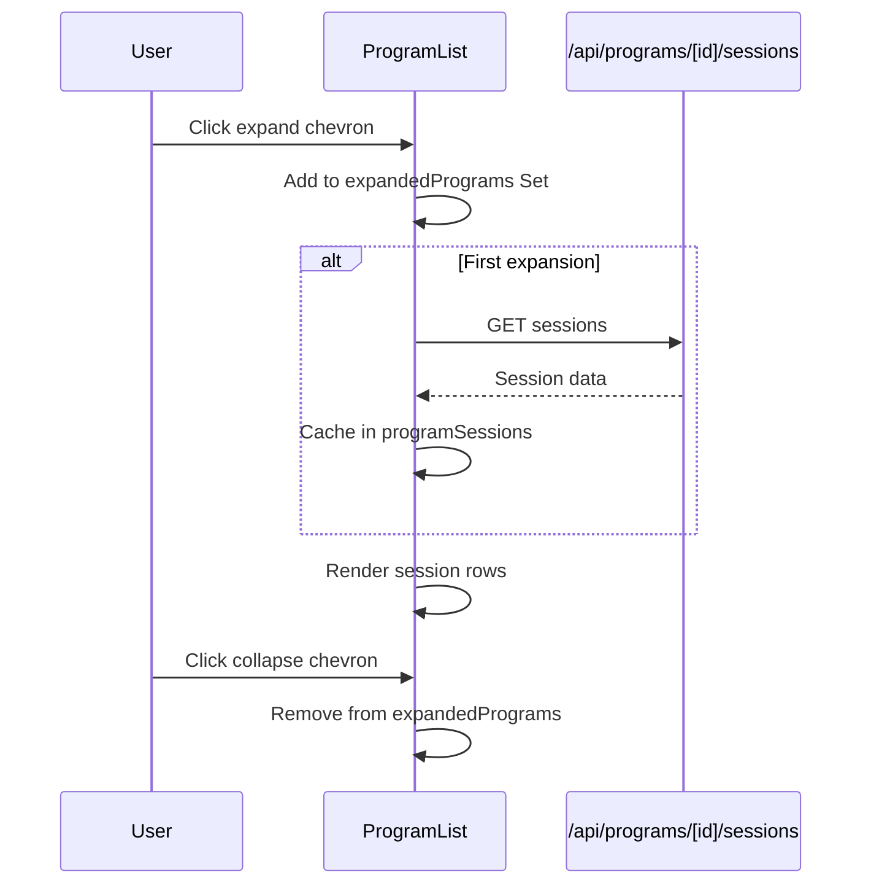
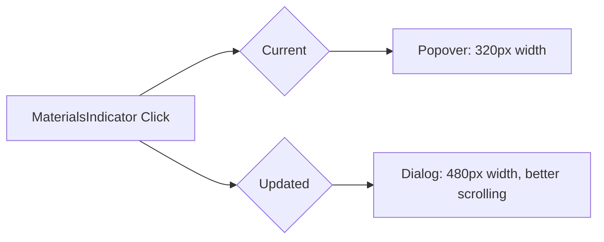
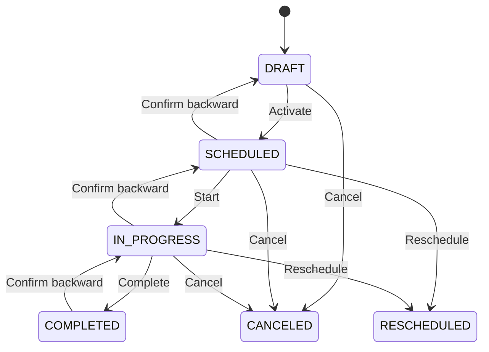
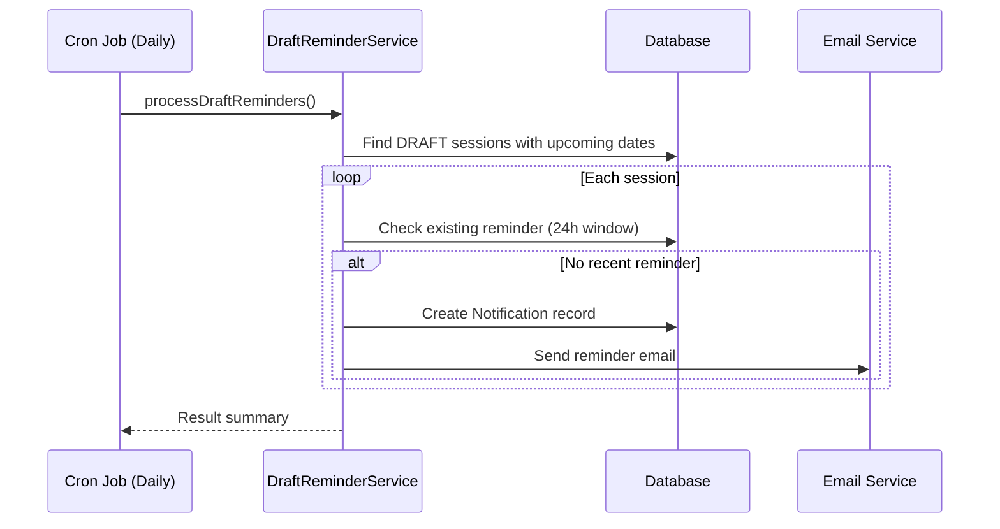

# Track B: Program Page UX Specification

**Tickets**: PX-721, PX-722, PX-723, PX-724, PX-725, PX-726
**Status**: Mostly Complete (1 minor update needed)
**Spec Date**: 2026-02-15

## Overview

Track B focuses on improving the Program Page user experience with session management, materials access, status tracking, and progress visualization. **All features are implemented** with one minor enhancement: converting the materials quick-view from popover to modal dialog.

---

## Feature Summary

| Ticket | Feature | Status | Location |
|--------|---------|--------|----------|
| PX-721 | Session Dropdown in Table Row | ✅ Complete | `src/components/programs/program-list.tsx` |
| PX-722 | Quick-View Materials | ⚠️ Popover→Modal | `src/components/programs/materials-quick-view.tsx` |
| PX-723 | Session Status History | ✅ Complete | `src/lib/services/session-status-history.ts` |
| PX-724 | Inline Quick-Status Update | ✅ Complete | `src/components/programs/session-status-dropdown.tsx` |
| PX-725 | Draft Status Reminders | ✅ Complete | `src/lib/services/draft-reminders.ts` |
| PX-726 | Session Progress Display | ✅ Complete | `src/components/programs/session-progress-badge.tsx` |

---

## PX-721: Session Dropdown in Table Row

### Implementation Details
- **Component**: `program-list.tsx`
- **Behavior**: Click chevron to expand/collapse program row
- **Data Loading**: Lazy-load sessions on first expand
- **State Management**: `expandedPrograms` Set and `programSessions` Record

### User Flow


### Key Code
```typescript
// Toggle expansion with lazy loading
const toggleProgramExpansion = useCallback((programId: string, event: React.MouseEvent) => {
  event.stopPropagation();
  setExpandedPrograms((prev) => {
    const next = new Set(prev);
    if (next.has(programId)) {
      next.delete(programId);
    } else {
      next.add(programId);
      fetchSessionsForProgram(programId); // Lazy load
    }
    return next;
  });
}, [fetchSessionsForProgram]);
```

---

## PX-722: Quick-View Materials

### Current Implementation
- **Component**: `materials-quick-view.tsx`
- **Current UX**: Popover on click
- **Requested UX**: Modal dialog for larger preview area

### Enhancement Required
Convert from `Popover` to `Dialog` component:



### Changes
1. Replace `Popover` with `Dialog` from shadcn/ui
2. Add preview capability for images/PDFs
3. Keep lazy-loading behavior on open
4. Add "Open in new tab" action per material

---

## PX-723: Session Status History

### Implementation Details
- **Service**: `src/lib/services/session-status-history.ts`
- **API**: `GET /api/sessions/[sessionId]/status-history`
- **Database**: `SessionStatusHistory` model in Prisma

### Schema
```prisma
model SessionStatusHistory {
  id              String        @id @default(cuid())
  sessionId       String
  session         ProgramSession @relation(...)
  oldStatus       SessionStatus?
  newStatus       SessionStatus
  changedById     String
  changedBy       User          @relation(...)
  changedAt       DateTime      @default(now())
  reason          String?
  rescheduledToId String?
}
```

### Service Functions
- `recordStatusChange()` - Records history entry + audit log if PHI involved
- `getSessionStatusHistory()` - Retrieves timeline for a session
- `updateSessionStatus()` - Transactional update + history recording

---

## PX-724: Inline Quick-Status Update

### Implementation Details
- **Component**: `session-status-dropdown.tsx`
- **Behavior**: Click badge → dropdown menu → select status
- **Backward Transitions**: Require confirmation dialog with optional reason

### Status State Machine


### Backward Transition Confirmation
```typescript
const BACKWARD_TRANSITIONS: Record<SessionStatus, SessionStatus[]> = {
  DRAFT: [],
  SCHEDULED: [SessionStatus.DRAFT],
  IN_PROGRESS: [SessionStatus.DRAFT, SessionStatus.SCHEDULED],
  COMPLETED: [SessionStatus.DRAFT, SessionStatus.SCHEDULED, SessionStatus.IN_PROGRESS],
  CANCELED: [],
  RESCHEDULED: [],
};
```

---

## PX-725: Draft Status Activation Reminders

### Implementation Details
- **Service**: `src/lib/services/draft-reminders.ts`
- **Cron**: `POST /api/cron/draft-reminders`
- **Notification**: In-app + Email

### Reminder Thresholds
- **7 days** before session date
- **3 days** before session date
- **1 day** before session date (urgent)

### Notification Flow


### Auto-Dismiss
When a session is activated (DRAFT → any other status):
```typescript
// In status update route
if (oldStatus === SessionStatus.DRAFT && newStatus !== SessionStatus.DRAFT) {
  await dismissSessionReminders(sessionId);
}
```

---

## PX-726: Session Completion Progress Display

### Implementation Details
- **Component**: `session-progress-badge.tsx`
- **Format**: `{completed}/{total}` with color coding

### Visual Design
| Progress | Color | Example |
|----------|-------|---------|
| 0-24% | Gray (secondary) | 0/8 |
| 25-49% | Amber | 2/8 |
| 50-74% | Blue | 4/8 |
| 75-99% | Green | 6/8 |
| 100% | Emerald with checkmark | ✓ 8/8 |

### Tooltip
Shows: `"3 of 8 sessions completed (37%)"`
At 100%: `"All sessions completed"`

---

## Outstanding Work

### PX-722: Convert Popover to Modal Dialog

**Task**: Update `materials-quick-view.tsx` to use Dialog instead of Popover

**Acceptance Criteria**:
1. Click materials indicator opens modal dialog (not popover)
2. Modal is centered with overlay backdrop
3. Modal width: 480px (vs current 320px popover)
4. Max height with scroll for long material lists
5. Preview support for images (inline)
6. Open in new tab action for all materials
7. Close via X button, backdrop click, or Escape key
8. Lazy-load materials on modal open (preserve current behavior)

---

## Files Modified

### Existing Files (no changes needed)
- `src/components/programs/program-list.tsx` - PX-721
- `src/components/programs/session-status-dropdown.tsx` - PX-724
- `src/components/programs/session-progress-badge.tsx` - PX-726
- `src/lib/services/session-status-history.ts` - PX-723
- `src/lib/services/draft-reminders.ts` - PX-725
- `src/app/api/sessions/[sessionId]/status/route.ts` - PX-724
- `src/app/api/sessions/[sessionId]/status-history/route.ts` - PX-723
- `src/app/api/cron/draft-reminders/route.ts` - PX-725

### File to Update
- `src/components/programs/materials-quick-view.tsx` - PX-722 (popover → modal)

---

## Decisions Made

1. **Lazy Loading for Sessions**: Chosen to reduce initial page load; sessions cached after first expand
2. **Backward Transition Confirmation**: Optional reason (not required) to balance UX vs audit needs
3. **Draft Reminder Thresholds**: 7/3/1 days provides escalating urgency without being annoying
4. **Progress Badge Colors**: Follow accessibility guidelines with sufficient contrast ratios
5. **Materials Modal**: Larger format allows better preview and multi-material management

---

## Deferred Items

- **Material preview in modal**: Full PDF/image preview could be added later; current scope is list with download
- **Bulk session status updates**: Not in scope; update one session at a time
- **Push notifications for reminders**: Only in-app + email; mobile push deferred

---

## Learnings

1. Most Track B features were already implemented during previous development cycles
2. The existing program infrastructure is robust with good separation of concerns
3. Status history with audit logging provides HIPAA compliance for session management
4. Notification system is mature with in-app + email + auto-dismiss on action
