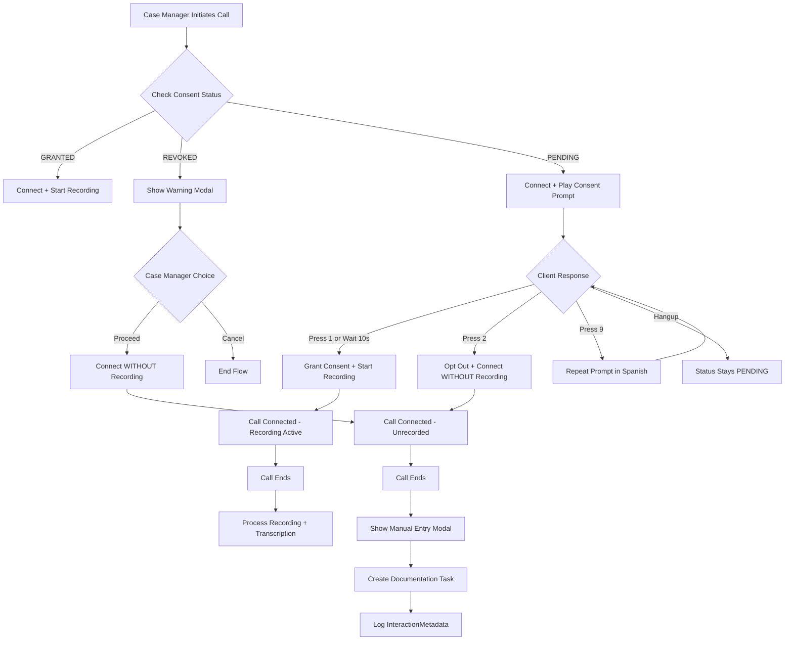
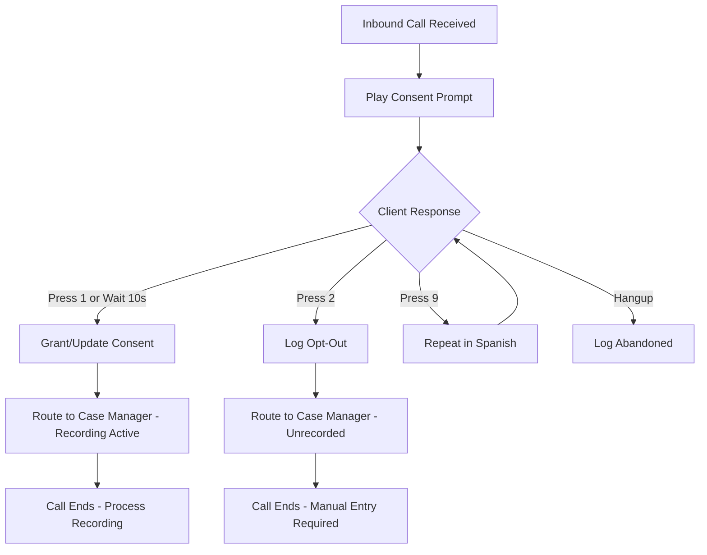
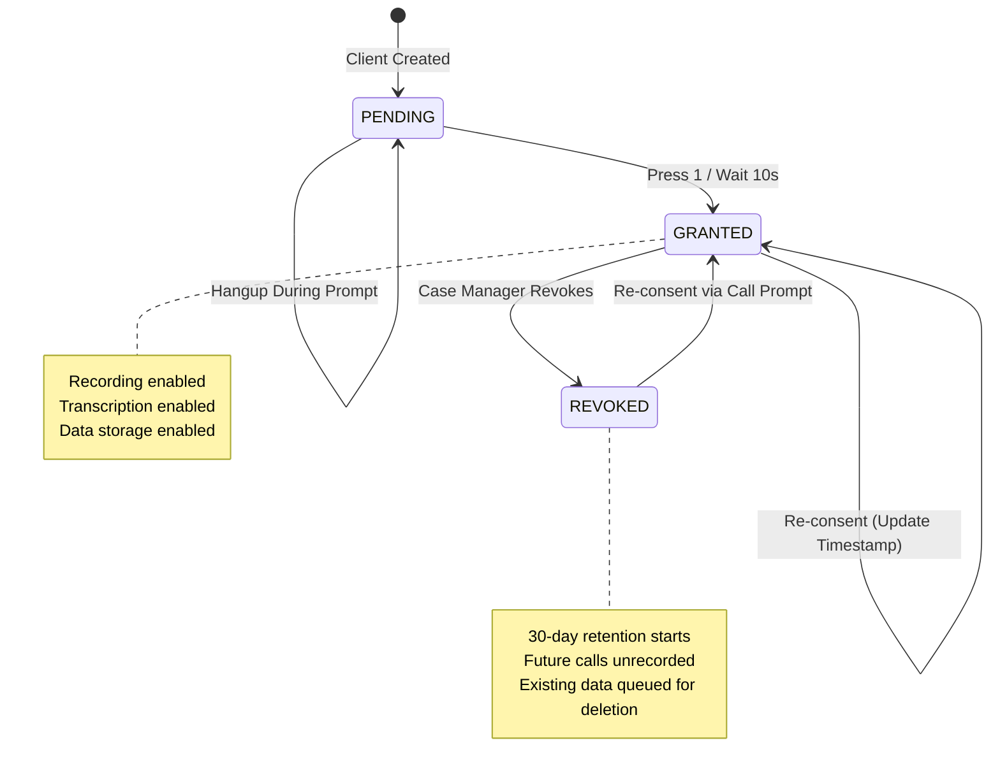

# PX-735: Recording Consent & Opt-Out Framework

> **Status**: Spec Complete
> **Priority**: Urgent (Launch Blocker)
> **Estimate**: ~5 dev days
> **Linear**: [PX-735](https://linear.app/phoenixing/issue/PX-735/recording-consent-and-opt-out-framework)

---

## 1. Overview

### What We're Building

A consent framework that ensures documented consent is obtained before any VoIP call recording or transcription occurs. California is a two-party consent state, making this a legal prerequisite for VoIP calling to go live.

### Why It Matters

- **Legal Requirement**: California Penal Code Section 632 requires all-party consent for recording confidential communications
- **HIPAA Compliance**: PHI protection requires documented consent for recording health-related conversations
- **Trust**: Clients must feel safe knowing they control what's recorded

### Key Principles

1. **Opt-out ≠ Opt-out of service** - Declining recording never blocks service delivery
2. **Immutable audit trail** - All consent events are logged to hash-chain audit system
3. **Single toggle** - One consent covers recording + transcription + storage (not granular)
4. **Never expires** - Consent remains valid until explicitly revoked

---

## 2. User Stories

### US-1: Case Manager Makes Outbound Call to New Client

**As a** case manager
**I want** the system to automatically gather consent before recording
**So that** I'm legally compliant without manual consent tracking

**Acceptance Criteria:**
- [ ] When I initiate a call to a client without prior consent, an automated prompt plays
- [ ] Prompt is in English with Spanish option (press 9 to hear in Spanish)
- [ ] Client pressing 1 or staying on line for 10 seconds grants consent
- [ ] Client pressing 2 opts out - call connects without recording
- [ ] I see real-time indication of consent status during the call
- [ ] Consent event is logged to client profile with timestamp and method

### US-2: Case Manager Calls Client Who Previously Consented

**As a** case manager
**I want** the system to remember prior consent
**So that** returning clients aren't asked repeatedly

**Acceptance Criteria:**
- [ ] System checks consent status before connecting
- [ ] If consent exists and not revoked, recording starts immediately
- [ ] Brief "Recording Active" indicator shown to case manager
- [ ] No consent prompt played to client

### US-3: Case Manager Calls Client Who Previously Opted Out

**As a** case manager
**I want** to be warned before calling a client who opted out
**So that** I'm prepared for manual documentation

**Acceptance Criteria:**
- [ ] Warning modal appears: "[Client Name] has opted out of recording"
- [ ] Modal shows options: "Proceed Unrecorded" or "Cancel"
- [ ] If proceeding, call connects without recording
- [ ] No consent prompt replayed (consent is auto-prompted on every inbound call instead)

### US-4: Case Manager Completes Unrecorded Call

**As a** case manager
**I want** to be reminded to document the call manually
**So that** critical information isn't lost

**Acceptance Criteria:**
- [ ] Blocking modal appears after call ends: "This call was not recorded"
- [ ] Modal prompts: "Please complete your notes and relevant forms"
- [ ] A documentation task is created in case manager's queue
- [ ] InteractionMetadata record created (date, time, duration, participants - no content)

### US-5: Client Calls Inbound to Organization

**As a** client calling into the organization
**I want** to hear a consent disclosure before speaking with anyone
**So that** I know my call may be recorded

**Acceptance Criteria:**
- [ ] Consent prompt plays for ALL inbound calls (regardless of prior consent)
- [ ] Same press-1-or-wait/press-2-to-opt-out flow as outbound
- [ ] If consent granted, call routes to appropriate case manager with recording
- [ ] If opted out, call routes without recording

### US-6: Case Manager Views Client Consent Status

**As a** case manager
**I want** to see consent status on the client profile
**So that** I know what to expect before calling

**Acceptance Criteria:**
- [ ] Badge in client header shows: "Recording Consent: Granted" (green) or "Opted Out" (amber) or "Not Yet" (gray)
- [ ] Clicking badge opens Consent & Privacy section
- [ ] Section shows consent history timeline with dates and methods
- [ ] If revoked, shows who processed the revocation and when

### US-7: Case Manager Revokes Consent on Client Request

**As a** case manager
**I want** to revoke a client's consent when they request it
**So that** future calls with them are unrecorded

**Acceptance Criteria:**
- [ ] "Revoke Consent" button available on client profile (requires confirmation)
- [ ] All future calls with this client skip recording automatically
- [ ] Existing recordings enter 30-day retention queue (soft delete)
- [ ] Revocation event logged to audit trail with actor and timestamp

### US-8: Client Hangs Up During Consent Prompt

**As a** system
**I want** to handle abandoned consent prompts correctly
**So that** we don't assume consent when none was given

**Acceptance Criteria:**
- [ ] If call disconnects during consent prompt, consent status remains PENDING
- [ ] No InteractionMetadata created (call never connected)
- [ ] Case manager notified that consent wasn't captured if they initiated the call
- [ ] Case manager must call again to complete consent flow

---

## 3. User Flows

### 3.1 Outbound Call Flow



### 3.2 Inbound Call Flow



### 3.3 Consent State Machine



---

## 4. Technical Design

### 4.1 Architecture Overview

```mermaid
flowchart TB
    subgraph "Browser (Case Manager)"
        CM[Call Interface]
        CP[Client Profile]
    end

    subgraph "Next.js API"
        CALLS[/api/calls]
        CONSENT[/api/clients/:id/consent]
        HOOKS[Twilio Webhooks]
    end

    subgraph "Services"
        CS[consent.ts]
        CLS[calls.ts]
        TWL[call-manager.ts]
    end

    subgraph "Twilio"
        TW_CALL[Twilio Call]
        TW_REC[Recording]
    end

    subgraph "Database"
        CLIENT[(Client)]
        CONSENT_REC[(ConsentRecord)]
        CALL[(Call)]
        INTERACT[(InteractionMetadata)]
    end

    CM --> CALLS
    CP --> CONSENT

    CALLS --> CLS
    CLS --> CS
    CLS --> TWL

    TWL --> TW_CALL
    TW_CALL --> TW_REC
    TW_CALL --> HOOKS

    HOOKS --> CS
    HOOKS --> CLS

    CS --> CONSENT_REC
    CLS --> CALL
    CLS --> INTERACT

    CONSENT_REC --> CLIENT
```

### 4.2 Database Changes

#### New Table: InteractionMetadata

For logging opted-out calls without any content:

```prisma
// PX-735: Interaction metadata for unrecorded calls
model InteractionMetadata {
  id            String   @id @default(cuid())
  clientId      String
  caseManagerId String
  orgId         String

  interactionType InteractionType @default(VOIP_CALL)
  direction       CallDirection   @default(OUTBOUND)

  startedAt     DateTime
  endedAt       DateTime?
  durationSeconds Int?

  // Why was it unrecorded?
  reason        UnrecordedReason

  createdAt     DateTime @default(now())

  // Relations
  client        Client   @relation(fields: [clientId], references: [id], onDelete: Cascade)
  caseManager   User     @relation(fields: [caseManagerId], references: [id])
  organization  Organization @relation(fields: [orgId], references: [id])

  @@index([clientId])
  @@index([caseManagerId])
  @@index([orgId, startedAt])
}

enum InteractionType {
  VOIP_CALL
  IN_PERSON
  VIDEO_CALL
}

enum CallDirection {
  INBOUND
  OUTBOUND
}

enum UnrecordedReason {
  CLIENT_OPT_OUT     // Client pressed 2
  PRIOR_OPT_OUT      // Client had revoked consent
  SYSTEM_ERROR       // Recording failed
  MANUAL_OVERRIDE    // Case manager chose not to record
}
```

#### Existing Model Updates

**ConsentRecord** - Already exists, minor additions:

```prisma
model ConsentRecord {
  // ... existing fields ...

  // Add: Track which languages consent was given in
  languageCode  String @default("en") // "en", "es", etc.

  // Add: For compliance reporting
  promptVersion String @default("v1") // Track prompt script versions
}
```

**Call** - Add consent tracking fields:

```prisma
model Call {
  // ... existing fields ...

  // Add: Track consent state at time of call
  consentGrantedAt DateTime?
  consentMethod    ConsentCollectionMethod?
  isRecorded       Boolean @default(true)
}
```

### 4.3 API Contracts

#### POST /api/calls - Initiate Call (Updated)

**Request:**
```typescript
interface InitiateCallRequest {
  clientId: string;
  formIds: string[];
}
```

**Response (consent needed):**
```typescript
interface InitiateCallResponse {
  callId: string;
  status: "CONNECTING" | "CONSENT_PENDING";
  consentStatus: "GRANTED" | "REVOKED" | "PENDING";

  // If REVOKED, client has warning modal data
  warning?: {
    type: "CONSENT_REVOKED";
    message: string;
    clientName: string;
    revokedAt: string;
  };
}
```

#### POST /api/webhooks/twilio/consent - Consent Response Handler

**Request (from Twilio):**
```typescript
interface ConsentWebhookRequest {
  CallSid: string;
  Digits: string; // "1", "2", "9", or ""
  callId: string; // Our call ID
  clientId: string;
}
```

**Response (TwiML):**
```xml
<!-- If consent granted (1 or timeout) -->
<Response>
  <Say voice="Polly.Joanna">Thank you. Your call is being connected.</Say>
  <Dial recordingStatusCallback="...">
    <Number>+1234567890</Number>
  </Dial>
</Response>

<!-- If opted out (2) -->
<Response>
  <Say voice="Polly.Joanna">Understood. Your call will not be recorded.</Say>
  <Dial>
    <Number>+1234567890</Number>
  </Dial>
</Response>

<!-- If Spanish requested (9) -->
<Response>
  <Gather numDigits="1" action="/api/webhooks/twilio/consent?lang=es">
    <Say voice="Polly.Lupe" language="es-US">
      Esta llamada puede ser grabada y transcrita...
    </Say>
  </Gather>
</Response>
```

#### GET /api/clients/[clientId]/consent - Get Consent Status

**Response:**
```typescript
interface ConsentStatusResponse {
  recording: {
    status: "GRANTED" | "REVOKED" | "PENDING";
    grantedAt: string | null;
    method: "KEYPRESS" | "VERBAL" | "WRITTEN" | "SILENCE_TIMEOUT" | null;
    revokedAt: string | null;
    revokedBy: { id: string; name: string } | null;
  };
  history: Array<{
    action: "GRANTED" | "REVOKED";
    timestamp: string;
    method: string;
    actor: string;
  }>;
}
```

#### POST /api/clients/[clientId]/consent/revoke - Revoke Consent

**Request:**
```typescript
interface RevokeConsentRequest {
  reason?: string;
}
```

**Response:**
```typescript
interface RevokeConsentResponse {
  success: boolean;
  recordingsMarkedForDeletion: number;
  retentionUntil: string; // ISO date, 30 days from now
}
```

### 4.4 Component Structure

```
src/
├── app/
│   ├── api/
│   │   ├── calls/
│   │   │   └── route.ts              # Updated: Add consent check
│   │   ├── clients/
│   │   │   └── [clientId]/
│   │   │       └── consent/
│   │   │           └── route.ts      # Existing: GET/POST consent
│   │   │           └── revoke/
│   │   │               └── route.ts  # NEW: Revoke endpoint
│   │   └── webhooks/
│   │       └── twilio/
│   │           └── consent/
│   │               └── route.ts      # NEW: Consent DTMF handler
│
├── components/
│   ├── clients/
│   │   ├── ConsentBadge.tsx          # NEW: Header badge
│   │   ├── ConsentSection.tsx        # NEW: Profile section
│   │   ├── ConsentHistoryTimeline.tsx # NEW: History view
│   │   └── RevokeConsentDialog.tsx   # NEW: Revocation modal
│   │
│   └── calls/
│       ├── ConsentWarningModal.tsx   # NEW: Pre-call warning
│       ├── UnrecordedCallModal.tsx   # NEW: Post-call reminder
│       └── RecordingIndicator.tsx    # NEW: During-call indicator
│
├── lib/
│   ├── services/
│   │   └── consent.ts                # Existing: Minor updates
│   │   └── interaction-metadata.ts   # NEW: Unrecorded call logging
│   │
│   └── twilio/
│       └── call-manager.ts           # Existing: Add consent flow
│       └── consent-twiml.ts          # NEW: TwiML generators
```

### 4.5 Consent Prompt Scripts

**English (v1):**
```
This call may be recorded and transcribed to better serve you.

Press 1, or stay on the line, to accept.
Press 2 to opt out of recording.
Press 9 to hear this message in Spanish.
```

**Spanish (v1):**
```
Esta llamada puede ser grabada y transcrita para servirle mejor.

Presione 1, o permanezca en la línea, para aceptar.
Presione 2 para optar por no grabar.
```

**Voice Configuration:**
- English: `Polly.Joanna` (neural)
- Spanish: `Polly.Lupe` (neural, Mexican Spanish)
- Speed: Normal (default)
- Timeout: 10 seconds after prompt ends

---

## 5. Security Considerations

### 5.1 Audit Logging Requirements

| Event | Audit Action | Severity |
|-------|-------------|----------|
| Consent granted via keypress | CREATE | MEDIUM |
| Consent granted via timeout | CREATE | MEDIUM |
| Consent revoked | DELETE | HIGH |
| Recording started | CREATE | MEDIUM |
| Unrecorded call logged | CREATE | MEDIUM |
| Consent status viewed | VIEW | LOW |

### 5.2 Data Protection

- **Consent records are append-only** - Cannot be modified, only superseded
- **Hash-chain integrity** - All consent events included in audit chain
- **30-day retention on revocation** - Soft delete with configurable retention
- **Recording deletion** - S3 objects queued for deletion on consent revocation

### 5.3 Authorization

| Action | Required Permission |
|--------|---------------------|
| View consent status | `canViewClients` (any assigned client) |
| Revoke consent | `canEditClients` (any assigned client) |
| View consent audit log | `canViewAuditLogs` (admins only) |

---

## 6. Success Metrics & Hypotheses

### Metrics to Track

| Metric | Target | How Measured |
|--------|--------|--------------|
| Consent grant rate | ≥85% | (Granted / Total Prompts) |
| Consent prompt abandonment | ≤10% | (Hangups during prompt / Total Prompts) |
| Average time to conversation | ≤20s | (Call connected - Call initiated) |
| Compliance rate | 100% | (Calls with consent / Recorded calls) |
| Manual documentation completion | ≥90% | (Tasks completed / Tasks created) |

### Hypotheses

1. **H1**: Clients will accept recording at 85%+ rate because the prompt is clear and non-coercive
2. **H2**: Case managers will complete manual documentation tasks 90%+ of the time because the blocking modal creates accountability
3. **H3**: The 10-second silence timeout will not significantly increase false-consent grants because most opt-outs are intentional

---

## 7. Decisions Made

| Decision | Rationale | Alternatives Considered |
|----------|-----------|------------------------|
| Single consent toggle | Simpler UX, granular consent creates confusion | Granular (recording/transcription/storage separate) |
| Always prompt inbound calls | Caller ID can be spoofed, safer to always verify | Phone number matching with fallback |
| 10-second timeout | Industry standard for IVR, balances UX vs legal risk | 5s (too fast), 15s (too slow) |
| New InteractionMetadata table | Clean separation from recorded calls | Flag on existing Call table |
| Twilio Polly TTS | Free with Twilio, supports Spanish, easy to update | Pre-recorded audio, ElevenLabs |
| Never expires consent | Reduces friction for returning clients | Annual refresh, org configurable |
| No manual consent override | Ensures all consent is verifiable via call recording | Admin override with justification |

---

## 8. Deferred Items

| Item | Reason | Phase |
|------|--------|-------|
| Multi-state consent rules (PX-736) | Schema supports it, logic can be added later | Phase 2 |
| Chatbot consent | Separate feature, not blocking VoIP launch | Phase 1 (different ticket) |
| Vietnamese/Chinese/Korean prompts | Start with English+Spanish, expand based on user demographics | Post-launch |
| Consent analytics dashboard | Focus on core functionality first | Phase 2 |
| Re-consent reminder workflow | Edge case for now | Post-launch |

---

## 9. Open Questions

| Question | Status | Owner |
|----------|--------|-------|
| Legal review of consent prompt language | PENDING | Legal counsel |
| Accessibility audit for hearing impaired | PENDING | Product |
| Recording retention policy for revoked consent (30 days vs org configurable) | DECIDED: 30 days fixed | Engineering |

---

## 10. Learnings

1. **Existing code is solid** - The consent service (`src/lib/services/consent.ts`) already handles grant/revoke/check logic with proper audit logging. The gap is Twilio integration, not core logic.

2. **TwiML flow is well-designed** - `generateConsentTwiML()` exists but isn't wired into the call flow. Integration is straightforward.

3. **InteractionMetadata provides clean separation** - Using a separate table for unrecorded calls avoids polluting the Call table with nullable fields and keeps the data model clear.

4. **Single toggle simplifies compliance** - Granular consent would require tracking which specific features were consented to per call, significantly increasing complexity for minimal user benefit.

---

## Implementation Order

1. **Day 1**: Write tests for existing consent service, verify it works
2. **Day 1-2**: Create InteractionMetadata model and service
3. **Day 2-3**: Build Twilio consent webhook handler and TwiML generators
4. **Day 3-4**: Wire consent check into call initiation flow
5. **Day 4**: Build UI components (badge, section, modals)
6. **Day 5**: Integration testing, edge case handling, polish

---

## Related Tickets

- **PX-683**: VoIP Calling (BLOCKED by this ticket)
- **PX-736**: Multi-State Consent Registry (BUILDS on this ticket)
- **PX-728**: Cross-Role Unified Activity Feed (consent events should appear)
