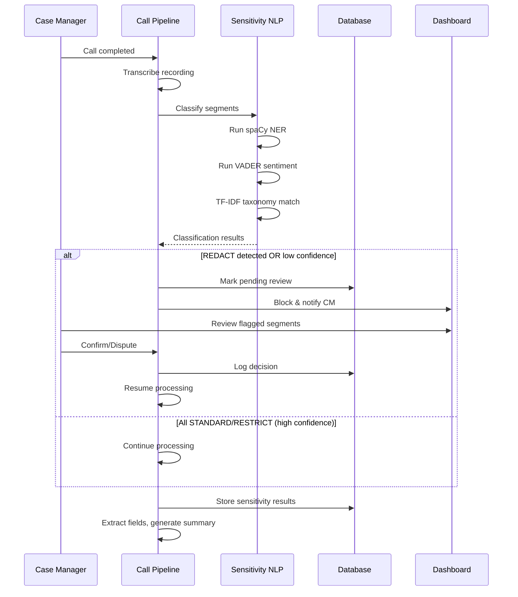
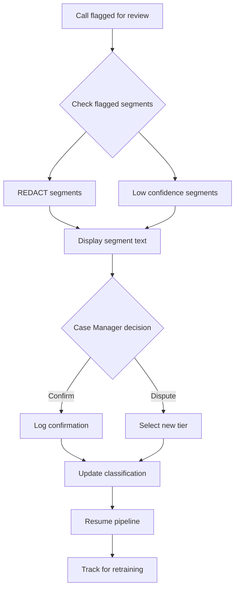
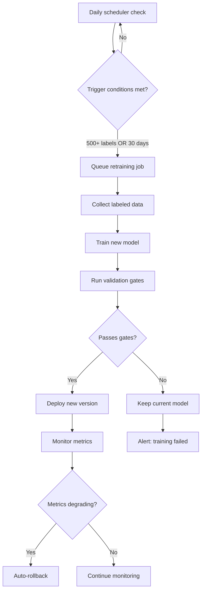

# PX-878: Sensitivity Detection NLP — Tiered Content Classifier PRD

**Version:** 1.0.0 | **Created:** 2026-03-28 | **Owner:** Valerie Phoenix
**Status:** Draft
**Linear Ticket:** PX-878

---

## 1. Problem Statement

### The Challenge
When processing call transcripts, Inkra captures everything—including personal conversations, sensitive HR discussions, and off-topic banter. Currently, all content flows through the same pipeline without differentiation, creating three problems:

1. **Privacy Risk**: Personal struggles, gossip, and non-work conversations get stored and processed alongside legitimate work content
2. **Compliance Risk**: Sensitive business content (HR actions, legal discussions, M&A) requires access controls that don't exist
3. **Workflow Pollution**: Standard workflows receive irrelevant content, reducing signal quality

### Hypothesis
By automatically classifying transcript segments into three tiers (Redact, Restrict, Standard), we can:
- Protect user privacy by flagging personal content for removal
- Enforce access controls on sensitive business content
- Improve workflow quality by routing only relevant content
- Reduce manual review burden while maintaining human oversight for critical decisions

### Success Criteria
- **Accuracy**: ≥85% classification accuracy across all tiers
- **Review Rate**: <15% of segments require human review
- **Pipeline Impact**: <500ms added latency to call processing
- **Adoption**: >80% of flagged REDACT content confirmed by users

---

## 2. User Stories

### US-878-1: Case Manager Views Sensitivity Flags
**As a** case manager
**I want** to see which parts of my call transcript contain sensitive or personal content
**So that** I can review and confirm appropriate handling before data flows to workflows

**Acceptance Criteria:**
- [ ] Transcript view shows tier badges (REDACT/RESTRICT/STANDARD) per segment
- [ ] Low-confidence classifications (<70%) are highlighted for review
- [ ] I can click to expand and see the flagged segment text
- [ ] Confidence score displayed alongside each classification

### US-878-2: Case Manager Reviews REDACT Content
**As a** case manager
**I want** to review content flagged for redaction before it's permanently removed
**So that** I can prevent accidental deletion of important information

**Acceptance Criteria:**
- [ ] REDACT-flagged calls are blocked from further processing until reviewed
- [ ] Review interface shows flagged segments with original text
- [ ] I can CONFIRM (approve redaction) or DISPUTE (override classification)
- [ ] Disputed content is reclassified to STANDARD or RESTRICT as I specify
- [ ] After review, processing resumes automatically

### US-878-3: HR Manager Accesses Restricted Content
**As an** HR manager
**I want** sensitive HR discussions (terminations, compensation, complaints) automatically protected
**So that** only authorized personnel can access this content

**Acceptance Criteria:**
- [ ] RESTRICT-tier content is access-controlled by role
- [ ] Standard case managers cannot view RESTRICT content details
- [ ] Admin/HR roles can view RESTRICT content with audit logging
- [ ] RESTRICT segments show "[Restricted Content]" placeholder to unauthorized users

### US-878-4: Compliance Officer Audits Sensitivity Decisions
**As a** compliance officer
**I want** an audit trail of all sensitivity classifications and human overrides
**So that** I can demonstrate due diligence in content handling

**Acceptance Criteria:**
- [ ] All classifications logged with model version, confidence, timestamp
- [ ] Human review decisions logged with user ID and action taken
- [ ] Disputes tracked separately for model improvement
- [ ] Audit logs are internal-only (not exposed to customers)
- [ ] Reports available showing classification distribution and dispute rates

### US-878-5: System Automatically Retrains Models
**As a** system administrator
**I want** classification models to improve automatically from human feedback
**So that** accuracy increases over time without manual intervention

**Acceptance Criteria:**
- [ ] Retraining triggers at 500 labeled decisions or 30 days
- [ ] New model must pass validation gates before deployment
- [ ] Rollback available if new model underperforms
- [ ] Model versions tracked with metrics history

---

## 3. User Flows

### 3.1 Call Processing with Sensitivity Detection

### 3.2 Human Review Flow

### 3.3 Retraining Pipeline Flow

---

## 4. Competitive Analysis

| Feature | Inkra (PX-878) | Otter.ai | Fireflies.ai | Gong |
|---------|----------------|----------|--------------|------|
| **Content Classification** | 3-tier (Redact/Restrict/Standard) | Basic PII redaction | Manual highlights | Deal-focused tags |
| **Human-in-the-Loop** | Required for REDACT, optional for others | None (auto-redact) | Manual only | Manager review |
| **PHI Detection** | spaCy NER + custom patterns | Limited | Not specialized | Not HIPAA-focused |
| **Access Control by Tier** | Yes, role-based | No tiers | Basic permissions | Team-based |
| **Retraining from Feedback** | Automated pipeline | No | No | Yes (deal outcomes) |
| **HIPAA Compliance** | Purpose-built | Partial | Partial | Enterprise only |
| **Blocking Pipeline** | Yes, for REDACT | No | No | No |

### Competitive Advantages
1. **Purpose-built for sensitive industries**: Healthcare, social services, legal
2. **Human oversight where it matters**: Block pipeline for high-risk content
3. **Continuous improvement**: Automated retraining from user decisions
4. **Compliance-first**: HIPAA-ready audit trails and access controls

---

## 5. Success Metrics

### Primary Metrics

| Metric | Target | Measurement Method |
|--------|--------|-------------------|
| Classification Accuracy | ≥85% | Human review confirmation rate |
| REDACT Precision | ≥90% | True positives / All REDACT flags |
| RESTRICT Precision | ≥85% | True positives / All RESTRICT flags |
| Human Review Rate | <15% | Segments requiring review / Total segments |
| Processing Latency | <500ms | Sensitivity step duration |

### Secondary Metrics

| Metric | Target | Measurement Method |
|--------|--------|-------------------|
| Dispute Rate | <10% | Disputes / Total classifications |
| Model Drift | <5% accuracy drop | Weekly validation against holdout |
| Retraining Success Rate | >90% | Successful deployments / Retraining attempts |
| Time to Review | <2 minutes | Average review completion time |

### Experiment Tracking

**A/B Test Plan:**
1. **Pilot Phase** (Week 1-2): 3 organizations, manual review of all classifications
2. **Beta Phase** (Week 3-4): 10 organizations, review only REDACT and low confidence
3. **GA Phase** (Week 5+): All organizations, production thresholds

**Tracking Events:**
- `sensitivity.detected` — Classification completed
- `sensitivity.confirmed` — User confirmed flag
- `sensitivity.disputed` — User overrode flag
- `sensitivity.review_blocked` — Pipeline blocked pending review
- `sensitivity.model_retrained` — New model deployed
- `sensitivity.model_rolled_back` — Reverted to previous model

---

## 6. MVP vs Future Scope

### MVP (Pilot Target)

| Feature | Status | Notes |
|---------|--------|-------|
| 3-tier classification | Required | REDACT, RESTRICT, STANDARD |
| Confidence scores | Required | Per-segment confidence |
| Human review for REDACT | Required | Block pipeline until reviewed |
| PHI detection | Required | spaCy NER for healthcare |
| Event tracking | Required | Core analytics events |
| Basic audit logging | Required | Internal-only logs |

### Full Scope (All Required for Pilot)

| Feature | Status | Notes |
|---------|--------|-------|
| Base + private instance models | Required | Org-specific customization |
| Retraining pipeline | Required | 500 labels or 30 days trigger |
| Model versioning | Required | Track versions, enable rollback |
| Bias detection | Required | Fairness monitoring |
| Validation gates | Required | Block bad models from deploying |

### Future Enhancements (Post-Pilot)

| Feature | Priority | Notes |
|---------|----------|-------|
| Custom taxonomy per org | P1 | Industry-specific patterns |
| Real-time streaming classification | P2 | Classify during call |
| Multi-language support | P2 | Spanish, French, etc. |
| Confidence calibration UI | P3 | Admin adjustable thresholds |
| Integration with external DLP | P3 | Microsoft Purview, etc. |

---

## 7. Dependencies

### Technical Dependencies
- **Python NLP Service**: New microservice for classification
- **ML Services Spec** (PX-887/897/898): Model registry integration
- **Call Processing Pipeline**: Integration point for sensitivity step

### External Dependencies
- **spaCy models**: en_core_web_lg or similar
- **NLTK/VADER**: Sentiment analysis
- **scikit-learn**: TF-IDF implementation

### Team Dependencies
- **Backend**: Call processing integration
- **Frontend**: Review UI components
- **DevOps**: Python service deployment
- **Compliance**: Audit log requirements validation

---

## 8. Open Questions

1. **Confidence threshold**: What threshold triggers human review? (Suggested: <70%)
2. **RESTRICT access roles**: Which roles should have RESTRICT access by default?
3. **Retention policy**: How long to retain REDACT content before permanent deletion?
4. **Off-peak scheduling**: Which timezone for 2-5 AM retraining window?
5. **Initial training data**: Use synthetic data for v1, then refine with pilot data?

---

## 9. Risks & Mitigations

| Risk | Impact | Likelihood | Mitigation |
|------|--------|------------|------------|
| Low initial accuracy | High | Medium | Start with conservative thresholds, more human review |
| Model bias | High | Medium | Fairness testing, diverse training data |
| Processing latency | Medium | Low | Async classification, batch processing |
| User review fatigue | Medium | Medium | Optimize thresholds to minimize review rate |
| Privacy budget exhaustion | High | Low | Monitor budget, synthetic data fallback |

---

## 10. Appendix

### Tier Definitions

**REDACT (Permanently Remove After Confirmation)**
- Personal struggles, emotional venting
- Gossip about other employees
- Non-work banter and jokes
- Personal medical information not relevant to service
- Off-topic discussions

**RESTRICT (Access-Controlled, Sensitive Business)**
- HR discussions (terminations, performance issues)
- Compensation and salary discussions
- Legal matters and compliance concerns
- M&A or strategic planning
- Complaints and grievances

**STANDARD (Normal Workflow Content)**
- Service delivery discussions
- Client intake information
- Follow-up coordination
- Program enrollment
- Normal work content
