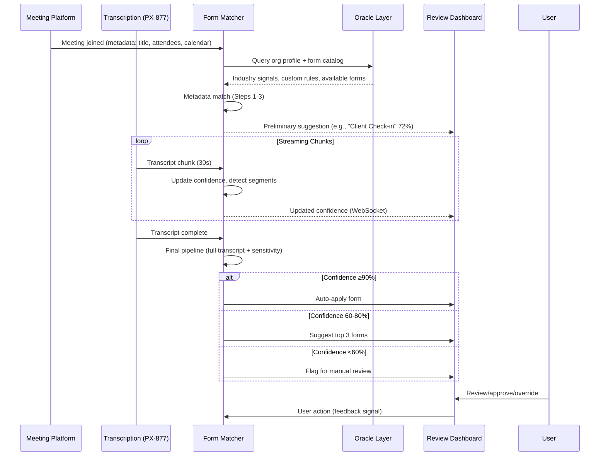
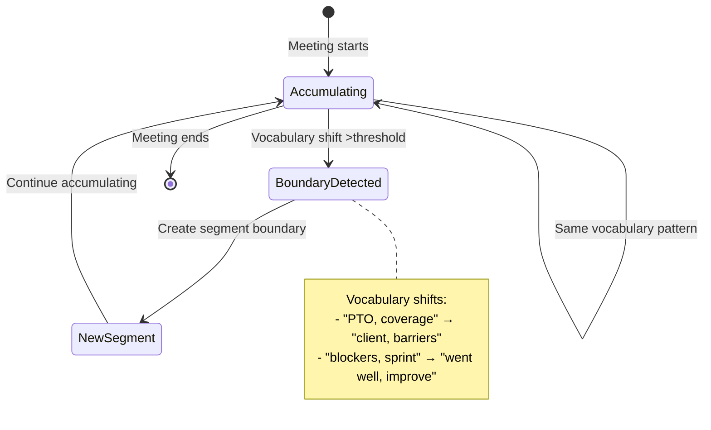
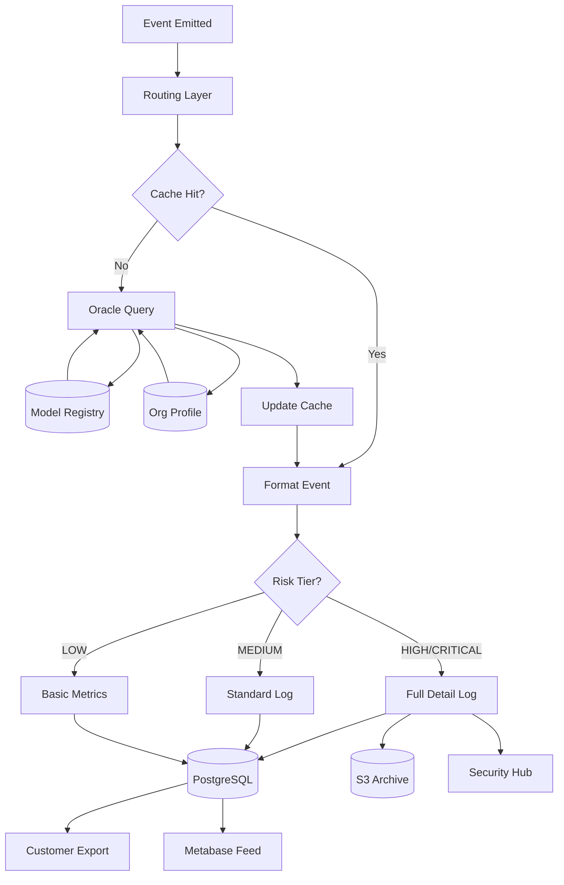
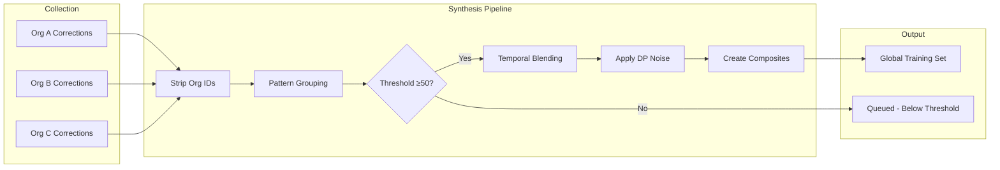
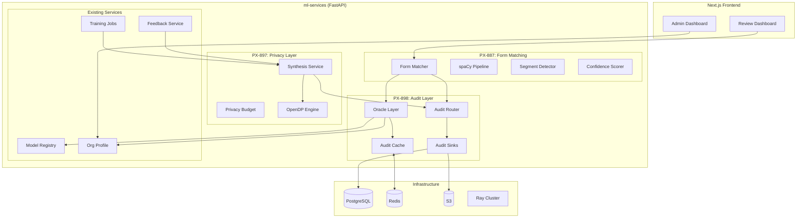
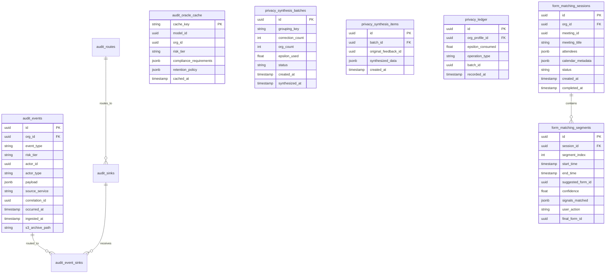
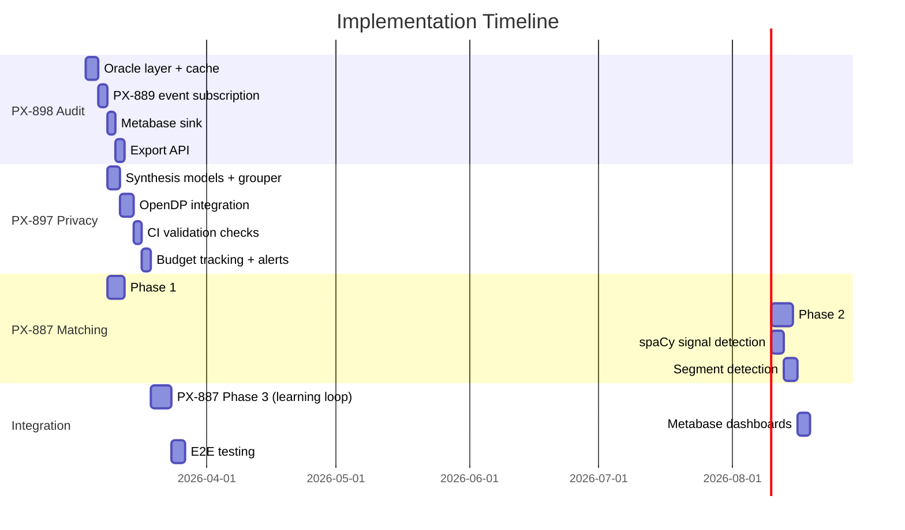

# PX-887, PX-897, PX-898: ML Foundation Services Implementation Spec

**Version:** 1.0.0 | **Created:** 2026-03-04 | **Owner:** Valerie Phoenix

**Tickets:**
- PX-887: Intelligent Form Auto-Detection & Matching Service
- PX-897: Differential Privacy & Data Synthesis Layer
- PX-898: Risk-Tiered Audit Event Schema & Routing Layer

---

## 1. Overview

This spec covers three interconnected ML foundation services that enable Inkra's core value proposition: turning conversations into structured work automatically.

| Service | Purpose | Key Output |
|---------|---------|------------|
| **PX-898** | Unified audit logging with risk-tiered routing | Compliance-ready event stream |
| **PX-897** | Differential privacy for global model training | Synthesized corrections with privacy guarantees |
| **PX-887** | Form auto-detection from meeting transcripts | Confidence-scored form suggestions per segment |

**Implementation Order:** PX-898 → PX-897 → PX-887 (with Phase 1-2 overlap)

---

## 2. User Stories

### PX-898: Audit Routing

**US-898-1:** As a compliance officer, I want all model decisions logged with full context so I can produce audit reports for HIPAA/SOC 2 reviews.
- **AC:** Every `model_inference` event includes model_id, version, confidence, signals used, timestamp
- **AC:** Export to CSV/JSON with date range filtering takes <30s for 100K events

**US-898-2:** As a system architect, I want the audit layer to determine logging detail based on model risk tier and org compliance requirements, not hardcoded logic.
- **AC:** Oracle layer queries model registry + org profile at routing time
- **AC:** Cache invalidation via PX-889 Redis pub/sub within 100ms of profile update

**US-898-3:** As an admin, I want customer-facing logs separate from internal debugging logs so users never see correction quality scores.
- **AC:** Dual log streams with different schemas
- **AC:** Customer logs exportable, internal logs feed Metabase only

### PX-897: Differential Privacy

**US-897-1:** As an enterprise customer, I want contractual guarantees that my org's corrections can't be reverse-engineered from the global model.
- **AC:** All corrections synthesized before entering global training pipeline
- **AC:** Org identifiers stripped, composite examples created from multi-org patterns
- **AC:** Epsilon budget tracked per data cohort with alerts at 80% consumption

**US-897-2:** As a data scientist, I want the synthesis layer to preserve signal quality while adding privacy guarantees.
- **AC:** Synthesized data maintains ≥85% of raw data accuracy on validation set
- **AC:** No single form type degrades below minimum threshold even if overall improves

**US-897-3:** As an org switching from shared to private tier, I want clean data isolation.
- **AC:** Pre-transition corrections remain in global model (already synthesized)
- **AC:** Post-transition corrections are private-only, never enter global pipeline

### PX-887: Form Matching

**US-887-1:** As a case manager, I want Inkra to automatically detect that my Zoom call with a client is an intake meeting and suggest the correct form.
- **AC:** Metadata match (title, attendees) runs when meeting joins, before transcript
- **AC:** Confidence ≥90% auto-applies form; 60-80% shows top 3 suggestions; <60% flags for manual

**US-887-2:** As a program director running mixed meetings (sync → case review → supervision), I want each segment matched to its own form.
- **AC:** Segment boundaries detected when vocabulary shifts
- **AC:** Each segment gets independent form suggestion with confidence score
- **AC:** Industry-aware: nonprofit/tech segment, healthcare stays single-encounter

**US-887-3:** As an admin, I want to configure custom signals and matching rules for my org's unique meeting types.
- **AC:** Custom keywords, patterns, weights editable via PX-889 admin UI
- **AC:** Org customizations merge with industry defaults (org takes precedence)

---

## 3. User Flows

### 3.1 Form Matching Flow (PX-887)



### 3.2 Segment Detection Flow



### 3.3 Audit Event Routing (PX-898)



### 3.4 Differential Privacy Synthesis (PX-897)



---

## 4. Technical Architecture

### 4.1 System Architecture



### 4.2 Database Schema



### 4.3 API Contracts

#### PX-898: Audit Events

```yaml
# POST /v1/audit/events (internal)
AuditEventCreate:
  event_type: string  # model_inference, user_override, etc.
  org_id: uuid
  model_id: uuid (optional)
  actor_id: uuid (optional)
  actor_type: enum [user, system, model]
  payload: object
  correlation_id: uuid (optional)
  occurred_at: datetime

# GET /v1/audit/events
AuditEventQuery:
  org_id: uuid (required)
  event_type: string (optional, glob pattern)
  risk_tier: enum (optional)
  start_date: datetime
  end_date: datetime
  page: int
  page_size: int

# POST /v1/audit/export
AuditExportRequest:
  org_id: uuid
  start_date: datetime
  end_date: datetime
  format: enum [csv, json]
  event_types: string[] (optional)
# Returns: { job_id, status_url }
```

#### PX-897: Privacy Synthesis

```yaml
# POST /v1/privacy/synthesis/trigger (internal, from training pipeline)
SynthesisTrigger:
  grouping_key: string  # form_type + action + meeting_type + industry
  correction_ids: uuid[]

# GET /v1/privacy/budget/{org_id}
PrivacyBudgetResponse:
  org_id: uuid
  epsilon_budget: float
  epsilon_consumed: float
  epsilon_remaining: float
  consumption_rate_30d: float
  projected_exhaustion_date: datetime (optional)
  is_exhausted: boolean

# GET /v1/privacy/synthesis/batches
SynthesisBatchList:
  status: enum [pending, processing, completed, failed]
  created_after: datetime
  page: int
```

#### PX-887: Form Matching

```yaml
# POST /v1/matching/sessions
FormMatchingSessionCreate:
  org_id: uuid
  meeting_id: uuid
  meeting_title: string
  attendees: object[]
  calendar_metadata: object (optional)

# POST /v1/matching/sessions/{id}/chunks
TranscriptChunk:
  text: string
  speaker_id: string
  start_time: float
  end_time: float

# GET /v1/matching/sessions/{id}
FormMatchingSessionResponse:
  id: uuid
  status: enum [pending, analyzing, completed]
  segments: Segment[]

Segment:
  segment_index: int
  start_time: datetime
  end_time: datetime
  suggested_forms: FormSuggestion[]
  confidence: float
  signals_matched: object

FormSuggestion:
  form_id: uuid
  form_name: string
  confidence: float
  rank: int
```

---

## 5. Component Structure

### 5.1 Directory Layout

```
ml-services/src/
├── audit/                    # PX-898 (existing, extend)
│   ├── models.py            # Add: audit_oracle_cache table
│   ├── schemas.py           # Add: export schemas
│   ├── router.py            # Add: export endpoint
│   ├── service.py           # Extend: oracle integration
│   ├── oracle.py            # NEW: Oracle layer with cache
│   ├── sinks/
│   │   ├── postgres.py
│   │   ├── s3.py
│   │   ├── security_hub.py
│   │   └── metabase.py      # NEW: Metabase sink
│   └── export.py            # NEW: CSV/JSON export service
│
├── privacy/                  # PX-897 (new module)
│   ├── __init__.py
│   ├── models.py            # synthesis_batches, synthesis_items
│   ├── schemas.py
│   ├── router.py
│   ├── service.py           # Main synthesis orchestration
│   ├── synthesis/
│   │   ├── grouper.py       # Pattern grouping logic
│   │   ├── noise.py         # OpenDP integration
│   │   └── composer.py      # Composite example creation
│   ├── budget.py            # Epsilon tracking & alerts
│   └── validation.py        # CI checks (org ID stripping, etc.)
│
├── form_matching/            # PX-887 (new module)
│   ├── __init__.py
│   ├── models.py            # sessions, segments
│   ├── schemas.py
│   ├── router.py
│   ├── service.py           # Main matching orchestration
│   ├── pipeline/
│   │   ├── metadata.py      # Step 1-3: org profile, industry, metadata
│   │   ├── transcript.py    # Step 4: keyword/topic analysis
│   │   ├── compliance.py    # Step 5: compliance layer
│   │   └── confidence.py    # Step 6: scoring & routing
│   ├── nlp/
│   │   ├── loader.py        # spaCy model loading (in-process)
│   │   ├── signals.py       # Signal detection from text
│   │   └── segments.py      # Segment boundary detection
│   └── signals/
│       ├── base.py          # Base vocabulary
│       ├── industry.py      # Industry overlays
│       └── custom.py        # Org custom signals
```

### 5.2 spaCy Pipeline Components

```python
# ml-services/src/form_matching/nlp/loader.py

import spacy
from spacy.language import Language

@Language.component("signal_detector")
def signal_detector(doc):
    """Detect domain signals in transcript text."""
    # Keyword matching with weights
    # Pattern matching (case#, MRN, etc.)
    # Returns signal scores in doc._.signals
    pass

@Language.component("segment_detector")
def segment_detector(doc):
    """Detect topic shifts for segment boundaries."""
    # Vocabulary shift detection
    # Returns boundaries in doc._.segment_boundaries
    pass

def load_matching_pipeline():
    """Load spaCy pipeline with custom components."""
    nlp = spacy.load("en_core_web_md")  # Medium model for embeddings
    nlp.add_pipe("signal_detector", last=True)
    nlp.add_pipe("segment_detector", last=True)
    return nlp
```

---

## 6. Security Considerations

### 6.1 PX-898: Audit Layer

| Concern | Mitigation |
|---------|------------|
| Log tampering | Immutable append-only writes, hash chain for S3 archives |
| Unauthorized export | Role-based access (ADMIN only), audit export itself |
| PII in customer logs | Dual logging - internal logs have full detail, customer logs filtered |
| Cache poisoning | Subscribe only to authenticated PX-889 Redis channels |

### 6.2 PX-897: Privacy Layer

| Concern | Mitigation |
|---------|------------|
| Org re-identification | Org IDs stripped before synthesis, 50+ correction minimum |
| Timing attacks | Temporal blending across 7+ day windows |
| Membership inference | OpenDP guarantees with epsilon tracking |
| Data leakage in logs | Synthesis metadata is Inkra-internal only |

### 6.3 PX-887: Form Matching

| Concern | Mitigation |
|---------|------------|
| Prompt injection in transcripts | spaCy pipeline processes structured signals, not raw LLM prompts |
| Incorrect form = wrong data routed | Human approval gate via Review Dashboard before downstream automation |
| HIGH/CRITICAL forms auto-applied wrong | PX-896 tier thresholds bump required confidence for risky forms |

---

## 7. Success Metrics & Hypotheses

### PX-887 Metrics (Metabase Dashboard)

| Metric | Target | Measurement |
|--------|--------|-------------|
| Auto-detection accuracy (≥90% conf) | ≥90% correct | Auto-selected vs user-confirmed |
| Suggestion acceptance (60-80% conf) | ≥85% in top 3 | Track which rank users select |
| Override rate | <15% | Manual form changes post-suggestion |
| Segment accuracy | ≥85% per industry | Segment form vs user assignment |
| Time to structured data | <2 min post-transcript | Latency from complete to form populated |

### PX-897 Metrics

| Metric | Target | Measurement |
|--------|--------|-------------|
| Synthesis throughput | >1000 corrections/batch | Batch processing rate |
| Privacy budget efficiency | <0.1ε per batch | Epsilon consumed per synthesis |
| Signal preservation | ≥85% accuracy retained | Compare model trained on raw vs synthesized |
| Org identifier leakage | 0 instances | CI validation check |

### PX-898 Metrics

| Metric | Target | Measurement |
|--------|--------|-------------|
| Event routing latency | <50ms p99 | Time from emit to sink write |
| Cache hit rate | >95% | Oracle cache effectiveness |
| Export generation time | <30s for 100K events | Export job duration |
| Dual log consistency | 100% | Customer events subset of internal |

---

## 8. Decisions Made

| Decision | Choice | Rationale |
|----------|--------|-----------|
| Confidence thresholds | Hybrid (PRD + PX-896 tiers) | Simple UX (90/60-80/<60) with tier overrides for HIGH/CRITICAL forms |
| DP library | OpenDP | Rust core performance, composable budgets, academic rigor for enterprise |
| Risk tier storage | Model + Version with inheritance | Model has default, version can override (e.g., new version touches PHI) |
| NLP deployment | In-process, migrate to Ray Serve later | Ship fast, scale when needed |
| Signal storage | Database (editable) | Orgs customize via admin UI, merges with industry defaults at runtime |
| Correction grouping | Multi-dimensional (form+action+meeting+industry) | Richer synthesis preserves more signal |
| Streaming approach | Batch + streaming + final refinement | Metadata match first, streaming confidence, full pipeline post-meeting |
| Mixed meeting handling | Segment detection with industry awareness | Nonprofit/tech segment, healthcare stays single-encounter |
| Correction threshold | Fixed at 50 | Consistent privacy guarantees across deployments |
| Audit writes | Async with guarantees (Redis/Celery queue) | Fast response, guaranteed delivery with retries |
| Segment latency | <2s per chunk | Relaxed from <500ms for better accuracy |
| Privacy testing | CI for deterministic + scheduled for statistical | Block deploys on implementation bugs, alert on statistical drift |
| New audit sinks | Metabase (internal dashboards) | Direct feed for observability |
| Export method | On-demand API | Admin requests, async generation, download link |
| Metrics tracking | Full Metabase dashboard from day one | All PRD metrics tracked immediately |

---

## 9. Deferred Items

| Item | Reason | Target Phase |
|------|--------|--------------|
| Ray Serve for NLP | Complexity vs. current scale | When concurrent sessions >100 |
| Multi-language support | English-first market | PX-887 Phase 4 |
| Cross-org anonymized learning | Needs PX-897 proven first | After 90-day privacy validation |
| Real-time segment UI | WebSocket complexity | Post-MVP, batch segments sufficient |
| Automated model inversion testing | Compute-intensive | Quarterly manual audit |
| SIEM integration (Splunk/Datadog) | No enterprise customers yet | When first enterprise signs |

---

## 10. Implementation Phasing



**Week 1 (PX-898):**
- Oracle layer with model registry + org profile queries
- Redis cache with PX-889 event subscription
- Dual audit logging (customer vs internal)

**Week 2 (PX-897 + PX-887 Phase 1):**
- Synthesis pipeline models and grouping logic
- OpenDP noise application
- PX-887 metadata matching (runs before PX-897 needed)

**Week 3 (PX-897 + PX-887 Phase 2):**
- Privacy CI validation checks
- Budget tracking and alerts
- spaCy NLP pipeline with signal detection
- Segment boundary detection

**Week 4 (Integration):**
- PX-887 Phase 3 (learning loop, needs PX-897)
- Full Metabase dashboard
- E2E testing across all three services

---

## 11. Open Questions

1. **Segment merge UI:** When user merges segments, should we retrain on that signal?
2. **Privacy budget reset:** Should epsilon reset monthly, quarterly, or only on admin request?
3. **Form catalog source:** Does PX-887 query the main app's Forms table or maintain a sync'd copy?

---

## 12. Learnings

1. **The three services form a dependency chain:** PX-898 (audit) → PX-897 (privacy) → PX-887 (matching). Building out of order creates retrofitting debt.

2. **PX-896's research is foundational:** The 47 meeting types, 21 roles, and accuracy tiers directly inform signal libraries and confidence thresholds. Reference it constantly.

3. **Industry-aware behavior is essential:** Healthcare encounters don't segment like nonprofit meetings. The org profile's industry field gates feature behavior, not just configuration.

4. **Privacy testing has tiers:** CI for deterministic checks (org ID stripping), scheduled for statistical tests (membership inference), quarterly for expensive tests (model inversion).

5. **Streaming + batch is the right model:** Metadata match at join, streaming confidence during meeting, full pipeline post-meeting. Don't force everything into one paradigm.
