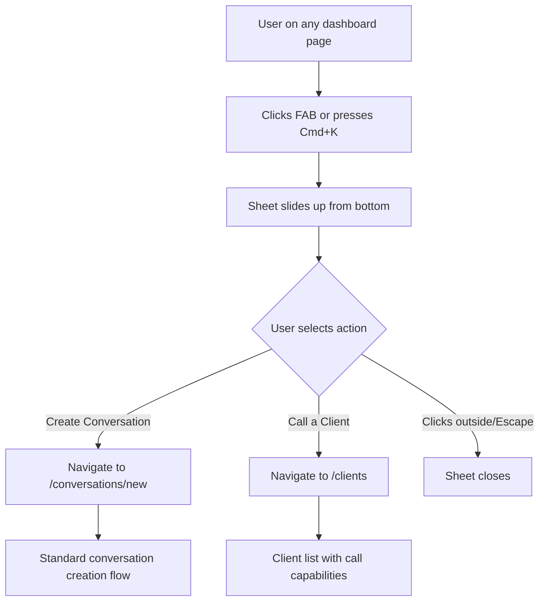
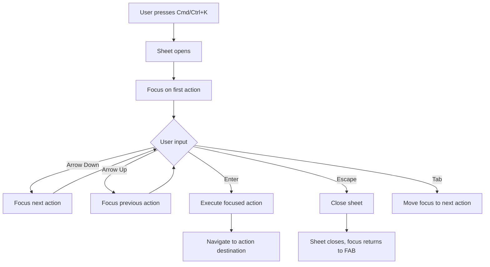
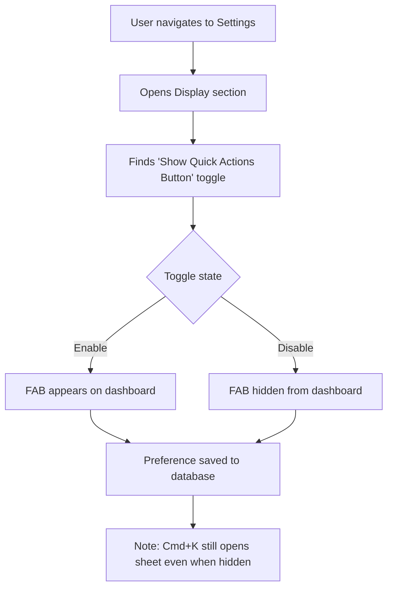
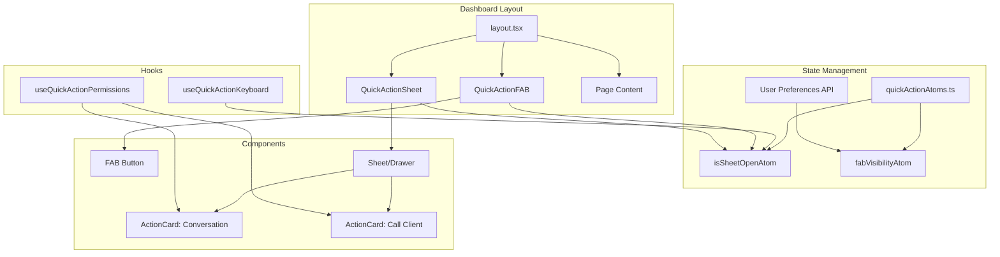

# Quick Action FAB Specification

## Overview

### What We're Building
A floating action button (FAB) that provides quick access to core creation workflows from anywhere in the dashboard. The FAB opens a mobile-first slide-up sheet with two quick actions:
1. **Create a Conversation** - Navigate to `/conversations/new`
2. **Call a Client** - Navigate to `/clients` (with call intent)

### Why
Users currently need to navigate through the sidebar to reach creation workflows. A FAB provides:
- **Faster access** to the most common actions
- **Discoverability** - new users see creation options immediately
- **Mobile-friendly** interaction pattern
- **Keyboard power users** get Cmd/Ctrl+K shortcut

### Target Users
All dashboard users with appropriate permissions:
- Case Managers (primary users of conversations and calls)
- Program Managers (oversight and occasional direct work)
- Admins (full access)

---

## User Stories

### US-1: Quick Conversation Creation
**As a** case manager
**I want to** quickly start a new conversation from any dashboard page
**So that** I don't lose context when inspiration strikes during other work

**Acceptance Criteria:**
- [ ] FAB is visible on all dashboard pages
- [ ] Clicking FAB opens slide-up sheet
- [ ] "Create Conversation" action navigates to `/conversations/new`
- [ ] Sheet closes after action selection
- [ ] Works on both desktop and mobile

### US-2: Quick Client Call
**As a** case manager
**I want to** quickly access the client list to make a call
**So that** I can initiate calls without navigating through menus

**Acceptance Criteria:**
- [ ] "Call a Client" action navigates to `/clients`
- [ ] Only shown if user has call permissions
- [ ] Works on both desktop and mobile

### US-3: Keyboard Shortcut
**As a** power user
**I want to** open quick actions with Cmd/Ctrl+K
**So that** I can work faster without reaching for the mouse

**Acceptance Criteria:**
- [ ] Cmd+K (Mac) / Ctrl+K (Windows/Linux) opens the sheet
- [ ] Same shortcut closes sheet if open
- [ ] Focus moves to first action when sheet opens
- [ ] Arrow keys navigate between actions
- [ ] Enter selects focused action
- [ ] Escape closes sheet

### US-4: FAB Visibility Setting
**As a** user who prefers minimal UI
**I want to** hide the FAB
**So that** I have a cleaner interface

**Acceptance Criteria:**
- [ ] Toggle in Settings > Display section
- [ ] Preference persists in database
- [ ] FAB immediately hides/shows on toggle
- [ ] Keyboard shortcut still works even when FAB is hidden

### US-5: Permission-Based Actions
**As an** admin
**I want** users to only see actions they can perform
**So that** the UI doesn't show dead ends

**Acceptance Criteria:**
- [ ] Actions filtered by user's RBAC permissions
- [ ] User without call permission doesn't see "Call a Client"
- [ ] User without conversation permission doesn't see "Create Conversation"
- [ ] If no actions available, FAB is hidden entirely

---

## User Flows

### Primary Flow: Create Conversation via FAB



### Keyboard Navigation Flow



### Settings Toggle Flow



---

## Technical Design

### Architecture Overview



### Component Structure

```
apps/web/src/
├── components/
│   └── quick-actions/
│       ├── quick-action-fab.tsx      # FAB button component
│       ├── quick-action-sheet.tsx    # Slide-up sheet with actions
│       ├── quick-action-card.tsx     # Individual action card
│       └── index.ts                  # Exports
├── lib/
│   └── quick-actions/
│       ├── atoms.ts                  # Jotai atoms for state
│       ├── hooks.ts                  # Custom hooks (keyboard, permissions)
│       ├── types.ts                  # TypeScript types
│       └── analytics.ts              # Analytics tracking
└── app/
    └── (dashboard)/
        └── layout.tsx                # Add FAB + Sheet here
```

### State Management (Jotai)

```typescript
// apps/web/src/lib/quick-actions/atoms.ts

import { atom } from "jotai";
import { atomWithStorage } from "jotai/utils";

// Sheet open state
export const isQuickActionSheetOpenAtom = atom(false);

// FAB visibility (synced with user preferences)
export const fabVisibilityAtom = atom<boolean | null>(null);

// Focused action index for keyboard navigation
export const focusedActionIndexAtom = atom(0);

// Action atoms
export const openQuickActionSheetAtom = atom(null, (get, set) => {
  set(isQuickActionSheetOpenAtom, true);
  set(focusedActionIndexAtom, 0);
  // Track analytics
});

export const closeQuickActionSheetAtom = atom(null, (get, set) => {
  set(isQuickActionSheetOpenAtom, false);
});

export const toggleQuickActionSheetAtom = atom(null, (get, set) => {
  const isOpen = get(isQuickActionSheetOpenAtom);
  if (isOpen) {
    set(closeQuickActionSheetAtom);
  } else {
    set(openQuickActionSheetAtom);
  }
});
```

### Database Changes

```prisma
// Addition to prisma/schema.prisma

model UserPreferences {
  id                String   @id @default(cuid())
  userId            String   @unique
  user              User     @relation(fields: [userId], references: [id], onDelete: Cascade)

  // Existing fields...

  // New field for FAB visibility
  showQuickActionFab Boolean @default(true)

  createdAt         DateTime @default(now())
  updatedAt         DateTime @updatedAt
}
```

**Note:** If `UserPreferences` model doesn't exist, add as new field to `User` model directly:

```prisma
model User {
  // Existing fields...

  showQuickActionFab Boolean @default(true)
}
```

### API Contracts

#### GET /api/user/preferences
Returns user preferences including FAB visibility.

**Response:**
```json
{
  "showQuickActionFab": true,
  "theme": "system",
  // ... other preferences
}
```

#### PATCH /api/user/preferences
Updates user preferences.

**Request:**
```json
{
  "showQuickActionFab": false
}
```

**Response:**
```json
{
  "success": true,
  "preferences": {
    "showQuickActionFab": false
  }
}
```

### Component Specifications

#### QuickActionFAB

```typescript
// apps/web/src/components/quick-actions/quick-action-fab.tsx

interface QuickActionFABProps {
  className?: string;
}

/**
 * Floating Action Button for quick actions
 *
 * Features:
 * - Fixed position bottom-right
 * - Primary brand color
 * - Plus icon
 * - Subtle scale animation on hover
 * - Hidden when user preference is disabled
 * - Hidden when no actions available (permission-based)
 *
 * WCAG AAA:
 * - 4.5:1 contrast ratio minimum
 * - 48x48px minimum touch target
 * - aria-label for screen readers
 * - aria-expanded reflects sheet state
 * - Focus visible indicator
 */
```

#### QuickActionSheet

```typescript
// apps/web/src/components/quick-actions/quick-action-sheet.tsx

interface QuickActionSheetProps {
  actions: QuickAction[];
}

/**
 * Slide-up sheet containing action cards
 *
 * Features:
 * - Slides up from bottom (mobile-first)
 * - Full-width on mobile, max-width on desktop
 * - Backdrop overlay with click-to-close
 * - Keyboard navigation (arrows, enter, escape)
 * - Focus trap while open
 * - Reduced motion support
 *
 * WCAG AAA:
 * - role="dialog"
 * - aria-modal="true"
 * - aria-labelledby pointing to title
 * - Focus returns to FAB on close
 */
```

#### QuickActionCard

```typescript
// apps/web/src/components/quick-actions/quick-action-card.tsx

interface QuickActionCardProps {
  icon: LucideIcon;
  title: string;
  description: string;
  href: string;
  onClick?: () => void;
}

/**
 * Individual action card within the sheet
 *
 * Features:
 * - Icon + title + description
 * - Hover state with subtle background change
 * - Focus state with visible outline
 * - Click navigates to href
 *
 * WCAG AAA:
 * - role="menuitem" within role="menu"
 * - Sufficient color contrast
 * - Focus indicator visible
 */
```

### Analytics Events

```typescript
// apps/web/src/lib/quick-actions/analytics.ts

export const QuickActionEvents = {
  // FAB interactions
  FAB_CLICKED: "quick_action.fab_clicked",
  SHEET_OPENED_KEYBOARD: "quick_action.sheet_opened_keyboard",
  SHEET_CLOSED: "quick_action.sheet_closed",

  // Action selections
  ACTION_SELECTED: "quick_action.action_selected",

  // Settings
  FAB_VISIBILITY_CHANGED: "quick_action.fab_visibility_changed",
} as const;

interface ActionSelectedEvent {
  action: "create_conversation" | "call_client";
  source: "click" | "keyboard";
}

interface FabVisibilityChangedEvent {
  visible: boolean;
}
```

**Tracked Metrics:**
- FAB open rate (clicks + keyboard)
- Action selection distribution
- Abandonment rate (opened but no action)
- FAB visibility toggle rate

---

## Security Considerations

### Permission Checks
- Actions filtered by RBAC permissions before rendering
- Use existing `hasPermission()` utility
- No server-side check needed (actions just navigate)

### No PHI Exposure
- FAB and sheet don't display or handle PHI
- No audit logging required for FAB interactions
- Analytics events contain no PII

### Keyboard Shortcut Safety
- Cmd/Ctrl+K is intercepted only within dashboard context
- Doesn't override browser defaults on non-dashboard pages
- Event listener properly cleaned up on unmount

---

## Accessibility (WCAG AAA)

### Color Contrast
- FAB: 7:1 contrast ratio for text/icon against background
- Action cards: 7:1 contrast for all text
- Focus indicators: 3:1 contrast against adjacent colors

### Keyboard Navigation
- All interactive elements reachable via keyboard
- Logical tab order
- Arrow key navigation within sheet
- Escape closes sheet and returns focus

### Screen Readers
- FAB: `aria-label="Quick actions"`, `aria-expanded`
- Sheet: `role="dialog"`, `aria-modal="true"`, `aria-labelledby`
- Actions: `role="menu"` container, `role="menuitem"` for each action

### Motion
- `prefers-reduced-motion`: Instant transitions instead of animations
- No auto-playing animations
- User-initiated only

### Focus Management
- Focus moves to first action when sheet opens
- Focus trapped within sheet while open
- Focus returns to FAB when sheet closes

### Touch Targets
- FAB: 56x56px (exceeds 48px minimum)
- Action cards: Full-width, minimum 48px height
- Adequate spacing between interactive elements

---

## Success Metrics & Hypotheses

### Hypothesis 1: Faster Task Initiation
**If** we add a FAB with quick actions
**Then** users will start conversations 30% faster
**Because** they don't need to navigate through sidebar

**Measurement:** Time from dashboard load to conversation creation start

### Hypothesis 2: Increased Feature Discovery
**If** we surface creation actions via FAB
**Then** new users will create their first conversation 20% sooner
**Because** the actions are immediately visible

**Measurement:** Time to first conversation for new users

### Hypothesis 3: Power User Adoption
**If** we provide Cmd+K shortcut
**Then** 15% of users will adopt keyboard navigation within 30 days
**Because** power users prefer keyboard workflows

**Measurement:** % of sheet opens via keyboard

### Key Performance Indicators
| Metric | Target | Measurement |
|--------|--------|-------------|
| FAB click rate | >5% of sessions | Analytics events |
| Action completion rate | >80% | Sheet open → action selected |
| Keyboard shortcut adoption | >15% of sheet opens | Analytics source tracking |
| Setting toggle rate | <10% disable | Preference changes |

---

## Decisions Made

| Decision | Options Considered | Choice | Rationale |
|----------|-------------------|--------|-----------|
| FAB position | Top-right, Bottom-left, Bottom-right | Bottom-right | Standard convention, thumb-reachable on mobile |
| Interaction pattern | Radial menu, Modal, Slide-up sheet | Slide-up sheet | Mobile-first, matches iOS/Android patterns |
| Action on selection | Inline flow, Navigation | Navigation | Simpler implementation, reuses existing pages |
| Actions included | 2, 3, or 4 actions | 2 (conversation + call) | Keep minimal, can expand later |
| Keyboard shortcut | Cmd+K, Cmd+J, Cmd+Shift+A | Cmd+K | Standard command palette convention |
| Animation level | None, Subtle, Rich | Subtle | Balance polish and performance |
| Permission handling | Show all, Filter, Disable | Filter by permissions | Clean UX, no dead ends |
| Preference storage | localStorage, Database | Database | Syncs across devices |
| Accessibility level | AA, AAA | AAA | Healthcare users may need higher support |

---

## Deferred Items

| Item | Reason | When to Revisit |
|------|--------|-----------------|
| Additional actions (New Client, New Form) | Keep MVP minimal | After measuring adoption |
| Recent clients in call action | Adds complexity | If navigation proves insufficient |
| Action customization/reordering | Over-engineering | After user feedback |
| Voice activation | Scope creep | Future accessibility enhancement |
| FAB position customization | Unnecessary complexity | Only if users request |
| Auto-hide on scroll | Could be confusing | After usability testing |
| Contextual actions based on current page | Complexity | V2 if proven useful |

---

## Open Questions

None - all questions resolved during interview.

---

## Implementation Checklist

### Phase 1: Core FAB
- [ ] Create `quick-actions/` component directory
- [ ] Implement `QuickActionFAB` component
- [ ] Implement `QuickActionSheet` component
- [ ] Implement `QuickActionCard` component
- [ ] Create Jotai atoms for state management
- [ ] Add to dashboard layout
- [ ] Basic keyboard shortcut (Cmd+K)

### Phase 2: Permissions & Preferences
- [ ] Add `showQuickActionFab` to User/UserPreferences model
- [ ] Create/update preferences API endpoint
- [ ] Implement permission filtering for actions
- [ ] Add toggle to Settings > Display
- [ ] Sync preference state with database

### Phase 3: Polish & Accessibility
- [ ] Implement subtle animations
- [ ] Add `prefers-reduced-motion` support
- [ ] Full WCAG AAA audit
- [ ] Screen reader testing
- [ ] Keyboard navigation testing

### Phase 4: Analytics & Monitoring
- [ ] Implement analytics events
- [ ] Add to analytics dashboard
- [ ] Set up success metric tracking

---

## Learnings

1. **Simple navigation over inline flows**: For quick actions, navigating to existing pages is preferable to recreating flows inline. This reduces code duplication and maintenance burden.

2. **Permission filtering > disabling**: Showing only permitted actions creates a cleaner UX than showing disabled options with "you don't have permission" tooltips.

3. **Keyboard shortcuts matter**: Power users strongly prefer keyboard navigation. Cmd+K is a well-established convention from tools like Slack, Notion, and VS Code.

4. **WCAG AAA for healthcare**: Given Inkra's healthcare focus, AAA compliance is worth the extra effort for accessibility.

5. **Mobile-first sheet pattern**: Slide-up sheets are more natural on mobile than centered modals, and work well on desktop too.
