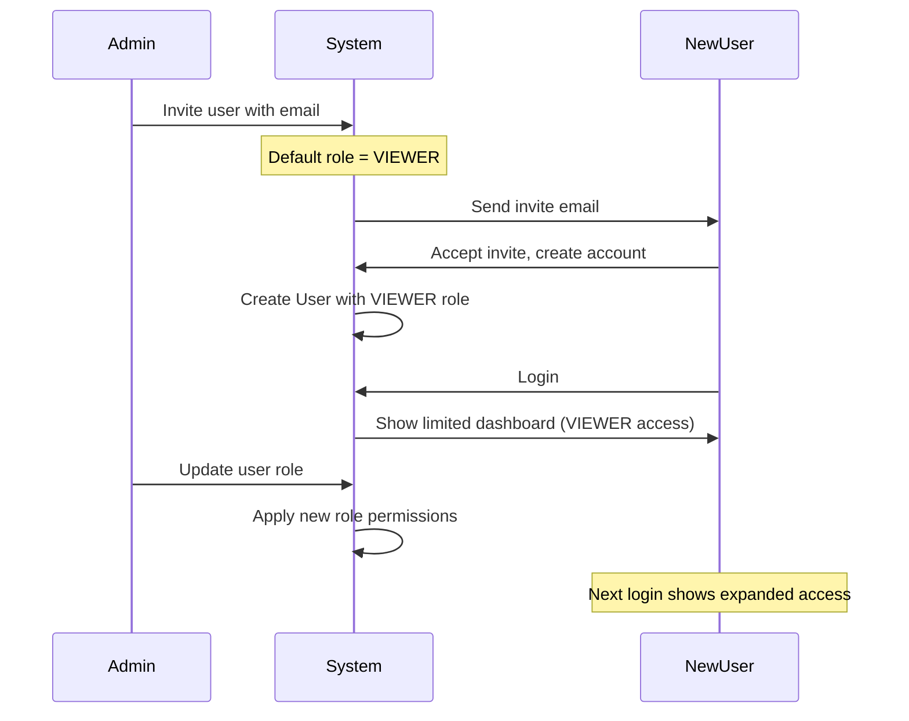
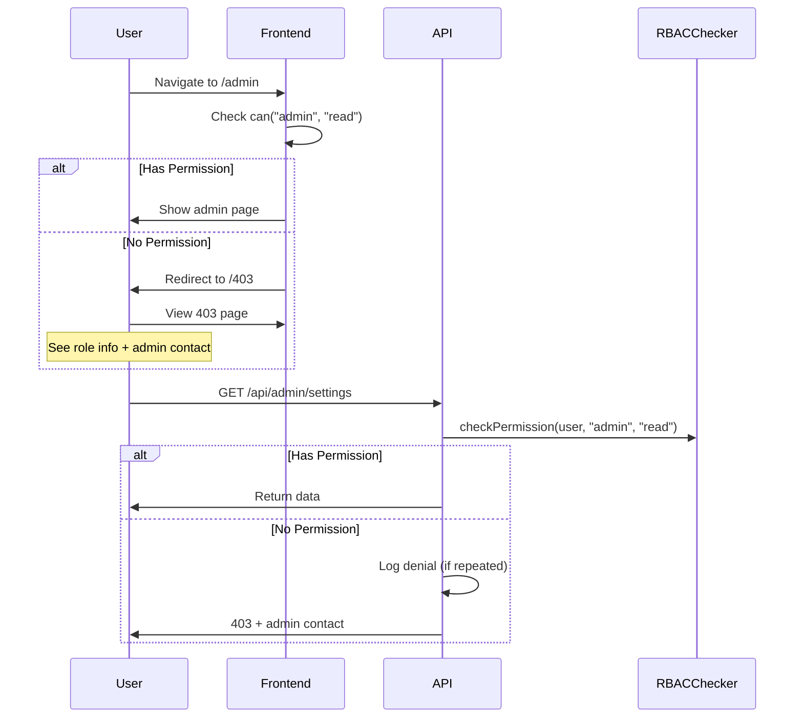
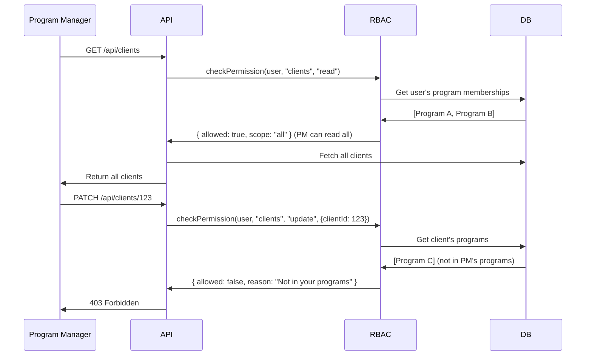
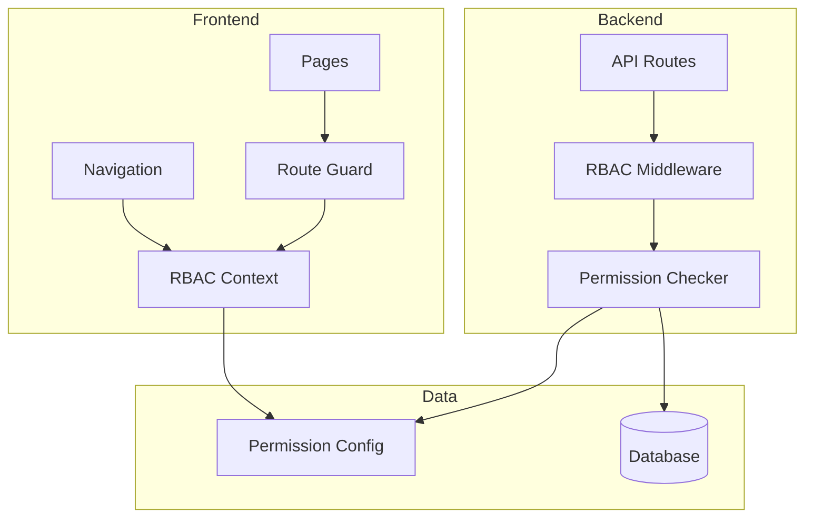
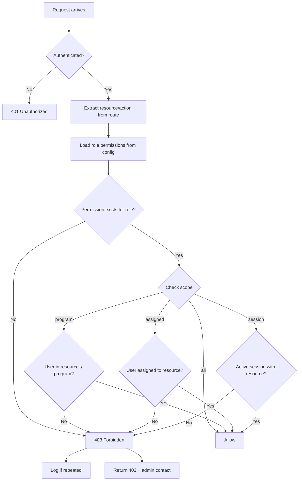
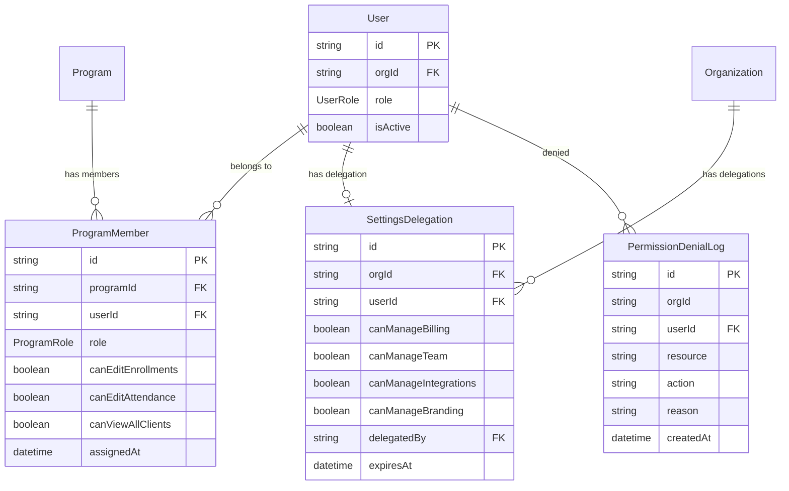

# Role-Based Access Control (RBAC) Specification

## Overview

Implement comprehensive RBAC for Scrybe to control feature access based on user roles. This ensures:
- PHI (Protected Health Information) is only accessible to authorized roles
- Users can only perform actions appropriate to their role
- Program-based scoping limits visibility to assigned programs
- Admins can delegate specific settings permissions

## User Stories

### US-1: Admin Full Access
**As an ADMIN**, I can access all features and data within my organization, so that I can manage the entire org effectively.

**Acceptance Criteria:**
- [ ] Can view all clients, programs, forms, calls, goals
- [ ] Can create, edit, delete any resource
- [ ] Can publish forms
- [ ] Can access admin panel and billing
- [ ] Can delegate settings permissions to other users

### US-2: Program Manager Scoped Access
**As a PROGRAM_MANAGER**, I can manage my assigned programs and see all clients, so that I can oversee program operations.

**Acceptance Criteria:**
- [ ] Can view all clients (read-only for non-program clients)
- [ ] Can edit only clients enrolled in my programs
- [ ] Can create and edit forms (cannot delete or publish)
- [ ] Can view calls for my programs
- [ ] Can export data only from my programs

### US-3: Case Manager Assigned Access
**As a CASE_MANAGER**, I can manage my assigned clients and my own calls, so that I can focus on my caseload.

**Acceptance Criteria:**
- [ ] Can only see clients assigned to me or shared with me
- [ ] Full CRUD on my assigned clients
- [ ] Can only see calls I made
- [ ] Can use (submit) forms but not create/edit them
- [ ] Can view programs I'm assigned to

### US-4: Facilitator Session Access
**As a FACILITATOR**, I can take attendance and add notes during program sessions, so that I can run classes effectively.

**Acceptance Criteria:**
- [ ] Can see basic client info (name, contact) only in my sessions
- [ ] Can record attendance for my sessions
- [ ] Can add session notes
- [ ] Can submit forms during sessions
- [ ] Cannot access calls, goals, or client CRUD

### US-5: Viewer Read-Only Access
**As a VIEWER**, I can view assigned/program data without editing, so that I can observe and report.

**Acceptance Criteria:**
- [ ] Read-only access to clients in my assigned programs
- [ ] Read-only access to forms
- [ ] Read-only access to goals in my programs
- [ ] Cannot access calls
- [ ] No create/update/delete anywhere

### US-6: Access Denied Experience
**As any user**, when I try to access something I don't have permission for, I see a helpful error page with admin contact info.

**Acceptance Criteria:**
- [ ] 403 page shows "Access Denied" with role context
- [ ] Shows what role would be needed
- [ ] Provides admin email to contact for access
- [ ] Has navigation back to dashboard

### US-7: Settings Delegation
**As an ADMIN**, I can delegate specific settings access to non-admin users, so that I can distribute management responsibilities.

**Acceptance Criteria:**
- [ ] Can grant Billing access to specific users
- [ ] Can grant Team management access to specific users
- [ ] Can grant Integrations access to specific users
- [ ] Can grant Branding access to specific users
- [ ] Delegated users see these options in settings menu

---

## User Flows

### Flow 1: New User Invite

### Flow 2: Permission Denied

### Flow 3: Program-Scoped Access

---

## Technical Design

### Architecture

### Permission Evaluation Flow

### Database Schema

---

## Security Considerations

1. **Defense in Depth**: Both frontend and backend enforce permissions; frontend is convenience, backend is enforcement
2. **Principle of Least Privilege**: New users default to VIEWER (most restrictive)
3. **Audit Trail**: Log repeated permission denials for security monitoring
4. **Session Validation**: Always verify user session before permission checks
5. **PHI Protection**: Facilitators see limited client info (basic contact only)
6. **No Escalation**: Users cannot modify their own role or permissions

---

## Success Metrics

| Metric | Target | How to Measure |
|--------|--------|----------------|
| Zero unauthorized PHI access | 0 incidents | Audit logs, penetration testing |
| All API routes protected | 100% | Code review, E2E tests |
| 403 page displays correctly | 100% user satisfaction | Manual QA |
| Navigation filters correctly | 0 visible-but-blocked items | E2E tests per role |
| Settings delegation works | Admin can delegate all 4 settings | Manual testing |

---

## Decisions Made

| Decision | Rationale |
|----------|-----------|
| Centralized permission config (not DB) | Scales better at 1000+ users, easier to audit, role changes instantly apply |
| VIEWER as default role | Most restrictive by default, aligns with PHI protection |
| Grandfather existing users as ADMIN | Preserve access for current users, they can adjust roles post-migration |
| Program-based scoping | Aligns with organizational structure (users work within specific programs) |
| 4 settings delegations | Covers main admin areas without over-complicating |
| Log repeated denials only | Reduces noise while catching suspicious patterns |

---

## Deferred Items

| Item | Reason |
|------|--------|
| IP/Location restrictions | Not needed for MVP, architecture supports future addition |
| Real-time access monitoring dashboard | Focus on enforcement first, monitoring can come later |
| Request access workflow (approval flow) | Simple "contact admin" is sufficient for now |
| Fine-grained per-resource permissions | Role-based is sufficient; can add resource-level ACLs later if needed |

---

## Learnings

1. **Existing foundation is solid**: The codebase already has `requireAuth()`, `requireRole()`, role enums, and navigation filtering (PX-729). This is an enhancement, not a rewrite.

2. **Program assignment needs work**: Currently programs have single `facilitatorId`. Need `ProgramMember` join table for proper multi-user program scoping.

3. **Settings delegation is new**: No prior model for delegating admin capabilities. Clean-slate implementation.

4. **Testing strategy**: E2E tests per role are critical to prevent regressions. Manual testing alone won't scale.
