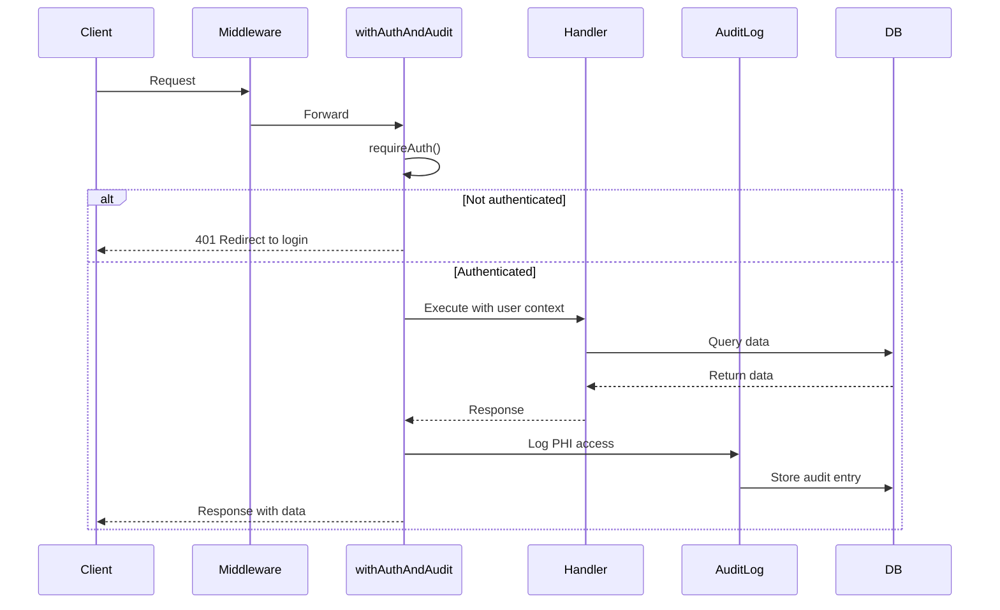
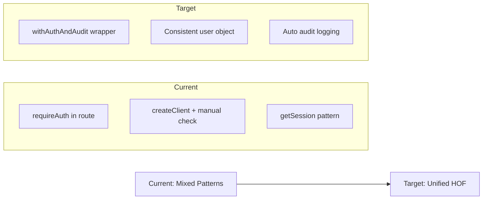
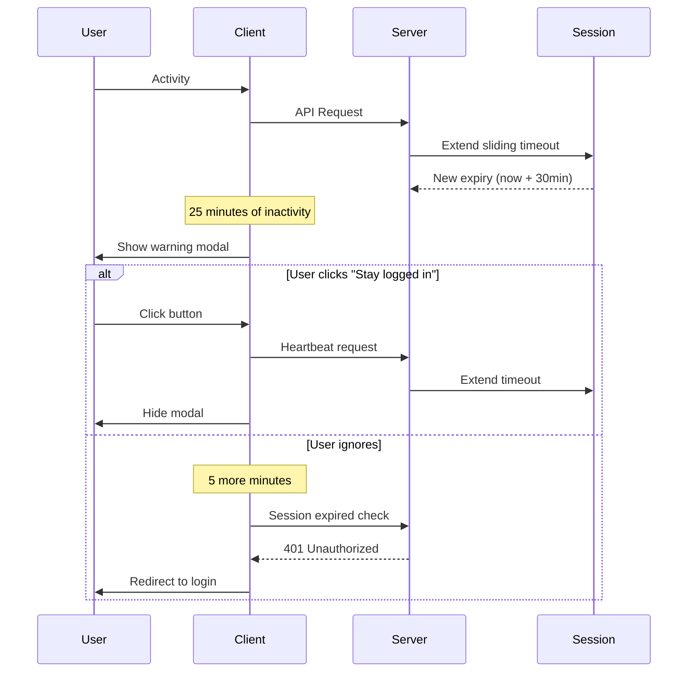
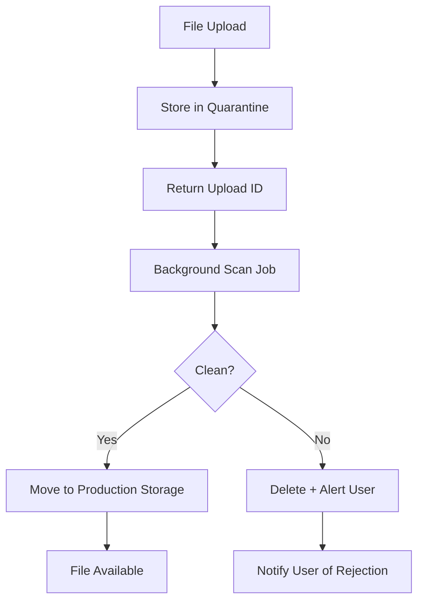
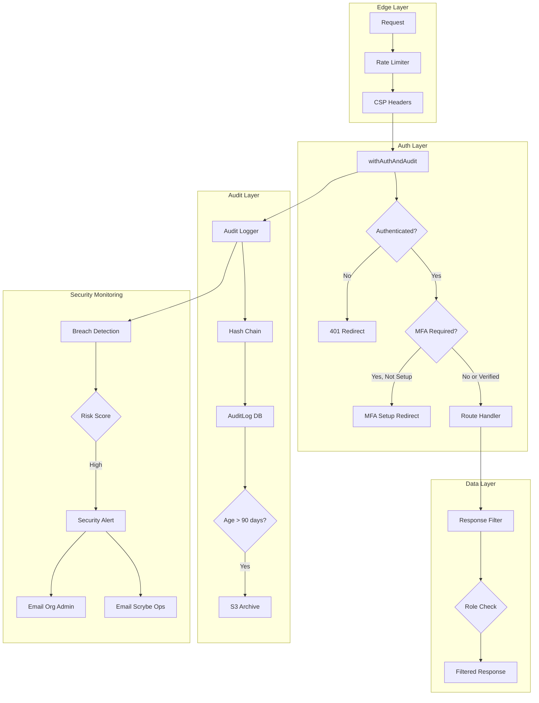
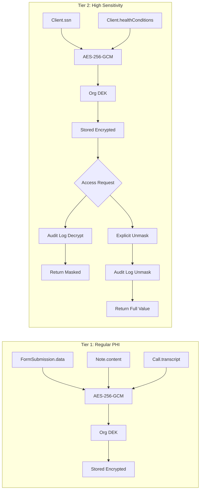
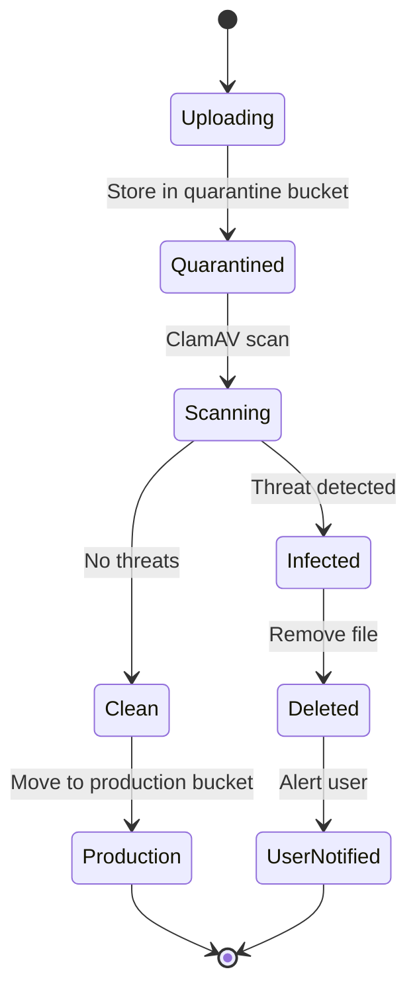

# Security & HIPAA Compliance Remediation Spec

**Linear Ticket:** PX-715
**Created:** 2026-02-09
**Status:** In Progress
**Priority:** Urgent

---

## Executive Summary

Comprehensive security audit identified **23 distinct vulnerabilities** across authentication, authorization, encryption, audit logging, and input validation. This spec documents all remediation decisions, implementation details, and success metrics.

### Key Decisions Summary

| Area | Decision | Rationale |
|------|----------|-----------|
| Audit Logging | Log ALL PHI operations | Full HIPAA compliance, no sampling |
| SQL Injection | Strict parameterization | Zero injection risk, slight latency acceptable |
| Webhook Auth | Environment variable toggle | `SKIP_WEBHOOK_VALIDATION=true` only for local |
| Response Filtering | Role-based filtering | Admins see all, case managers see assigned, viewers see redacted |
| MFA Enforcement | Immediate for admins | Block access until MFA configured |
| Breach Detection | Hybrid approach | Anomaly detection + hard thresholds |
| Rate Limiting | Role-based limits | Higher limits for admins, lower for viewers |
| Encryption | Two-tier system | Regular PHI in Tier 1, SSN/diagnosis in Tier 2 with masking |
| Session Timeout | Sliding 30min + absolute 12hr | With 5-minute warning modal |
| Auth Pattern | withAuthAndAudit() wrapper | Combined auth + audit in single HOF |
| Log Retention | Hot 90 days, warm archive | Archive to S3 after 90 days |

---

## Table of Contents

1. [Critical Issues](#1-critical-issues)
2. [High Severity Issues](#2-high-severity-issues)
3. [Medium Severity Issues](#3-medium-severity-issues)
4. [Database Changes](#4-database-changes)
5. [Implementation Plan](#5-implementation-plan)
6. [User Stories](#6-user-stories)
7. [Technical Architecture](#7-technical-architecture)
8. [Success Metrics](#8-success-metrics)
9. [Deferred Items](#9-deferred-items)
10. [Learnings](#10-learnings)

---

## 1. Critical Issues

### 1.1 Missing PHI Audit Logging (295+ endpoints)

**Severity:** CRITICAL (HIPAA Violation)
**Decision:** Log ALL PHI operations via centralized middleware

#### Current State
- Only 7 of 295+ endpoints have audit logging
- Missing: client views, notes, exports, calls, forms, messages

#### Solution: Centralized Audit Middleware

```typescript
// src/lib/auth/with-auth-audit.ts
export function withAuthAndAudit<T extends AuthenticatedHandler>(
  handler: T,
  config: AuditConfig
): NextRouteHandler {
  return async (request: NextRequest, context?: RouteContext) => {
    // 1. Authenticate
    const user = await requireAuth();

    // 2. Execute handler
    const response = await handler(request, context, user);

    // 3. Auto-audit based on config
    if (config.auditOnSuccess && response.ok) {
      await createAuditLog({
        orgId: user.orgId,
        userId: user.id,
        action: config.action,
        resource: config.resource,
        resourceId: extractResourceId(request, context),
        details: { method: request.method, path: request.nextUrl.pathname },
        ipAddress: getClientIp(request),
        userAgent: request.headers.get('user-agent') || undefined,
      });
    }

    return response;
  };
}
```

#### Routes Requiring Audit Logging

| Route Pattern | Resource | Action | Priority |
|--------------|----------|--------|----------|
| `GET /api/clients/[id]` | CLIENT | VIEW | P0 |
| `GET /api/clients/[id]/notes` | NOTE | VIEW | P0 |
| `GET /api/clients/[id]/calls` | CALL | VIEW | P0 |
| `GET /api/calls/[id]/transcript` | CALL | VIEW | P0 |
| `GET /api/exports/[id]/download` | EXPORT | DOWNLOAD | P0 |
| `GET /api/forms/[id]/export-filled` | SUBMISSION | EXPORT | P0 |
| `GET /api/clients/[id]/messages` | MESSAGE | VIEW | P1 |
| `GET /api/clients/[id]/eligibility` | ELIGIBILITY | VIEW | P1 |
| `GET /api/clients/[id]/insurance` | INSURANCE | VIEW | P1 |

#### Flow Diagram



---

### 1.2 Export Operations Not Logged

**Severity:** CRITICAL (HIPAA Violation)
**Decision:** Add DATA_EXPORTED audit events to all export endpoints

#### Affected Files
- `src/app/api/exports/[id]/download/route.ts`
- `src/app/api/forms/[formId]/export-filled/route.ts`
- `src/app/api/forms/[formId]/export/route.ts`
- `src/app/api/reports/[reportId]/download/route.ts`

#### Implementation

```typescript
// After generating export
await AuditLogger.dataExported(
  user.orgId,
  user.id,
  "SUBMISSION", // or FILE, CLIENT, etc.
  resourceId,
  format // "PDF", "CSV", "XLSX"
);
```

---

### 1.3 SQL Injection in Vector Search

**Severity:** CRITICAL
**Decision:** Strict parameterization with pgvector typed parameters

#### Current Vulnerable Code (src/lib/ai/examples.ts:63-83)

```typescript
// VULNERABLE
const embeddingStr = `[${embedding.join(",")}]`;
await prisma.$queryRaw`... embedding <=> ${embeddingStr}::vector`
```

#### Fixed Implementation

```typescript
// SECURE
import { Prisma } from "@prisma/client";

export async function findSimilarExamples(
  fieldIds: string[],
  embedding: number[],
  limit: number = 5
): Promise<ExtractionExample[]> {
  // Validate inputs
  if (!fieldIds.every(id => isValidUUID(id))) {
    throw new Error("Invalid field IDs");
  }

  if (!embedding.every(v => typeof v === "number" && isFinite(v))) {
    throw new Error("Invalid embedding values");
  }

  // Use Prisma's safe parameterization
  const embeddingArray = Prisma.sql`${embedding}::vector`;

  return await prisma.$queryRaw<ExtractionExample[]>`
    SELECT id, "fieldId", "inputText", "expectedValue", embedding
    FROM "ExtractionExample"
    WHERE "fieldId" = ANY(${fieldIds}::uuid[])
    AND embedding IS NOT NULL
    ORDER BY embedding <=> ${embeddingArray}
    LIMIT ${limit}
  `;
}
```

---

### 1.4 Webhook Verification Disabled in Staging

**Severity:** CRITICAL
**Decision:** Environment variable toggle, staging always validates

#### Current Vulnerable Code

```typescript
// VULNERABLE - staging is open
if (process.env.NODE_ENV === "production") {
  const isValid = validateTwilioWebhook(signature, url, params);
  if (!isValid) return NextResponse.json({ error: "Invalid signature" }, { status: 403 });
}
```

#### Fixed Implementation

```typescript
// SECURE - validate unless explicitly skipped for local dev
const shouldSkipValidation =
  process.env.SKIP_WEBHOOK_VALIDATION === "true" &&
  process.env.NODE_ENV === "development";

if (!shouldSkipValidation) {
  const isValid = validateTwilioWebhook(signature, url, params);
  if (!isValid) {
    console.warn("[Webhook] Invalid signature rejected", {
      path: request.nextUrl.pathname,
      ip: getClientIp(request)
    });
    return NextResponse.json({ error: "Invalid signature" }, { status: 403 });
  }
}
```

---

## 2. High Severity Issues

### 2.1 Inconsistent Auth Patterns

**Decision:** Create unified `withAuthAndAudit()` higher-order function

#### Pattern Migration



#### Migration Example

**Before:**
```typescript
export async function GET(request: NextRequest) {
  try {
    const user = await requireAuth();
    // ... handler logic
  } catch (error) {
    // error handling
  }
}
```

**After:**
```typescript
export const GET = withAuthAndAudit(
  async (request, context, user) => {
    // ... handler logic (user already authenticated)
  },
  { action: "VIEW", resource: "CLIENT", auditOnSuccess: true }
);
```

---

### 2.2 Client PII in Responses

**Decision:** Role-based filtering

#### Implementation

```typescript
// src/lib/services/response-filter.ts
export function filterClientResponse(
  client: Client,
  userRole: UserRole,
  isAssigned: boolean
): FilteredClient {
  const base = {
    id: client.id,
    firstName: client.firstName,
    lastName: client.lastName,
    status: client.status,
  };

  // Admins see everything
  if (userRole === UserRole.ADMIN || userRole === UserRole.SUPER_ADMIN) {
    return client;
  }

  // Case managers see full details for assigned clients
  if (userRole === UserRole.CASE_MANAGER && isAssigned) {
    return client;
  }

  // Everyone else gets redacted contact info
  return {
    ...base,
    phone: redactPhone(client.phone), // XXX-XXX-1234
    email: redactEmail(client.email), // j***@example.com
    address: null, // Fully redacted
  };
}
```

---

### 2.3 Cron Secret Timing-Safe Comparison + IP Allowlist

**Decision:** Timing-safe comparison + IP allowlist

```typescript
// src/lib/cron/verify.ts
import crypto from "crypto";

const ALLOWED_IPS = [
  // Vercel cron IPs
  "76.76.21.0/24",
  // Railway cron IPs
  "34.82.0.0/16",
];

export function verifyCronRequest(request: NextRequest): boolean {
  const authHeader = request.headers.get("authorization");
  const cronSecret = process.env.CRON_SECRET;

  if (!authHeader || !cronSecret) return false;

  // Check IP allowlist
  const clientIp = getClientIp(request);
  if (!isIpInAllowlist(clientIp, ALLOWED_IPS)) {
    console.warn("[Cron] Request from non-allowlisted IP", { ip: clientIp });
    return false;
  }

  // Timing-safe comparison
  const token = authHeader.replace("Bearer ", "");
  const tokenBuffer = Buffer.from(token);
  const secretBuffer = Buffer.from(cronSecret);

  if (tokenBuffer.length !== secretBuffer.length) return false;

  return crypto.timingSafeEqual(tokenBuffer, secretBuffer);
}
```

---

### 2.4 Public Widget Config Endpoint Protection

**Decision:** Strict rate limiting + honeypot orgs

```typescript
// src/app/api/chatbot/widget-config/[orgSlug]/route.ts
import { strictRateLimit, checkHoneypot } from "@/lib/security";

export async function GET(request: NextRequest, context: RouteContext) {
  const { orgSlug } = await context.params;

  // Strict rate limit: 10 req/min per IP
  const rateLimited = await strictRateLimit(request, { limit: 10, window: 60 });
  if (rateLimited) return rateLimited;

  // Check honeypot orgs
  if (await checkHoneypot(orgSlug)) {
    // Alert security team
    await alertSecurityTeam({
      type: "HONEYPOT_ACCESS",
      orgSlug,
      ip: getClientIp(request),
      userAgent: request.headers.get("user-agent"),
    });
    // Return fake config to not tip off attacker
    return NextResponse.json({ enabled: false });
  }

  // Normal config lookup
  const config = await getWidgetConfig(orgSlug);
  return NextResponse.json({
    enabled: config.enabled,
    // formId intentionally omitted - configured in widget script
    orgName: config.orgName,
    primaryColor: config.primaryColor,
    logoUrl: config.logoUrl,
  });
}
```

---

### 2.5 Portal Token Brute Force Protection

**Decision:** Progressive delays with exponential backoff

```typescript
// src/lib/portal/token-protection.ts
const attemptCounts = new Map<string, { count: number; lastAttempt: number }>();

export async function validateWithProtection(
  token: string
): Promise<{ valid: boolean; delay?: number }> {
  const attempts = attemptCounts.get(token) || { count: 0, lastAttempt: 0 };

  // Calculate required delay: 1s, 2s, 4s, 8s, 16s...
  const delayMs = attempts.count > 0
    ? Math.min(Math.pow(2, attempts.count - 1) * 1000, 30000)
    : 0;

  const timeSinceLastAttempt = Date.now() - attempts.lastAttempt;

  if (timeSinceLastAttempt < delayMs) {
    return { valid: false, delay: delayMs - timeSinceLastAttempt };
  }

  // Record attempt
  attemptCounts.set(token, {
    count: attempts.count + 1,
    lastAttempt: Date.now()
  });

  // Validate token
  const valid = await validatePortalToken(token);

  if (valid) {
    attemptCounts.delete(token); // Clear on success
  }

  return { valid };
}
```

---

### 2.6 Admin Rate Limiting

**Decision:** Role-based rate limits

```typescript
// src/lib/rate-limit/config.ts
export const ROLE_RATE_LIMITS: Record<UserRole, number> = {
  SUPER_ADMIN: 2000,  // requests per minute
  ADMIN: 2000,
  PROGRAM_MANAGER: 1500,
  CASE_MANAGER: 1000,
  VIEWER: 500,
};

export function getRateLimitForUser(user: SessionUser | null): number {
  if (!user) return 100; // Public/unauthenticated
  return ROLE_RATE_LIMITS[user.role] || 500;
}
```

---

## 3. Medium Severity Issues

### 3.1 MFA Enforcement for Admins

**Decision:** Immediate enforcement on role assignment

```typescript
// src/lib/auth/mfa-enforcement.ts
export async function checkMFARequired(user: SessionUser): Promise<boolean> {
  const adminRoles = [UserRole.SUPER_ADMIN, UserRole.ADMIN];

  if (!adminRoles.includes(user.role)) {
    return false; // MFA optional for non-admins
  }

  const mfaStatus = await getMFAStatus(user.id);
  return !mfaStatus.enabled;
}

// In requireAuth():
export async function requireAuth(): Promise<SessionUser> {
  const user = await getCurrentUser();
  if (!user) redirect("/login");

  // Check MFA requirement for admins
  if (await checkMFARequired(user)) {
    redirect("/mfa-setup?required=true");
  }

  return user;
}
```

---

### 3.2 Breach Detection System

**Decision:** Hybrid approach (anomaly + thresholds)

```typescript
// src/lib/security/breach-detection.ts
export interface SecurityThresholds {
  maxExportsPerDay: number;       // 50
  maxClientViewsPerHour: number;  // 100
  maxFailedLoginsPerHour: number; // 10
  maxBulkDownloads: number;       // 20 files in 5 min
}

export interface AnomalyIndicators {
  offHoursAccess: boolean;        // Access outside 6am-10pm local
  geographicAnomaly: boolean;     // IP from unusual country
  unusualAccessPattern: boolean;  // Different from historical baseline
  rapidFireRequests: boolean;     // >10 requests per second
}

export async function evaluateSecurityRisk(
  userId: string,
  orgId: string,
  action: string
): Promise<SecurityRiskResult> {
  const [thresholdViolations, anomalies] = await Promise.all([
    checkThresholds(userId, orgId),
    detectAnomalies(userId, orgId, action),
  ]);

  const riskScore = calculateRiskScore(thresholdViolations, anomalies);

  if (riskScore >= 80) {
    await triggerSecurityAlert({
      level: "CRITICAL",
      userId,
      orgId,
      thresholdViolations,
      anomalies,
      action,
    });
  } else if (riskScore >= 50) {
    await triggerSecurityAlert({
      level: "WARNING",
      userId,
      orgId,
      thresholdViolations,
      anomalies,
      action,
    });
  }

  return { riskScore, thresholdViolations, anomalies };
}
```

---

### 3.3 Two-Tier Encryption

**Decision:** Tier 1 for regular PHI, Tier 2 for SSN/diagnosis with masking

```typescript
// src/lib/encryption/two-tier.ts

// Tier 1: Regular PHI (existing implementation)
export const TIER_1_FIELDS = {
  FormSubmission: ["data", "aiExtractedData"],
  Note: ["content"],
  Call: ["transcriptRaw", "transcriptJson"],
  Message: ["content"],
};

// Tier 2: High-sensitivity with additional masking
export const TIER_2_FIELDS = {
  Client: ["ssn", "healthConditions"],
  ClientInsurance: ["memberId", "groupNumber"],
  EligibilityCheck: ["eligibilityData"],
};

export interface Tier2DecryptResult<T> {
  data: T;
  auditId: string; // Every decrypt is logged
}

export async function decryptTier2<T>(
  orgId: string,
  encrypted: string,
  userId: string,
  purpose: string
): Promise<Tier2DecryptResult<T>> {
  // Log the decrypt operation
  const auditEntry = await createAuditLog({
    orgId,
    userId,
    action: "VIEW",
    resource: "SENSITIVE_DATA",
    resourceId: "tier2-decrypt",
    details: { purpose, timestamp: new Date().toISOString() },
  });

  const dek = await getOrCreateOrgDek(orgId);
  const data = decryptJson<T>(encrypted, dek);

  return { data, auditId: auditEntry.id };
}

// Display masking for Tier 2 fields
export function maskTier2Field(fieldName: string, _value: unknown): string {
  return "[REDACTED]"; // Full redaction until explicit unmask
}
```

---

### 3.4 Session Timeout with Warning

**Decision:** Sliding 30min + absolute 12hr max + 5-minute warning



```typescript
// src/components/session-timeout-warning.tsx
"use client";

export function SessionTimeoutWarning() {
  const [showWarning, setShowWarning] = useState(false);
  const [timeRemaining, setTimeRemaining] = useState(300); // 5 minutes

  useEffect(() => {
    const checkSession = setInterval(async () => {
      const session = await getSessionStatus();

      if (session.expiresIn <= 300 && session.expiresIn > 0) {
        setShowWarning(true);
        setTimeRemaining(session.expiresIn);
      } else if (session.expiresIn <= 0) {
        window.location.href = "/login?reason=timeout";
      }
    }, 30000); // Check every 30 seconds

    return () => clearInterval(checkSession);
  }, []);

  const extendSession = async () => {
    await fetch("/api/auth/extend-session", { method: "POST" });
    setShowWarning(false);
  };

  if (!showWarning) return null;

  return (
    <AlertDialog open={showWarning}>
      <AlertDialogContent>
        <AlertDialogHeader>
          <AlertDialogTitle>Session Expiring</AlertDialogTitle>
          <AlertDialogDescription>
            Your session will expire in {Math.ceil(timeRemaining / 60)} minutes
            due to inactivity. Click below to stay logged in.
          </AlertDialogDescription>
        </AlertDialogHeader>
        <AlertDialogFooter>
          <AlertDialogAction onClick={extendSession}>
            Stay Logged In
          </AlertDialogAction>
        </AlertDialogFooter>
      </AlertDialogContent>
    </AlertDialog>
  );
}
```

---

### 3.5 Health Endpoint Protection

**Decision:** Public summary, authenticated detail

```typescript
// src/app/api/health/route.ts
export async function GET(request: NextRequest) {
  const user = await getCurrentUser(); // Don't require auth

  const healthStatus = await checkAllServices();
  const isHealthy = healthStatus.every(s => s.status === "healthy");

  // Public response: just status
  if (!user || !isAdmin(user)) {
    return NextResponse.json({
      status: isHealthy ? "healthy" : "degraded",
      timestamp: new Date().toISOString(),
    });
  }

  // Admin response: full details
  return NextResponse.json({
    status: isHealthy ? "healthy" : "degraded",
    timestamp: new Date().toISOString(),
    services: healthStatus.map(s => ({
      name: s.name,
      status: s.status,
      latency: s.latency,
      details: s.details,
    })),
  });
}
```

---

### 3.6 Audit Log Archival

**Decision:** Hot 90 days, warm archive to S3

```typescript
// src/lib/audit/archival.ts
import { S3Client, PutObjectCommand } from "@aws-sdk/client-s3";

export async function archiveOldAuditLogs(): Promise<ArchivalResult> {
  const cutoffDate = new Date();
  cutoffDate.setDate(cutoffDate.getDate() - 90);

  // Get logs older than 90 days
  const oldLogs = await prisma.auditLog.findMany({
    where: { timestamp: { lt: cutoffDate } },
    orderBy: { timestamp: "asc" },
  });

  if (oldLogs.length === 0) return { archived: 0 };

  // Group by month for archival
  const byMonth = groupByMonth(oldLogs);

  for (const [monthKey, logs] of Object.entries(byMonth)) {
    const archiveKey = `audit-archives/${monthKey}.jsonl.gz`;
    const compressed = await compressLogs(logs);

    await s3Client.send(new PutObjectCommand({
      Bucket: process.env.ARCHIVE_BUCKET,
      Key: archiveKey,
      Body: compressed,
      ContentType: "application/gzip",
      Metadata: {
        logCount: String(logs.length),
        dateRange: `${logs[0].timestamp.toISOString()}-${logs[logs.length-1].timestamp.toISOString()}`,
      },
    }));
  }

  // Delete archived logs from primary DB
  await prisma.auditLog.deleteMany({
    where: { id: { in: oldLogs.map(l => l.id) } },
  });

  return { archived: oldLogs.length };
}
```

---

### 3.7 Virus Scanning (Async Quarantine)

**Decision:** Accept upload, quarantine until scanned



```typescript
// src/lib/files/virus-scan.ts
export async function uploadWithQuarantine(
  file: Buffer,
  metadata: FileMetadata
): Promise<QuarantinedFile> {
  // Store in quarantine bucket
  const quarantineKey = `quarantine/${nanoid()}/${metadata.filename}`;

  await s3Client.send(new PutObjectCommand({
    Bucket: process.env.QUARANTINE_BUCKET,
    Key: quarantineKey,
    Body: file,
    Metadata: {
      orgId: metadata.orgId,
      userId: metadata.userId,
      originalName: metadata.filename,
      contentType: metadata.contentType,
      uploadedAt: new Date().toISOString(),
    },
  }));

  // Queue scan job
  await scanQueue.add("virus-scan", {
    quarantineKey,
    metadata,
  });

  return {
    id: quarantineKey,
    status: "SCANNING",
    estimatedTime: 30, // seconds
  };
}

// Worker
export async function processScanJob(job: Job): Promise<void> {
  const { quarantineKey, metadata } = job.data;

  const scanResult = await virusScanner.scan(quarantineKey);

  if (scanResult.clean) {
    // Move to production
    await moveToProduction(quarantineKey, metadata);
    await notifyUser(metadata.userId, { status: "ready", fileId: metadata.id });
  } else {
    // Delete and alert
    await deleteQuarantinedFile(quarantineKey);
    await notifyUser(metadata.userId, {
      status: "rejected",
      reason: "Malware detected",
      filename: metadata.filename,
    });
    await alertSecurityTeam({
      type: "MALWARE_DETECTED",
      filename: metadata.filename,
      uploadedBy: metadata.userId,
      threat: scanResult.threat,
    });
  }
}
```

---

### 3.8 Content Security Policy

**Decision:** Strict CSP with nonces

```typescript
// src/middleware.ts (addition)
export function addSecurityHeaders(response: NextResponse): NextResponse {
  const nonce = crypto.randomBytes(16).toString("base64");

  response.headers.set("Content-Security-Policy", [
    `default-src 'self'`,
    `script-src 'self' 'nonce-${nonce}' https://cdn.jsdelivr.net`,
    `style-src 'self' 'unsafe-inline'`, // Required for Tailwind
    `img-src 'self' data: https: blob:`,
    `font-src 'self'`,
    `connect-src 'self' https://api.anthropic.com wss://*.supabase.co`,
    `frame-ancestors 'none'`,
    `base-uri 'self'`,
    `form-action 'self'`,
  ].join("; "));

  response.headers.set("X-Content-Type-Options", "nosniff");
  response.headers.set("X-Frame-Options", "DENY");
  response.headers.set("X-XSS-Protection", "1; mode=block");
  response.headers.set("Referrer-Policy", "strict-origin-when-cross-origin");
  response.headers.set("Permissions-Policy", "camera=(), microphone=(self), geolocation=()");

  // Pass nonce to app for script tags
  response.cookies.set("csp-nonce", nonce, { httpOnly: true, secure: true });

  return response;
}
```

---

## 4. Database Changes

### 4.1 New Models

```prisma
// prisma/schema.prisma

// Security incident tracking
model SecurityIncident {
  id          String   @id @default(uuid())
  orgId       String
  org         Organization @relation(fields: [orgId], references: [id])
  type        SecurityIncidentType
  severity    IncidentSeverity
  description String
  details     Json
  triggeredBy String?  // userId if known
  ipAddress   String?
  userAgent   String?
  status      IncidentStatus @default(OPEN)
  resolvedAt  DateTime?
  resolvedBy  String?
  resolution  String?
  createdAt   DateTime @default(now())

  @@index([orgId, createdAt])
  @@index([status])
}

enum SecurityIncidentType {
  THRESHOLD_VIOLATION
  ANOMALY_DETECTED
  FAILED_LOGIN_SPIKE
  UNAUTHORIZED_ACCESS
  DATA_EXPORT_SPIKE
  HONEYPOT_ACCESS
  MALWARE_UPLOAD
}

enum IncidentSeverity {
  LOW
  MEDIUM
  HIGH
  CRITICAL
}

enum IncidentStatus {
  OPEN
  INVESTIGATING
  RESOLVED
  FALSE_POSITIVE
}

// File quarantine tracking
model QuarantinedFile {
  id          String   @id @default(uuid())
  orgId       String
  org         Organization @relation(fields: [orgId], references: [id])
  userId      String
  user        User     @relation(fields: [userId], references: [id])
  filename    String
  contentType String
  size        Int
  s3Key       String
  status      QuarantineStatus @default(SCANNING)
  scanResult  Json?
  scannedAt   DateTime?
  movedToKey  String?  // Production key if clean
  createdAt   DateTime @default(now())

  @@index([orgId, status])
  @@index([userId])
}

enum QuarantineStatus {
  SCANNING
  CLEAN
  INFECTED
  ERROR
}

// Audit log archive reference
model AuditArchive {
  id        String   @id @default(uuid())
  orgId     String
  org       Organization @relation(fields: [orgId], references: [id])
  s3Key     String
  startDate DateTime
  endDate   DateTime
  logCount  Int
  sizeBytes Int
  createdAt DateTime @default(now())

  @@index([orgId, startDate])
}

// Session tracking for timeout
model UserSession {
  id            String   @id @default(uuid())
  userId        String
  user          User     @relation(fields: [userId], references: [id])
  createdAt     DateTime @default(now())
  lastActivity  DateTime @default(now())
  expiresAt     DateTime
  absoluteExpiry DateTime
  ipAddress     String?
  userAgent     String?
  isActive      Boolean  @default(true)

  @@index([userId, isActive])
  @@index([expiresAt])
}
```

### 4.2 Model Updates

```prisma
// Add to Client model
model Client {
  // ... existing fields

  // Tier 2 encrypted fields
  ssn              String?  // Encrypted, Tier 2
  healthConditions Json?    // Encrypted, Tier 2
}

// Add to Organization model
model Organization {
  // ... existing fields

  // Security settings
  mfaRequiredForAdmins  Boolean @default(true)
  sessionTimeoutMinutes Int     @default(30)
  absoluteSessionHours  Int     @default(12)

  // Relations
  securityIncidents SecurityIncident[]
  quarantinedFiles  QuarantinedFile[]
  auditArchives     AuditArchive[]
}

// Add to User model
model User {
  // ... existing fields

  sessions         UserSession[]
  quarantinedFiles QuarantinedFile[]
}
```

---

## 5. Implementation Plan

### Phase 1: Critical (Immediate)

| Task | Files | Est. Time |
|------|-------|-----------|
| Create withAuthAndAudit() wrapper | `src/lib/auth/with-auth-audit.ts` | 2h |
| Add audit logging to client endpoints | `src/app/api/clients/**` | 3h |
| Add audit logging to export endpoints | `src/app/api/exports/**`, `src/app/api/forms/**/export*` | 2h |
| Fix SQL injection in vector search | `src/lib/ai/examples.ts` | 1h |
| Fix Twilio webhook validation | `src/app/api/webhooks/twilio/**` | 1h |

### Phase 2: High (48 hours)

| Task | Files | Est. Time |
|------|-------|-----------|
| Migrate routes to withAuthAndAudit() | All API routes | 4h |
| Implement role-based response filtering | `src/lib/services/response-filter.ts` | 2h |
| Add timing-safe cron validation + IP allowlist | `src/lib/cron/verify.ts` | 2h |
| Add honeypot protection to widget config | `src/app/api/chatbot/widget-config/**` | 1h |
| Implement portal token progressive delays | `src/lib/portal/token-protection.ts` | 1h |
| Add role-based rate limits | `src/lib/rate-limit/config.ts` | 2h |

### Phase 3: Medium (1 week)

| Task | Files | Est. Time |
|------|-------|-----------|
| MFA enforcement for admins | `src/lib/auth/mfa-enforcement.ts` | 3h |
| Breach detection system | `src/lib/security/breach-detection.ts` | 4h |
| Two-tier encryption implementation | `src/lib/encryption/two-tier.ts` | 3h |
| Session timeout with warning | `src/components/session-timeout-warning.tsx` | 3h |
| Health endpoint protection | `src/app/api/health/route.ts` | 1h |
| Audit log archival | `src/lib/audit/archival.ts` | 3h |
| Virus scanning quarantine | `src/lib/files/virus-scan.ts` | 4h |
| Content Security Policy | `src/middleware.ts` | 2h |
| Security dashboard | `src/app/(dashboard)/admin/security/**` | 6h |

---

## 6. User Stories

### US-1: Admin Security Dashboard
**As an** organization admin
**I want to** view a security dashboard with compliance metrics
**So that** I can monitor PHI access and identify anomalies

**Acceptance Criteria:**
- Dashboard shows: failed logins, PHI access volume, export count, MFA adoption
- Anomaly alerts highlighted in real-time
- Audit chain integrity verification status
- Export weekly compliance report as PDF

### US-2: Session Timeout Warning
**As a** case manager
**I want to** receive a warning before my session expires
**So that** I don't lose unsaved work

**Acceptance Criteria:**
- Warning modal appears 5 minutes before timeout
- "Stay logged in" button extends session
- Countdown timer shows remaining time
- Silent redirect to login if no action taken

### US-3: MFA Setup Requirement
**As a** newly promoted admin
**I want to** be guided through MFA setup
**So that** my account is properly secured

**Acceptance Criteria:**
- Redirected to MFA setup immediately on admin role assignment
- Cannot access admin features until MFA enabled
- Clear instructions with QR code for authenticator app
- Backup codes provided after setup

### US-4: Breach Alert Notification
**As a** Scrybe operations team member
**I want to** receive immediate alerts on security anomalies
**So that** I can investigate potential breaches quickly

**Acceptance Criteria:**
- Email alert within 1 minute of threshold violation
- Alert includes: org name, user involved, violation type, timestamp
- Link to security dashboard with detailed investigation view
- Escalation to Scrybe ops and org admin simultaneously

---

## 7. Technical Architecture

### 7.1 Security Layer Architecture



### 7.2 Two-Tier Encryption Flow



### 7.3 File Upload Quarantine Flow



---

## 8. Success Metrics

### 8.1 Compliance Metrics

| Metric | Target | Measurement |
|--------|--------|-------------|
| PHI Access Logged | 100% | Audit logs / PHI API calls |
| Audit Chain Integrity | 100% | Daily verification job |
| MFA Adoption (Admins) | 100% | Users with MFA / Admin users |
| Encryption Coverage | 100% | Encrypted fields / PHI fields |

### 8.2 Security Metrics

| Metric | Target | Measurement |
|--------|--------|-------------|
| SQL Injection Vulnerabilities | 0 | Static analysis scan |
| Auth Bypass Attempts | 0 successful | Failed auth attempts with access |
| Malware Upload Rate | <0.1% | Infected / total uploads |
| Mean Time to Detect (MTTD) | <5 min | Alert time - incident time |

### 8.3 Operational Metrics

| Metric | Target | Measurement |
|--------|--------|-------------|
| Session Timeout Warnings | Track | Warnings shown / timeouts |
| Rate Limit Blocks | <1% of requests | Blocked / total requests |
| False Positive Alerts | <10% | FP / total alerts |
| Audit Log Volume | Track | Entries per day |

### 8.4 Hypotheses to Validate

1. **Full audit logging won't impact performance**
   - Measure: API response times before/after
   - Target: <10ms latency increase

2. **Session timeout warnings reduce data loss complaints**
   - Measure: Support tickets mentioning "lost work"
   - Target: 50% reduction

3. **Breach detection catches real threats without alert fatigue**
   - Measure: True positive rate over 90 days
   - Target: >80% actionable alerts

4. **Two-tier encryption doesn't slow down common operations**
   - Measure: Client record load time
   - Target: <100ms for Tier 1, <200ms for Tier 2 masked

---

## 9. Deferred Items

### 9.1 Deferred to Future

| Item | Reason | Revisit When |
|------|--------|--------------|
| HSM-backed encryption | Cost prohibitive for current scale | ARR > $1M |
| Mutual TLS for cron | Complexity vs benefit | If IP allowlist fails |
| Field-level ACLs | Role-based sufficient for now | Customer request |
| Client-side encryption | Requires significant arch change | V2 security review |

### 9.2 Known Limitations

1. **Batch operations may not encrypt properly** - Prisma middleware warns but doesn't block. Mitigation: avoid batch writes for encrypted fields.

2. **Audit log archival query limitation** - Can't query archived logs directly. Mitigation: 90-day hot window covers most compliance needs.

3. **Rate limits reset on deploy** - In-memory fallback loses state. Mitigation: Redis persistence for rate limit state.

---

## 10. Learnings

### 10.1 Technical Learnings

1. **Middleware intercept ordering matters** - Rate limiting must come before auth to prevent DoS on auth endpoints.

2. **Prisma middleware has limitations** - Cannot easily intercept raw queries ($queryRaw), requiring manual encryption handling.

3. **Timing-safe comparison is non-trivial** - Buffer lengths must match before comparison, requiring padding or rejection.

### 10.2 Process Learnings

1. **Security audit revealed tech debt** - Inconsistent patterns (3 auth approaches) indicate need for better initial architecture decisions.

2. **HIPAA compliance is cumulative** - Individual features seem small but add up to significant audit logging volume.

3. **Developer experience vs security tradeoff** - Webhook validation in staging slows debugging. Environment toggle balances both needs.

### 10.3 Business Impact

1. **Compliance is a sales requirement** - HIPAA/SOC2 gaps block enterprise deals. This work directly enables larger contracts.

2. **Security incidents have outsized impact** - One breach could end the business. Investment in prevention is high ROI.

3. **Audit capability enables trust** - Customers can verify their data is protected, building confidence in the platform.

---

## Appendix A: Files Changed

```
src/lib/auth/
├── with-auth-audit.ts (new)
├── index.ts (modified)
└── mfa-enforcement.ts (new)

src/lib/audit/
├── service.ts (modified)
├── archival.ts (new)
└── types.ts (modified - add resources)

src/lib/encryption/
├── field-encryption.ts (modified)
└── two-tier.ts (new)

src/lib/security/
├── breach-detection.ts (new)
├── alert-service.ts (new)
└── honeypot.ts (new)

src/lib/rate-limit/
├── config.ts (modified)
└── middleware.ts (modified)

src/lib/cron/
└── verify.ts (new)

src/lib/portal/
└── token-protection.ts (new)

src/lib/files/
└── virus-scan.ts (new)

src/app/api/
├── clients/** (modified - add audit)
├── exports/** (modified - add audit)
├── forms/** (modified - add audit)
├── webhooks/twilio/** (modified - fix validation)
├── chatbot/widget-config/** (modified - add protection)
├── health/route.ts (modified)
└── auth/extend-session/route.ts (new)

src/components/
└── session-timeout-warning.tsx (new)

src/app/(dashboard)/admin/security/
├── page.tsx (new)
├── incidents/page.tsx (new)
└── compliance/page.tsx (new)

middleware.ts (modified - add CSP)
prisma/schema.prisma (modified)
```

---

## Appendix B: Rollback Plan

If critical issues discovered post-deployment:

1. **Audit logging causing performance issues**
   - Disable via feature flag `AUDIT_LOGGING_ENABLED=false`
   - Review batch size and async processing

2. **Rate limiting blocking legitimate users**
   - Increase limits via config without deploy
   - Whitelist specific IPs/users

3. **Session timeout breaking workflows**
   - Extend timeout to 60 minutes
   - Disable warning modal via feature flag

4. **CSP blocking necessary resources**
   - Switch to report-only mode
   - Add specific domains to allowlist
