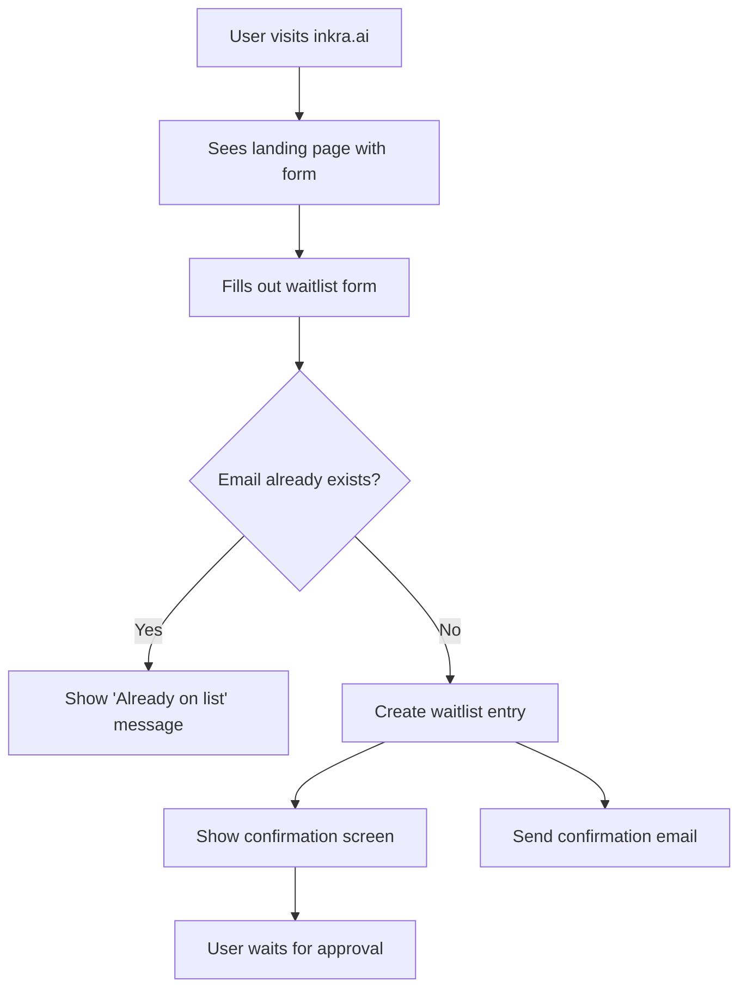
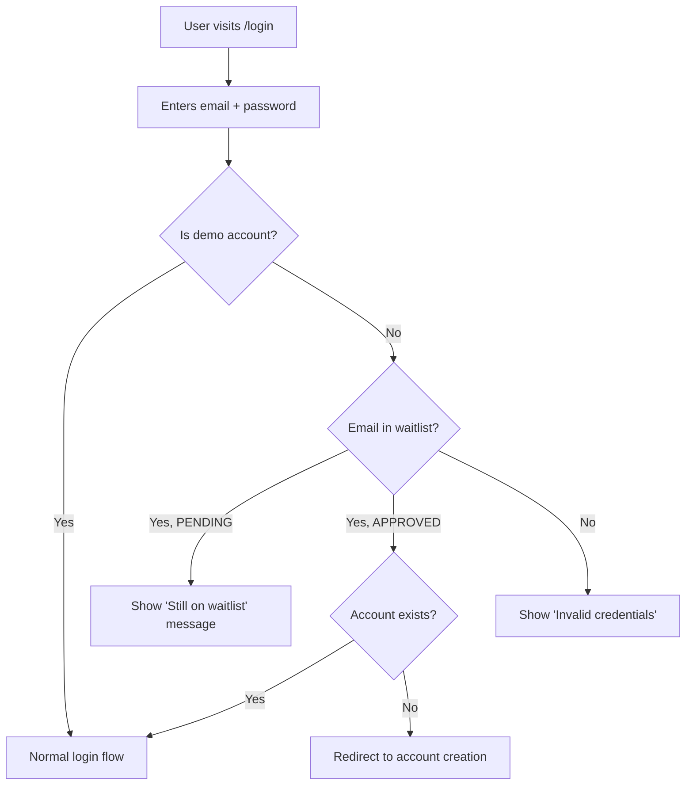
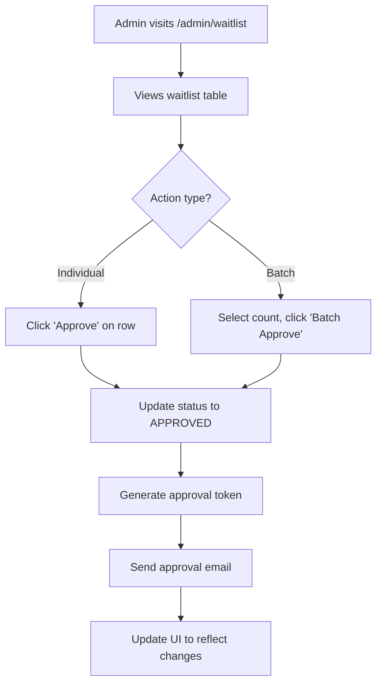
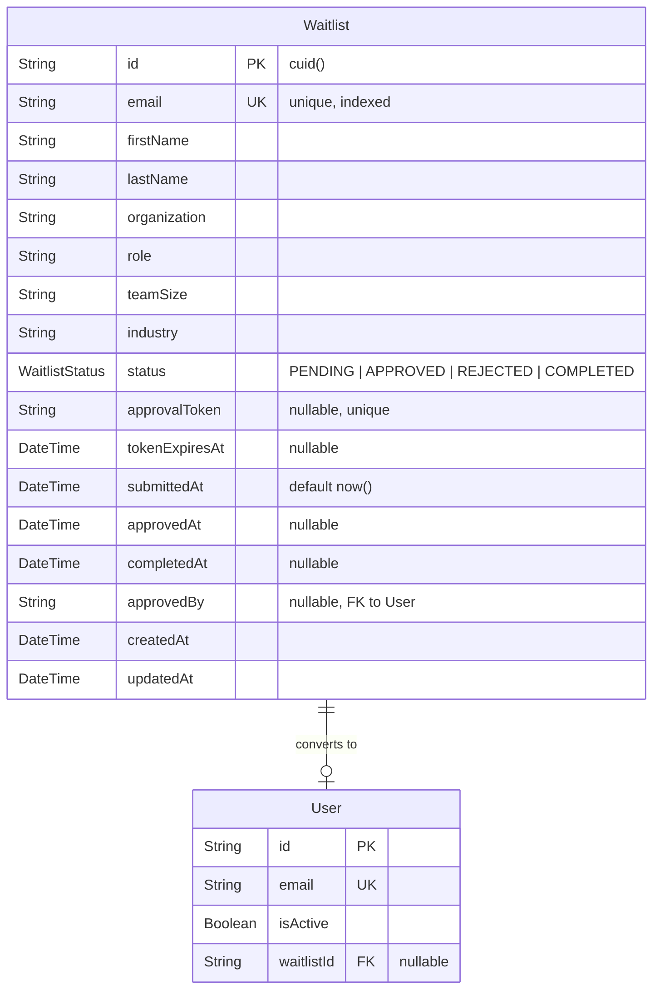
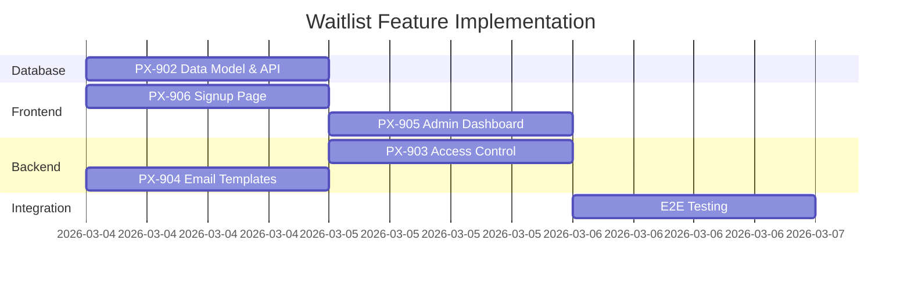

# Waitlist & Account Gating Feature Specification

**Version:** 1.0.0
**Author:** Valerie Phoenix
**Status:** Ready for Implementation
**Created:** 2026-03-04
**Linear Tickets:** PX-901 (parent), PX-902, PX-903, PX-904, PX-905, PX-906

---

## 1. Overview

### What We're Building

A waitlist and account gating system that controls who can create accounts on Inkra. Currently, anyone can bypass the pilot signup and directly access `/login` or `/signup`. This feature gates all account creation behind admin approval, with only 3 demo accounts having unrestricted access.

### Why We're Building It

- **Controlled rollout**: Gradual onboarding for Spring 2026 pilot (20 founding organizations)
- **Quality control**: Ensure early users are the right fit for the product
- **Security**: Prevent unauthorized access during pre-launch phase
- **Sales qualification**: Capture lead data for prioritization

### Success Metrics

| Metric | Target |
|--------|--------|
| Unauthorized login attempts redirected | 100% |
| Waitlist confirmation email delivery | < 60 seconds |
| Approval notification email delivery | < 5 minutes |
| Unauthorized account creations | 0 (outside demo accounts) |

---

## 2. User Stories

### US-1: Public User Joins Waitlist

**As a** prospective user
**I want to** submit my information on the pilot signup form
**So that** I can be notified when I'm approved for access

**Acceptance Criteria:**
- [ ] Form collects: first name, last name, work email, organization, role, team size, industry
- [ ] Duplicate email submissions show "You're already on the list" message
- [ ] Successful submission shows confirmation screen
- [ ] Confirmation email sent within 60 seconds
- [ ] Form validates email format and required fields

### US-2: Unapproved User Attempts Login

**As a** user who submitted the waitlist form
**I want to** know my application status when I try to login
**So that** I understand why I can't access the platform yet

**Acceptance Criteria:**
- [ ] Login page is visible to all users
- [ ] Login attempt with waitlist email shows "Your application is pending. We'll email you when approved."
- [ ] Login attempt with unknown email shows standard "Invalid credentials" error
- [ ] No information leakage about which emails are on waitlist vs. not

### US-3: Admin Approves Waitlist Users

**As an** admin
**I want to** view and approve waitlist entries
**So that** I can control who gets access to the platform

**Acceptance Criteria:**
- [ ] View table of all waitlist entries with: name, email, organization, role, team size, industry, submission date, status
- [ ] Search by email or name
- [ ] Filter by status (pending, approved, rejected)
- [ ] Approve individual users with one click
- [ ] Batch approve next N users (10, 15, 20, 30, or custom) in FIFO order
- [ ] Approval triggers notification email with account creation link
- [ ] View basic counts: total, pending, approved, rejected

### US-4: Approved User Creates Account

**As an** approved waitlist user
**I want to** create my account using the link from my approval email
**So that** I can start using Inkra

**Acceptance Criteria:**
- [ ] Approval email contains unique tokenized link
- [ ] Token is valid for 7 days
- [ ] Clicking link shows account creation form (password setup)
- [ ] Expired tokens show "This link has expired" with option to request new one
- [ ] After account creation, user can login normally
- [ ] Token is single-use (consumed on account creation)

### US-5: Demo Accounts Bypass Waitlist

**As a** demo user (internal team)
**I want to** login without waitlist restrictions
**So that** I can test and demo the product

**Acceptance Criteria:**
- [ ] Demo account emails configured via `DEMO_ACCOUNT_EMAILS` env var
- [ ] Demo emails bypass all waitlist checks
- [ ] Demo users can login/signup directly
- [ ] Demo users are visually distinguishable in admin view (if they appear)

---

## 3. User Flows

### 3.1 Waitlist Signup Flow



### 3.2 Login Attempt Flow



### 3.3 Admin Approval Flow



### 3.4 Account Creation Flow

```mermaid
flowchart TD
    A[User clicks link in email] --> B[/signup/waitlist/:token]
    B --> C{Token valid?}
    C -->|No - Expired| D[Show expiry message + request new link]
    C -->|No - Used| E[Redirect to login]
    C -->|Yes| F[Show account creation form]
    F --> G[User sets password]
    G --> H[Create Supabase auth user]
    H --> I[Create Prisma User + Organization]
    I --> J[Mark token as used]
    J --> K[Update waitlist status to COMPLETED]
    K --> L[Redirect to dashboard]
```

---

## 4. Technical Design

### 4.1 Architecture

```mermaid
flowchart TB
    subgraph "Public Routes"
        LP[Landing Page Form]
        WL[/signup/waitlist/:token]
        LG[/login]
    end

    subgraph "API Layer"
        API1[POST /api/waitlist]
        API2[GET /api/admin/waitlist]
        API3[PATCH /api/admin/waitlist/:id]
        API4[POST /api/admin/waitlist/batch-approve]
        API5[GET /api/waitlist/verify/:token]
    end

    subgraph "Services"
        WLS[WaitlistService]
        EMS[EmailService]
        AUS[AuthService]
    end

    subgraph "Database"
        WLT[(Waitlist Table)]
        USR[(User Table)]
        ORG[(Organization Table)]
    end

    LP --> API1
    API1 --> WLS
    WLS --> WLT
    WLS --> EMS

    LG --> AUS
    AUS --> WLT

    WL --> API5
    API5 --> WLS
    WLS --> AUS
    AUS --> USR
    AUS --> ORG
```

### 4.2 Database Schema



#### Prisma Schema Addition

```prisma
enum WaitlistStatus {
  PENDING
  APPROVED
  REJECTED
  COMPLETED
}

model Waitlist {
  id             String          @id @default(cuid())
  email          String          @unique
  firstName      String
  lastName       String
  organization   String
  role           String
  teamSize       String
  industry       String
  status         WaitlistStatus  @default(PENDING)
  approvalToken  String?         @unique
  tokenExpiresAt DateTime?
  submittedAt    DateTime        @default(now())
  approvedAt     DateTime?
  completedAt    DateTime?
  approvedById   String?
  approvedBy     User?           @relation("WaitlistApprover", fields: [approvedById], references: [id])

  createdAt      DateTime        @default(now())
  updatedAt      DateTime        @updatedAt

  @@index([status])
  @@index([submittedAt])
  @@index([email])
}
```

### 4.3 API Contracts

#### POST /api/waitlist

Submit a new waitlist entry.

**Request:**
```typescript
{
  firstName: string;
  lastName: string;
  email: string;
  organization: string;
  role: string;
  teamSize: string;
  industry: string;
}
```

**Response (201):**
```typescript
{
  success: true;
  message: "You're on the list! We'll notify you when your access is ready.";
}
```

**Response (409 - Duplicate):**
```typescript
{
  success: true;
  message: "You're already on the list! We'll notify you when your access is ready.";
}
```

#### GET /api/admin/waitlist

List waitlist entries (admin only).

**Query Params:**
- `status`: `PENDING | APPROVED | REJECTED | COMPLETED`
- `search`: string (searches email, name, organization)
- `page`: number (default 1)
- `limit`: number (default 50)

**Response:**
```typescript
{
  entries: WaitlistEntry[];
  total: number;
  page: number;
  totalPages: number;
  counts: {
    pending: number;
    approved: number;
    rejected: number;
    completed: number;
  };
}
```

#### PATCH /api/admin/waitlist/:id

Update waitlist entry status.

**Request:**
```typescript
{
  status: "APPROVED" | "REJECTED";
}
```

**Response:**
```typescript
{
  success: true;
  entry: WaitlistEntry;
}
```

#### POST /api/admin/waitlist/batch-approve

Batch approve next N pending entries in FIFO order.

**Request:**
```typescript
{
  count: number; // 10, 15, 20, 30, or custom
}
```

**Response:**
```typescript
{
  success: true;
  approvedCount: number;
  entries: WaitlistEntry[];
}
```

#### GET /api/waitlist/verify/:token

Verify approval token for account creation.

**Response (200 - Valid):**
```typescript
{
  valid: true;
  email: string;
  firstName: string;
  lastName: string;
  organization: string;
}
```

**Response (410 - Expired):**
```typescript
{
  valid: false;
  reason: "expired";
  message: "This link has expired. Request a new one.";
}
```

**Response (404 - Not Found):**
```typescript
{
  valid: false;
  reason: "not_found";
}
```

### 4.4 Component Structure

```
src/
├── app/
│   ├── (auth)/
│   │   └── signup/
│   │       └── waitlist/
│   │           └── [token]/
│   │               └── page.tsx          # Token-based account creation
│   ├── (dashboard)/
│   │   └── admin/
│   │       └── waitlist/
│   │           └── page.tsx              # Admin waitlist dashboard
│   └── api/
│       ├── waitlist/
│       │   └── route.ts                  # POST - submit to waitlist
│       └── admin/
│           └── waitlist/
│               ├── route.ts              # GET - list entries
│               ├── [id]/
│               │   └── route.ts          # PATCH - update status
│               └── batch-approve/
│                   └── route.ts          # POST - batch approve
├── components/
│   └── admin/
│       ├── waitlist-table.tsx            # Table with search/filter
│       ├── waitlist-stats.tsx            # Count cards
│       └── batch-approve-dialog.tsx      # Batch approve modal
├── lib/
│   └── services/
│       └── waitlist.ts                   # WaitlistService
```

### 4.5 Existing Infrastructure Reuse

| Component | Existing | Reuse Strategy |
|-----------|----------|----------------|
| Email sending | AWS SES via `email.ts` | Add `waitlist_confirmation` and `waitlist_approved` templates |
| Token generation | `user-invitation.ts` | Copy pattern for `generateApprovalToken()` |
| Admin UI | `/admin` with tabs | Add new "Waitlist" tab |
| Rate limiting | Middleware-level | Apply to `/api/waitlist` endpoint |
| Table components | shadcn/ui DataTable | Use existing patterns from team management |

---

## 5. Security Considerations

### 5.1 OWASP Top 10 Mitigations

| Risk | Mitigation |
|------|------------|
| Injection | Prisma ORM with parameterized queries |
| Broken Auth | Token-based with 7-day expiry, single-use |
| Sensitive Data Exposure | No password in waitlist, email-only verification |
| Rate Limiting | 10 submissions per IP per hour on `/api/waitlist` |
| CSRF | Next.js server actions with CSRF protection |

### 5.2 Token Security

- 32-byte cryptographically random token via `crypto.randomBytes(32).toString('hex')`
- Hashed in database, plaintext only in email
- 7-day expiration window
- Single-use (marked as used on account creation)
- No token reuse after expiration

### 5.3 Demo Account Bypass

- Configured via `DEMO_ACCOUNT_EMAILS` environment variable
- Comma-separated list: `email1@example.com,email2@example.com,email3@example.com`
- Checked at login time, not stored in database
- Excluded from waitlist UI completely

### 5.4 Internal Admin Access (Waitlist Management)

**Who can see and manage the waitlist?**

Access to the waitlist tab in `/admin` is controlled by the `INTERNAL_ADMIN_EMAILS` environment variable, **NOT** by RBAC roles. This is intentional — waitlist management is for Inkra internal team members only, not customer organization admins.

**How it works:**

1. Admin page loads → calls `/api/admin/waitlist/check-access`
2. Endpoint checks if user's email is in `INTERNAL_ADMIN_EMAILS`
3. If yes → `canAccessWaitlist = true` → Waitlist tab appears
4. If no → tab is hidden (no error, just not shown)

**Environment Variable Configuration:**

```bash
# .env.local (development) or environment config (production)
INTERNAL_ADMIN_EMAILS=valerie@techbychoice.org,another.admin@inkra.ai
```

- Comma-separated list of emails
- Case-insensitive comparison
- Must match the user's email in the database exactly (no wildcards)

**To grant waitlist admin access:**

1. Add their email to `INTERNAL_ADMIN_EMAILS` in the environment
2. Restart the application (or redeploy)
3. User refreshes the admin page → Waitlist tab now visible

**Key files:**

| File | Purpose |
|------|---------|
| `apps/web/src/lib/services/waitlist.ts` | `isInternalAdmin()` and `getInternalAdminEmails()` functions |
| `apps/web/src/app/api/admin/waitlist/check-access/route.ts` | API endpoint that checks access |
| `apps/web/src/app/(dashboard)/admin/page.tsx` | Conditional rendering of Waitlist tab |

**Why separate from RBAC?**

- Waitlist is a pre-signup feature — manages people who don't have accounts yet
- Organization ADMINs shouldn't manage the global waitlist
- Only Inkra team members need this access
- Keeps waitlist data isolated from multi-tenant customer data

**Common confusion:**

| Scenario | Result |
|----------|--------|
| User is ADMIN role but not in `INTERNAL_ADMIN_EMAILS` | Cannot see waitlist tab |
| User is VIEWER role but is in `INTERNAL_ADMIN_EMAILS` | CAN see waitlist tab |
| User is in `DEMO_ACCOUNT_EMAILS` only | Can login without waitlist, but CANNOT manage waitlist |

### 5.5 Information Leakage Prevention

- Login with unknown email: "Invalid credentials" (standard)
- Login with pending waitlist email: "Application pending" (intentional disclosure)
- Signup redirect for all non-demo users: Same landing page
- No indication of whether email is in waitlist from public routes

---

## 6. Email Templates

### 6.1 Waitlist Confirmation

**Subject:** You're on the Inkra pilot waitlist

**Body:**
```
Hi {firstName},

Thanks for applying to the Inkra Spring 2026 Pilot!

We're reviewing applications weekly and will reach out when your access is ready.

What you submitted:
- Organization: {organization}
- Role: {role}
- Team size: {teamSize}
- Industry: {industry}

Questions? Reply to this email.

— The Inkra Team
```

### 6.2 Approval Notification

**Subject:** You're approved for the Inkra pilot!

**Body:**
```
Hi {firstName},

Great news — you've been approved for the Inkra Spring 2026 Pilot!

Click below to create your account:

[Create My Account]({accountCreationUrl})

This link expires in 7 days. If it expires, just reply to this email and we'll send a new one.

What's next:
1. Create your account (2 minutes)
2. Connect your first channel (Zoom, phone, or Teams)
3. Have your first conversation

Welcome to Inkra.

— The Inkra Team
```

---

## 7. Decisions Made

| Decision | Rationale |
|----------|-----------|
| Minimal form fields matching landing page | Consistency with existing form; captures all needed qualification data |
| No rejection emails | Avoids negative user experience; silent rejection is industry standard |
| 7-day token expiry | Matches existing UserInvitation pattern; provides urgency without being too short |
| Demo accounts via ENV var | Simple, flexible per environment, no migration needed |
| "Still on waitlist" message on login | Clear user feedback; they know their application was received |
| Basic counts only for analytics | MVP scope; full funnel analytics deferred to later |
| FIFO batch approval | Fair, transparent ordering; prevents cherry-picking |
| Reuse existing email infrastructure | AWS SES already configured; consistent branding |

---

## 8. Deferred Items

| Item | Reason |
|------|--------|
| Waitlist priority/scoring | Adds complexity; manual review sufficient for 20-org pilot |
| Referral-based advancement | Not needed for controlled pilot |
| Public waitlist position | Creates comparison anxiety; not aligned with brand |
| Full analytics funnel | MVP is basic counts; can add Metabase dashboards later |
| Self-serve token refresh | Email support for expired tokens is acceptable at pilot scale |
| Automated rejection emails | Silent rejection preferred; can add later if needed |

---

## 9. Open Questions

None — all questions resolved during spec interview.

---

## 10. Implementation Order

The tickets can be parallelized as follows:



### Parallel Tracks

**Track 1: Database & API (PX-902)**
- Prisma schema migration
- WaitlistService
- All API endpoints

**Track 2: Email (PX-904)**
- Email templates (confirmation, approval)
- Integration with existing email service

**Track 3: Frontend - Public (PX-906)**
- Update landing page form to POST to `/api/waitlist`
- Confirmation screen component
- Duplicate handling UI

**Track 4 (depends on Track 1): Access Control (PX-903)**
- Middleware updates for demo bypass
- Login flow modifications
- Token-based signup route

**Track 5 (depends on Track 1): Admin UI (PX-905)**
- Waitlist table component
- Search/filter functionality
- Batch approve dialog
- Stats cards

---

## 11. Learnings

1. **Existing infrastructure is extensive** — User invitation system provided a near-complete pattern for token-based approval flows
2. **Landing page already collects all needed data** — No new form fields required, just wire up submission
3. **AWS SES is production-ready** — Email infrastructure doesn't need setup, just new templates
4. **Admin UI patterns are consistent** — Tabs, tables, dialogs all follow established patterns
5. **Demo account bypass via ENV var is simplest** — No schema changes, no UI complexity, easy to manage per environment
