# Scrybe Solutions - Technical Architecture

## System Architecture Overview

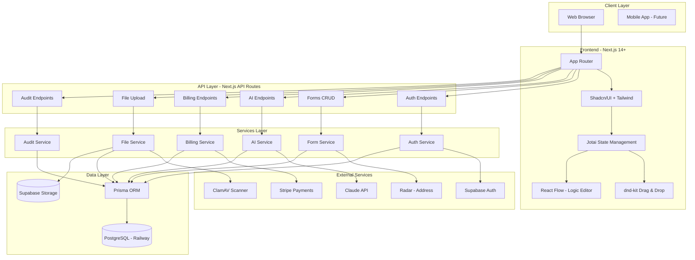

## Technology Stack

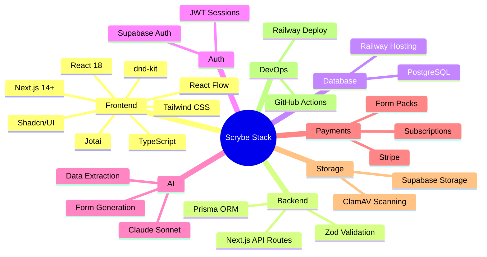

## Component Architecture

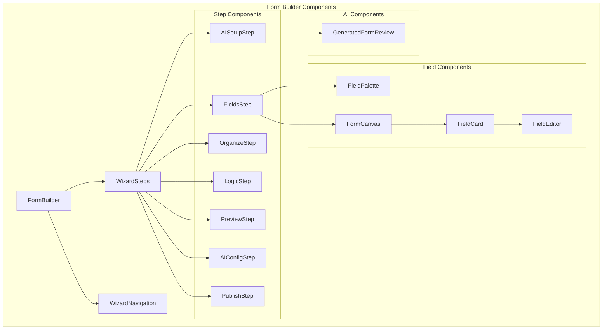

## State Management (Jotai)

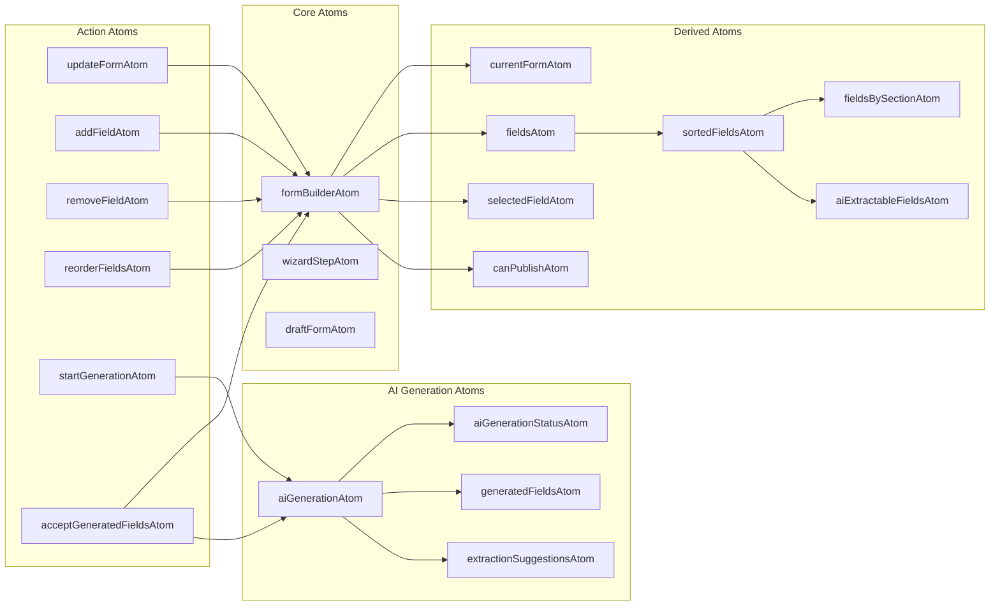

## API Endpoint Structure

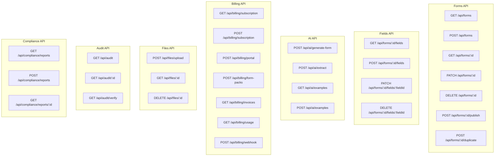

## Data Flow - AI Form Generation

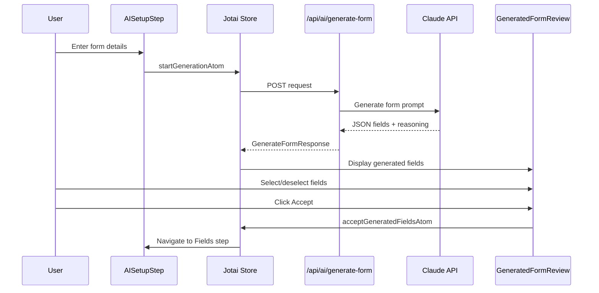

## Security Architecture

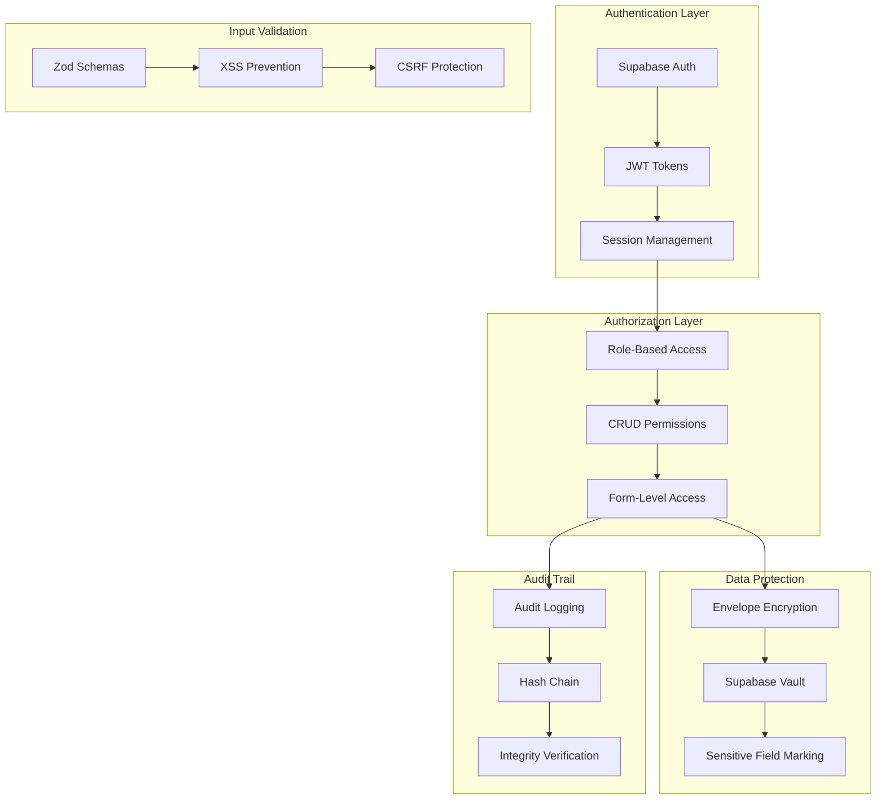

## File Processing Pipeline

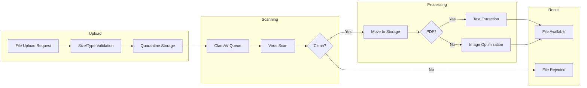

## Deployment Architecture

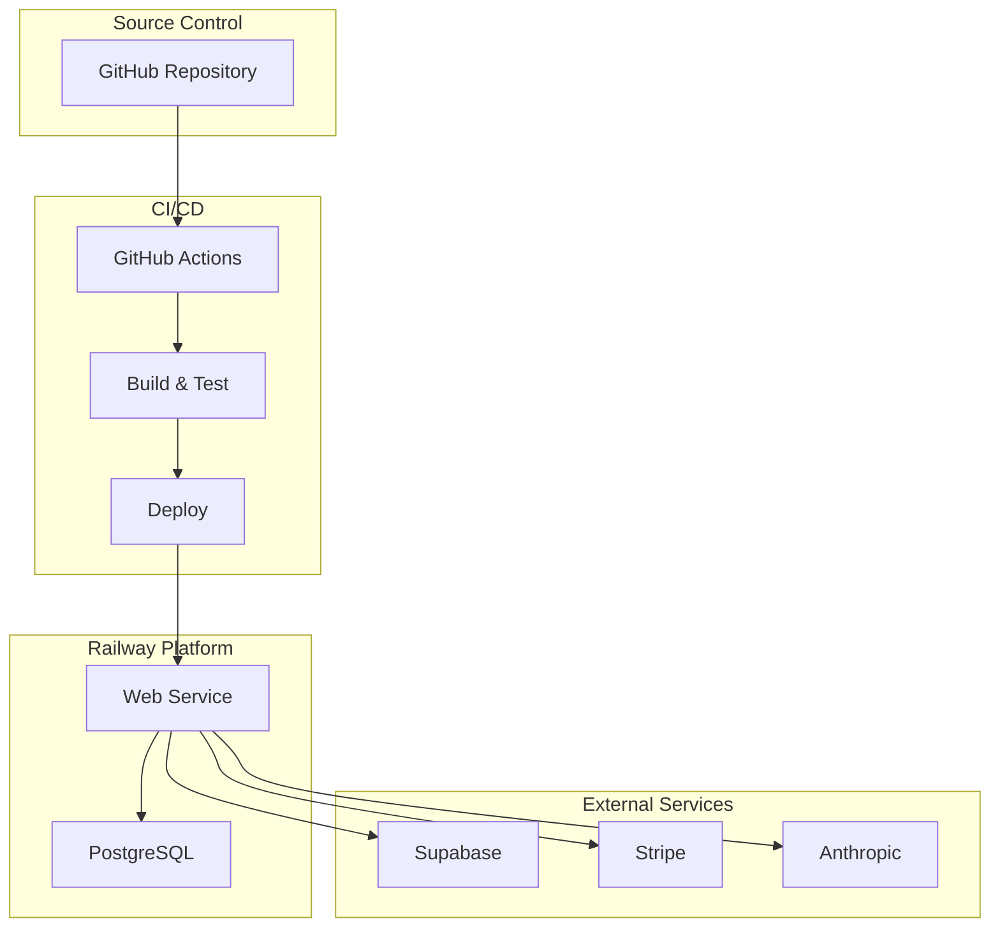

## Module Dependencies

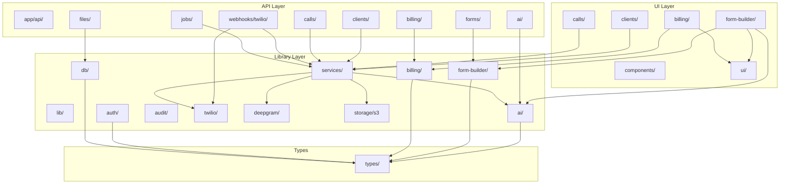

---

## Spec-2: Call Processing Pipeline

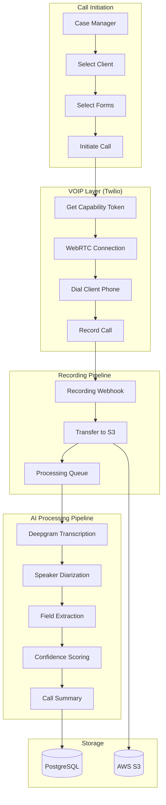

## Spec-2: Transcription & AI Extraction Flow

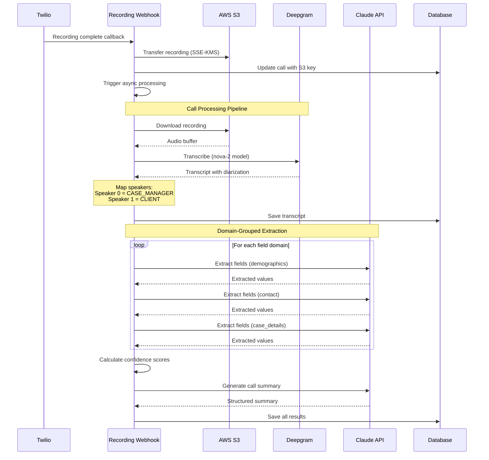

## Spec-2: Confidence Scoring System

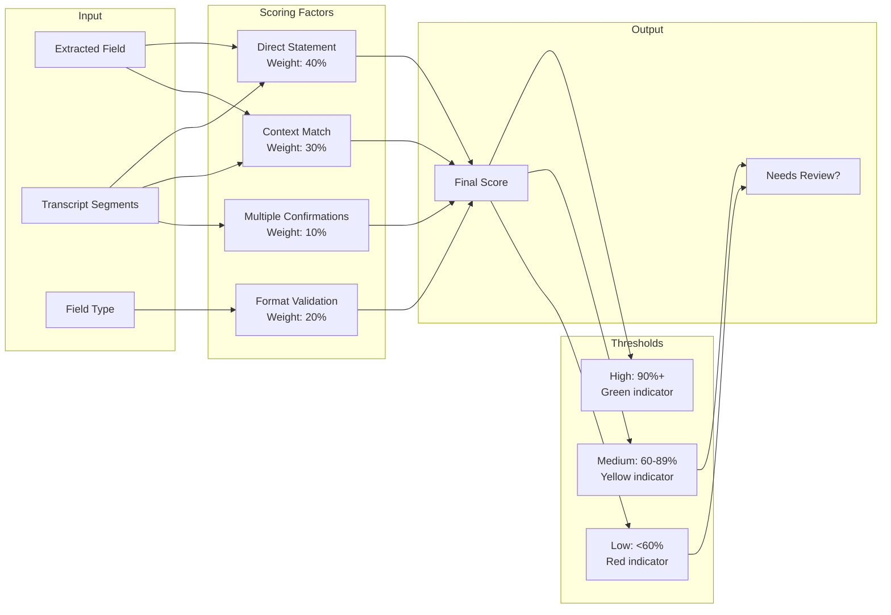

## Spec-2: HIPAA-Compliant Storage

```mermaid
flowchart TD
    subgraph "Recording Sources"
        TW[Twilio Recording URL]
    end

    subgraph "Transfer Layer"
        DL[Download Recording]
        ENC[Encrypt with SSE-KMS]
        UP[Upload to S3]
    end

    subgraph "S3 Configuration"
        BUCKET[recordings/{orgId}/{year}/{month}/]
        KMS[AWS KMS Key]
        POLICY[Bucket Policy]
        LIFECYCLE[Lifecycle Rules]
    end

    subgraph "Access Layer"
        SIGNED[Pre-signed URLs]
        TTL[15 min expiry]
        AUDIT[Access Logging]
    end

    TW --> DL
    DL --> ENC
    ENC --> KMS
    ENC --> UP
    UP --> BUCKET

    BUCKET --> SIGNED
    SIGNED --> TTL
    SIGNED --> AUDIT
    LIFECYCLE --> BUCKET
```

## Spec-2: Client Management Architecture

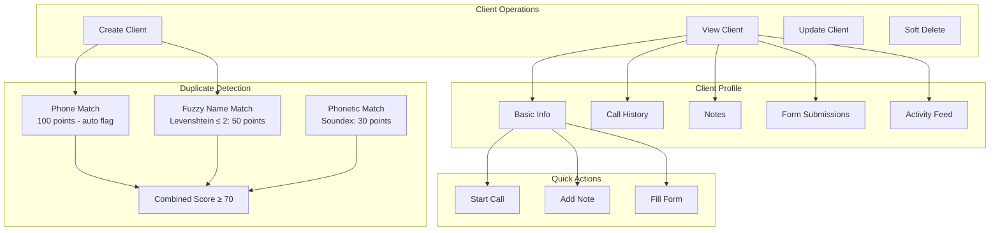
