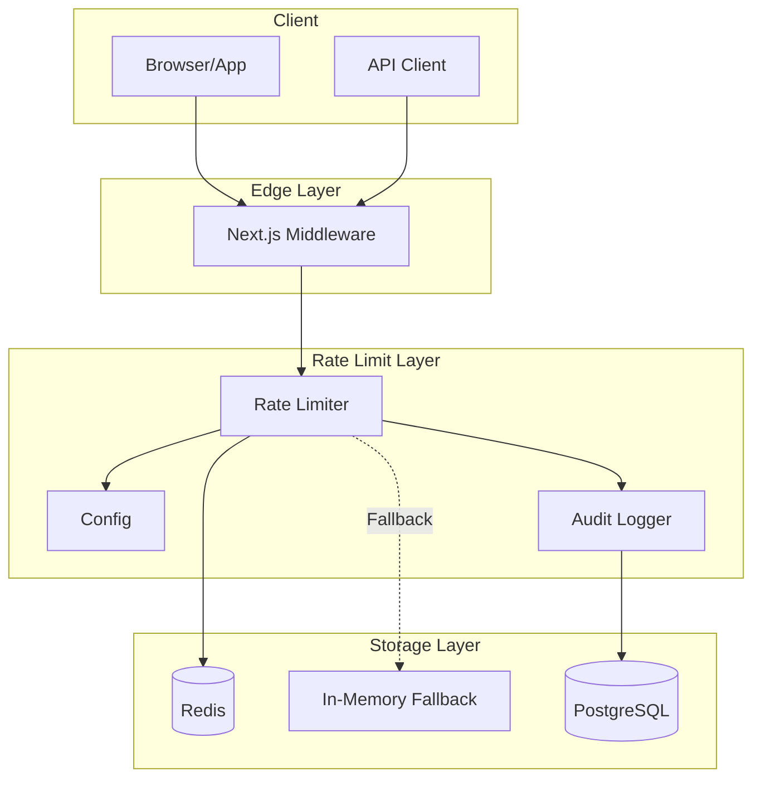
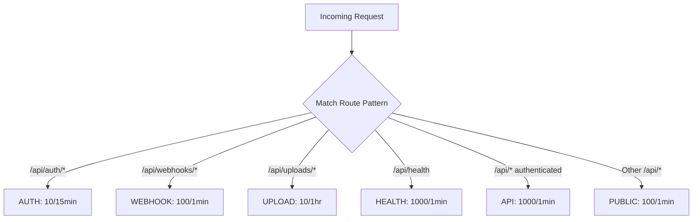
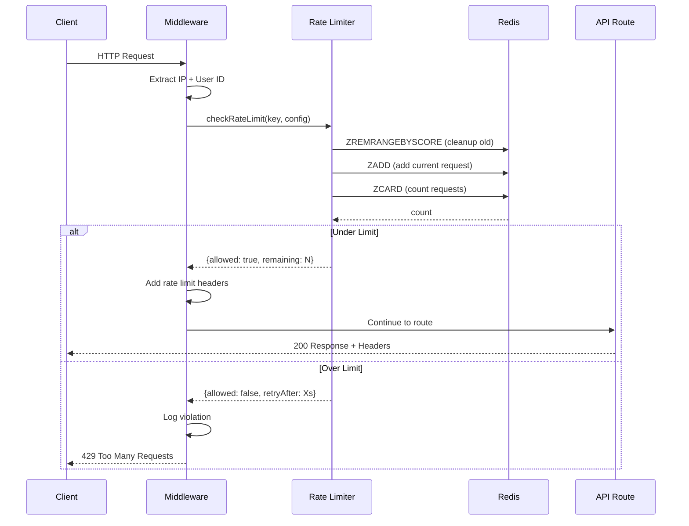
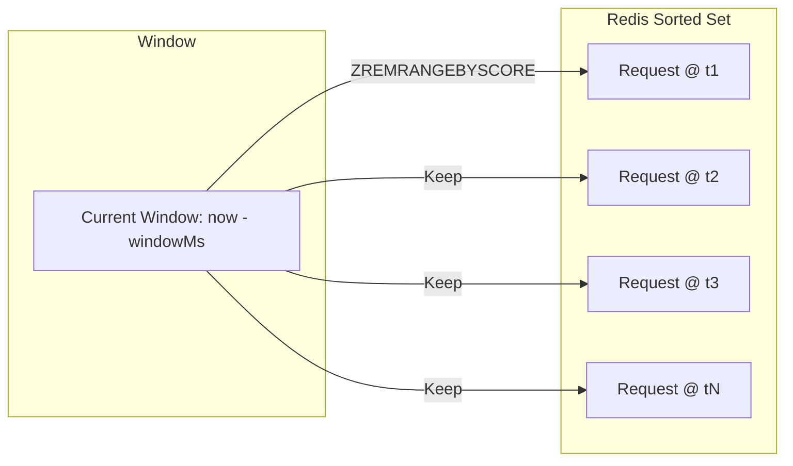
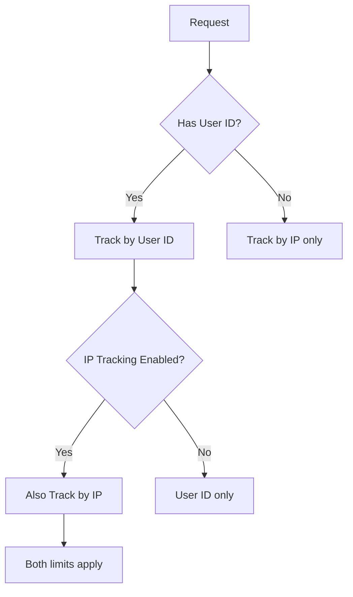
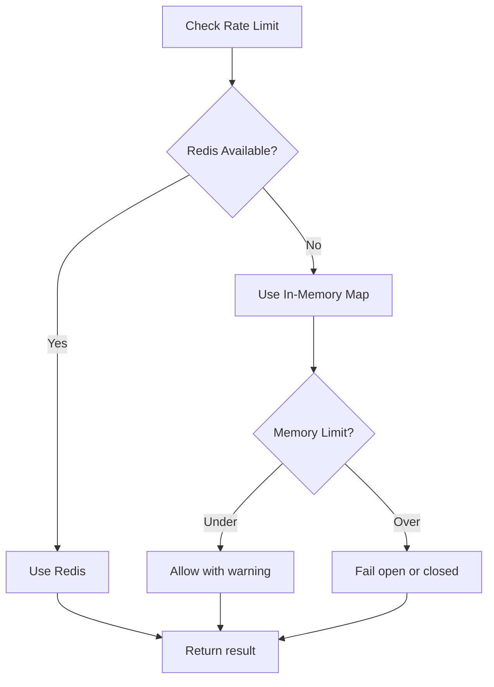
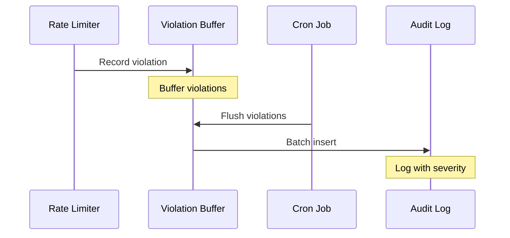

# API Rate Limiting - Technical Design

**Status:** Implemented
**Linear Issue:** PX-670
**Date:** January 31, 2026

## Overview

Distributed API rate limiting using Redis with sliding window algorithm. Provides abuse prevention, brute force protection, and SOC 2 compliance through violation logging.

## Architecture

### Component Diagram



## Rate Limit Configuration

### Endpoint Categories

| Category | Limit | Window | Purpose |
|----------|-------|--------|---------|
| Authentication | 10 requests | 15 minutes | Brute force protection |
| API (authenticated) | 1000 requests | 1 minute | General API usage |
| File uploads | 10 uploads | 1 hour | Storage abuse prevention |
| Webhooks | 100 requests | 1 minute | Integration limits |
| Public endpoints | 100 requests | 1 minute | Unauthenticated access |
| Health checks | 1000 requests | 1 minute | Monitoring systems |

### Route Matching



## Request Flow

### Rate Limit Check Flow



### Sliding Window Algorithm



## Response Headers

### Standard Rate Limit Headers

```
X-RateLimit-Limit: 1000
X-RateLimit-Remaining: 999
X-RateLimit-Reset: 1706698200
```

### 429 Response

```http
HTTP/1.1 429 Too Many Requests
Retry-After: 60
X-RateLimit-Limit: 10
X-RateLimit-Remaining: 0
X-RateLimit-Reset: 1706698260
Content-Type: application/json

{
  "error": "Too many requests",
  "message": "Rate limit exceeded. Please try again later.",
  "retryAfter": 60
}
```

## Tracking Strategy

### Dual Tracking



### Key Format

```
rate_limit:{category}:{identifier}:{window_start}

Examples:
- rate_limit:auth:192.168.1.1:1706698200
- rate_limit:api:user_abc123:1706698200
- rate_limit:upload:user_xyz789:1706694600
```

## Graceful Degradation

### Redis Unavailable



## Audit Logging

### Violation Tracking



### Severity Classification

| Overage | Severity | Description |
|---------|----------|-------------|
| 1-5x | LOW | Normal traffic spike |
| 5-10x | MEDIUM | Unusual activity |
| >10x | HIGH | Potential abuse |

## File Structure

```
src/lib/rate-limit/
├── redis.ts       # Redis client singleton
├── config.ts      # Rate limit configurations
├── limiter.ts     # Sliding window algorithm
├── middleware.ts  # Next.js middleware integration
├── audit.ts       # Violation logging
└── index.ts       # Exports

src/app/api/cron/
└── flush-rate-limit-violations/
    └── route.ts   # Periodic audit flush

middleware.ts      # Main middleware (updated)
```

## Configuration

### Environment Variables

```bash
# Redis connection (shared with BullMQ)
REDIS_URL=redis://localhost:6379

# Optional: Cron job protection
CRON_SECRET=your-secret-here
```

### Customizing Limits

```typescript
// src/lib/rate-limit/config.ts
export const RATE_LIMIT_CONFIGS: Record<RateLimitCategory, RateLimitConfig> = {
  auth: {
    limit: 10,
    windowMs: 15 * 60 * 1000, // 15 minutes
    keyPrefix: "auth",
    trackBy: ["ip"],
  },
  api: {
    limit: 1000,
    windowMs: 60 * 1000, // 1 minute
    keyPrefix: "api",
    trackBy: ["userId", "ip"],
  },
  // ... other categories
};
```

## API Usage

### Manual Rate Limit Check

```typescript
import { checkRateLimit, getRateLimitStatus } from "@/lib/rate-limit";

// Check if request is allowed
const result = await checkRateLimit(
  `api:${userId}`,
  { limit: 100, windowMs: 60000 }
);

if (!result.allowed) {
  return new Response("Too many requests", { status: 429 });
}

// Get current status without incrementing
const status = await getRateLimitStatus(
  `api:${userId}`,
  { limit: 100, windowMs: 60000 }
);
console.log(`${status.remaining} requests remaining`);
```

### Reset Rate Limit (Admin)

```typescript
import { resetRateLimit } from "@/lib/rate-limit";

// Reset a specific user's limit
await resetRateLimit(`api:${userId}`);
```

## Testing Checklist

- [ ] Auth endpoints limited to 10/15min
- [ ] API endpoints limited to 1000/min
- [ ] Upload endpoints limited to 10/hour
- [ ] Rate limit headers in all responses
- [ ] 429 response with Retry-After header
- [ ] Violations logged to audit trail
- [ ] Redis fallback to in-memory works
- [ ] Per-user and per-IP tracking works
- [ ] Middleware integration working

## SOC 2 Compliance

| Control | Implementation |
|---------|----------------|
| CC6.1 | Logical access controls via rate limiting |
| CC7.2 | Violation monitoring and logging |
| A1.1 | Protection against DoS attacks |
