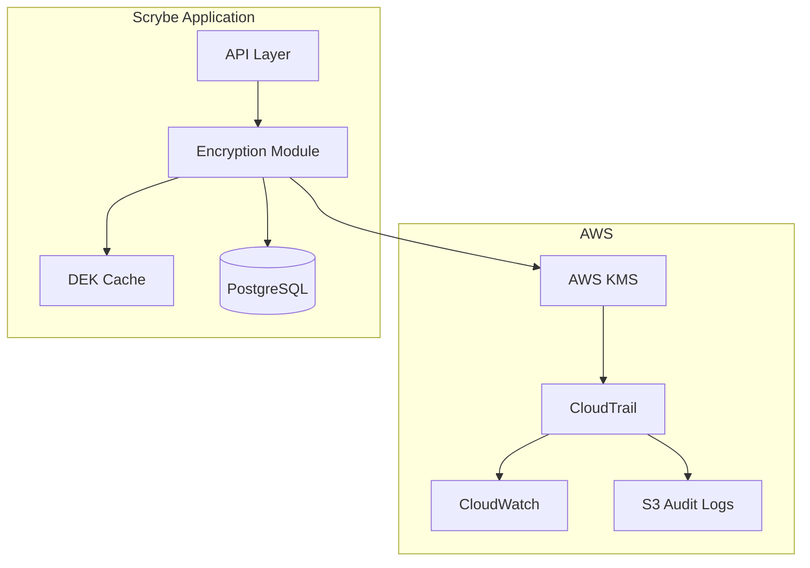

# AWS KMS & Key Management

**Status:** Implemented
**Linear Issue:** PX-672
**Date:** February 1, 2026

## Overview

This document describes the AWS KMS integration and key management procedures for Scrybe's PHI encryption infrastructure. The implementation ensures HIPAA and SOC 2 compliance through proper key lifecycle management, access controls, and audit logging.

## Key Hierarchy

```
AWS KMS Master Key (CMK)
├── Managed by AWS KMS
├── Automatic annual rotation
├── Never leaves KMS HSM
└── Used to encrypt/decrypt DEKs

Organization DEK (Data Encryption Key)
├── Generated per organization
├── Encrypted by CMK at rest
├── Cached in memory (5-min TTL)
├── On-demand rotation support
└── Used for actual PHI encryption
```

## Architecture

### Component Overview



### File Structure

```
src/lib/encryption/
├── crypto.ts           # AES-256-GCM operations
├── kms.ts              # AWS KMS client & operations
├── key-management.ts   # DEK lifecycle & caching
├── field-encryption.ts # Prisma middleware
└── index.ts            # Public exports

infrastructure/terraform/kms/
├── main.tf                        # KMS key & policy definitions
└── environments/
    ├── development.tfvars
    ├── staging.tfvars
    └── production.tfvars
```

## AWS KMS Configuration

### Environment Variables

```bash
# Required for production
AWS_KMS_KEY_ID=arn:aws:kms:us-west-2:123456789:key/abc-123
AWS_KMS_REGION=us-west-2

# Optional - defaults to environment-specific alias
AWS_KMS_KEY_ALIAS=alias/scrybe-phi-master-key-prod
```

### Terraform Deployment

```bash
# Initialize Terraform
cd infrastructure/terraform/kms
terraform init

# Deploy to staging
terraform plan -var-file=environments/staging.tfvars
terraform apply -var-file=environments/staging.tfvars

# Deploy to production
terraform plan -var-file=environments/production.tfvars
terraform apply -var-file=environments/production.tfvars
```

### Key Features Provisioned by Terraform

1. **KMS Customer Master Key (CMK)**
   - AES-256 symmetric key
   - Automatic annual rotation enabled
   - Environment-specific (dev/staging/prod)

2. **Key Aliases**
   - `alias/scrybe-phi-master-key-{env}`
   - `alias/scrybe-phi-{env}` (shorthand)

3. **IAM Key Policy**
   - Root account: Full access (required)
   - Admin roles: Key management (no crypto)
   - Application role: Encrypt/Decrypt only
   - Emergency role: Requires MFA

4. **CloudTrail Logging**
   - All KMS API calls logged
   - 7-year retention (HIPAA)
   - Encrypted with same CMK

5. **CloudWatch Alarms**
   - Key disabled alert
   - Key deletion scheduled alert

## Key Rotation

### Master Key Rotation (AWS-Managed)

AWS KMS handles master key rotation automatically when enabled:
- **Frequency**: Annual (365 days)
- **Process**: AWS creates new key material
- **Compatibility**: Old ciphertexts still decryptable
- **No action required**: Fully automatic

### Organization DEK Rotation (On-Demand)

Organization DEKs can be rotated manually via API or admin UI.

#### API Endpoint

```bash
# Rotate key
POST /api/admin/encryption/rotate-key
Authorization: Bearer <token>
Content-Type: application/json

{
  "reason": "Annual compliance rotation",
  "reEncrypt": true  # Optional: trigger re-encryption job
}

# Response
{
  "data": {
    "success": true,
    "rotation": {
      "previousVersion": 1,
      "newVersion": 2,
      "rotatedAt": "2026-02-01T12:00:00Z",
      "rotatedBy": {
        "id": "user-123",
        "email": "admin@example.com"
      }
    },
    "reEncryptionStatus": {
      "requested": true,
      "status": "QUEUED"
    }
  }
}
```

#### Re-encryption After Rotation

```bash
# Trigger re-encryption
POST /api/admin/encryption/re-encrypt
Authorization: Bearer <token>
Content-Type: application/json

{
  "fromVersion": 1,
  "toVersion": 2,
  "models": ["FormSubmission", "Note", "Call", "Message"],
  "dryRun": false
}

# Check status
GET /api/admin/encryption/re-encrypt?jobId=job-123
```

### Rotation Schedule Recommendations

| Environment | DEK Rotation | Trigger |
|-------------|--------------|---------|
| Production | Annual | Scheduled + on-demand |
| Staging | Quarterly | Manual |
| Development | As needed | Manual |

## Key Access Policies

### Principle of Least Privilege

```
Role                    | Permissions
------------------------|------------------------------------------
Application (ECS/Lambda)| Encrypt, Decrypt, GenerateDataKey
Key Administrators      | Manage key, view config (NO crypto ops)
Security Team           | View key status, audit logs
Emergency Access        | Full access (requires MFA)
```

### Emergency Access Procedures

Emergency ("break-glass") access is available for critical situations:

1. **Prerequisites**:
   - MFA must be enabled and verified
   - Access logged to CloudTrail
   - Post-incident review required

2. **Process**:
   ```bash
   # Emergency access is logged automatically
   # MFA verification required at AWS IAM level
   ```

3. **Post-Incident**:
   - Review CloudTrail logs
   - Document reason for access
   - Security team notification
   - Consider key rotation if compromised

## Monitoring & Alerting

### Key Health Check Endpoint

```bash
GET /api/admin/encryption/status
Authorization: Bearer <token>

# Response includes:
{
  "data": {
    "kms": {
      "configured": true,
      "region": "us-west-2",
      "environment": "production"
    },
    "keyHealth": {
      "keyId": "abc-123",
      "enabled": true,
      "keyState": "Enabled",
      "rotationEnabled": true,
      "healthChecks": {
        "keyExists": true,
        "keyEnabled": true,
        "rotationConfigured": true,
        "canGenerateDataKey": true,
        "canEncryptDecrypt": true
      }
    },
    "rotation": {
      "enabled": true,
      "periodDays": 365,
      "nextRotation": "2027-01-15T00:00:00Z"
    }
  }
}
```

### CloudWatch Metrics

| Metric | Description | Alarm Threshold |
|--------|-------------|-----------------|
| `DisableKey` | Key disabled events | > 0 |
| `ScheduleKeyDeletion` | Deletion scheduled | > 0 |
| `Encrypt` | Encrypt operations | Monitor trend |
| `Decrypt` | Decrypt operations | Monitor trend |
| `GenerateDataKey` | DEK generation | Monitor trend |

### Audit Log Events

All key operations are logged to the audit system:

```typescript
// Event types
KEY_ROTATION_INITIATED   // Key rotation started
KEY_ROTATION_COMPLETED   // Key rotation successful
KEY_ROTATION_FAILED      // Key rotation failed
RE_ENCRYPTION_STARTED    // Data re-encryption started
RE_ENCRYPTION_COMPLETED  // Data re-encryption complete
RE_ENCRYPTION_FAILED     // Data re-encryption failed
KEY_HEALTH_CHECK         // Health check performed
KEY_ACCESS_DENIED        // Unauthorized access attempt
EMERGENCY_KEY_ACCESS     // Break-glass access used
```

## Compliance Mapping

### HIPAA Requirements

| Requirement | Section | Implementation |
|-------------|---------|----------------|
| Encryption at rest | 164.312(a)(2)(iv) | AES-256-GCM via DEK |
| Key management | 164.308(a)(5)(ii)(D) | AWS KMS + rotation |
| Audit controls | 164.312(b) | CloudTrail + audit logs |
| Access controls | 164.312(d) | IAM policies |
| Integrity | 164.312(c)(1) | GCM auth tag |

### SOC 2 Requirements

| Criterion | Requirement | Implementation |
|-----------|-------------|----------------|
| CC6.1 | Logical access controls | IAM key policy |
| CC6.7 | Restrict data transmission | KMS encryption |
| CC7.2 | Monitor for vulnerabilities | CloudWatch alarms |
| CC8.1 | Change management | Terraform IaC |

## Disaster Recovery

### Key Backup Strategy

AWS KMS automatically maintains key material backups. For organization DEKs:

1. **DEKs stored encrypted** in PostgreSQL
2. **Database backups** include encrypted DEKs
3. **Cross-region replication** (optional) for DR

### Recovery Procedures

1. **Master Key Unavailable**:
   - Contact AWS Support
   - Use cross-region replica (if configured)
   - Emergency: Data encrypted with unavailable key is unrecoverable

2. **DEK Recovery**:
   - Restore from database backup
   - DEK decryption requires master key access

3. **Accidental Key Deletion**:
   - 7-30 day deletion window (configurable)
   - Cancel deletion if caught in time
   - CloudWatch alarm alerts on deletion schedule

## Development Mode

For local development without AWS credentials:

```bash
# .env.local - DO NOT USE IN PRODUCTION
# Omitting AWS_KMS_KEY_ID enables dev mode
# AWS_KMS_KEY_ID=  # Comment out or remove

# Dev mode behavior:
# - DEKs generated locally
# - Stored with "dev:" prefix
# - NOT suitable for real PHI
```

**Warning**: Development mode keys:
- Are NOT encrypted by KMS
- Will be rejected in production
- Should never contain real PHI

## Security Considerations

### Key Material Protection

1. **Master Key**: Never leaves AWS KMS HSM
2. **DEK at Rest**: Always KMS-encrypted in database
3. **DEK in Memory**: 5-minute TTL, cleared on rotation
4. **DEK in Transit**: TLS 1.3 to AWS KMS

### Attack Mitigation

| Threat | Mitigation |
|--------|------------|
| Key theft | HSM-backed, never exportable |
| Unauthorized access | IAM policies, MFA for emergency |
| Key deletion | 30-day window, CloudWatch alerts |
| Replay attacks | Unique IV per operation |
| Tampering | GCM authentication tag |

## API Reference

### Encryption Status

```
GET /api/admin/encryption/status
```

Returns comprehensive encryption and KMS health status.

### Key Rotation

```
GET  /api/admin/encryption/rotate-key  # Get rotation info
POST /api/admin/encryption/rotate-key  # Trigger rotation
```

### Re-encryption

```
GET  /api/admin/encryption/re-encrypt?jobId=<id>  # Get job status
POST /api/admin/encryption/re-encrypt              # Start re-encryption
```

## Troubleshooting

### Common Issues

1. **"KMS_KEY_ID not configured"**
   - Set `AWS_KMS_KEY_ID` environment variable
   - Verify AWS credentials are available

2. **"Access denied" from KMS**
   - Check IAM role has required permissions
   - Verify key policy includes application role

3. **"Key not found"**
   - Verify key ID/alias is correct
   - Check region matches key location

4. **Slow encryption operations**
   - Check DEK cache is working (5-min TTL)
   - Monitor KMS API latency

### Debug Logging

```bash
# Enable verbose KMS logging
LOG_LEVEL=debug
DEBUG=kms:*
```

## References

- [AWS KMS Developer Guide](https://docs.aws.amazon.com/kms/latest/developerguide/)
- [HIPAA Security Rule](https://www.hhs.gov/hipaa/for-professionals/security/)
- [SOC 2 Trust Services Criteria](https://www.aicpa.org/soc2)
- [NIST Key Management Guidelines (SP 800-57)](https://csrc.nist.gov/publications/detail/sp/800-57-part-1/rev-5/final)
