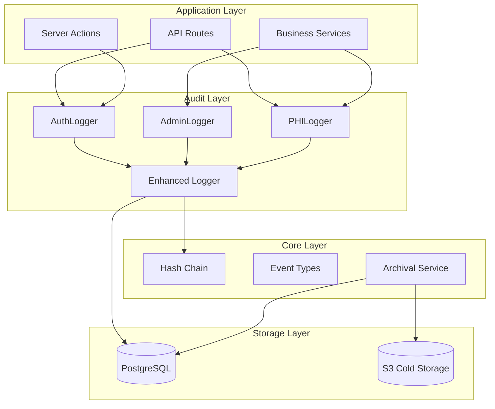
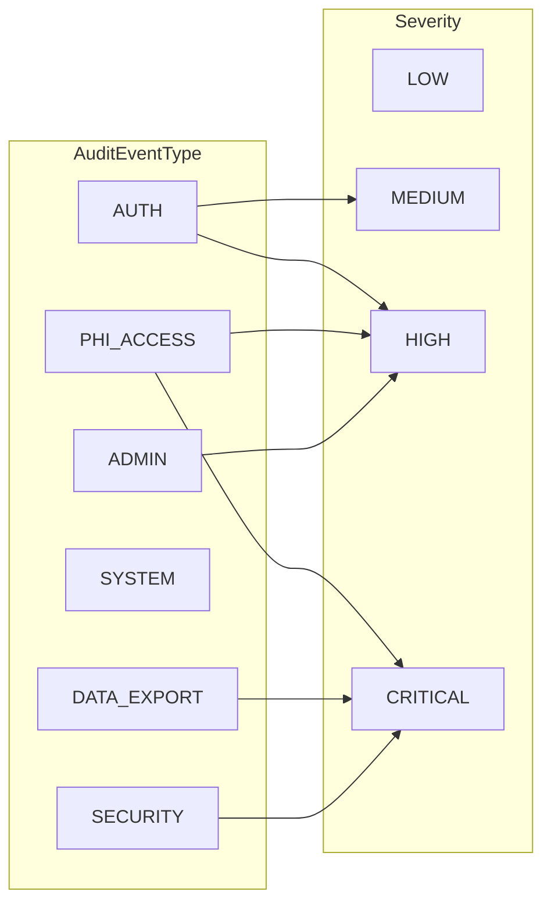
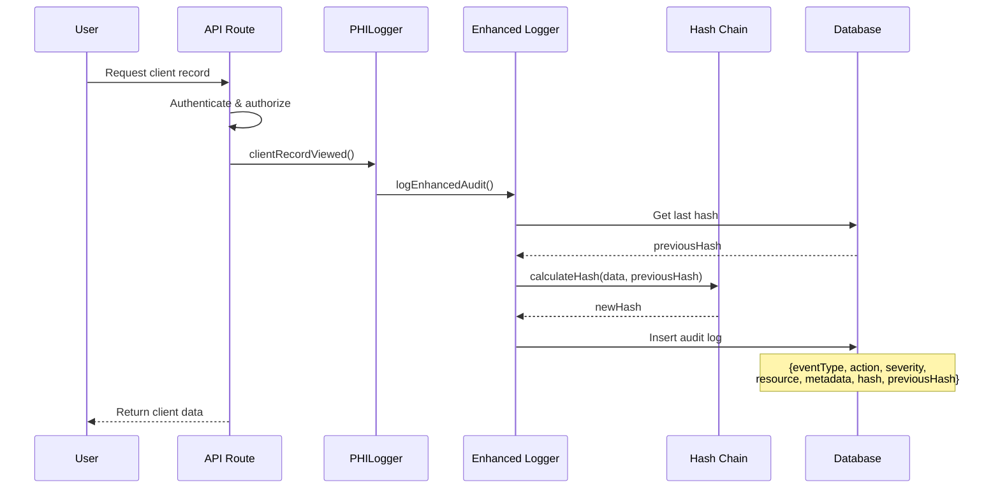
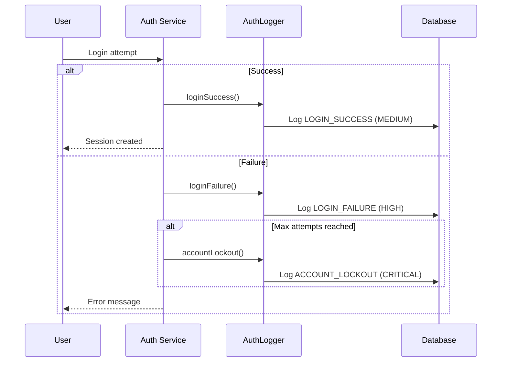
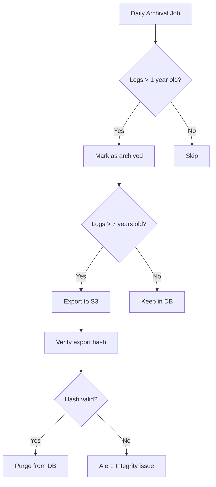
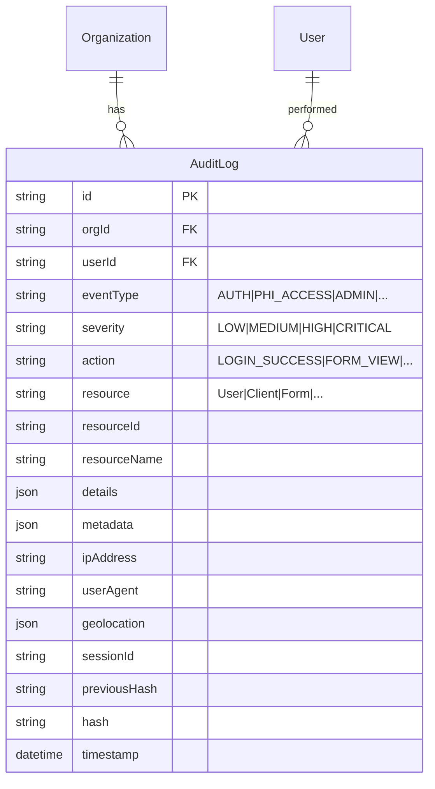
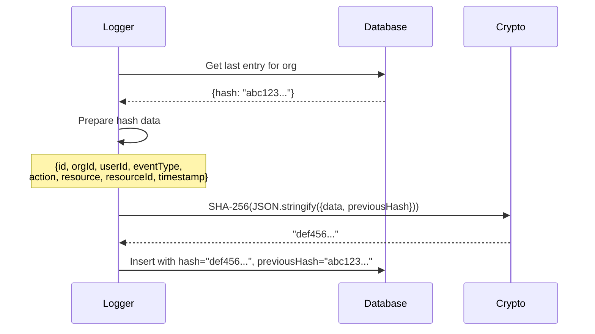
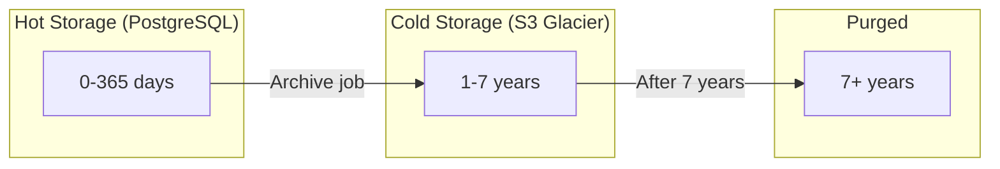

# Enhanced Audit Logging - Technical Design

**Status:** Implemented
**Linear Issue:** PX-669
**Date:** January 31, 2026

## Overview

HIPAA-compliant audit logging system with comprehensive event tracking, hash-chain integrity, and 7-year retention support.

## Architecture

### Component Diagram



## Event Types

### Event Classification



### Event Taxonomy

| Event Type | Actions | Severity |
|------------|---------|----------|
| AUTH | LOGIN_SUCCESS, LOGIN_FAILURE, LOGOUT, SESSION_TIMEOUT, PASSWORD_CHANGE, MFA_SETUP, MFA_VERIFY, ACCOUNT_LOCKOUT, ACCOUNT_UNLOCK | MEDIUM-CRITICAL |
| PHI_ACCESS | FORM_SUBMISSION_VIEW/EDIT/EXPORT, CLIENT_RECORD_VIEW/EDIT/EXPORT, CALL_RECORDING_PLAY/DOWNLOAD, TRANSCRIPT_VIEW, REPORT_GENERATE | HIGH-CRITICAL |
| ADMIN | USER_CREATE/UPDATE/DELETE, ROLE_ASSIGN, PERMISSION_GRANT, ORG_SETTINGS_UPDATE | HIGH |
| DATA_EXPORT | BULK_EXPORT | CRITICAL |
| SECURITY | SUSPICIOUS_ACTIVITY, RATE_LIMIT_EXCEEDED, UNAUTHORIZED_ACCESS_ATTEMPT | HIGH-CRITICAL |

## User Flows

### PHI Access Logging Flow



### Authentication Event Flow



### Log Archival Flow



## Data Model

### Audit Log Entry



### Metadata Structure

```json
{
  "eventType": "PHI_ACCESS",
  "severity": "HIGH",
  "fieldsAccessed": ["clientName", "diagnosis", "ssn"],
  "sensitiveFieldsAccessed": ["ssn"],
  "clientId": "uuid",
  "formId": "uuid",
  "exportFormat": "csv",
  "recordCount": 150
}
```

## Hash Chain Integrity

### Hash Calculation



### Chain Verification

```mermaid
flowchart TD
    A[Start Verification] --> B[Fetch logs in order]
    B --> C{For each log i > 0}
    C --> D{log[i].previousHash == log[i-1].hash?}
    D -->|Yes| E[Continue]
    D -->|No| F[CHAIN BROKEN at i]
    E --> C
    C -->|Done| G[CHAIN VALID]
    F --> H[Return error position]
```

## Retention Policy

### HIPAA Requirements

| Data Type | Retention | Storage |
|-----------|-----------|---------|
| AUTH events | 7 years | Hot → Cold after 1 year |
| PHI_ACCESS | 7 years | Hot → Cold after 1 year |
| ADMIN events | 7 years | Hot → Cold after 1 year |
| SYSTEM events | 3 years | Hot → Cold after 6 months |
| DATA_EXPORT | 7 years | Hot → Cold after 1 year |

### Storage Tiers



## File Structure

```
src/lib/audit/
├── events.ts           # Event types, actions, severity enums
├── enhanced-logger.ts  # Core logging with hash chain
├── phi-access.ts       # PHI-specific logging helpers
├── archival.ts         # Retention and archival service
├── hash-chain.ts       # Hash chain utilities (existing)
├── service.ts          # Legacy service (existing)
├── reports.ts          # Compliance reports (existing)
├── types.ts            # Type definitions (existing)
└── index.ts            # Exports
```

## API Usage

### Logging Authentication Events

```typescript
import { AuthLogger } from "@/lib/audit";

// Login success
await AuthLogger.loginSuccess({
  orgId: user.orgId,
  userId: user.id,
  ipAddress: request.ip,
  userAgent: request.headers["user-agent"],
});

// Login failure
await AuthLogger.loginFailure({
  orgId: org.id,
  attemptedEmail: email,
  ipAddress: request.ip,
  failureReason: "INVALID_PASSWORD",
  failedAttempts: 3,
});

// Account lockout
await AuthLogger.accountLockout({
  orgId: user.orgId,
  userId: user.id,
  ipAddress: request.ip,
  failedAttempts: 5,
  lockoutDurationMinutes: 30,
});
```

### Logging PHI Access

```typescript
import { PHILogger } from "@/lib/audit";

// Form submission viewed
await PHILogger.submissionViewed({
  orgId: user.orgId,
  userId: user.id,
  submissionId: submission.id,
  formId: form.id,
  formName: form.name,
  fieldsAccessed: ["clientName", "address", "phone"],
  sensitiveFieldsAccessed: ["ssn"],
  clientId: client.id,
  ipAddress: request.ip,
});

// Call recording downloaded (CRITICAL)
await PHILogger.callRecordingDownloaded({
  orgId: user.orgId,
  userId: user.id,
  callId: call.id,
  clientId: call.clientId,
  ipAddress: request.ip,
});
```

### Archival Operations

```typescript
import { archiveOldLogs, checkRetentionCompliance } from "@/lib/audit";

// Archive logs older than 1 year
const stats = await archiveOldLogs(orgId, {
  olderThanDays: 365,
  batchSize: 1000,
  dryRun: false,
});

// Check compliance
const compliance = await checkRetentionCompliance(orgId);
if (!compliance.compliant) {
  console.error("Compliance issues:", compliance.issues);
}
```

## Testing Checklist

- [ ] AuthLogger logs all authentication events
- [ ] PHILogger logs all PHI access with field-level detail
- [ ] Hash chain integrity maintained across entries
- [ ] Severity correctly assigned based on event type
- [ ] Geolocation captured when available
- [ ] Session ID correlation working
- [ ] Archival marks old logs correctly
- [ ] Compliance check detects chain breaks
- [ ] Export generates valid integrity hash
- [ ] 7-year retention enforced

## HIPAA Compliance Mapping

| Requirement | Implementation |
|-------------|----------------|
| §164.312(b) Audit Controls | Comprehensive event logging |
| §164.308(a)(1)(ii)(D) | Information system activity review |
| §164.312(c)(1) | Hash chain for integrity |
| §164.530(j) | 7-year retention policy |
| §164.308(a)(5)(ii)(C) | Login monitoring |
