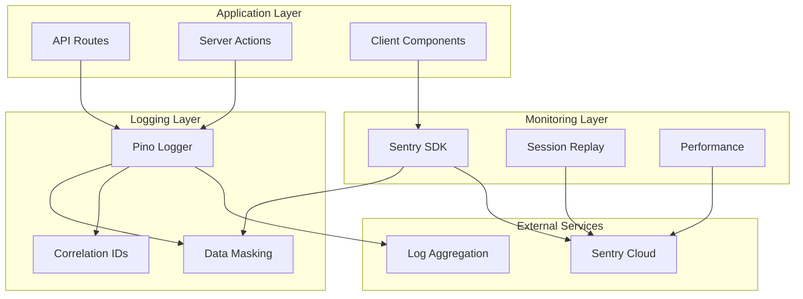
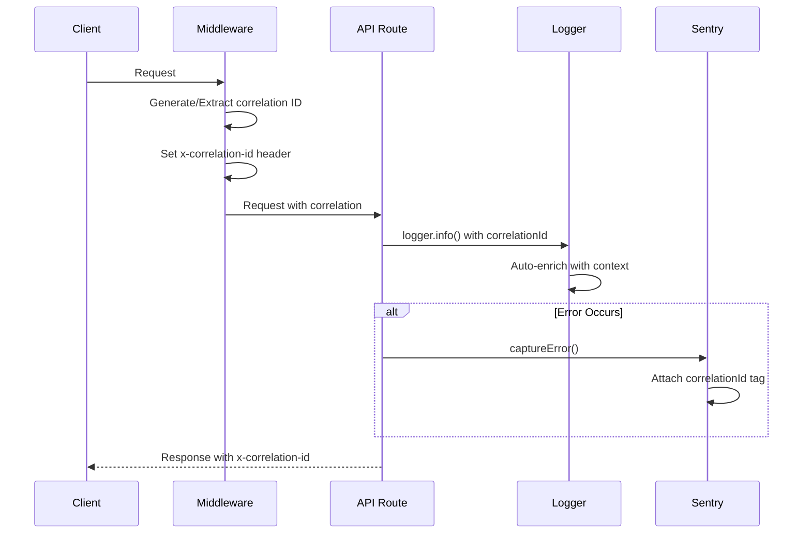
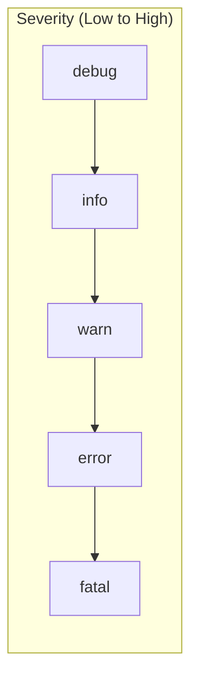
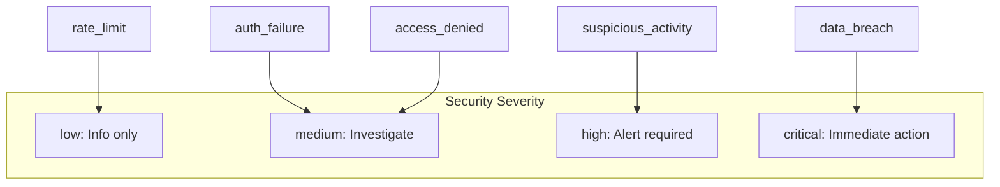
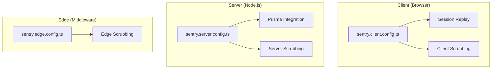
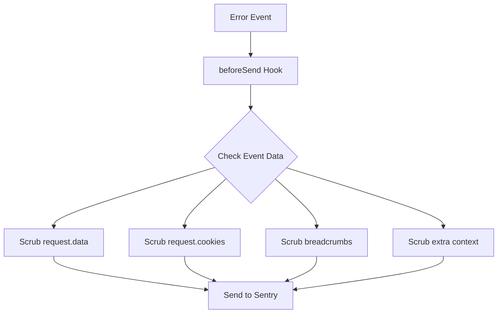

# Centralized Logging & Monitoring - Technical Design

**Status:** Implemented
**Linear Issue:** PX-671
**Date:** January 31, 2026

## Overview

Comprehensive logging and monitoring infrastructure using Pino for structured logging and Sentry for error tracking. All logs are JSON-formatted with automatic sensitive data masking for HIPAA/SOC 2 compliance.

## Architecture

### Component Diagram



## Request Flow

### Correlation ID Flow



### Data Masking Flow

```mermaid
flowchart TD
    A[Log Data] --> B{Contains Sensitive?}
    B -->|Email| C[mask: j***@example.com]
    B -->|Phone| D[mask: ***-***-1234]
    B -->|SSN| E[mask: ***-**-6789]
    B -->|Card| F[mask: ****-****-****-1234]
    B -->|Token| G[mask: [REDACTED]]
    B -->|API Key| H[mask: sk-***abc]
    B -->|No| I[Pass through]

    C --> J[Safe Log Entry]
    D --> J
    E --> J
    F --> J
    G --> J
    H --> J
    I --> J
```

## Log Levels & Categories

### Log Levels



### Specialized Log Methods

| Method | Purpose | Example |
|--------|---------|---------|
| `logger.info()` | General information | User actions, state changes |
| `logger.error()` | Error with stack trace | Exceptions, failures |
| `logger.security()` | Security events | Auth failures, access denials |
| `logger.request()` | HTTP request logging | Method, path, status, duration |
| `logger.external()` | External service calls | Twilio, Stripe, Deepgram |
| `logger.database()` | Database operations | Queries, migrations |
| `logger.job()` | Background jobs | BullMQ job execution |

### Security Event Severities



## Sensitive Data Masking

### Masked Field Types

| Pattern | Example Input | Masked Output |
|---------|---------------|---------------|
| Email | `john@example.com` | `j***@example.com` |
| Phone | `555-123-4567` | `***-***-4567` |
| SSN | `123-45-6789` | `***-**-6789` |
| Credit Card | `4111111111111234` | `****-****-****-1234` |
| JWT Token | `eyJhbGc...` | `[JWT REDACTED]` |
| API Key | `sk_live_abc123` | `sk_l***123` |
| Bearer Token | `Bearer xyz` | `Bearer [REDACTED]` |

### Field Name Detection

Fields automatically masked based on name patterns:
- `password`, `secret`, `token`, `key`, `auth`
- `ssn`, `social`, `tax`
- `card`, `cvv`, `cvc`
- `phone`, `mobile`, `cell`
- `address`, `street`
- `dob`, `birthdate`

## Sentry Integration

### Configuration Layers



### Session Replay (HIPAA Compliant)

```typescript
// All text masked, all media blocked
Sentry.replayIntegration({
  maskAllText: true,
  blockAllMedia: true,
  maskAllInputs: true,
})
```

### Error Scrubbing



## File Structure

```
src/lib/logging/
├── masking.ts      # Sensitive data masking utilities
├── correlation.ts  # Correlation ID management
├── logger.ts       # Pino-based structured logger
└── index.ts        # Exports

src/lib/monitoring/
├── sentry.ts       # Sentry utilities
└── index.ts        # Exports

/
├── sentry.client.config.ts  # Client-side Sentry
├── sentry.server.config.ts  # Server-side Sentry
├── sentry.edge.config.ts    # Edge runtime Sentry
└── middleware.ts            # Correlation ID injection
```

## Environment Variables

```bash
# Sentry Configuration
SENTRY_DSN=https://xxx@xxx.ingest.sentry.io/xxx
NEXT_PUBLIC_SENTRY_DSN=https://xxx@xxx.ingest.sentry.io/xxx
SENTRY_AUTH_TOKEN=sntrys_xxx
SENTRY_ORG=your-org
SENTRY_PROJECT=scribe
SENTRY_RELEASE=1.0.0

# Logging
LOG_LEVEL=info  # debug, info, warn, error

# Development
SENTRY_DEBUG=false  # Enable Sentry in dev
```

## Usage Examples

### Basic Logging

```typescript
import { logger } from '@/lib/logging';

// Info log
logger.info('User logged in', { userId: 'user123' });

// Error log with stack trace
logger.error('Failed to process form', error, { formId: 'form456' });

// Warning
logger.warn('Deprecated API called', { endpoint: '/api/v1/old' });
```

### Security Logging

```typescript
import { logger } from '@/lib/logging';

// Authentication failure
logger.security('auth_failure', 'Invalid password', {
  userId: 'user123',
  ip: '192.168.1.1',
  attempts: 3,
});

// Access denied
logger.security('access_denied', 'Insufficient permissions', {
  userId: 'user123',
  resource: 'admin_panel',
  required: 'ADMIN',
  actual: 'VIEWER',
});
```

### Request Logging

```typescript
import { logger } from '@/lib/logging';

// HTTP request
logger.request('POST', '/api/forms', 201, 45, {
  userId: 'user123',
  formId: 'form456',
});

// External service call
logger.external('Twilio', 'sendSms', true, 230, {
  to: '***-***-1234',
});
```

### Child Loggers

```typescript
import { createLogger } from '@/lib/logging';

// Create bound logger for request
const reqLogger = createLogger({
  correlationId: 'abc123',
  userId: 'user123',
  organizationId: 'org456',
});

reqLogger.info('Processing started');
reqLogger.info('Step 1 complete');
reqLogger.info('Processing finished');
// All logs include correlationId, userId, organizationId
```

### Sentry Error Tracking

```typescript
import { captureError, setSentryUser } from '@/lib/monitoring';

// Set user context
setSentryUser({
  id: 'user123',
  organizationId: 'org456',
  role: 'ADMIN',
});

// Capture error with context
captureError(error, {
  action: 'createForm',
  formId: 'form123',
});
```

## Log Output Format

### Development (Pretty)

```
[19:15:30] INFO: User logged in
    userId: "user123"
    correlationId: "abc123xyz"
    action: "login"
```

### Production (JSON)

```json
{
  "level": 30,
  "time": 1706745330000,
  "msg": "User logged in",
  "userId": "user123",
  "correlationId": "abc123xyz",
  "action": "login",
  "service": "scribe",
  "environment": "production"
}
```

## Testing Checklist

- [ ] Structured JSON logs in production
- [ ] Pretty-printed logs in development
- [ ] Correlation IDs in all request logs
- [ ] Emails masked: `j***@example.com`
- [ ] Phone numbers masked: `***-***-1234`
- [ ] SSNs masked: `***-**-6789`
- [ ] Tokens masked: `[REDACTED]`
- [ ] API keys masked: `sk_l***123`
- [ ] Sentry capturing errors
- [ ] Session replay with text/media masked
- [ ] Security events with severity levels

## SOC 2 Compliance

| Control | Implementation |
|---------|----------------|
| CC7.2 | Structured logging with correlation |
| CC7.3 | Security event classification |
| CC6.1 | Sensitive data masking |
| A1.2 | Error tracking and alerting |
