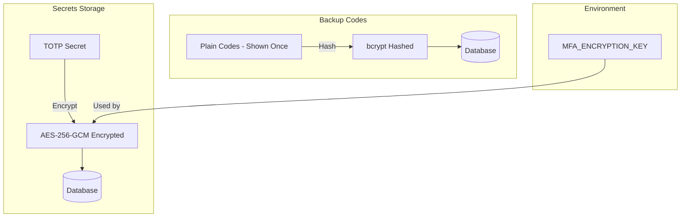
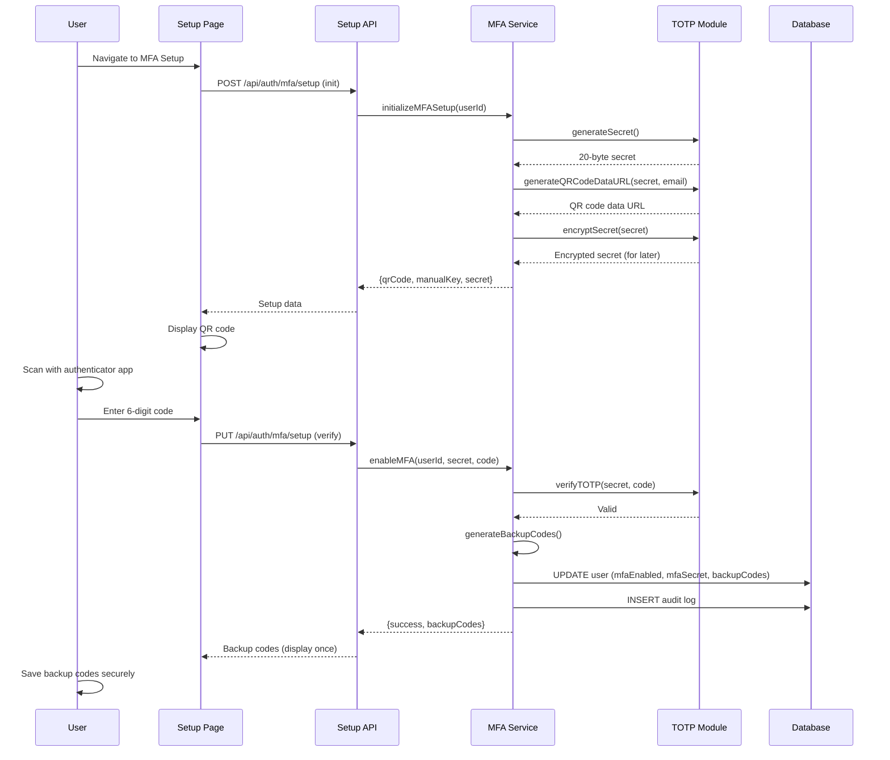
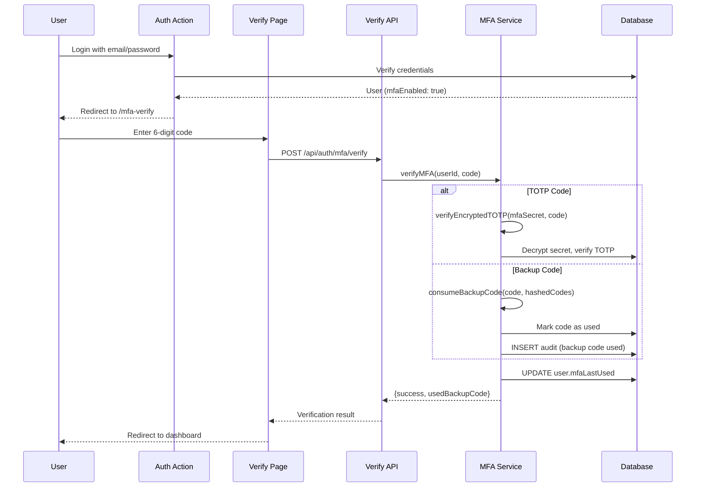
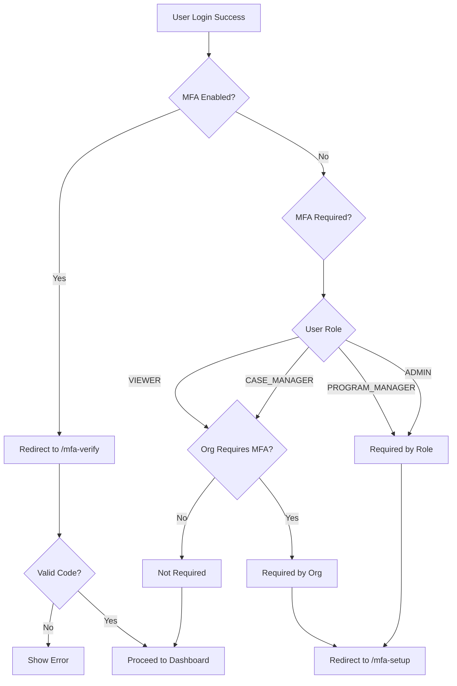
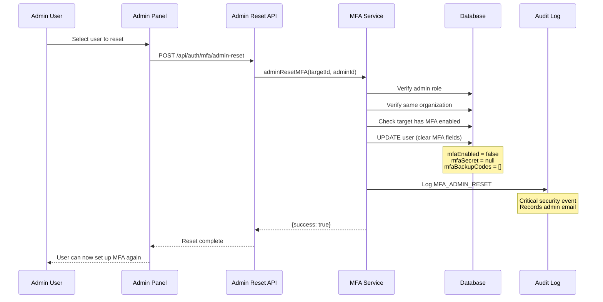
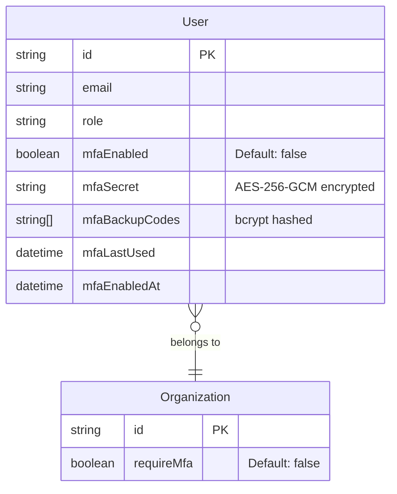

# Multi-Factor Authentication (MFA) - Technical Design

**Status:** Implemented
**Linear Issue:** PX-665
**Date:** January 31, 2026

## Overview

TOTP-based Multi-Factor Authentication (RFC 6238) with backup codes for account recovery. Supports authenticator apps (Google Authenticator, Authy, 1Password) with role-based and organization-level enforcement.

## Architecture

### Component Diagram

```mermaid
graph TB
    subgraph "Client Layer"
        Setup[MFA Setup Page]
        Verify[MFA Verify Page]
        Settings[User Settings]
    end

    subgraph "API Layer"
        SetupAPI[/api/auth/mfa/setup]
        VerifyAPI[/api/auth/mfa/verify]
        BackupAPI[/api/auth/mfa/backup-codes]
        StatusAPI[/api/auth/mfa/status]
        DisableAPI[/api/auth/mfa/disable]
        AdminAPI[/api/auth/mfa/admin-reset]
        OrgAPI[/api/auth/mfa/org-setting]
    end

    subgraph "Service Layer"
        MFAService[MFA Service]
        TOTPModule[TOTP Module]
        BackupModule[Backup Codes]
    end

    subgraph "Storage Layer"
        DB[(PostgreSQL)]
        Audit[(Audit Log)]
    end

    Setup --> SetupAPI
    Verify --> VerifyAPI
    Settings --> StatusAPI
    Settings --> DisableAPI

    SetupAPI --> MFAService
    VerifyAPI --> MFAService
    BackupAPI --> MFAService
    StatusAPI --> MFAService
    DisableAPI --> MFAService
    AdminAPI --> MFAService
    OrgAPI --> MFAService

    MFAService --> TOTPModule
    MFAService --> BackupModule
    MFAService --> DB
    MFAService --> Audit
```

### Security Architecture



## MFA Setup Flow



## MFA Verification Flow



## Enforcement Rules



## Admin Reset Flow



## Data Model

### User MFA Fields



### Backup Code Format

```
Storage Format (hashed):
[
  "$2b$12$...",  // Hash of "ABCD1234"
  "$2b$12$...",  // Hash of "EFGH5678"
  "USED",        // Consumed code marker
  ...
]

Display Format (plain, shown once):
ABCD-1234
EFGH-5678
IJKL-9012
...
```

## Configuration

### Environment Variables

```bash
# Required: 32-byte hex key for AES-256-GCM encryption
MFA_ENCRYPTION_KEY=your-64-character-hex-string

# Generate with:
openssl rand -hex 32
```

### TOTP Configuration

| Setting | Value | Description |
|---------|-------|-------------|
| Algorithm | SHA-1 | Standard for TOTP |
| Digits | 6 | Code length |
| Period | 30 seconds | Time step |
| Window | 1 step | Clock drift tolerance (±30s) |
| Secret Length | 20 bytes | 160 bits entropy |

### Backup Codes Configuration

| Setting | Value | Description |
|---------|-------|-------------|
| Count | 10 codes | Per user |
| Format | 8 chars | Alphanumeric |
| Hashing | bcrypt | 12 rounds |
| Display | XXXX-XXXX | Formatted for readability |

## File Structure

```
src/lib/auth/mfa/
├── totp.ts          # TOTP generation, verification, QR codes
├── backup-codes.ts  # Backup code generation and validation
├── service.ts       # MFA orchestration and business logic
└── index.ts         # Public exports

src/app/api/auth/mfa/
├── setup/route.ts        # Initialize and complete setup
├── verify/route.ts       # Verify TOTP or backup code
├── backup-codes/route.ts # Regenerate backup codes
├── status/route.ts       # Get MFA status
├── disable/route.ts      # Disable MFA (self or admin)
├── admin-reset/route.ts  # Admin reset for locked users
└── org-setting/route.ts  # Organization MFA requirement

src/app/(auth)/
├── mfa-setup/page.tsx   # Setup wizard UI
└── mfa-verify/page.tsx  # Verification UI
```

## API Endpoints

### POST /api/auth/mfa/setup

Initialize MFA setup.

**Response:**
```json
{
  "success": true,
  "qrCode": "data:image/png;base64,...",
  "manualKey": "ABCD EFGH IJKL MNOP QRST",
  "secret": "ABCDEFGHIJKLMNOPQRST"
}
```

### PUT /api/auth/mfa/setup

Complete MFA setup with verification code.

**Request:**
```json
{
  "secret": "ABCDEFGHIJKLMNOPQRST",
  "code": "123456"
}
```

**Response:**
```json
{
  "success": true,
  "backupCodes": [
    "ABCD-1234",
    "EFGH-5678",
    ...
  ]
}
```

### POST /api/auth/mfa/verify

Verify MFA code during login.

**Request:**
```json
{
  "userId": "user-uuid",
  "code": "123456"
}
```

**Response:**
```json
{
  "success": true,
  "usedBackupCode": false,
  "remainingBackupCodes": 10
}
```

## Security Events

| Event | Severity | Trigger |
|-------|----------|---------|
| MFA_ENABLED | MEDIUM | User enables MFA |
| MFA_DISABLED | HIGH | User or admin disables MFA |
| MFA_ADMIN_RESET | CRITICAL | Admin resets user's MFA |
| MFA_BACKUP_CODE_USED | MEDIUM | Backup code consumed |
| MFA_BACKUP_CODES_REGENERATED | MEDIUM | New backup codes generated |
| ORG_MFA_REQUIREMENT_CHANGED | HIGH | Org-wide MFA setting changed |

## Testing Checklist

- [ ] TOTP setup generates valid QR code
- [ ] Authenticator apps accept generated secrets
- [ ] 6-digit codes verify within 30-second window
- [ ] Clock drift tolerance works (±30 seconds)
- [ ] Backup codes generate and verify correctly
- [ ] Backup codes can only be used once
- [ ] MFA required for ADMIN/PROGRAM_MANAGER roles
- [ ] Organization-wide MFA enforcement works
- [ ] Admin can reset locked-out user's MFA
- [ ] All MFA events logged to audit trail
- [ ] Secrets encrypted at rest

## HIPAA Compliance Mapping

| Requirement | Implementation |
|-------------|----------------|
| §164.312(d) Person/Entity Auth | TOTP as second factor |
| §164.312(a)(2)(i) Unique User ID | Per-user MFA secrets |
| §164.308(a)(5)(ii)(D) Password Mgmt | MFA as additional control |
| §164.312(b) Audit Controls | All MFA events logged |
| §164.312(c)(1) Integrity | Encrypted secrets, hashed codes |
