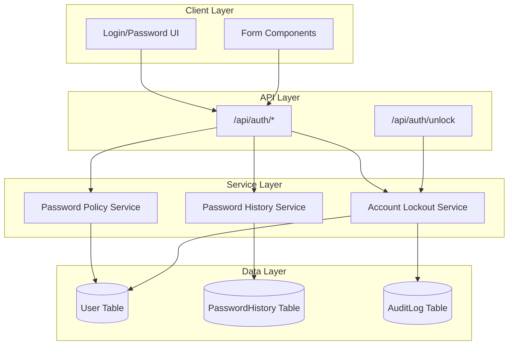
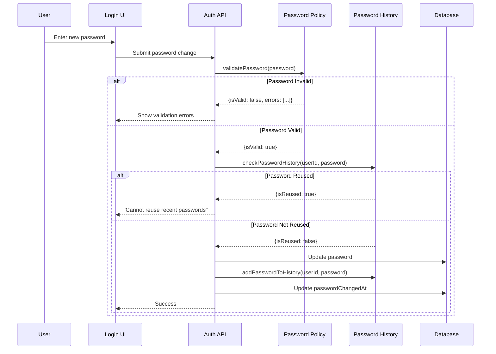
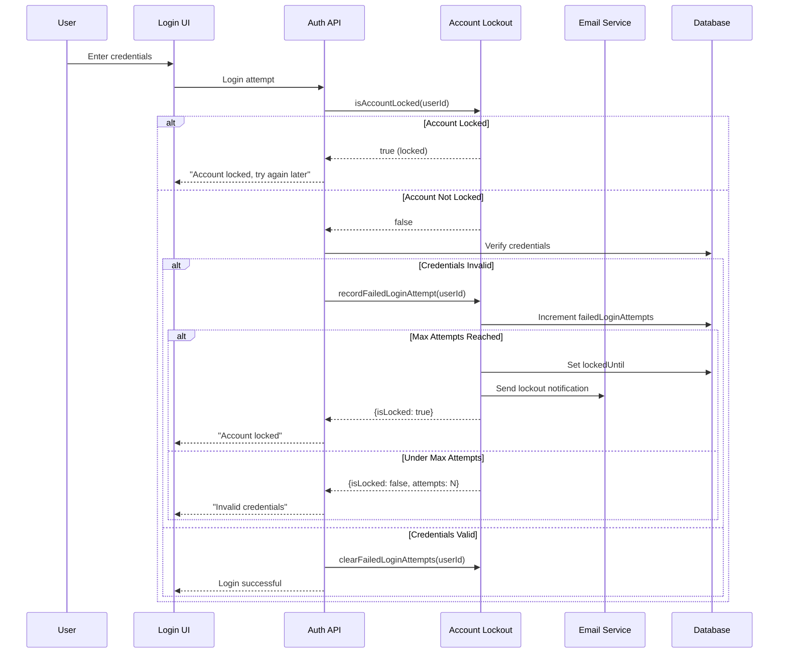
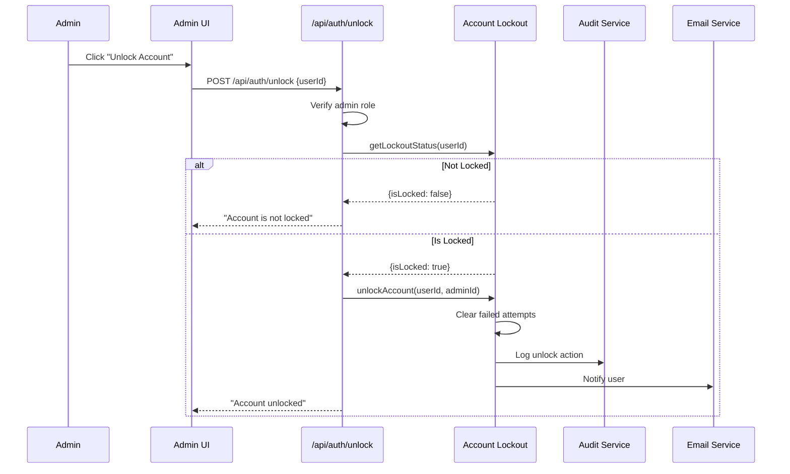
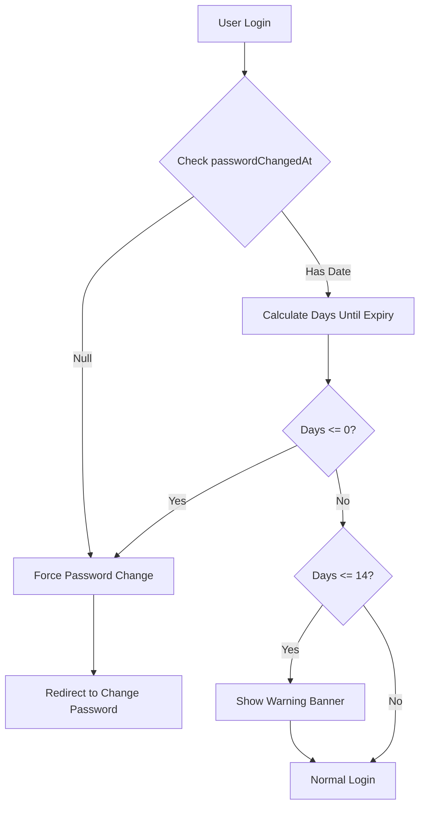
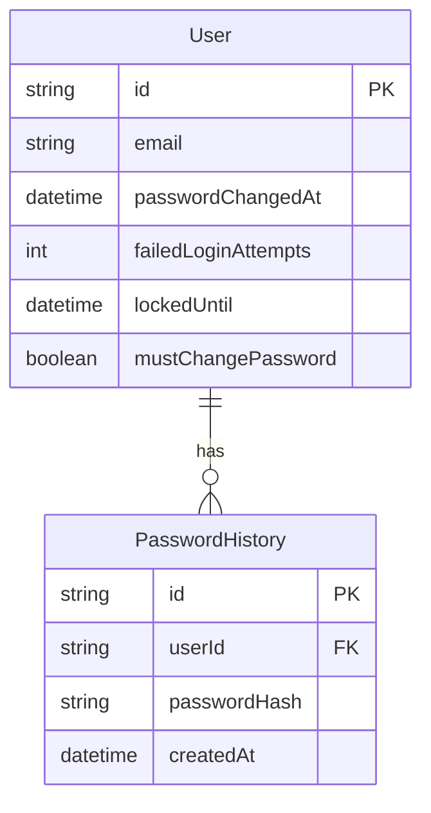

# Password Policy & Security Headers - Technical Design

**Status:** Implemented
**Linear Issue:** PX-668
**Date:** January 31, 2026

## Overview

This document describes the HIPAA-compliant password policy and security headers implementation for Scribe.

## Architecture

### Component Diagram



## User Flows

### Password Validation Flow



### Account Lockout Flow



### Admin Unlock Flow



### Password Expiration Check Flow



## Data Model

### User Fields (Password Security)



## Configuration

### Password Policy Defaults

| Setting | Default | Range | Description |
|---------|---------|-------|-------------|
| MIN_LENGTH | 8 | - | Minimum password length |
| MAX_LENGTH | 128 | - | Maximum password length |
| DEFAULT_EXPIRATION_DAYS | 90 | 30-180 | Days until password expires |
| EXPIRATION_WARNING_DAYS | 14 | - | Days before expiry to warn |
| PASSWORD_HISTORY_COUNT | 12 | - | Passwords to remember |

### Account Lockout Defaults

| Setting | Default | Description |
|---------|---------|-------------|
| MAX_FAILED_ATTEMPTS | 5 | Attempts before lockout |
| LOCKOUT_DURATION_MINUTES | 30 | Lockout duration |

## Security Headers

### Implemented Headers

| Header | Value | Purpose |
|--------|-------|---------|
| Strict-Transport-Security | max-age=31536000; includeSubDomains; preload | Force HTTPS |
| Content-Security-Policy | default-src 'self'... | Prevent XSS |
| X-Frame-Options | DENY | Prevent clickjacking |
| X-Content-Type-Options | nosniff | Prevent MIME sniffing |
| X-XSS-Protection | 1; mode=block | XSS filter |
| Referrer-Policy | strict-origin-when-cross-origin | Control referrer |

## File Structure

```
src/lib/auth/
├── password-policy.ts      # Validation, expiration checking
├── password-history.ts     # History tracking, reuse prevention
├── account-lockout.ts      # Lockout logic, admin unlock
└── actions.ts              # Auth server actions (updated)

src/app/api/auth/
└── unlock/
    └── route.ts            # Admin unlock endpoint

next.config.js              # Security headers
prisma/schema.prisma        # PasswordHistory model
```

## API Endpoints

### POST /api/auth/unlock

Unlock a locked user account (admin only).

**Request:**
```json
{
  "userId": "uuid"
}
```

**Response:**
```json
{
  "success": true,
  "message": "Account has been unlocked"
}
```

### GET /api/auth/unlock?userId=uuid

Check lockout status for a user (admin only).

**Response:**
```json
{
  "isLocked": true,
  "failedAttempts": 5,
  "lockedUntil": "2026-01-31T12:00:00Z",
  "minutesRemaining": 25
}
```

## Testing Checklist

- [ ] Password validation rejects weak passwords
- [ ] Password validation rejects common passwords
- [ ] Password history prevents reuse of last 12 passwords
- [ ] Account locks after 5 failed attempts
- [ ] Account unlocks after 30 minutes
- [ ] Admin can manually unlock accounts
- [ ] Password expiration warning shows at 14 days
- [ ] Expired passwords force change
- [ ] Security headers present in responses
- [ ] Audit log records lockout/unlock events

## HIPAA Compliance Mapping

| Requirement | Implementation |
|-------------|----------------|
| §164.308(a)(5)(ii)(D) | Password expiration, complexity |
| §164.312(a)(2)(i) | Unique user identification |
| §164.312(d) | Account lockout, MFA |
| §164.312(b) | Audit logging of auth events |
