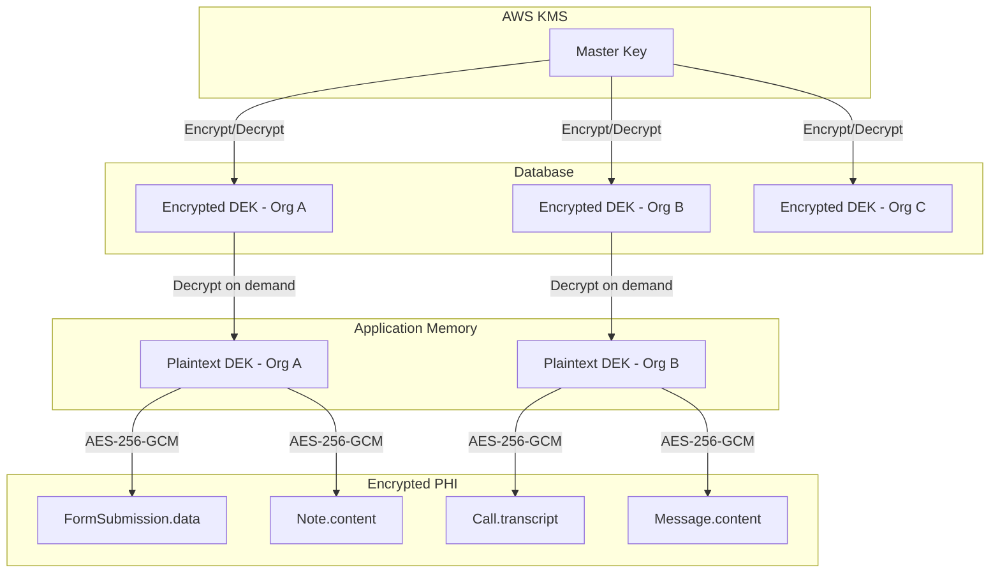
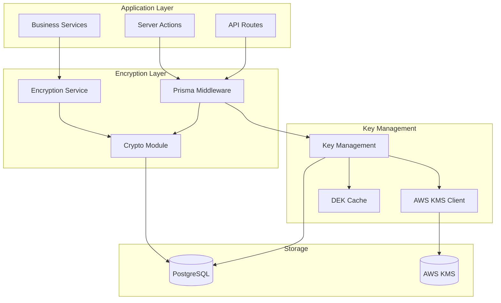
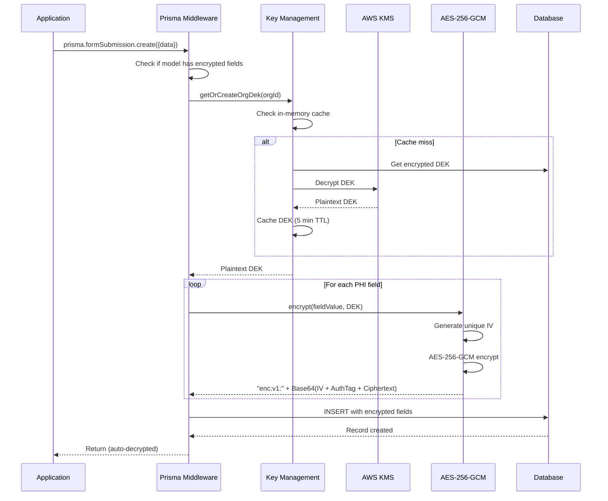
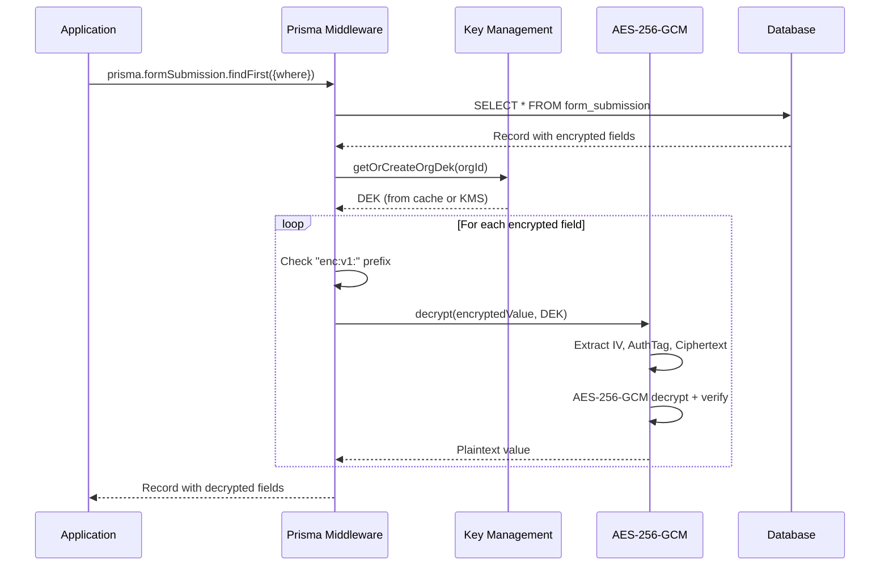
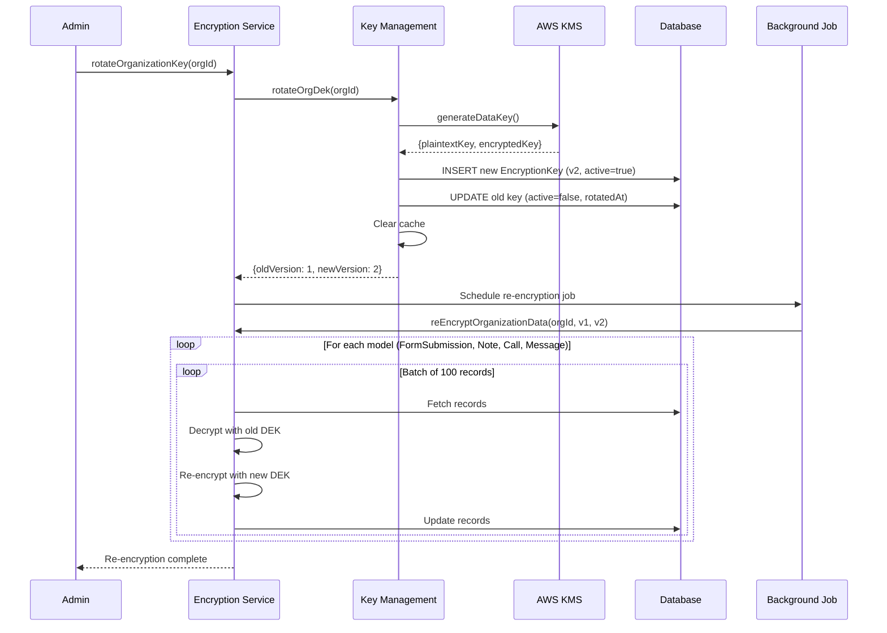
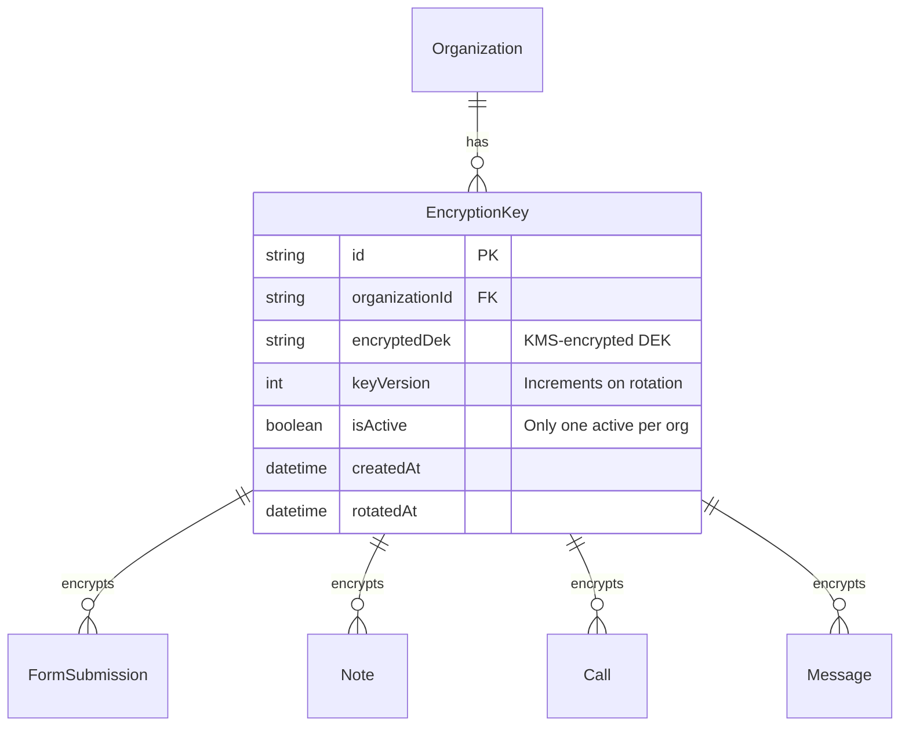
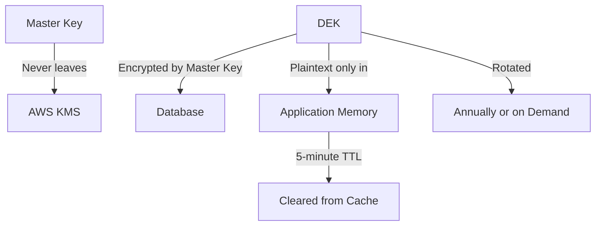

# PHI Field Encryption - Technical Design

**Status:** Implemented
**Linear Issue:** PX-666
**Date:** January 31, 2026

## Overview

Application-level field encryption for Protected Health Information (PHI) using AES-256-GCM with envelope encryption via AWS KMS. Provides transparent encryption/decryption through Prisma middleware with per-organization Data Encryption Keys (DEKs).

## Architecture

### Key Hierarchy



### Component Diagram



## Encryption Flow

### Write Flow (Automatic via Middleware)



### Read Flow (Automatic via Middleware)



### Key Rotation Flow



## Data Model

### EncryptionKey Entity



### Encrypted Data Format

```
enc:v1:[Base64-encoded data]

Where Base64 decodes to:
┌────────────────┬──────────────────┬─────────────────┐
│   IV (12B)     │  Auth Tag (16B)  │   Ciphertext    │
└────────────────┴──────────────────┴─────────────────┘
```

## Encrypted Fields

| Model | Field | Type | Description |
|-------|-------|------|-------------|
| FormSubmission | data | JSON | Form field values with PHI |
| FormSubmission | aiExtractedData | JSON | AI-extracted data from calls |
| Note | content | String | Rich text HTML content |
| Call | transcriptRaw | String | Raw call transcript |
| Call | transcriptJson | JSON | Structured transcript |
| Call | extractedFields | JSON | AI-extracted form fields |
| Call | aiSummary | JSON | AI-generated summary |
| Call | confidenceScores | JSON | AI confidence scores |
| Message | content | String | Message text |

## Configuration

### Environment Variables

```bash
# AWS KMS Configuration
AWS_KMS_KEY_ID=arn:aws:kms:us-west-2:123456789:key/abc-123
AWS_KMS_REGION=us-west-2  # Optional, defaults to AWS_REGION

# Development mode (KMS not required)
# If AWS_KMS_KEY_ID is not set, uses local key generation
# Keys are prefixed with "dev:" and NOT suitable for production
```

### Prisma Schema Addition

```prisma
model EncryptionKey {
  id              String    @id @default(uuid())
  organizationId  String
  encryptedDek    String    @db.Text
  keyVersion      Int       @default(1)
  isActive        Boolean   @default(true)
  createdAt       DateTime  @default(now())
  rotatedAt       DateTime?

  @@index([organizationId, isActive])
  @@index([organizationId, keyVersion])
}
```

## File Structure

```
src/lib/encryption/
├── crypto.ts           # AES-256-GCM encrypt/decrypt functions
├── kms.ts              # AWS KMS client and operations
├── key-management.ts   # DEK lifecycle and caching
├── field-encryption.ts # Prisma middleware
└── index.ts            # Public exports

src/lib/services/
└── encryption-service.ts # High-level API
```

## Usage Examples

### Automatic Encryption (Recommended)

```typescript
// Enable middleware in Prisma client initialization
import { createEncryptionMiddleware } from '@/lib/encryption';
prisma.$use(createEncryptionMiddleware());

// All operations are automatically encrypted/decrypted
const submission = await prisma.formSubmission.create({
  data: {
    orgId: 'org-123',
    formId: 'form-456',
    data: { ssn: '123-45-6789', name: 'John Doe' }, // Auto-encrypted
  }
});

// Reading returns decrypted data
const result = await prisma.formSubmission.findFirst({
  where: { id: submission.id }
});
console.log(result.data); // { ssn: '123-45-6789', name: 'John Doe' }
```

### Manual Encryption

```typescript
import { encryptValue, decryptValue } from '@/lib/services/encryption-service';

// Encrypt a value
const encrypted = await encryptValue('org-123', 'sensitive PHI data');
// Returns: "enc:v1:base64..."

// Decrypt a value
const decrypted = await decryptValue('org-123', encrypted);
// Returns: "sensitive PHI data"
```

### Key Rotation

```typescript
import {
  rotateOrganizationKey,
  reEncryptOrganizationData
} from '@/lib/services/encryption-service';

// 1. Rotate the key
const { oldVersion, newVersion } = await rotateOrganizationKey('org-123');

// 2. Re-encrypt existing data (run as background job)
const results = await reEncryptOrganizationData('org-123', oldVersion, newVersion, {
  batchSize: 100,
  onProgress: (model, count) => console.log(`${model}: ${count} processed`)
});
```

### Initial Migration

```typescript
import { encryptExistingData } from '@/lib/services/encryption-service';

// Encrypt all unencrypted data for an organization
const results = await encryptExistingData('org-123', {
  batchSize: 100,
  onProgress: (model, count) => console.log(`Encrypting ${model}: ${count}`)
});
```

## Security Considerations

### Key Protection



### Data Flow Security

1. **Master Key**: Never leaves AWS KMS hardware security modules
2. **DEK Storage**: Always encrypted at rest in database
3. **DEK in Memory**: Cached for 5 minutes, then cleared
4. **Unique IV**: Every encryption operation uses a random 12-byte IV
5. **Authentication**: GCM mode provides integrity verification

## Testing Checklist

- [ ] Encryption produces "enc:v1:" prefixed output
- [ ] Decryption reverses encryption correctly
- [ ] Unique IV per encryption operation
- [ ] Auth tag verification prevents tampering
- [ ] Organization isolation (Org A can't decrypt Org B data)
- [ ] Key rotation creates new version
- [ ] Re-encryption migrates data to new key
- [ ] Cache invalidation on key rotation
- [ ] Development mode works without KMS
- [ ] Production rejects dev-mode keys

## HIPAA Compliance Mapping

| Requirement | Implementation |
|-------------|----------------|
| §164.312(a)(2)(iv) Encryption | AES-256-GCM for PHI at rest |
| §164.312(e)(2)(ii) Encryption | Same encryption for PHI in transit |
| §164.312(c)(1) Integrity | GCM authentication tag |
| §164.308(a)(5)(ii)(D) Key Management | AWS KMS with rotation support |
| §164.312(d) Authentication | Per-organization key isolation |
