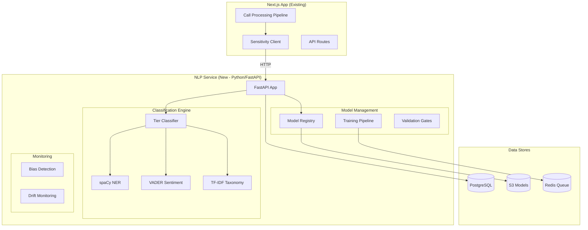
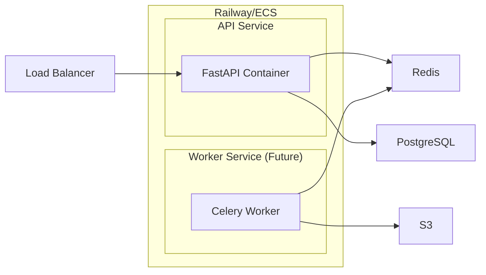
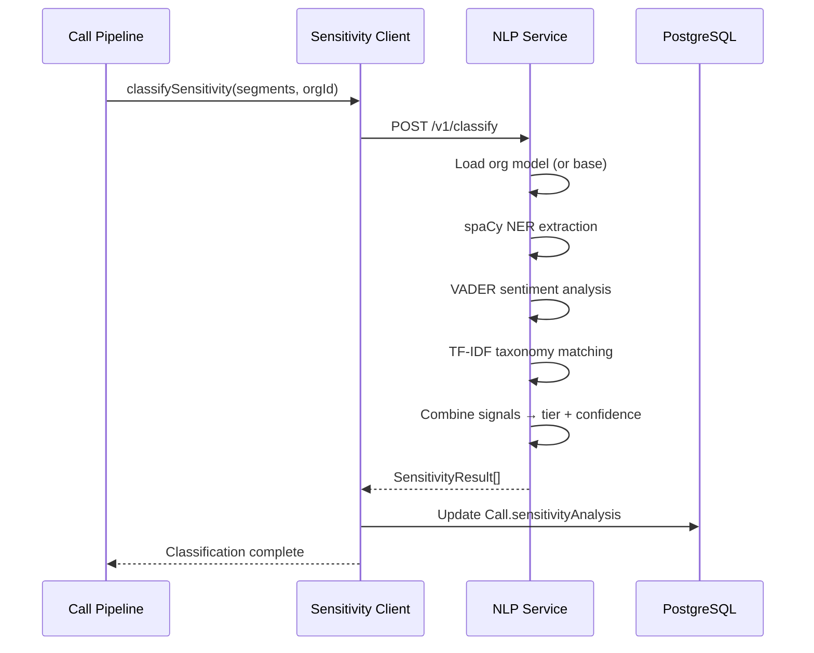
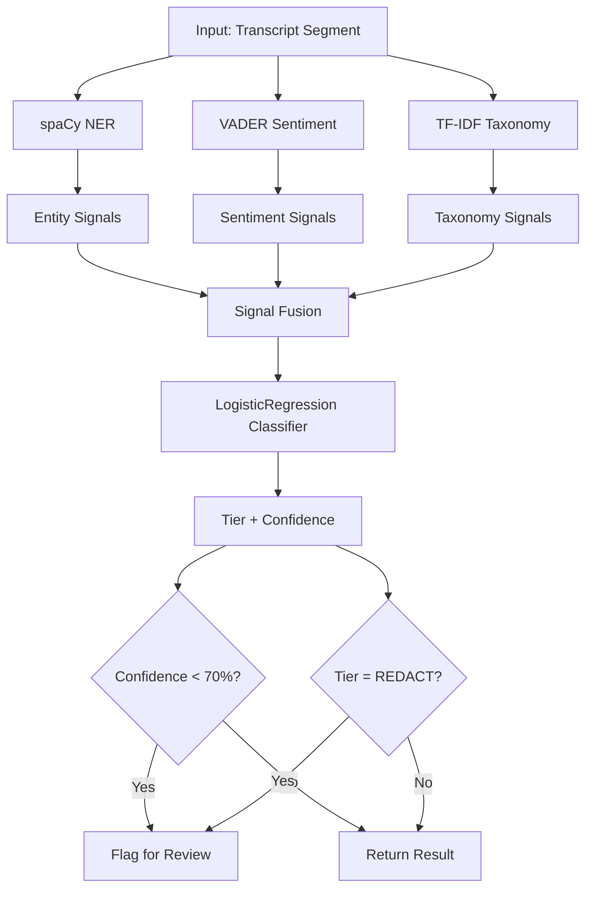
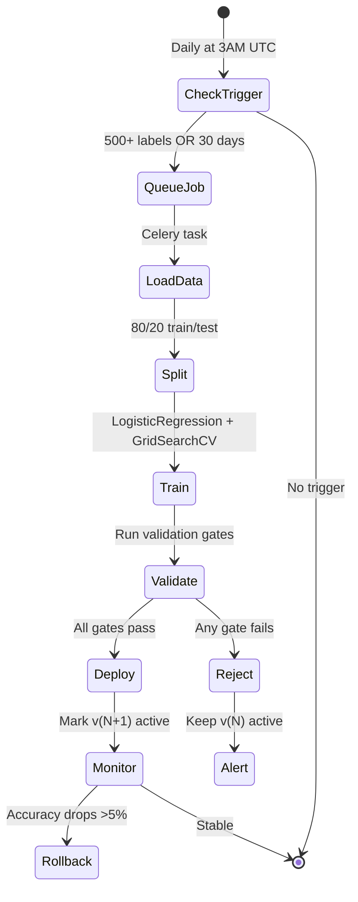

# Sensitivity Detection NLP — Technical Specification

**Version:** 1.0.0 | **Created:** 2026-03-28 | **Updated:** 2026-03-28
**Linear Ticket:** PX-878 | **PRD:** [PX-878-sensitivity-detection-prd.md](../specs/PX-878-sensitivity-detection-prd.md)

---

## 1. Overview

This document specifies the technical implementation of the Sensitivity Detection NLP system—a tiered content classifier that analyzes transcript segments and assigns them to three tiers: REDACT, RESTRICT, or STANDARD.

### Design Goals
- **Accuracy**: ≥85% classification accuracy
- **Latency**: <500ms for sensitivity analysis step
- **Privacy**: Internal-only audit logs, org-isolated training data
- **Compliance**: HIPAA-ready, SOC2-compatible audit trails
- **Scalability**: Handle 1000+ daily call transcripts per organization

---

## 2. Architecture

### 2.1 High-Level System Diagram



### 2.2 Container Architecture



### 2.3 Data Flow



---

## 3. Tech Stack

| Component | Technology | Rationale |
|-----------|------------|-----------|
| **Framework** | FastAPI | Async-native, Pydantic validation, OpenAPI docs |
| **Python** | 3.11 | Latest stable, good ML library support |
| **NER** | spaCy (en_core_web_lg) | Production-grade, HIPAA-capable entity extraction |
| **Sentiment** | VADER | Fast, rule-based, good for workplace context |
| **Classification** | TF-IDF + LogisticRegression | Interpretable, fast, low latency |
| **HTTP Client** | httpx (async) | Async requests from Node.js service |
| **Job Queue** | Celery + Redis | For retraining jobs (future) |
| **Model Storage** | S3 | Versioned model artifacts |
| **Database** | PostgreSQL (shared) | Audit logs, model metadata |

---

## 4. Data Models

### 4.1 Prisma Schema Additions

```prisma
// ============================================
// SENSITIVITY DETECTION (PX-878)
// ============================================

enum SensitivityTier {
  REDACT    // Personal/off-topic — permanently remove after confirmation
  RESTRICT  // Sensitive business — access-controlled
  STANDARD  // Normal work content — flows to workflows
}

// Extended Call model fields
model Call {
  // ... existing fields ...

  // Sensitivity Detection (PX-878)
  sensitivityAnalysis       Json?             // SensitivitySegmentResult[]
  sensitivityTier           SensitivityTier?  // Overall tier (highest risk)
  sensitivityConfidence     Float?            // Overall confidence (lowest of segments)
  sensitivityReviewed       Boolean           @default(false)
  sensitivityReviewedAt     DateTime?
  sensitivityReviewedById   String?
  pendingSensitivityReview  Boolean           @default(false) // Blocks pipeline if true
  sensitivityModelVersion   String?           // Model version used for classification
}

// Internal audit log for sensitivity decisions (NOT exposed to customers)
model SensitivityAuditLog {
  id              String   @id @default(cuid())
  orgId           String
  callId          String
  segmentIndex    Int
  segmentText     String   @db.Text // Encrypted, internal only
  originalTier    SensitivityTier
  finalTier       SensitivityTier
  action          String   // CONFIRMED | DISPUTED | ESCALATED
  confidence      Float
  modelVersion    String
  reviewedById    String?
  createdAt       DateTime @default(now())

  @@index([callId])
  @@index([orgId, createdAt])
  @@index([action])
}

// Model version tracking
model SensitivityModel {
  id            String    @id @default(cuid())
  orgId         String?   // null = shared base model
  version       String
  s3Key         String
  accuracy      Float
  precision     Float
  recall        Float
  f1Score       Float
  trainingSize  Int
  isActive      Boolean   @default(false)
  trainedAt     DateTime  @default(now())
  createdAt     DateTime  @default(now())

  @@unique([orgId, version])
  @@index([orgId, isActive])
}

// Retraining job tracking
model SensitivityRetrainingJob {
  id              String    @id @default(cuid())
  orgId           String?   // null = shared model
  status          String    // PENDING | RUNNING | COMPLETED | FAILED | ROLLED_BACK
  triggerReason   String    // THRESHOLD_LABELS | SCHEDULED | MANUAL
  labelCount      Int
  previousVersion String?
  newVersion      String?
  metrics         Json?
  error           String?
  startedAt       DateTime?
  completedAt     DateTime?
  createdAt       DateTime  @default(now())

  @@index([orgId, status])
  @@index([status, createdAt])
}
```

### 4.2 TypeScript Types

```typescript
// apps/web/src/lib/services/sensitivity/types.ts

export type SensitivityTier = 'REDACT' | 'RESTRICT' | 'STANDARD';

export interface SensitivitySegmentResult {
  segmentIndex: number;
  startTime: number;
  endTime: number;
  text: string;
  tier: SensitivityTier;
  confidence: number;
  signals: {
    entities: EntitySignal[];
    sentiment: SentimentSignal;
    taxonomy: TaxonomySignal[];
  };
  needsReview: boolean;
  reviewReason?: string;
}

export interface EntitySignal {
  text: string;
  label: string; // PERSON, ORG, DATE, etc.
  start: number;
  end: number;
  sensitivity: 'HIGH' | 'MEDIUM' | 'LOW';
}

export interface SentimentSignal {
  compound: number;
  positive: number;
  negative: number;
  neutral: number;
  category: 'PERSONAL' | 'PROFESSIONAL' | 'NEUTRAL';
}

export interface TaxonomySignal {
  pattern: string;
  category: string;
  tier: SensitivityTier;
  score: number;
}

export interface SensitivityResult {
  success: boolean;
  segments: SensitivitySegmentResult[];
  overallTier: SensitivityTier;
  confidence: number;
  modelVersion: string;
  requiresReview: boolean;
  blockReason?: string;
  processingTimeMs: number;
}

export interface SensitivityReviewInput {
  callId: string;
  segmentIndex: number;
  action: 'CONFIRM' | 'DISPUTE';
  newTier?: SensitivityTier; // Required if action = DISPUTE
  reason?: string;
}
```

---

## 5. API Endpoints

### 5.1 NLP Service Endpoints (Python)

| Endpoint | Method | Description | Latency SLA |
|----------|--------|-------------|-------------|
| `/health` | GET | Health check | <10ms |
| `/v1/classify` | POST | Classify transcript segments | <500ms |
| `/v1/models` | GET | List model versions | <50ms |
| `/v1/models/{version}` | GET | Get model details | <50ms |
| `/v1/train` | POST | Trigger retraining job | async |
| `/v1/rollback` | POST | Rollback to previous version | <100ms |
| `/v1/bias/report` | GET | Generate bias report | <1000ms |

### 5.2 Next.js API Endpoints

| Endpoint | Method | Auth | Description |
|----------|--------|------|-------------|
| `/api/calls/[callId]/sensitivity` | GET | Case Manager+ | Get sensitivity results |
| `/api/calls/[callId]/sensitivity/review` | POST | Case Manager+ | Submit review decision |
| `/api/admin/sensitivity/models` | GET | Admin | List model versions |
| `/api/admin/sensitivity/retrain` | POST | Admin | Trigger manual retraining |
| `/api/admin/sensitivity/rollback` | POST | Admin | Rollback to previous version |

### 5.3 Request/Response Examples

**POST /v1/classify**

Request:
```json
{
  "segments": [
    {
      "index": 0,
      "start_time": 0.0,
      "end_time": 5.2,
      "text": "Hi John, I'm calling about your housing application.",
      "speaker": "AGENT"
    },
    {
      "index": 1,
      "start_time": 5.2,
      "end_time": 12.8,
      "text": "Yes, I've been really stressed about this. My marriage is falling apart.",
      "speaker": "CLIENT"
    }
  ],
  "org_id": "org_123",
  "call_id": "call_456"
}
```

Response:
```json
{
  "success": true,
  "segments": [
    {
      "segment_index": 0,
      "tier": "STANDARD",
      "confidence": 0.92,
      "signals": {
        "entities": [{"text": "John", "label": "PERSON", "sensitivity": "LOW"}],
        "sentiment": {"compound": 0.0, "category": "PROFESSIONAL"},
        "taxonomy": []
      },
      "needs_review": false
    },
    {
      "segment_index": 1,
      "tier": "REDACT",
      "confidence": 0.78,
      "signals": {
        "entities": [],
        "sentiment": {"compound": -0.6, "category": "PERSONAL"},
        "taxonomy": [{"pattern": "marriage.*falling apart", "category": "personal_struggles", "tier": "REDACT", "score": 0.85}]
      },
      "needs_review": true,
      "review_reason": "Personal emotional content detected"
    }
  ],
  "overall_tier": "REDACT",
  "confidence": 0.78,
  "model_version": "v1.0.0",
  "requires_review": true,
  "block_reason": "REDACT content detected with confidence 78%",
  "processing_time_ms": 127
}
```

---

## 6. ML Pipeline

### 6.1 Classification Logic



### 6.2 Signal Weights

| Signal Type | Weight | Notes |
|-------------|--------|-------|
| Taxonomy match (REDACT pattern) | 0.40 | Highest signal for personal content |
| Sentiment (personal/negative) | 0.25 | Emotional content indicator |
| Entity density (PHI) | 0.20 | Names, dates, addresses |
| Context (speaker=CLIENT + emotional) | 0.15 | Speaker-aware classification |

### 6.3 Taxonomy Patterns

**REDACT Patterns:**
```yaml
personal_struggles:
  - "marriage.*falling|divorce"
  - "financial.*trouble|bankruptcy"
  - "health.*issue|diagnosis"
  - "mental.*health|depression|anxiety"

gossip:
  - "did you hear about"
  - "between you and me"
  - "don't tell anyone"

off_topic:
  - "weekend plans"
  - "favorite show|movie|restaurant"
  - "sports.*game|score"
```

**RESTRICT Patterns:**
```yaml
hr_sensitive:
  - "termination|fired|let go"
  - "performance.*improvement|PIP"
  - "salary|compensation|raise"
  - "harassment|complaint|grievance"

legal:
  - "lawsuit|litigation|legal action"
  - "settlement|mediation"
  - "compliance.*violation"

strategic:
  - "merger|acquisition|M&A"
  - "layoff|restructur"
  - "confidential.*project"
```

### 6.4 Training Pipeline



### 6.5 Validation Gates

| Gate | Metric | Threshold | Action on Fail |
|------|--------|-----------|----------------|
| Accuracy | F1 Score | ≥0.85 | Block deploy |
| Calibration | ECE | ≤0.05 | Block deploy |
| Drift | PSI | ≤0.10 | Warn, allow deploy |
| Fairness | Demographic Parity | ≤0.10 | Warn, allow deploy |

---

## 7. Bias Detection & Monitoring

### 7.1 Bias Metrics

| Metric | Expected Range | Alert Threshold |
|--------|---------------|-----------------|
| Tier Distribution | 70% STD, 20% RST, 10% RED | ±10% deviation |
| Dispute Rate by Tier | <10% each | >15% |
| Segment Length Correlation | r < 0.1 | r > 0.2 |
| Speaker Bias | Equal classification rates | >5% difference |

### 7.2 Fairness Testing

```python
# packages/nlp-service/app/monitoring/bias.py

def run_fairness_tests(model, test_data: List[Segment]) -> FairnessReport:
    """Test model for demographic parity across content categories."""
    categories = ['healthcare', 'social_services', 'legal', 'sales']

    results = {}
    for category in categories:
        subset = [s for s in test_data if s.category == category]
        predictions = model.predict(subset)
        tier_distribution = Counter(predictions)
        results[category] = {
            'distribution': tier_distribution,
            'redact_rate': tier_distribution['REDACT'] / len(subset),
            'restrict_rate': tier_distribution['RESTRICT'] / len(subset),
        }

    # Check for systematic bias
    redact_rates = [r['redact_rate'] for r in results.values()]
    max_diff = max(redact_rates) - min(redact_rates)

    return FairnessReport(
        results=results,
        demographic_parity_diff=max_diff,
        passes=max_diff <= 0.10
    )
```

### 7.3 Drift Monitoring

```python
# Weekly drift check
def check_model_drift(model_version: str) -> DriftReport:
    """Compare current model performance against baseline."""
    baseline = load_baseline_metrics(model_version)
    current = compute_current_metrics(days=7)

    psi = compute_psi(baseline.tier_distribution, current.tier_distribution)
    accuracy_delta = current.accuracy - baseline.accuracy

    alert_needed = psi > 0.10 or accuracy_delta < -0.05

    return DriftReport(
        psi=psi,
        accuracy_delta=accuracy_delta,
        alert_needed=alert_needed,
        recommendation='rollback' if accuracy_delta < -0.10 else 'monitor'
    )
```

---

## 8. Security & Compliance

### 8.1 Data Handling

| Data Type | Storage | Encryption | Retention |
|-----------|---------|------------|-----------|
| Transcript segments | PostgreSQL | AES-256-GCM | 7 years |
| Sensitivity results | PostgreSQL | None (non-PHI) | 7 years |
| Audit logs | PostgreSQL | AES-256-GCM | 7 years |
| Model artifacts | S3 | SSE-S3 | Indefinite |

### 8.2 Access Control

| Role | Sensitivity Results | REDACT Content | RESTRICT Content | Admin APIs |
|------|---------------------|----------------|------------------|------------|
| Case Manager | View own calls | Review own | No | No |
| Program Manager | View team calls | Review team | View team | No |
| Admin | View all | Review all | View all | Yes |
| Compliance | View all | Audit only | Audit only | Read only |

### 8.3 Audit Logging

All sensitivity operations are logged internally (NOT exposed to customers):

```typescript
// Internal audit - never exposed via API
await prisma.sensitivityAuditLog.create({
  data: {
    orgId,
    callId,
    segmentIndex,
    segmentText: encrypt(segmentText), // Always encrypted
    originalTier,
    finalTier,
    action,
    confidence,
    modelVersion,
    reviewedById,
  }
});
```

---

## 9. Deployment

### 9.1 Railway Service Configuration

```toml
# packages/nlp-service/railway.toml
[build]
builder = "dockerfile"
dockerfilePath = "Dockerfile"

[deploy]
startCommand = "uvicorn app.main:app --host 0.0.0.0 --port $PORT"
healthcheckPath = "/health"
healthcheckTimeout = 30

[variables]
PYTHON_VERSION = "3.11"
```

### 9.2 Environment Variables

| Variable | Description | Required |
|----------|-------------|----------|
| `DATABASE_URL` | PostgreSQL connection string | Yes |
| `S3_BUCKET_MODELS` | S3 bucket for model storage | Yes |
| `AWS_ACCESS_KEY_ID` | AWS credentials | Yes |
| `AWS_SECRET_ACCESS_KEY` | AWS credentials | Yes |
| `REDIS_URL` | Redis for job queue | Future |
| `SENSITIVITY_API_KEY` | Service-to-service auth | Yes |

### 9.3 Dockerfile

```dockerfile
# packages/nlp-service/Dockerfile
FROM python:3.11-slim

WORKDIR /app

# Install system dependencies
RUN apt-get update && apt-get install -y \
    build-essential \
    && rm -rf /var/lib/apt/lists/*

# Install Python dependencies
COPY requirements.txt .
RUN pip install --no-cache-dir -r requirements.txt

# Download spaCy model
RUN python -m spacy download en_core_web_lg

# Copy application
COPY app/ ./app/

# Health check
HEALTHCHECK --interval=30s --timeout=10s --start-period=5s --retries=3 \
    CMD curl -f http://localhost:8000/health || exit 1

EXPOSE 8000

CMD ["uvicorn", "app.main:app", "--host", "0.0.0.0", "--port", "8000"]
```

---

## 10. Testing Strategy

### 10.1 Test Pyramid

| Level | Tool | Coverage Target | Focus |
|-------|------|-----------------|-------|
| Unit | pytest | 80% | Classification logic, signal fusion |
| Integration | pytest + testcontainers | 70% | DB operations, model loading |
| E2E | pytest + staging | Key flows | Full API flows |
| Performance | locust | P99 < 500ms | Latency under load |

### 10.2 Test Fixtures

```python
# packages/nlp-service/tests/fixtures/segments.py

STANDARD_SEGMENTS = [
    {"text": "I'm calling about your housing application.", "expected_tier": "STANDARD"},
    {"text": "Let me update your contact information.", "expected_tier": "STANDARD"},
    {"text": "Your appointment is scheduled for Tuesday.", "expected_tier": "STANDARD"},
]

RESTRICT_SEGMENTS = [
    {"text": "We need to discuss the termination paperwork.", "expected_tier": "RESTRICT"},
    {"text": "Your salary increase has been approved.", "expected_tier": "RESTRICT"},
    {"text": "This is confidential but we're restructuring.", "expected_tier": "RESTRICT"},
]

REDACT_SEGMENTS = [
    {"text": "My marriage is falling apart and I'm so stressed.", "expected_tier": "REDACT"},
    {"text": "Between you and me, the boss is terrible.", "expected_tier": "REDACT"},
    {"text": "Did you watch the game last night?", "expected_tier": "REDACT"},
]
```

### 10.3 Integration Test Example

```python
# packages/nlp-service/tests/test_classify.py

@pytest.mark.asyncio
async def test_classify_mixed_segments(client: AsyncClient):
    response = await client.post("/v1/classify", json={
        "segments": [
            {"index": 0, "text": "Let me verify your address.", "speaker": "AGENT"},
            {"index": 1, "text": "My divorce is killing me.", "speaker": "CLIENT"},
        ],
        "org_id": "test_org",
        "call_id": "test_call"
    })

    assert response.status_code == 200
    data = response.json()

    assert data["success"] is True
    assert data["segments"][0]["tier"] == "STANDARD"
    assert data["segments"][1]["tier"] == "REDACT"
    assert data["requires_review"] is True
```

---

## 11. Decisions Made

| Decision | Rationale | Alternatives Considered |
|----------|-----------|------------------------|
| Python microservice | spaCy/VADER are Python-native, mature NLP ecosystem | Node.js with `natural` (less mature) |
| TF-IDF + LogReg | Interpretable, fast, low latency | Transformers (too slow for MVP) |
| Block pipeline for REDACT | User review critical for privacy decisions | Async review (risk of data leakage) |
| Internal-only audit logs | Sensitivity logs contain PHI-adjacent content | Customer-facing logs (compliance risk) |
| 70% confidence threshold | Balance between review burden and accuracy | Higher threshold = more false negatives |
| Railway deployment | Matches existing infra, simpler than ECS | AWS ECS (overkill for MVP) |

---

## 12. Deferred Items

| Item | Reason | When |
|------|--------|------|
| Transformer models | Latency too high for MVP | Post-pilot, if accuracy insufficient |
| Real-time streaming | Complexity, not needed for completed calls | Future roadmap |
| Custom org taxonomies | Requires admin UI | Post-pilot |
| Multi-language | English-only for pilot | Q2 2026 |
| External DLP integration | Scope creep | Enterprise tier |

---

## 13. Success Metrics

| Metric | Target | Measurement |
|--------|--------|-------------|
| Classification latency | P99 < 500ms | Prometheus histogram |
| Accuracy (pilot orgs) | ≥85% | Human confirmation rate |
| Review rate | <15% | Segments flagged / total |
| Model deployment success | >90% | Successful deploys / attempts |
| Rollback rate | <5% | Rollbacks / deploys |

---

## 14. References

- **PRD**: [PX-878-sensitivity-detection-prd.md](../specs/PX-878-sensitivity-detection-prd.md)
- **ML Services Spec**: [ML_SERVICES_SPEC.md](../ML_SERVICES_SPEC.md)
- **Call Processing**: `apps/web/src/lib/services/call-processing.ts`
- **Audit System**: `apps/web/src/lib/audit/service.ts`
- **Linear Ticket**: PX-878
