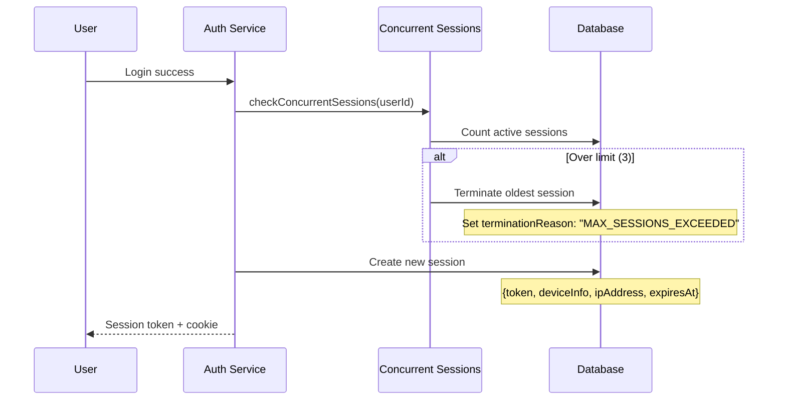
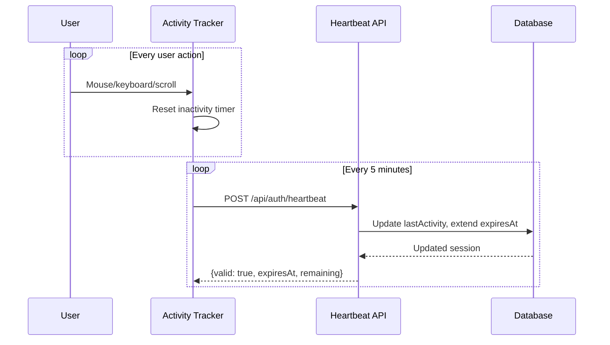
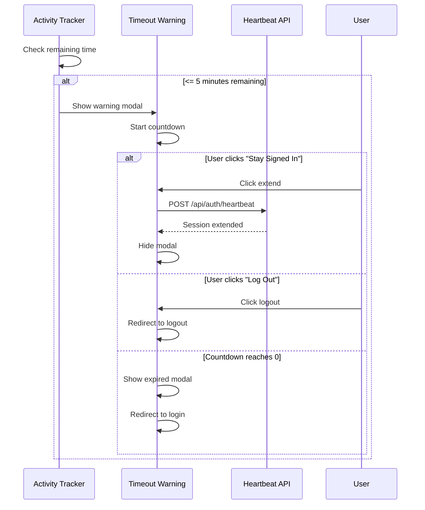
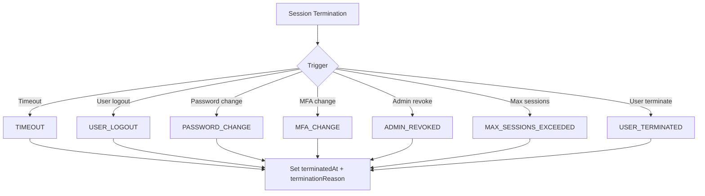
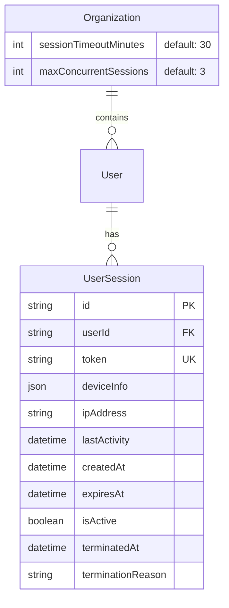
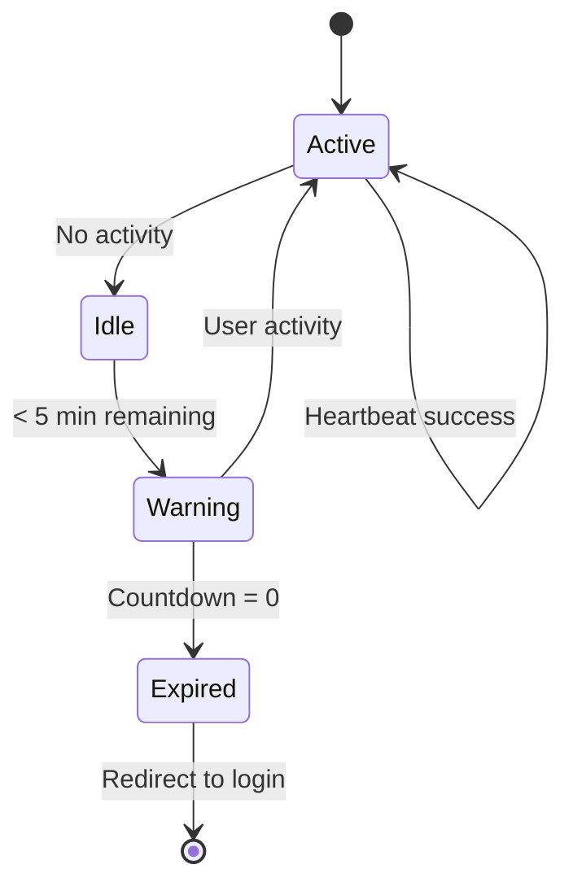

# Session Management & Timeout - Technical Design

**Status:** Implemented
**Linear Issue:** PX-667
**Date:** January 31, 2026

## Overview

HIPAA-compliant session management with automatic timeout, concurrent session control, and activity tracking. Implements automatic logoff as required by §164.312(a)(2)(iii).

## Architecture

### Component Diagram

```mermaid
graph TB
    subgraph "Client Layer"
        AT[Activity Tracker]
        TW[Timeout Warning]
        AS[Active Sessions UI]
    end

    subgraph "API Layer"
        HB[/api/auth/heartbeat]
        SS[/api/auth/sessions]
    end

    subgraph "Service Layer"
        TO[Timeout Service]
        CS[Concurrent Sessions]
        Types[Types & Utils]
    end

    subgraph "Data Layer"
        DB[(UserSession Table)]
        Org[(Organization Settings)]
    end

    AT --> HB
    TW --> HB
    AS --> SS

    HB --> TO
    SS --> TO
    SS --> CS

    TO --> DB
    CS --> DB
    TO --> Org
    CS --> Org
```

## Session Lifecycle

### Session Creation Flow



### Activity Tracking Flow



### Timeout Warning Flow



### Session Termination Triggers



## Data Model

### UserSession Entity



### Device Info Structure

```json
{
  "browser": "Chrome",
  "browserVersion": "120.0.0",
  "os": "macOS",
  "osVersion": "14.0",
  "device": "desktop",
  "isMobile": false,
  "userAgent": "Mozilla/5.0..."
}
```

## Configuration

### Default Settings

| Setting | Default | Range | Description |
|---------|---------|-------|-------------|
| Session Timeout | 30 min | 15-60 min | Inactivity before logout |
| Warning Time | 5 min | - | Time before timeout to show warning |
| Heartbeat Interval | 5 min | - | Activity refresh interval |
| Max Sessions | 3 | 1-10 | Concurrent sessions per user |

### Organization-Level Config

```typescript
// In Organization settings
{
  sessionTimeoutMinutes: 30,  // 15-60
  maxConcurrentSessions: 3,   // 1-10
}
```

## Client Components

### Activity Tracker Hook



### Session Timeout Warning Modal

```
┌─────────────────────────────────────────┐
│         Session Expiring Soon           │
├─────────────────────────────────────────┤
│                                         │
│  Your session will expire in 4:32       │
│                                         │
│  [████████████░░░░░░░] 4:32 remaining   │
│                                         │
│  ┌─────────────┐  ┌──────────────────┐  │
│  │ Log Out Now │  │ Stay Signed In   │  │
│  └─────────────┘  └──────────────────┘  │
│                                         │
└─────────────────────────────────────────┘
```

### Active Sessions UI

```
┌─────────────────────────────────────────────────┐
│ Active Sessions (2 of 3)                        │
├─────────────────────────────────────────────────┤
│ ┌─────────────────────────────────────────────┐ │
│ │ 🖥️ Chrome on macOS          ← Current       │ │
│ │    192.168.1.100                            │ │
│ │    Last active: Just now                    │ │
│ └─────────────────────────────────────────────┘ │
│ ┌─────────────────────────────────────────────┐ │
│ │ 📱 Safari on iOS                            │ │
│ │    10.0.0.50                                │ │
│ │    Last active: 15 minutes ago   [End]      │ │
│ └─────────────────────────────────────────────┘ │
│                                                 │
│ [End All Other Sessions]                        │
└─────────────────────────────────────────────────┘
```

## API Endpoints

### POST /api/auth/heartbeat

Refresh session expiration.

**Request:** (Cookie-based auth)

**Response:**
```json
{
  "valid": true,
  "expiresAt": "2026-01-31T20:00:00Z",
  "remainingSeconds": 1800,
  "timeoutMinutes": 30
}
```

### GET /api/auth/heartbeat

Check session status without refreshing.

**Response:**
```json
{
  "valid": true,
  "expiresAt": "2026-01-31T20:00:00Z",
  "remainingSeconds": 1500,
  "warningThreshold": 300
}
```

### GET /api/auth/sessions

List all active sessions for current user.

**Response:**
```json
{
  "sessions": [
    {
      "id": "session-uuid",
      "deviceInfo": {...},
      "ipAddress": "192.168.1.100",
      "lastActivity": "2026-01-31T19:30:00Z",
      "createdAt": "2026-01-31T18:00:00Z",
      "isCurrent": true
    }
  ],
  "maxSessions": 3,
  "currentCount": 2
}
```

### DELETE /api/auth/sessions

Terminate session(s).

**Query params:**
- `sessionId=uuid` - Terminate specific session
- `all=true` - Terminate all other sessions

**Response:**
```json
{
  "success": true,
  "terminated": 1
}
```

## File Structure

```
src/lib/auth/session/
├── types.ts              # Type definitions and utilities
├── timeout.ts            # Core timeout logic
├── concurrent-sessions.ts # Multi-session management
├── activity-tracker.tsx  # Client-side activity tracking
└── index.ts              # Exports

src/components/auth/
├── SessionTimeoutWarning.tsx  # Warning modal
└── ActiveSessions.tsx         # Session management UI

src/app/api/auth/
├── heartbeat/route.ts    # Session refresh
└── sessions/route.ts     # Session CRUD
```

## Security Events

### Session-Related Audit Events

| Event | Trigger | Severity |
|-------|---------|----------|
| SESSION_CREATED | Login | LOW |
| SESSION_REFRESHED | Heartbeat | LOW |
| SESSION_TIMEOUT | Inactivity | MEDIUM |
| SESSION_TERMINATED | User action | MEDIUM |
| SESSION_ADMIN_REVOKED | Admin action | HIGH |
| PASSWORD_CHANGE_INVALIDATION | Password change | HIGH |
| MFA_CHANGE_INVALIDATION | MFA change | HIGH |

## Usage Examples

### Activity Tracker Provider

```tsx
// In app layout
import { ActivityTrackerProvider } from '@/lib/auth/session';
import { SessionTimeoutProvider } from '@/components/auth/SessionTimeoutWarning';

export default function DashboardLayout({ children }) {
  return (
    <ActivityTrackerProvider>
      <SessionTimeoutProvider>
        {children}
      </SessionTimeoutProvider>
    </ActivityTrackerProvider>
  );
}
```

### Invalidate Sessions on Password Change

```typescript
import { invalidateSessionsOnPasswordChange } from '@/lib/auth/session';

async function changePassword(userId: string, newPassword: string) {
  // Change password...

  // Invalidate all sessions except current
  await invalidateSessionsOnPasswordChange(userId, currentSessionId);
}
```

### Admin Revoke All Sessions

```typescript
import { adminRevokeAllSessions } from '@/lib/auth/session';

async function revokeUserSessions(targetUserId: string, adminId: string) {
  await adminRevokeAllSessions(targetUserId, adminId);
}
```

## Testing Checklist

- [ ] Sessions timeout after configured period
- [ ] Warning modal shows 5 minutes before expiry
- [ ] "Stay Signed In" extends session
- [ ] Users can view active sessions
- [ ] Users can terminate other sessions
- [ ] Max 3 concurrent sessions enforced
- [ ] Password change invalidates all sessions
- [ ] MFA change invalidates all sessions
- [ ] Admin can revoke user sessions
- [ ] Session events logged to audit trail

## HIPAA Compliance Mapping

| Requirement | Implementation |
|-------------|----------------|
| §164.312(a)(2)(iii) Automatic Logoff | 30-minute timeout with warning |
| §164.312(d) Authentication | Session tokens with expiration |
| §164.312(b) Audit Controls | Session events logged |
| §164.308(a)(4) Access Control | Concurrent session limits |
