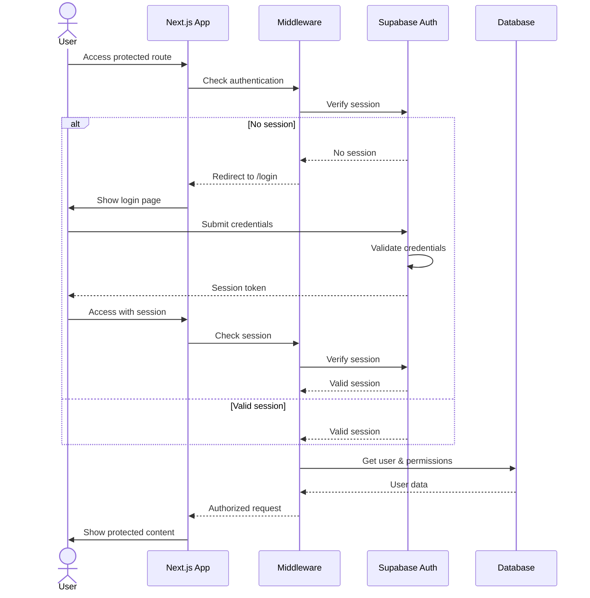

# Scrybe Solutions - User Flow Diagrams

## Admin: Creating a New Form (AI-Powered)

```mermaid
flowchart TD
    START([Admin opens Forms page]) --> CLICK[Click "Create New Form"]
    CLICK --> CHECK{Form limit<br/>reached?}

    CHECK -->|Yes| UPGRADE[Show upgrade prompt]
    UPGRADE --> BILLING[Redirect to billing]

    CHECK -->|No| WIZARD[Open Form Builder Wizard]

    subgraph "Step 1: AI Setup"
        WIZARD --> NAME[Enter form name]
        NAME --> TYPE[Select form type]
        TYPE --> PURPOSE[Describe purpose/outcome]
        PURPOSE --> DATA[List key data points]
        DATA --> COMPLIANCE[Add compliance requirements]
        COMPLIANCE --> CHOICE{Generate with AI<br/>or Skip?}
    end

    CHOICE -->|Skip| MANUAL[Go to Fields step]

    CHOICE -->|Generate| LOADING[Show generating state]
    LOADING --> AI_CALL[Call Claude API]
    AI_CALL --> REVIEW[Display generated fields]

    subgraph "AI Review Phase"
        REVIEW --> SELECT[Select/deselect fields]
        SELECT --> ACCEPT{Accept<br/>fields?}
        ACCEPT -->|Regenerate| AI_CALL
        ACCEPT -->|Start Over| WIZARD
        ACCEPT -->|Accept| FIELDS_STEP
    end

    MANUAL --> FIELDS_STEP[Fields Step]

    subgraph "Step 2: Add Fields"
        FIELDS_STEP --> ADD_FIELD[Click to add field]
        ADD_FIELD --> FIELD_TYPE[Select field type]
        FIELD_TYPE --> FIELD_CONFIG[Configure field]
        FIELD_CONFIG --> MORE{Add more<br/>fields?}
        MORE -->|Yes| ADD_FIELD
        MORE -->|No| ORGANIZE
    end

    subgraph "Step 3: Organize"
        ORGANIZE --> REORDER[Drag to reorder]
        REORDER --> SECTIONS[Create sections]
        SECTIONS --> LOGIC[Add conditional logic]
    end

    subgraph "Step 4: Preview"
        LOGIC --> PREVIEW[Preview form]
        PREVIEW --> A11Y[Run accessibility audit]
        A11Y --> EDIT{Need changes?}
        EDIT -->|Yes| FIELDS_STEP
        EDIT -->|No| AI_CONFIG
    end

    subgraph "Step 5: AI Config"
        AI_CONFIG --> EXAMPLES[Add extraction examples]
        EXAMPLES --> PROMPT[Review AI prompt]
    end

    subgraph "Step 6: Publish"
        PROMPT --> ACCESS[Configure access]
        ACCESS --> VALIDATE[Run validation]
        VALIDATE --> VALID{Valid?}
        VALID -->|No| FIX[Show errors]
        FIX --> FIELDS_STEP
        VALID -->|Yes| PUBLISH[Publish form]
        PUBLISH --> VERSION[Create version snapshot]
        VERSION --> DONE([Form is live])
    end
```

## Admin: Form Builder Wizard Steps


## AI Form Generation Flow


## Billing User Flow


## Authentication Flow



## Form Access Control Flow


## Audit Trail Flow


## File Upload Flow


## Subscription Lifecycle


---

## Spec-2: Case Manager Creating a Client

```mermaid
flowchart TD
    START([Case Manager opens Clients]) --> LIST[View client list]
    LIST --> NEW[Click "Add Client"]

    NEW --> FORM[Client creation form]

    subgraph "Client Information"
        FORM --> NAME[Enter first/last name]
        NAME --> PHONE[Enter phone number]
        PHONE --> EMAIL[Enter email - optional]
        EMAIL --> ADDR[Enter address - optional]
    end

    ADDR --> DUP_CHECK{Check for<br/>duplicates}

    DUP_CHECK -->|Match found| WARN[Show duplicate warning]
    WARN --> CHOICE{Proceed anyway?}
    CHOICE -->|No| FORM
    CHOICE -->|Yes| SAVE

    DUP_CHECK -->|No match| SAVE[Save client]

    SAVE --> ASSIGN[Auto-assign to creator]
    ASSIGN --> SUCCESS([Client created])

    SUCCESS --> VIEW[View client profile]
    VIEW --> ACTIONS{Quick actions}
    ACTIONS --> CALL[Start a call]
    ACTIONS --> NOTE[Add a note]
    ACTIONS --> FORM_FILL[Fill a form]
```

## Spec-2: Case Manager Making a Call

```mermaid
flowchart TD
    START([Open client profile]) --> CALL_BTN[Click "Start Call"]

    CALL_BTN --> FORMS[Select forms to use]
    FORMS --> CONFIRM[Confirm call setup]
    CONFIRM --> MIC{Microphone<br/>access?}

    MIC -->|Denied| ERROR1[Show permission error]
    MIC -->|Granted| INIT[Initialize call]

    INIT --> TOKEN[Get Twilio token]
    TOKEN --> CONNECT[Connect WebRTC]
    CONNECT --> DIAL[Dial client phone]

    DIAL --> RINGING{Call status?}
    RINGING -->|No answer| ABANDON[Mark abandoned]
    RINGING -->|Answered| ACTIVE[Call in progress]

    subgraph "Active Call"
        ACTIVE --> RECORD[Recording active]
        RECORD --> GUIDE[Show conversation guide]
        GUIDE --> NOTES[Take notes in panel]
        NOTES --> TIMER[Show call timer]
    end

    TIMER --> END[End call]
    END --> SAVE_REC[Save recording]
    SAVE_REC --> PROCESS[Queue for processing]
    PROCESS --> REVIEW[Show post-call review]
```

## Spec-2: Call Processing Pipeline


## Spec-2: Post-Call Review Flow


## Spec-2: Client Notes Flow

```mermaid
flowchart TD
    START([View client]) --> NOTES_TAB[Open notes tab]

    NOTES_TAB --> LIST[View note history]
    LIST --> FILTER[Filter by type/date]

    subgraph "Note Display"
        FILTER --> INTERNAL[Internal notes]
        FILTER --> SHAREABLE[Shareable notes]
        FILTER --> CALL_NOTES[Call-linked notes]
    end

    LIST --> ADD[Click "Add Note"]
    ADD --> EDITOR[Rich text editor]

    subgraph "Note Creation"
        EDITOR --> TYPE[Select type]
        TYPE --> INTERNAL_NEW[Internal]
        TYPE --> SHARE_NEW[Shareable]
        EDITOR --> TAGS[Add tags]
        EDITOR --> LINK{Link to<br/>call?}
        LINK -->|Yes| SELECT_CALL[Select call]
        LINK -->|No| CONTENT
        SELECT_CALL --> CONTENT
        CONTENT --> DRAFT{Save as<br/>draft?}
    end

    DRAFT -->|Yes| SAVE_DRAFT[Save draft]
    DRAFT -->|No| PUBLISH[Publish note]

    SAVE_DRAFT --> DONE([Note saved])
    PUBLISH --> DONE
```

## Spec-2: Twilio Number Provisioning


## Spec-2: AI Processing Retry Flow


## Spec-2: Duplicate Detection Flow

```mermaid
flowchart TD
    START([Enter client info]) --> PHONE_CHECK{Phone<br/>entered?}

    PHONE_CHECK -->|Yes| EXACT[Exact phone match?]
    EXACT -->|Yes| SCORE_100[Score: 100 pts - Auto flag]
    EXACT -->|No| FUZZY

    PHONE_CHECK -->|No| FUZZY[Check name fuzzy match]

    FUZZY --> LEV{Levenshtein<br/>distance ≤ 2?}
    LEV -->|Yes| SCORE_50[Add 50 pts]
    LEV -->|No| SOUNDEX

    SOUNDEX{Soundex<br/>match?}
    SOUNDEX -->|Yes| SCORE_30[Add 30 pts]
    SOUNDEX -->|No| TOTAL

    SCORE_100 --> TOTAL[Calculate total]
    SCORE_50 --> TOTAL
    SCORE_30 --> TOTAL

    TOTAL --> THRESHOLD{Score >= 70?}
    THRESHOLD -->|Yes| WARN[Show warning with matches]
    THRESHOLD -->|No| PROCEED[Proceed with creation]

    WARN --> CHOICE{User choice}
    CHOICE -->|View match| VIEW[Open matched client]
    CHOICE -->|Create anyway| PROCEED
    CHOICE -->|Cancel| CANCEL[Cancel creation]
```


